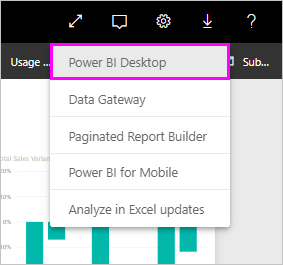
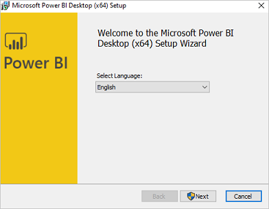
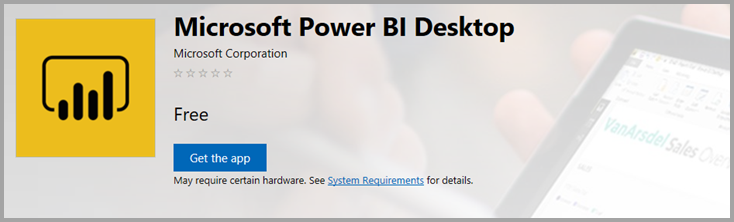

# Get Power BI Desktop
**Power BI Desktop** lets you build advanced queries, models, and reports that visualize data. With **Power BI Desktop**, you can build data models, create reports, and share your work by publishing to the Power BI service.  **Power BI Desktop** is a free download.

You can get **Power BI Desktop** in two ways, each of which is described in the following sections:

* **Download** directly (an MSI package you download and install on your computer)
* Install as an app from the **Microsoft Store**

Either approach will get the latest version of **Power BI Desktop** onto your computer, but there are a few differences worth noting, which are described in the following sections.

## Download Power BI Desktop
To download the most recent version of **Power BI Desktop**, you can select the download icon from the upper right corner of the Power BI service, and select **Power BI Desktop**.

You can also download the latest version of Power BI Desktop from the following download page:

* [**Power BI Desktop download** (both 32- and 64-bit versions)](https://powerbi.microsoft.com/desktop).
  
  

Regardless of which way you choose to download, once **Power BI Desktop** is downloaded you're prompted to run the installation file:

**Power BI Desktop** is installed as an application, and runs on your desktop.

> [!NOTE]
> Installing the downloaded (MSI) version, and the **Microsoft Store** version of **Power BI Desktop** on the same computer (sometimes referred to as a *side-by-side* installation) is not supported.
> 
> 

## Install as an app from the Microsoft Store
You can also get **Power BI Desktop** from the Microsoft Store, using the following link:

* [Install **Power BI Desktop** from the **Microsoft Store**](http://aka.ms/pbidesktopstore)

There are a few advantages to getting **Power BI Desktop** from the Microsoft Store:

* **Automatic updates** - Windows downloads the latest version automatically in the background as soon as it's available, so your version will always be up to date.
* **Smaller downloads** - The **Microsoft Store** ensures only components that have changed in each update are downloaded to your machine, resulting in smaller downloads for each update.
* **Admin priviledge is not required** - when you download the MSI directly and install, you must be an administrator for the installation to complete successfully. When you get **Power BI Desktop** from the Microsoft Store, admin priviledge is *not* required.
* **IT roll-out enabled** - the **Microsoft Store** version can more easily be deployed, or *rolled-out*, to everyone in your organization, and can make **Power BI Desktop** available through the **Microsoft Store for Business**.
* **Language detection** - the **Microsoft Store** version includes all supported languages, and checks which languages is being used on the computer each time it is launched. This also affects the localization of models created in **Power BI Desktop**; for example, built-in date hierarchies will match the language that **Power BI Desktop** was using when the .pbix file was created.

There are a few consideration and limitations for installing **Power BI Desktop** from the Microsoft Store, which include the following:

* If you use the SAP connector, you may need to move your SAP driver files to the *Windows\System32* folder.
* Installing **Power BI Desktop** from the Microsoft Store doesn't copy user settings from the MSI version. You might have to reconnect to your recent datasources and re-enter your data source credentials. 

> [!NOTE]
> Installing the downloaded (MSI) version, and the **Microsoft Store** version of **Power BI Desktop** on the same computer (sometimes referred to as a *side-by-side* installation) is not supported. You should manually uninstall **Power BI Desktop** before downloading it from the **Microsoft Store**
> 
> [!NOTE]
> The Power BI Report Server version of **Power BI Desktop** is a separate and different installation from the versions discussed in this article. For information about the Report Server version of **Power BI Desktop**, see [Create a Power BI report for Power BI Report Server](report-server/quickstart-create-powerbi-report.md).
> 
> 

## Using Power BI Desktop
When you launch **Power BI Desktop**, a *Welcome* screen is displayed.

If this is your first time using **Power BI Desktop** (if the installation is not an upgrade), you'll be prompted to fill out a form and answer a few questions, or sign in to the **Power BI service** before you'll be able to proceed.

From there, you can begin creating data models or reports, then share them with others on the Power BI service. Check out the **More information** links at the end of this article for links to guides that can help you get started using **Power BI Desktop**.

## Minimum requirements
The following list provides the minimum requirements to run **Power BI Desktop**:

* Windows 7 / Windows Server 2008 R2, or later
* .NET 4.5
* Internet Explorer 9 or later
* **Memory (RAM):** At least 1 GB available, 1.5 GB or more recommended.
* **Display:** At least 1440x900 or 1600x900 (16:9) recommended. Lower resolutions such as 1024x768 or 1280x800 are not recommended, as certain controls (such as closing the startup screen) display beyond those resolutions.
* **Windows Display settings:** If your display settings are set to change the size of text, apps, and other items to more than 100%, you may not be able to see certain dialogs that must be closed or responded to in order to proceed using **Power BI Desktop**. If you encounter this issue, check your **Display settings** by going to **Settings > System > Display** in Windows, and use the slider to return display settings to 100%.
* **CPU:** 1 gigahertz (GHz) or faster x86- or x64-bit processor recommended.

## Considerations and Limitations

We always want your experience with Power BI Desktop to be great. There may be occasions when you run into an issue with Power BI Desktop, so this section contains solutions or suggestions to address issues that might arise. 

### Issues when using previous releases of Power BI Desktop

Some users encounter an error similar to the following when using an outdated version of **Power BI Desktop**: 

    "We weren't able to restore the saved database to the model" 

Updating to the current version of Power BI Desktop usually solves this issue.

### Disabling notifications
We recommend updating to the most recent version of Power BI Desktop to take advantage of advances in features, perfromance, stability, and other improvements. Some organizations may not want users to update to each new version. You can disable notifications by modifying the registry with the following steps:

1. Using the Registry Editor, navigate to *HKEY_LOCAL_MACHINE\SOFTWARE\Microsoft\Microsoft Power BI Desktop*
2. Create a new entry there with the following settings: *REG_DWORD : DisableUpdateNotification*
3. Set the value of that new entry to **1**.

You'll need to restart your computer for the change to take effect.

### Power BI Desktop loads with a partial screen

In certain circumstances, including certain screen resolution configurations, some users may see Power BI Desktop render content with large black areas. This is generally a result of recent operating system updates that affect how items are rendered, rather than a direct result of how Power BI Desktop presents content. Regardless, large black areas are not as compelling as great visuals, so to address this issue, take the following steps:

1. Press the Start key and type the world *blurry* into the search bar that appears.
2. In the dialog that appears, select the option: *Let Windows fix apps that are blurry.*
3. Restart Power BI Desktop.

This issue may resolve after subsequent Windows updates are released. 
 

## Next steps
Once you get **Power BI Desktop** installed, the following content can help you get up and running quickly:

* [What is Power BI Desktop?](desktop-what-is-desktop.md)
* [Query Overview with Power BI Desktop](desktop-query-overview.md)
* [Data Sources in Power BI Desktop](desktop-data-sources.md)
* [Connect to Data in Power BI Desktop](desktop-connect-to-data.md)
* [Shape and Combine Data with Power BI Desktop](desktop-shape-and-combine-data.md)
* [Common Query Tasks in Power BI Desktop](desktop-common-query-tasks.md)   

