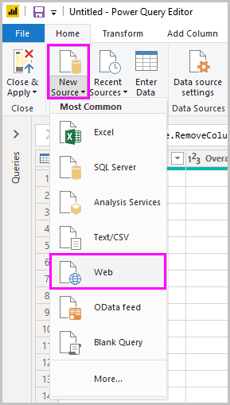
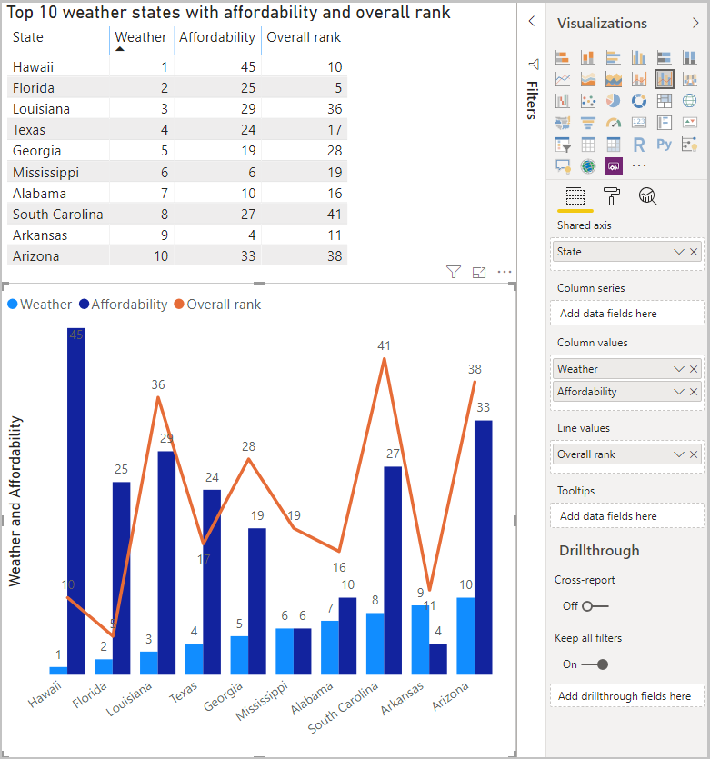

# Getting started with Power BI Desktop
Welcome to the **Power BI Desktop Getting Started Guide**. This short tour of Power BI Desktop gets you acquainted with how it works, demonstrates what it can do, and accelerates your ability to build robust data models — along with amazing reports — that amplify your business intelligence efforts. 

Prefer to watch instead of read? Feel free to [take a look at our getting started video](desktop-videos.md). And if you want to follow along with the video with matching sample data, you can [download this sample Excel workbook](http://go.microsoft.com/fwlink/?LinkID=521962).

Power BI Desktop lets you create a collection of queries, data connections, and reports that can easily be shared with others. Power BI Desktop integrates proven Microsoft technologies – the powerful Query engine, data modeling, and visualizations – and works seamlessly with the online [**Power BI service**](https://app.powerbi.com/).

With the combination of **Power BI Desktop** (where analysts and others can create powerful data connections, models and reports) and the [**Power BI service**](https://preview.powerbi.com/) (where Power BI Desktop reports can be shared so users can view and interact with them), new insights from the world of data are easier to model, build, share, and extend.

Data analysts will find Power BI Desktop a powerful, flexible, and a highly accessible tool to connect with and shape the world of data, build robust models, and craft well-structured reports.

## How to use this guide
You can use this guide in a couple of ways – scan it for a quick overview, or read through each section for a strong understanding of how Power BI Desktop works.

If you’re in a hurry you can do a visual sweep of this guide in just a couple minutes, and come away with a good sense of how Power BI Desktop operates, and how to use it. Most of this guide consists of screens that visually show how Power BI Desktop works.

For a more thorough understanding you can read through each section, perform the steps, and walk away with your own Power BI Desktop file that’s ready to post onto the **Power BI** service, and share with others.

>[!NOTE]
>There is also a separate and specialized version of **Power BI** called [**Power BI Report Server**](report-server/get-started.md), which is for customers who need their data and reporting to remain on-premises. For use with that specialized version, there's also a separate and specialized version of **Power BI Desktop** called **Power BI Desktop for Power BI Report Server**, which works only with the Report Server version of Power BI. This article describes the standard **Power BI Desktop**.

## How Power BI Desktop works
With Power BI Desktop, you *connect to data* (usually multiple data sources), *shape that data* (with queries that build insightful, compelling data models), and use that model to *create reports* (which others can leverage, build upon, and share).

When the steps are completed to your satisfaction – connect, shape, and report – you can save that work in Power BI Desktop file format, which is the .pbix extension. Power BI Desktop files can be shared like any other file, but the most compelling way to share Power BI Desktop files is to upload them (share them) on the [**Power BI service**](https://preview.powerbi.com/). 

Power BI Desktop centralizes, simplifies, and streamlines what can otherwise be a scattered, disconnected, and arduous process of designing and creating business intelligence repositories and reports.

Ready to give it a try? Let’s get started.

## Install and run Power BI Desktop
You can download Power BI Desktop from the **Power BI** service, by selecting the **gear** icon, then select **Power BI Desktop**.

Power BI Desktop is installed as an application, and runs on your desktop.

When you run Power BI Desktop, a *Welcome* screen is displayed.

You can **Get Data**, see **Recent Sources**, or **Open Other** **Reports** directly from the *Welcome* screen (from the links in the left pane). If you close the screen (select the **x** in the top right corner), the **Report** view of Power BI Desktop is displayed.

There are three views in Power BI Desktop: **Report** view, **Data** view, and **Relationships** view. Power BI Desktop also includes **Query Editor**, which opens in a separate window. In **Query Editor**, you can build queries and transform data, then load that refined data model into Power BI Desktop, and create reports.

The following screen shows the three view icons along the left of Power BI Desktop: **Report**, **Data**, and **Relationships**, from top to bottom. The currently displayed view is indicated by the yellow bar along the left. In this case, **Report** view is currently displayed. You can change views by selecting any of those three icons.

With Power BI Desktop installed you’re ready to connect to data, shape data, and build reports (usually in that order). In the next few sections, we take a tour through each in turn.

## Connect to data
With Power BI Desktop installed, you’re ready to connect to the ever expanding world of data. There are *all sorts* of data sources available in the Query window. The following image shows how to connect to data, by selecting the **Home** ribbon, then **Get Data \> More**.

 

For this quick tour, we'll connect to a couple different **Web** data sources.

Imagine you’re retiring – you want to live where there’s lots of sunshine, preferable taxes, and good health care – or perhaps you’re a data analyst, and you want that information to help your customers. For example, perhaps you want to help your sunglasses retailer target sales where the sun shines most frequently.

Either way, the following Web resource has interesting data about those topics, and more:

[*http://www.bankrate.com/finance/retirement/best-places-retire-how-state-ranks.aspx*](http://www.bankrate.com/finance/retirement/best-places-retire-how-state-ranks.aspx)

Select **Get Data \> Web** and paste the address.

 

When you select **OK**, the **Query** functionality of Power BI Desktop goes to work. Query contacts the Web resource, and the **Navigator** window returns what it found on that Web page. In this case, it found a table (*Table 0*) and the overall Web Document. We’re interested in the table, so we select it from the list. The **Navigator** window displays a preview.

 

At this point we can edit the query before loading the table, by selecting **Edit** from the bottom of the window, or we can load the table.

When we select **Edit**, Query Editor launches and a representative view of the table is presented. The **Query Settings** pane is displayed (if it’s not, you can select **View** from the ribbon, then **Show \> Query Settings** to display the **Query Settings** pane). Here’s what that looks like.

 

For more information about connecting to data, see [Connect to Data in Power BI Desktop](desktop-connect-to-data.md).

In the next section, we adjust the data so it meets our needs. The process of adjusting connected data is called *shaping* data.

## Shape and combine data
Now that we’ve connected to a data source, we need to adjust the data to meet our needs. Sometimes adjusting means *transforming* the data – such as renaming columns or tables, changing text to numbers, removing rows, setting the first row as headers, and so on.

The Query editor in Power BI Desktop makes ample use of right-click menus, in addition to having tasks available on the ribbon. Most of what you can select in the **Transform** ribbon is also available by right-clicking an item (such as a column) and choosing from the menu that appears.

## Shape data
When you shape data in the **Query Editor**, you’re providing step-by-step instructions (that **Query Editor** carries out for you) to adjust the data as **Query Editor** loads and presents it. The original data source is not affected; only this particular view of the data is adjusted, or *shaped*.

The steps you specify (such as rename a table, transform a data type, or delete columns) are recorded by **Query Editor**, and each time this query connects to the data source those steps are carried out so that the data is always shaped the way you specify. This process occurs whenever you use the query in Power BI Desktop, or for anyone who uses your shared query, such as in the **Power BI** service. Those steps are captured, sequentially, in the **Query Settings** pane under **Applied Steps**.

The following image shows the **Query Settings** pane for a query that has been shaped – we’ll go through each of those steps in the next few paragraphs.

 

Let’s get back to our retirement data, which we found by connecting to a Web data source, and shape that data to fit our needs.

For starters, most ratings were brought into **Query Editor** as whole numbers, but not all of them (one column contained text and numbers, so it wasn't automatically converted). We need the data to be numbers. No problem – just right-click the column header, and select **Change Type \> Whole Number** to change the data type. If we needed to choose more than one column, we could first select a column then hold down **SHIFT**, select additional adjacent columns, and then right-click a column header to change all selected columns. You can also use **CTRL** to select non-adjacent columns.

 

You can also change, or *transform,* those columns from text to header by using the **Transform** ribbon. Here’s the **Transform** ribbon, with an arrow pointing toward the **Data Type** button, which lets you transform the current data type to another.

 

Note that in **Query Settings**, the **Applied Steps** reflect the changes that were made. If I want to remove any step from the shaping process, I simply select that step, and then select the **X** to the left of the step.

 

We need to make a few more changes to get the query where we want it:

* *Remove the first column* – we don’t need it, it just includes redundant rows that say “Check out how your state ranks for retirement” which is an artifact of this being a Web based table

<!-- -->

* *Fix a few Errors* – on the Web page, one column had text mixed in with the numbers (some states tied in one category). That works well in the website, but not for our data analysis. It's easy (in this case) to fix, and shows some cool features and capabilities of **Query Editor** and its **Applied Steps**

<!-- -->

* *Change the Table Name* – that **Table 0** is not a useful descriptor, but changing it simple

Each of these steps is demonstrated in **[Shape and Combine Data in Power BI Desktop](desktop-shape-and-combine-data.md)**. Feel free to check out that page, or keep going in this document to see what you would do next. The next section picks up after the changes above are applied.

## Combine data
That data about various states is interesting, and will be useful for building additional analysis efforts and queries. But there’s one problem: most data out there uses a two-letter abbreviation for state codes, not the full name of the state. We need some way to associate state names with their abbreviations.

We’re in luck: there’s another public data source that does just that, but it needs a fair amount of shaping before we can connect it to our retirement table. Here’s the Web resource for state abbreviations:

<http://en.wikipedia.org/wiki/List_of_U.S._state_abbreviations>

From the **Home** ribbon in **Query Editor**, we select **Get Data \> Web** and type the address, select **OK**, and the **Navigator** window shows what it found on that Web page.

 

We select **Table[edit]** because it includes the data we want, but it’s going to take quite a bit of shaping to pare that table’s data down. Each of these steps is also demonstrated in **[Shape and Combine Data in Power BI Desktop](desktop-shape-and-combine-data.md)**. To summarize those steps, here's what we do:

We select **Edit**, then:

* *Remove the top two rows* – they’re a result of the way that Web page’s table was created, and we don’t need them.

<!-- -->

* *Remove the bottom 26 rows* – they’re all the territories, which we don’t need to include.

<!-- -->
* *Filter out Washington DC* – the retirement stats table doesn't include DC, so we'll exclude it from our list.

<!-- -->

* *Remove a few unneeded columns* – we only need the mapping of state to its official two-letter abbreviation, so we can remove the other columns.

<!-- -->

* *Use the first row as headers* – since we removed the top three rows, the current top row is the header we want.

    >[!NOTE]
    >This is a good time to point out that the *sequence* of applied steps in **Query Editor** is important, and can affect how the data is shaped. It’s also important to consider how one step may impact another subsequent step; if you remove a step from the **Applied Steps**, subsequent steps may not behave as originally intended, because of the impact of the query’s sequence of steps.

* *Rename the columns, and the table itself* – as usual, there are a couple ways to rename a column, you can choose whichever you prefer.

With the *StateCodes* table shaped, we can combine these two tables, or queries, into one; since the tables we now have are a result of the queries we applied to the data, they’re often referred to as *queries*.

There are two primary ways of combining queries – *merging* and *appending*.

When you have one or more columns that you’d like to add to another query, you **merge** the queries. When you have additional rows of data that you’d like to add to an existing query, you **append** the query.

In this case we want to merge queries. To get started, we select the query *into which* we want the other query to merge, then select **Merge Queries** from the **Home** tab on the ribbon.

 

The **Merge** window appears, prompting us to select which table we’d like merged into the selected table, and then, the matching columns to use for the merge. Select *State* from the *RetirementStats* table (query), then select the *StateCodes* query (easy in this case, since there’s only one other query – when you connect to many data sources, there are many queries to choose from). When we select the correct matching columns – *State* from *RetirementStats*, and *State Name* from *StateCodes* – the **Merge** window looks like the following, and the **OK** button is enabled.

 

A **NewColumn** is created at the end of the query, which is the contents of the table (query) that was merged with the existing query. All columns from the merged query are condensed into the **NewColumn**, but you can select to **Expand** the table, and include whichever columns you want. To expand the merged table, and select which columns to include, select the expand icon (). The **Expand** window appears.

 

In this case, we only want the *State Code* column, so we select only that column and then select **OK**. We clear the checkbox from **Use original column name as prefix** because we don’t need or want that; if we leave that selected, the merged column would be named *NewColumn.State Code* (the original column name, or *NewColumn*, then a dot, then the name of the column being brought into the query).

>[!NOTE]
>Want to play around with how to bring in that *NewColumn* table? You can experiment a bit, and if you don’t like the results, just delete that step from the **Applied Steps** list in the **Query Settings** pane; your query returns to the state prior to applying that **Expand** step. It’s like a free do-over, which you can do as many times as you like until the expand process looks the way you want it.

We now have a single query (table) that combined two data sources, each of which has been shaped to meet our needs. This query can serve as a basis for lots of additional, interesting data connections – such as housing cost statistics, demographics, or job opportunities in any state.

For a more complete description of each of these shape and combine data steps, see [Shape and Combine Data in Power BI Desktop](desktop-shape-and-combine-data.md).

For now, we have enough data to create a few interesting reports, all within Power BI Desktop. Since this is a milestone let’s save this Power BI Desktop file – we’ll call it **Getting Started with Power BI Desktop**. To apply the changes in **Query Editor** and load them into Power BI Desktop, select **Close & Apply** from the **Home** ribbon.

## Build reports
Additional changes can be made after the table is loaded, and you can reload a model to apply any changes you make. But for now this will do. In Power BI Desktop **Report** view, you can begin to build reports.

The **Report** view has five main areas:

1. The ribbon, which displays common tasks associated with reports and visualizations
2. The **Report** view, or canvas, where visualizations are created and arranged
3. The **Pages** tab area along the bottom, which lets you select or add a report page
4. The **Visualizations** pane, where you can change visualizations, customize colors or axes, apply filters, drag fields, and more
5. The **Fields** pane, where query elements and filters can be dragged onto the **Report** view, or dragged to the **Filters** area of the **Visualizations** pane
   
   

The **Visualizations** and **Fields** pane can be collapsed by selecting the small arrow along the edge, providing more space in the **Report** view to build cool visualizations. When modifying visualizations, you'll also see these arrows pointing up or down, which means you can expand or collapse that section, accordingly.

 

To create a visualization, just drag a field from the **Fields** list onto the **Report** view. In this case, let’s drag the *State* field from *RetirementStats*, and see what happens.

 

Look at that... Power BI Desktop automatically created a map-based visualization, because it recognized that the *State* field contained geolocation data.

Notice that in the **Visualizations** pane, I can select different types of visualizations, and in the area below those icons, I can drag fields to different areas to apply a Legend, or otherwise modify the visualization.

 

Let’s fast-forward a bit, and see what the **Report** view looks like after a handful of visualizations have been added, as well as a few new Report pages. For more information about reports, see [Report View in Power BI Desktop](desktop-report-view.md).

The first Report page provides a perspective of the data based on *Overall rank*. When we select one of the visualizations, the **Fields and Filters** pane shows which fields are selected, and the structure of the visualization (which fields are applied to the **Shared Axis**, **Column Values**, and **Line Values**).

 

There are six **Pages** in this Report, each visualizing certain elements of our data.

1. The first page, shown above, shows all states based on *Overall rank*.
2. The second page focuses on the top ten states based on *Overall rank*.
3. For the third page, the best 10 states for cost of living (and associated data) are visualized.
4. Weather is the focus of the fourth page, filtered to the 15 sunniest states.
5. On the fifth page, Community well-being is charted and visualized for the top 15 states.
6. Lastly, crime statistics are visualized, showing the best (and well, the last) ten states.

Here’s what the cost of living-focused Report page looks like.

 

There are all sorts of interesting reports and visualizations you can create.

## Share your work
Now that we have a Power BI Desktop report that’s reasonably complete, we can share it with others on the **Power BI** service. There are a few ways to share your work in Power BI Desktop. You can publish to the **Power BI** service, you can upload the .pbix file directly from the Power BI service, or you can save the .pbix file and send it like any other file.

First, let's look at publishing to the **Power BI** service directly from Power BI Desktop. On the **Home** ribbon, select **Publish**.

You may be prompted to sign in to Power BI.

When you've signed in and the publish process is complete, you see the following dialog.

When you sign in to Power BI, you'll see Power BI Desktop file you just loaded in the **Dashboards**, **Reports**, and **Datasets** sections of the service.

Another way to share your work is to load it from within the **Power BI** service. The following link brings up the **Power BI** service in a browser:

`https://app.powerbi.com`

Select **Get Data** to start the process of loading your Power BI Desktop report.

 

The **Get Data** page appears, from which you can select where to get your data from. In this case, we select **Get** from the **Files** box.

The **Files** view appears. In this case, we select **Local File**.

When you select the file, Power BI uploads the file.

Once the file is uploaded, you can select the file from the **Reports** in the left pane of the Power BI service.

The **Power BI** service displays the first page of the report. Along the bottom of the page, you can select any tab to display that page of the report.

 

You can make changes to a report in the **Power BI** service by selecting **Edit Report** from the top of the report canvas.

To save your report, select **File \> Save As** from the service. There are all sorts of interesting visuals you can create in the **Power BI** service from your report, which you can pin to a *dashboard*. To learn about dashboards in the **Power BI** service<strong>[, see Tips for designing a great dashboard](service-dashboards-design-tips.md)</strong>.

 

Once saved, select the **Share** icon on the main page.

 

From here, you can send an email to colleagues with whom you’d like to share the dashboard.

 

For more information about creating, sharing, and modifying dashboards, see [Share a dashboard](service-share-dashboards.md).

There are all sorts of compelling data-related mash-ups and visualizations you can do with Power BI Desktop, and with the Power BI service. Check out the next section for more information.

## Diagnostics

Power BI desktop supports connecting to a diagnostics port. The diagnostic port allows for other tools to connect to and perform traces for diagnostic purposes. *Making any changes to the model is not supported! Changes to the model may lead to corruption and data loss.*

## Next steps
There are all sorts of things you can do with Power BI Desktop. For more information on its capabilities, check out the following resources:

* [Query Overview with Power BI Desktop](desktop-query-overview.md)
* [Data Sources in Power BI Desktop](desktop-data-sources.md)
* [Connect to Data in Power BI Desktop](desktop-connect-to-data.md)
* [Shape and Combine Data with Power BI Desktop](desktop-shape-and-combine-data.md)
* [Common Query Tasks in Power BI Desktop](desktop-common-query-tasks.md)   