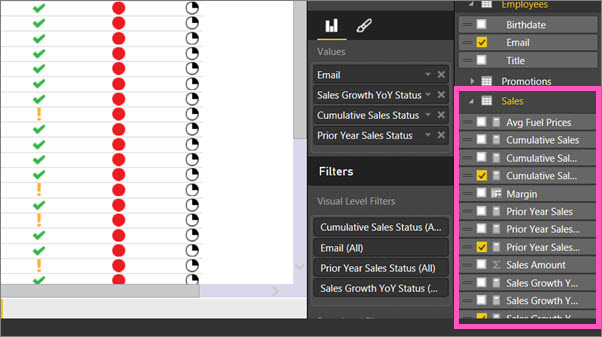

# Import and display KPIs in Power BI
With **Power BI Desktop**, you can import and display KPIs in tables, matrixes, and cards.

Follow these steps to import and display KPIs.

1. Start with an Excel workbook that has a Power Pivot model and KPIs. This exercise uses a workbook named *KPIs*. You can also [learn how to import workbooks](desktop-import-excel-workbooks.md).  
2. Open the report and select the **Top Performers** tab.  The *Top Performers* matrix contains KPIs for three different sales measures by employee email address.  
   
    

That's all there is to it. You can use KPIs to highlight important trends, progress, or other important indicators.

