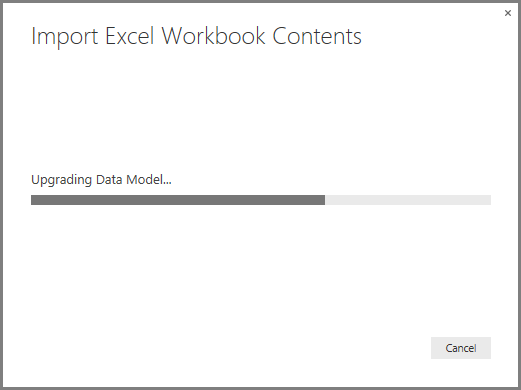

# Import Excel workbooks into Power BI Desktop
With **Power BI Desktop**, you can easily import Excel workbooks that contain Power Query queries, Power Pivot models, and Power View worksheets into Power BI Desktop. Reports and visualizations are automatically created based on the Excel workbook, and once imported, you can continue to improve and refine those reports using Power BI Desktop, using the existing features and new features released with each Power BI Desktop monthly update.

In the future, the plan is to provide additional communication between Excel and Power BI Desktop (such as import/export); this current ability to import workbooks into Power BI Desktop lets existing Excel users get started with Power BI Desktop.

## How do I import an Excel workbook?
To import a workbook, from Power BI Desktop select **File -\> Import -\> Excel Workbook Contents**.

A window appears, letting you select the workbook to import. There is currently no limitation on the size or number of objects in the workbook, but larger workbooks take longer for Power BI Desktop to analyze and import.

> [!NOTE]
> To load or import Excel files from **shared OneDrive for Business** folders or from **Office 365 group** folders, use the URL of the Excel file, and input it into the **Web** data source in Power BI Desktop. There are a few steps you need to follow to properly format the **OneDrive for Business** URL, so check out [Use OneDrive for Business links in Power BI Desktop](desktop-use-onedrive-business-links.md) for more information and the correct series of steps.
> 
> 

Once a workbook is selected, Power BI Desktop analyzes the workbook and converts it into a Power BI Desktop file (.pbix). This action is a one-time event; once the Power BI Desktop file is created with these steps, the Power BI Desktop file has no dependence on the original Excel workbook, and can be modified or changed (and saved, and shared) without affecting the original workbook.

Once the import is finished, a **Summary** page is displayed that describes the items that were converted, and also lists any items that were not able to be imported.

When you select **Close**, the report is loaded in Power BI Desktop. The following image shows Power BI Desktop after an Excel workbook was imported: Power BI Desktop automatically loaded the report based on the workbook contents.

Now that the workbook is imported, you can continue working on the report – such as creating new visualizations, adding data, or creating new report pages – using any of the features and capabilities included in Power BI Desktop.

## Which workbook elements are imported?
Power BI Desktop can import the following elements, commonly referred to as *objects*, in Excel.

| Object in Excel Workbook | Final Result in Power BI Desktop file |
| --- | --- |
| Power Query queries |All Power Query queries from Excel are converted to queries in Power BI Desktop. If there were Query Groups defined in the Excel Workbook, the same organization will be replicated in Power BI Desktop. All queries are loaded unless they were set to “Only Create Connection” in Excel. The Load behavior can be customized from the **Properties** dialog in the **Home** tab of **Query Editor** in Power BI Desktop. |
| Power Pivot External Data Connections |All Power Pivot External Data Connections will be converted to queries in Power BI Desktop. |
| Linked Tables or Current Workbook tables |If there is a worksheet table in Excel linked to the Data Model, or linked to a query (by using *From Table* or the *Excel.CurrentWorkbook()* function in M), the following options are presented: <ol><li>Import the table to the Power BI Desktop file. This table is a one-time snapshot of the data, after which you cannot edit the data in the table in Power BI Desktop. There is a size limitation of 1 million characters (total, combining all column headers and cells) for tables created using this option.</li><li>Keep a connection to the original workbook. Alternatively, you can keep a connection to the original Excel Workbook and Power BI Desktop retrieves the latest content in this table with each refresh, just like any other query created against an Excel workbook in Power BI Desktop.</li></ul> |
| Data Model Calculated Columns, Measures, KPIs, Data Categories, and Relationships |These Data Model objects are converted to the equivalent objects in Power BI Desktop. Note there are certain Data Categories that are not available in Power BI Desktop, such as **Image**. In these cases, the Data Category information will be reset for the columns in question. |
| Power View Worksheets |A new report page is created for each Power View worksheet in Excel. The name and order of these report pages match the original Excel workbook. |

## Are there any limitations to importing a workbook?
There are a few limitations to importing a workbook into Power BI Desktop, which is the following list:

* **External Connections to Analysis Services Tabular Models:** In Excel 2013, it is possible to create a connection to SQL Server Analysis Services Tabular models and create Power View reports on top of these models without the need to import the data. This type of connection is currently not supported as part of importing Excel Workbooks into Power BI Desktop. As a workaround, you must recreate these external connections in Power BI Desktop.
* **Hierarchies:** This type of Data Model object is currently not supported in Power BI Desktop. As such, hierarchies are skipped as part of importing an Excel Workbook into Power BI Desktop.
* **Binary data columns:** This type of Data Model column is currently not supported in Power BI Desktop. Binary Data columns are removed from the resulting table in Power BI Desktop.
* **Unsupported Power View elements:** There are a few features in Power View that are not available in Power BI Desktop, such as Themes or certain types of visualizations (Scatter Chart with Play Axis, Drill-Down behaviors, etc.). These unsupported visualizations result in *Unsupported Visualization* messages on their corresponding locations in the Power BI Desktop report, which you can delete or reconfigure as needed.
* **Named Ranges using** ***From Table*** **in Power Query, or using** ***Excel.CurrentWorkbook*** **in M:** Importing this named range data into Power BI Desktop is not currently supported, but it is a planned update for Power BI Desktop. Currently, these named ranges are loaded into Power BI Desktop as a connection to the external Excel workbook.
* **PowerPivot to SSRS:** PowerPivot external connections to SQL Server Reporting Services (SSRS) are not currently supported, since that data source is not currently available in Power BI Desktop.

