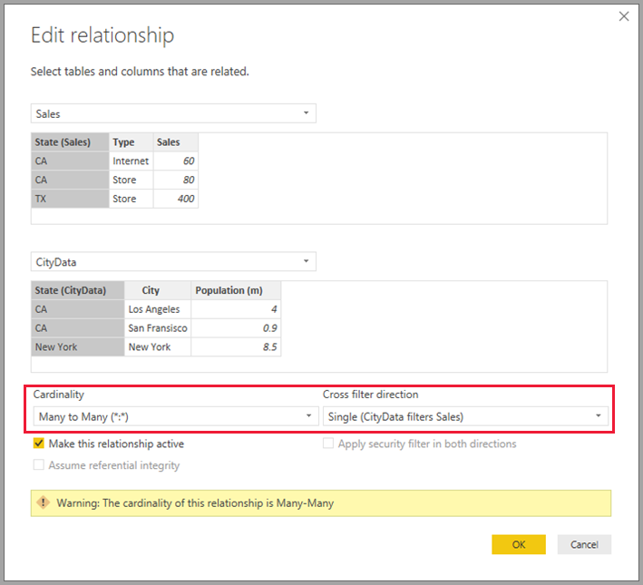
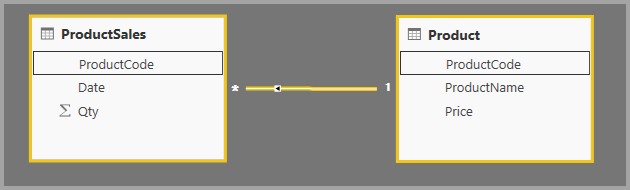
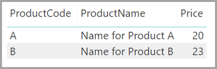
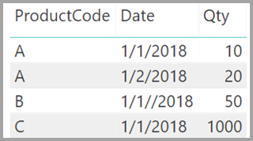
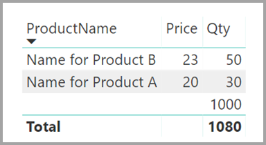
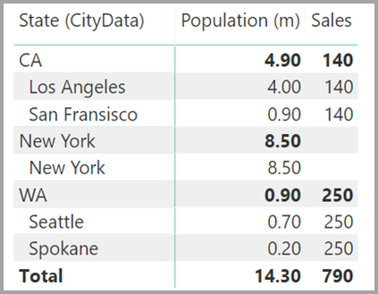
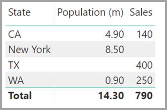
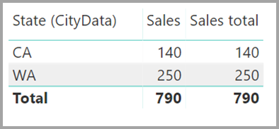

# Relationships with a many-many cardinality in Power BI Desktop

With the *relationships with a many-many cardinality* feature in Power BI Desktop, you can join tables that use a cardinality of *Many to Many*. You can more easily and intuitively create data models that contain two or more data sources. The *relationships with a many-many cardinality* feature is part of the larger *composite models* capabilities in Power BI Desktop.

The *relationships with a many-many cardinality* capability in Power BI Desktop is one of three related features:

* **Composite models**: Allows a report to have two or more data connections, including DirectQuery connections or Import, in any combination. For more information, see [Composite models in Power BI Desktop (preview)](desktop-composite-models.md).

* **Relationships with a many-many cardinality**: With *composite models*, you can establish *relationships with a many-many cardinality* between tables. This approach removes requirements for unique values in tables. It also removes previous workarounds, such as introducing new tables only to establish relationships. The feature is described further in this article.

* **Storage mode**: You can now specify which visuals require a query to back-end data sources. Visuals that don't require a query are imported even if they're based on DirectQuery. This feature helps improve performance and reduce back-end load. Previously, even simple visuals such as slicers began queries that were sent to back-end sources. For more information, see [Storage mode in Power BI Desktop (preview)](desktop-storage-mode.md).

## What *relationships with a many-many cardinality* solves

Before the *relationships with a many-many cardinality* feature became available, the relationship between two tables was defined in Power BI. At least one of the table columns involved in the relationship had to contain unique values. Often, though, no columns contained unique values. 

For example, two tables might have had a column labeled *Country*, but the values of *Country* weren't unique in either table. To join such tables, it was necessary to create a workaround. One such workaround might be to introduce into the model additional tables with the necessary unique values. With the *relationships with a many-many cardinality* feature, you can join such tables directly by using a relationship with a cardinality of **Many to-Many**.  

## Use *relationships with a many-many cardinality*

When you define a relationship between two tables in Power BI, you must define the cardinality of the relationship. For example, the relationship between *ProductSales* and *Product*&mdash;using columns *ProductSales[ProductCode]* and *Product[ProductCode]*&mdash;would be defined as *Many-1*. We define the relationship in this way because there are many sales for each product, and the column in the *Product* table *(ProductCode)* is unique. When you define a relationship cardinality as *Many-1*, *1-Many*, or *1-1*, Power BI validates it to help ensure that the cardinality that you select matches the actual data.

For example, take a look at the simple model in the following image:

Now, imagine that the *Product* table displays just two rows, as shown:

Also imagine that the *Sales* table has just four rows, including a row for a product C. Because of a referential integrity error, the product C row doesn't exist in the *Product* table.

The *ProductName* and *Price* (from the *Product* table), along with the total *Qty* for each product (from the *ProductSales* table), would be displayed as shown: 

As you can see in the preceding image, there's blank *ProductName* row that's associated with sales for product C. This blank row accounts for the following:

* Any rows in the *ProductSales* table for which no corresponding row exists in the *Product* table. There's a referential integrity issue, as we see for product *C* in this example.

* Any rows in the *ProductSales* table for which the foreign key column is null. 

For these reasons, the blank row in both cases accounts for sales where the *ProductName* and *Price* are unknown.

It sometimes happens that the tables are joined by two columns, yet neither column is unique. For example, consider the following two tables:

* The *Sales* table displays sales data by *State*, and each row contains the sales amount for the type of sale in that state. The states include CA, WA, and TX. 

    

* The *CityData* table displays data on cities, including the population and state (including CA, WA, and New York).

    

Although there's a column for *State* in both tables and it's reasonable to want to report on both total sales by state and total population of each state, a problem exists: the *State* column isn't unique in either table. 

## The previous workaround

In earlier Power BI Desktop versions than the July 2018 release, users couldn't create a direct relationship between these tables. A common workaround was to do the following:

* Create a third table that contains only the unique *State* IDs. The table could be any or all of the following:
  * A calculated table (defined by using Data Analysis Expressions [DAX]).
  * A table based on a query that's defined in Query Editor, which could display the unique IDs drawn from one of the tables.
  * The combined full set.

* Relate the two original tables to that new table by using common *Many-1* relationships.

You could either leave the workaround table visible or hide it so that it doesn't appear in the **Fields** list. If you hide the table, the *Many-1* relationships would commonly be set to filter in both directions, and you could use the *State* field from either table. The subsequent cross filtering would propagate to the other table. That approach is shown in the following image:

A visual that displays *State* (from the *CityData* table), along with total *Population* and total *Sales*, would then appear as follows:

> [!NOTE]
> Because the state from the *CityData* table is used in this workaround, only the states in that table are listed and, therefore, TX is excluded. Also, unlike *Many-1* relationships, while the total row includes all *Sales* (including those of TX), the details do not include a blank row covering such mismatched rows. Similarly, there would be no blank row covering *Sales* for which there's a null value for the *State*.

If you also add *City* to that visual, although the population per *City* is known, the *Sales* shown for *City* simply repeats the *Sales* for the corresponding *State*. This is normally the case when the grouping in a column is unrelated to some aggregate measure, as shown in the following image:

If we define the new *Sales* table as the combination of all *States* in this workaround and we make it visible in the **Fields** list, the same visual would display both *State* (on the new table) and the total *Population* and total *Sales*, as shown in the following image:

As you can see, *TX*&mdash;with *Sales* data but unknown *Population* data&mdash;and *New York*&mdash;with known *Population* data but no *Sales* data&mdash;would be included. This workaround isn't optimal, and it has many issues. With the creation of the relationships with a many-many cardinality, the resulting issues are addressed as described in the next section.

## Use *relationships with a many-many cardinality* instead of the workaround

As of the July 2018 version of Power BI Desktop, you can directly relate tables, such as the ones we described earlier, without having to resort to similar workarounds. It's now possible to set the relationship cardinality to *Many to Many*. This setting indicates that neither table contains unique values. For such relationships, you can still control which table filters the other table, or apply bi-directional filtering where each table filters the other.  

In Power BI Desktop, the cardinality defaults to *Many to Many* when it determines that neither table contains unique values for the columns in the relationship. In such cases, a warning is displayed to confirm that relationship-setting is your intended behavior and not the unintended effect of a data issue. 

For example, when you create a relationship directly between *CityData* and *Sales*&mdash;where filters should flow from *CityData* to *Sales*&mdash;Power BI Desktop displays the **Edit relationship** window as shown in the following image:

The resulting **Relationship** view would then display the direct, many-to-many relationship between the two tables. The tables' appearance in the **Fields** list, and their subsequent behavior when the visuals are created, is similar to when we applied the workaround. In the workaround, the extra table that displays the distinct *State* data isn't made visible. For example, as described in the preceding section, a visual showing *State*, *Population*, and *Sales* data would be displayed as follows:

The major differences between *relationships with a many-many cardinality* and the more typical *Many-1* relationships are as follows:

* The values shown don't include a blank row that accounts for mismatched rows in the other table. Nor do the values account for rows where the column used in the relationship in the other table is null.
* It isn't possible to use the `RELATED()` function, because more than one row could be related.
* Using the `ALL()` function on a table doesn't remove filters that are applied to other, related tables by a many-to-many relationship. In the preceding example, a measure that's defined as shown in the following script would not remove filters on columns in the related *CityData* table:

    

    A visual showing *State*, *Sales*, and *Sales total* data would result in the following:

    

With the preceding differences in mind, make sure that the calculations that use `ALL(\<Table>)`, such as *% of grand total*, are returning the intended results. 

## Limitations and considerations

There are a few limitations for this release of *relationships with a many-many cardinality* and composite models.

The following Live Connect (multi-dimensional) sources can't be used with composite models:

* SAP HANA
* SAP Business Warehouse
* SQL Server Analysis Services
* Power BI datasets
* Azure Analysis Services

When you connect to these multi-dimensional sources by using DirectQuery, you can't connect to another DirectQuery source or combine it with imported data.

The existing limitations of using DirectQuery still apply when you use *relationships with a many-many cardinality*. Many of these limitations are now per table, depending upon the storage mode of the table. For example, a calculated column on an imported table can refer to other tables, but a calculated column on a DirectQuery table can still refer only to columns on the same table. Other limitations apply to the model as a whole if any of the tables within the model are DirectQuery. For example, the QuickInsights and Q&A features are unavailable on a model if any of the tables within it has a storage mode of DirectQuery. 

## Next steps

For more information about composite models and DirectQuery, see the following articles:
* [Composite models in Power BI Desktop (preview)](desktop-composite-models.md)
* [Storage mode in Power BI Desktop (preview)](desktop-storage-mode.md)
* [Use DirectQuery in Power BI Desktop](desktop-directquery-about.md)
* [Data sources supported by DirectQuery in Power BI Desktop](desktop-directquery-data-sources.md)
