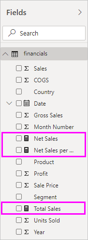

# Measures in Power BI Desktop

**Power BI Desktop** helps you create insights into your data with just a few clicks. But sometimes that data just doesn’t include everything you need to answer some of your most important questions. Measures can help you get there.

Measures are used in some of the most common data analyses. For example sums, averages, minimum or maximum values, counts, or more advanced calculations you create yourself using a DAX formula. The calculated results of measures are always changing in response to your interaction with your reports, allowing for fast and dynamic ad-hoc data exploration. Let’s take a closer look.

## Understanding measures

In **Power BI Desktop**, measures are created and used in **Report View** or **Data View**. Measures you create yourself appear in the Fields list with a calculator icon. You can name measures whatever you want, and add them to a new or existing visualization just like any other field.

> [!NOTE]
> You might also be interested in **quick measures**, which are ready-made measures you can select from dialog boxes. They're a good way to quickly create measures, and also a good way to learn DAX syntax, since their automatically created DAX formulas are available to review. Check out the article: [quick measures](desktop-quick-measures.md).
> 
> 

## Data Analysis Expressions

Measures calculate a result from an expression formula. When you create your own measures, you’ll use the [Data Analysis Expressions](https://msdn.microsoft.com/library/gg413422.aspx) (DAX) formula language. DAX includes a library of over 200 functions, operators, and constructs. Its library provides immense flexibility in creating measures to calculate results for just about any data analysis need.

DAX formulas are a lot like Excel formulas. DAX even has many of the same functions as Excel, such like DATE, SUM, and LEFT. But, DAX’s functions are meant to work with relational data like we have in Power BI Desktop.

## Let’s look at an example
Jan is a sales manager at Contoso. She’s been asked to provide reseller sales projections over the next fiscal year. Jan decides to base the estimates on last year’s sales amounts, with a six percent annual increase resulting from various promotions that are scheduled over the next six months.

To report the estimates, Jan imports last year’s sales data into Power BI Desktop. She finds the SalesAmount field in the Reseller Sales table. Because the imported data only contains sales amounts for last year, Jan renames the SalesAmount field to Last Years Sales. Jan then drag Last Years Sales onto the report canvas. It appears in a chart visualization as single value that is the sum of all reseller sales from last year.

Jan notices that even though she did not specify a calculation herself, one has been provided automatically. Power BI Desktop created its own measure by summing up all of the values in Last Years Sales.

But, Jan needs a measure to calculate sales projections for the coming year, which will be based on last year’s sales multiplied by 1.06 to account for the expected 6 percent increase in business. For this calculation, she’ll create her own measure. Using the New Measure feature, she creates a new measure, then enters the following DAX formula:

    Projected Sales = SUM('Sales'[Last Years Sales])*1.06

Jan then drags her new Projected Sales measure into the chart.

Quickly and with minimal effort, Jan now has a measure to calculate projected sales. Jan can further analyze her projections by filtering on specific resellers or by adding other fields to her report.

## Data categories for measures

You can also pick data categories for measures. 

Among other things, this enables you to use measures to dynamically create URLs, and mark the data category as a Web URL. 

You could create tables that display the measures as Web URLs, and be able to click on the URL that's created based on your selection. This is especially useful when you want to link to other Power BI reports with [URL filter parameters](service-url-filters.md).

## Learn more
We’ve only provided you with a quick introduction to measures here, but there’s a lot more to help you learn how to create your own. Be sure to see the [Tutorial: Create your own measures in Power BI Desktop](desktop-tutorial-create-measures.md), where you can download a sample file and get step-by-step lessons on how to create more measures.  

To dive a little deeper into DAX, be sure to check out [DAX basics in Power BI Desktop](desktop-quickstart-learn-dax-basics.md). The [Data Analysis Expressions Reference](https://msdn.microsoft.com/library/gg413422.aspx) provides detailed articles on each of the functions, syntax, operators, and naming conventions. DAX has been around for several years in Power Pivot in Excel and SQL Server Analysis Services, so there are many other great resources available, too. Be sure to check out the [DAX Resource Center Wiki](http://social.technet.microsoft.com/wiki/contents/articles/1088.dax-resource-center.aspx), where influential members of the BI community share their knowledge of DAX.

