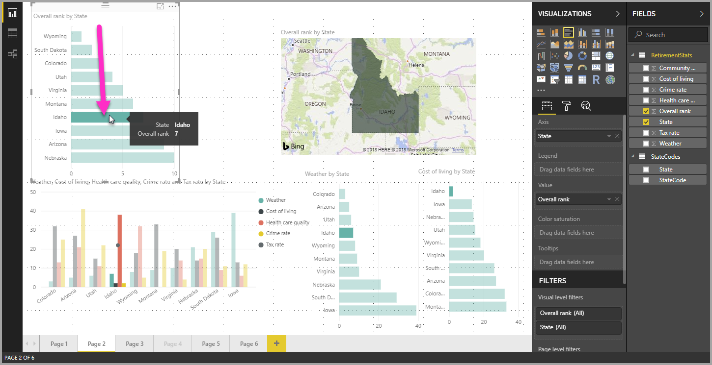
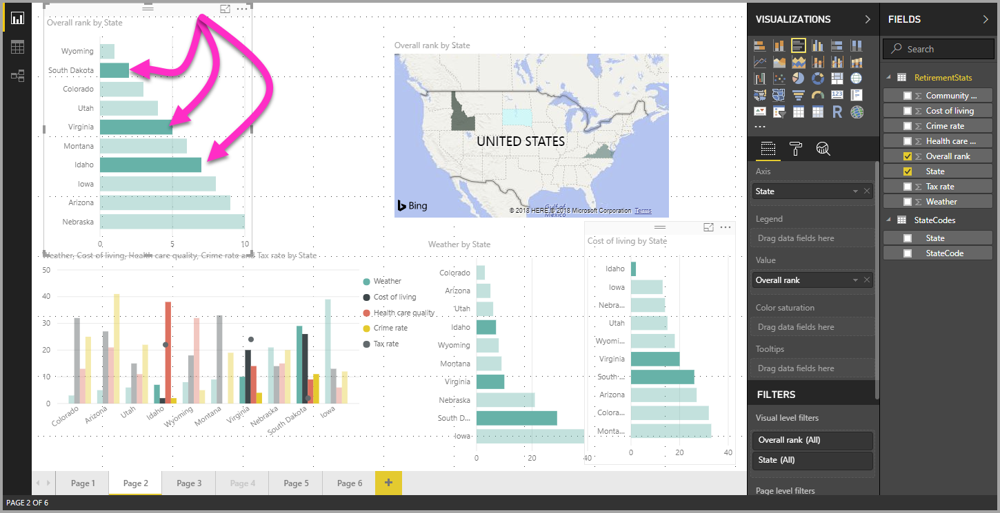

# Multi-select data elements in visuals using Power BI Desktop

In **Power BI Desktop** you can highlight a data point in a given visual by simply clicking on the data point in the visual. For example, if you have an important bar or chart element, and you want other visuals on the report page to highlight data based on your selection, you can click the data element in one visual and see results reflected in other visuals on the page. This is basic, or single-select highlighting. The following image shows a basic highlight. 

With multi-select, you can now select more than one data point in your **Power BI Desktop** report page, and highlight the results across the visuals on the page. This is equivalent to an **and** statement, or functionality, such as "highlight results for Idaho **and** Virginia". To multi-select data points in visuals, simply use **CTRL+Click** to select multiple data points. The following image shows **multiple data points** selected (multi-select).

This sounds like a simple capability, but it opens up all sorts of opportunities when creating, sharing, and interacting with reports. 

## Next steps

You might also be interested in the following articles:

* [Use gridlines and snap-to-grid in Power BI Desktop reports](desktop-gridlines-snap-to-grid.md)
* [About filters and highlighting in Power BI reports](power-bi-reports-filters-and-highlighting.md)

