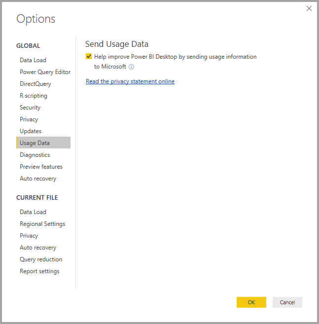
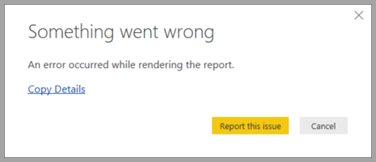

# Power BI Desktop Privacy

At Microsoft, we work hard to protect your privacy while delivering products that bring you the performance, power, and convenience you want. Microsoft collects certain information about your usage of Power BI Desktop to help diagnose problems and improve the product. For more details about Microsoft’s privacy practices, please review the Microsoft Privacy Statement. It applies to the data we collect from your use of **Power BI Desktop**.
 
The information we collect from **Power BI Desktop** users can include data on the operating system, Power BI Desktop information, and Internet Explorer versions. 
 
If you want to opt out of this data collection, you can go to **File > Options and Settings > Options**, and on the **Usage Data** tab, uncheck the **Send Usage Data** check box, as shown in the following image.

## Sending additional information

If you encounter crashes or other issues, you can choose to send error reports and additional information that may help us fix the problem in a future release. We also collect information about the state of the **Power BI Desktop** file you were working on such as document locale, preview features that are enabled, and storage mode. This can include screenshots, error messages, and formulas from your model. These items may include the contents of files you were using when an error occurred, so you should review them before sending. We remind you before sending that you can choose which information is sent to Microsoft.  
 
If you don’t want to send this information, you can click **Close** when an error occurs, or opt out of sending usage data as explained above. 

