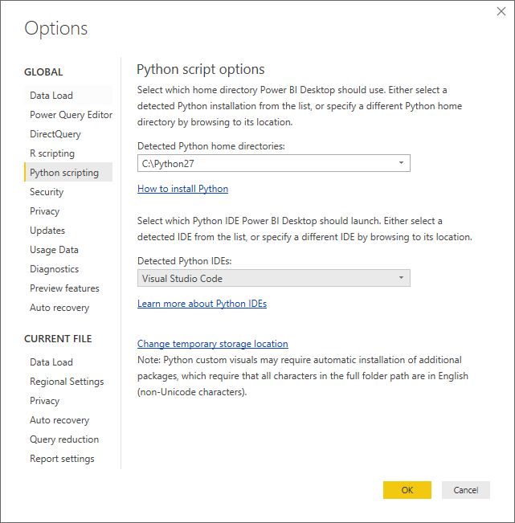
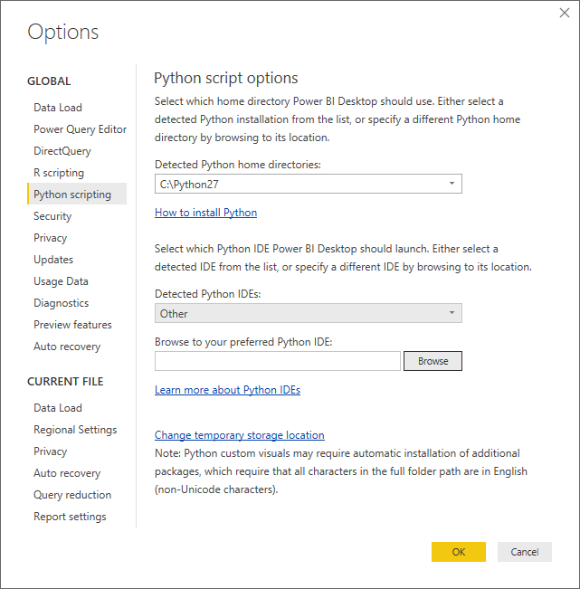
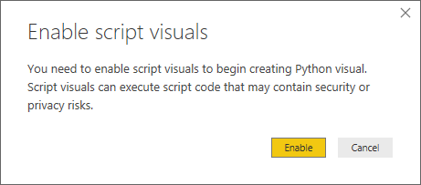
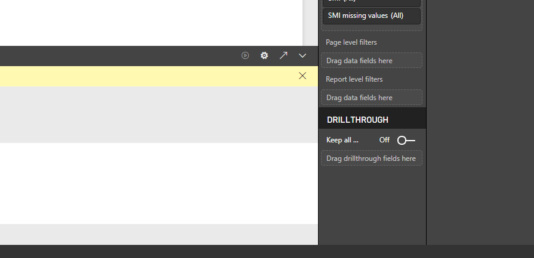
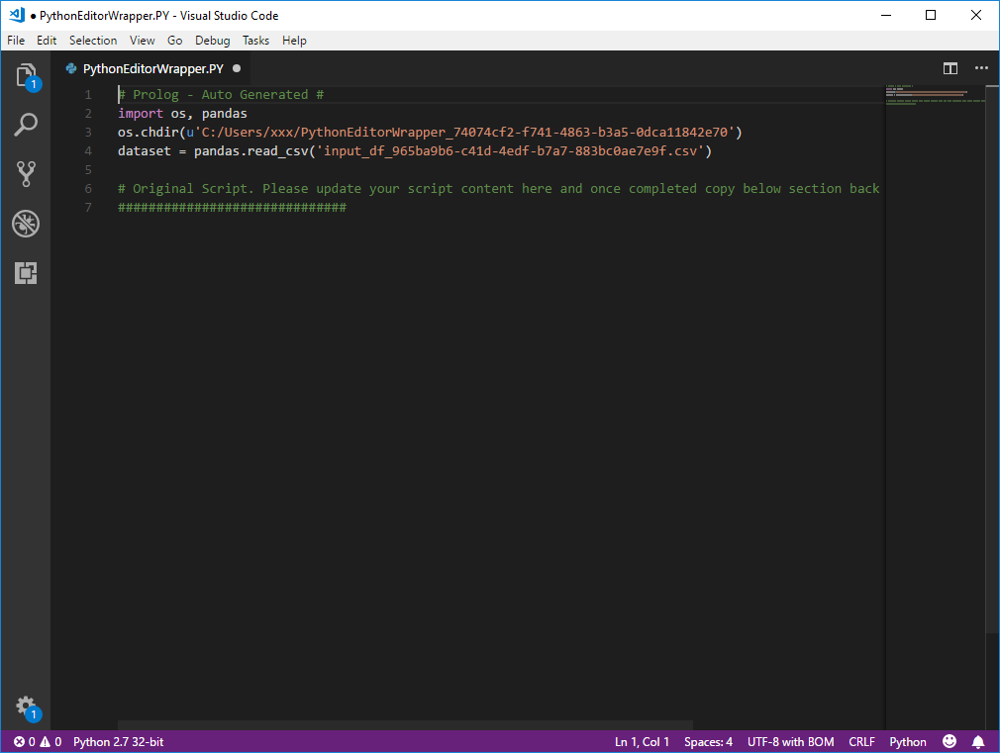

# Use an external Python IDE with Power BI
With **Power BI Desktop**, you can use your external Python IDE (Integrated Development Environment) to create and refine Python scripts, then use those scripts in Power BI.

## Enable an external Python IDE
You can launch your external Python IDE from **Power BI Desktop** and have your data automatically imported and displayed in the Python IDE. From there, you can modify the script in that external Python IDE, then paste it back into **Power BI Desktop** to create Power BI visuals and reports.

You can specify which Python IDE you would like to use, and have it launch automatically from within **Power BI Desktop**.

### Requirements
To use this feature, you need to install an **Python IDE** on your local computer. **Power BI Desktop** does not include, deploy, or install the Python engine, so you must separately install **Python** on your local computer. You can choose which Python IDE to use, with the following options:

* You can install your favorite Python IDE, many of which are available for free, such as the [Visual Studio Code download page](https://code.visualstudio.com/download/).
* **Power BI Desktop** also supports **Visual Studio**.
* You can also install a different Python IDE and have **Power BI Desktop** launch that **Python IDE** by doing one of the following:
  
  * You can associate **.PY** files with the external IDE you want **Power BI Desktop** to launch.
  * You can specify the .exe that **Power BI Desktop** should launch by selecting *Other* from the **Python Script Options** section of the **Options** dialog. You can bring up the **Options** dialog by going to **File > Options and settings > Options**.
    
    

If you have multiple Python IDEs installed, you can specify which will be launched by selecting it from the *Detected Python IDEs* drop-down in the **Options** dialog.

By default, **Power BI Desktop** will launch **Visual Studio Code** as the external Python IDE if it's installed on your local computer; if **Visual Studio Code** is not installed and you have **Visual Studio**, that will be launched instead. If neither of those Python IDEs is installed, the application associated with **.PY** files is launched.

And if no **.PY** file association exists, it's possible to specify a path to a custom IDE in the *Browse to your preferred Python IDE* section of the **Options** dialog. You can also launch a different Python IDE by selecting the **Settings** gear icon beside the **Launch Python IDE** arrow icon, in **Power BI Desktop**.

## Launch an Python IDE from Power BI Desktop
To launch an Python IDE from **Power BI Desktop**, take the following steps:

1. Load data into **Power BI Desktop**.
2. Select some fields from the **Fields** pane that you want to work with. If you haven't enabled script visuals yet, you'll be prompted to do so.
   
   
3. When script visuals are enabled, you can select an Python visual from the **Visualizations** pane, which creates a blank Python visual that's ready to display the results of your script. The **Python script editor** pane also appears.
   
   
4. Now you can select the fields you want to use in your Python script. When you select a field, the **Python script editor** field automatically creates script code based on the field or fields you select. You can either create (or paste) your Python script directly in the **Python script editor** pane, or you can leave it empty.
   
   
   
   > [!NOTE]
   > The default aggregation type for Python visuals is *do not summarize*.
   > 
   > 
5. You can now launch your Python IDE directly from **Power BI Desktop**. Select the **Launch Python IDE** button, found on the right side of the **Python script editor** title bar, as shown below.
   
   
6. Your specified Python IDE is launched by Power BI Desktop, as shown in the following image (in this image, **Visual Studio Code** is the default Python IDE).
   
   
   
   > [!NOTE]
   > **Power BI Desktop** adds the first three lines of the script so it can import your data from **Power BI Desktop** once you run the script.
   > 
   > 
7. Any script you created in the **Python script editor pane** of **Power BI Desktop** appears starting in line 4 in your Python IDE. At this point, you can create your Python script in the Python IDE. Once your Python script is complete in your Python IDE, you need to copy and paste it back into the **Python script editor** pane in **Power BI Desktop**, *excluding* the first three lines of the script that **Power BI Desktop** automatically generated. Do not copy the first three lines of script back into **Power BI Desktop**, those lines were only used to import your data to your Python IDE from **Power BI Desktop**.

### Known limitations
Launching an Python IDE directly from Power BI Desktop has a few limitations:

* Automatically exporting your script from your Python IDE into **Power BI Desktop** is not supported.

## Next steps
Take a look at the following additional information about Python in Power BI.

* [Running Python Scripts in Power BI Desktop](desktop-python-scripts.md)
* [Create Power BI visuals using Python](desktop-python-visuals.md)

