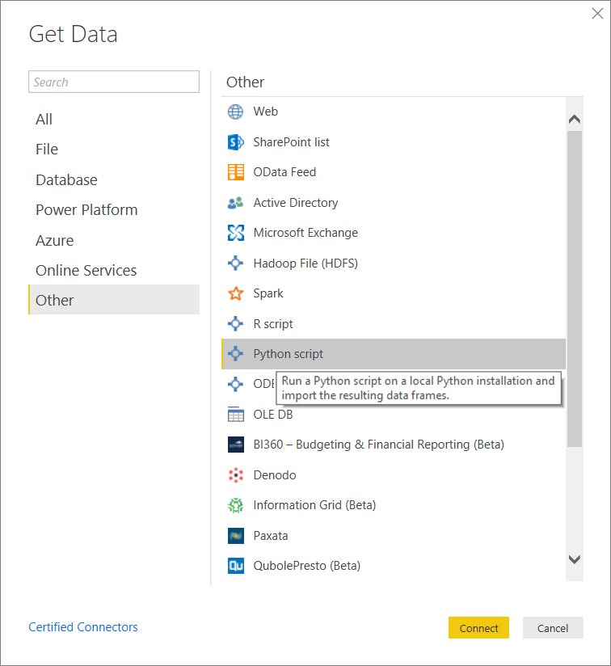

# Run Python scripts in Power BI Desktop
You can run Python scripts directly in **Power BI Desktop**, and import the resulting datasets into a Power BI Desktop data model.

## Install Python
To run Python scripts in Power BI Desktop, you need to install **Python** on your local machine. You can download and install **Python** for free from many locations, including the [Official Python download page](https://www.python.org/), and the [Anaconda](https://anaconda.org/anaconda/python/). The current release of Python scripting in Power BI Desktop supports Unicode characters as well as spaces (empty characters) in the installation path.

### Install Required Python Packages
The Power BI Python integration requires two Python packages to be installed (Pandas and Matplotlib).  Using the pip command line tool, install the following two pacakges,

```
pip install pandas
pip install matplotlib
```

## Run Python scripts
With just a few steps in Power BI Desktop, you can run Python scripts and create a data model, from which you can create reports, and share them on the Power BI service.

### Prepare a Python script
To run a Python script in Power BI Desktop, create the script in your local Python development environment, and make sure it runs successfully.

To run the script in Power BI Desktop, make sure the script runs successfully in a new and unmodified workspace. This means that all packages and dependencies must be explicitly loaded and run.

When preparing and running a Python script in Power BI Desktop, there are a few limitations:

* Only Pandas data frames are imported, so make sure the data you want to import to Power BI is represented in a data frame
* Any Python script that runs longer than 30 minutes times out
* Interactive calls in the Python script, such as waiting for user input, halts the script’s execution
* When setting the working directory within the Python script, you *must* define a full path to the working directory, rather than a relative path
* Nested tables (table of tables) are currently not supported 

### Run your Python script and import data
1. In Power BI Desktop, the Python Script data connector is found in **Get Data**. To run your Python Script, select **Get Data > More...**, then select **Other > Python script** as shown in the following image:
   
   
2. If Python is installed on your local machine, the latest installed version is selected as your Python engine. Simply copy your script into the script window and select **OK**.
   
   
3. If Python is not installed, is not identified, or if there are multiple installations on your local machine, warning will be displayed.
   
   
   
   Python installation settings are centrally located in the Python Scripting section of the Options dialog. To specify your Python installation settings, select **File > Options and settings** and then **Options > Python scripting**. If multiple installations of Python are available, a drop-down menu appears that allows you to select which installation to use. You can also select **Other** and give custom path.
   
   
4. Select **OK** to run the Python Script. When the script runs successfully, you can then choose the resulting data frames to add to the Power BI model.

### Refresh
You can refresh a Python script in Power BI Desktop. When you refresh a Python script, Power BI Desktop runs the Python script again in the Power BI Desktop environment.

## Next steps
Take a look at the following additional information about Python in Power BI.

* [Create Python Visuals in Power BI Desktop](desktop-python-visuals.md)
* [Use an external Python IDE with Power BI](desktop-python-ide.md)
