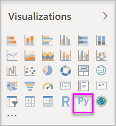

# Create Power BI visuals using Python
With **Power BI Desktop**, you can use **Python** to visualize your data.

## Install Python
**Power BI Desktop** does not include, deploy, or install the **Python** engine. To run Python scripts in **Power BI Desktop**, you must separately install **Python** on your local computer. You can download and install **Python** for free from many locations, including the [Official Python download page](https://www.python.org/), and the [Anaconda](https://anaconda.org/anaconda/python/). The current release of Python scripting in Power BI Desktop supports Unicode characters as well as spaces (empty characters) in the installation path.

## Enable Python visuals
To enable Python visuals, select **File > Options and settings > Options** and in the **Options** page that appears, make sure your local Python installation is specified in the **Python Scripting** section of the **Options** window, as shown in the following image. In the following image, the path local installation of Python is **C:\Python27** and that path is explicitly provided in the text box. Make sure the path it displays properly reflects the local Python installation you want **Power BI Desktop** to use.
   
   

Once you specify your Python installation, you’re ready to begin creating Python visuals.

## Create Python visuals in Power BI Desktop
1. Select the **Python Visual** icon in the **Visualization** pane, as shown in the following image, to add a Python visual.
   
   

   When you add a Python visual to a report, **Power BI Desktop** does the following:
   
   - A placeholder Python visual image appears on the report canvas.
   
   - The **Python script editor** appears along the bottom of the center pane.
   
   

2. Next, add fields you want to consume in your Python script to the **Values** section in the **Fields** well, just as you would with any other **Power BI Desktop** visual. 
    
    Only fields that have been added to the **Fields** well are available to your Python script. You can add new fields or remove unneeded fields from the **Fields** well while working on your Python script in the **Power BI Desktop Python script editor**. **Power BI Desktop** automatically detects which fields you have added or removed.
   
   > [!NOTE]
   > The default aggregation type for Python visuals is *do not summarize*.
   > 
   > 
   
3. Now you can use the data you selected to create a plot. 

    As you select fields, the **Python script editor** generates supporting Python script binding code based on your selections in the gray section along the top of the editor pane. As you select or remove additional fields, supporting code in the Python script editor is automatically generated or removed accordingly.
   
   In the example shown in the following image, three fields were selected: hp, gear, and drat. As a result of those selections, the Python script editor generated the following binding code:
   
   * A dataframe called **dataset** was created
     * That dataframe is comprised of the different fields selected by the user
   * The default aggregation is *do not summarize*
   * Similar to table visuals, fields are grouped and duplicate rows only appear once
   
   
   
   > [!TIP]
   > In certain cases, you may not want automatic grouping to occur, or you may want all rows to appear, including duplicates. In that case, you can add an index field to your dataset that causes all rows to be considered unique and which prevents grouping.
   > 
   > 
   
   The generated dataframe is called a **dataset**, and you can access selected columns by their respective names. For example, access the gear field by writing *dataset["gear"]* in your Python script.

4. With the dataframe automatically generated by the fields you selected, you’re ready to write a Python script that results in plotting to the Python default device. When the script is complete, select **Run** from the **Python script editor** title bar (**Run** is on the right side of the title bar).
   
    When you select **Run**, **Power BI Desktop** identifies the plot and presents it on the canvas. Since the process is executed on your local Python installation, make sure the required packages are installed.
   
   **Power BI Desktop** replots the visual when any of the following events occur:
   
   * When you select **Run** from the **Python script editor** title bar
   * Whenever a data change occurs, due to data refresh, filtering, or highlighting

    The following image shows an example of the correlation plot code, and it plots the correlations between attributes of different types of cars.

    

5. To get a larger view of the visualizations, you can minimize the **Python script editor**. And, of course, like other visuals in **Power BI Desktop**, you can cross filter the correlation plot by selecting only sport cars in the donut visual (the round visual on the right, in the above example image).

    

6. You can also modify the Python script to customize the visual, and take advantage of the power of Python by adding parameters to the plotting command.

    The original plotting command was the following:

    plt.matshow(dataset.corr('pearson'))

    With a few changes in the Python script, the command is now the following:

    plt.matshow(dataset.corr('kendall'))

    As a result, the Python visual now plots using Kendall Tau correlation coefficient, as shown in the following image.

    

    When executing a Python script that results in an error, the Python visual is not plotted and an error message is displayed on the canvas. For details on the error, select **See details** from the Python visual error on the canvas.

    

    > **Python scripts security:** Python visuals are created from Python scripts, which could contain code with security or privacy risks. When attempting to view or interact with an Python visual for the first time, a user is presented with a security warning message. Only enable Python visuals if you trust the author and source, or after you review and understand the Python script.
    > 
    > 

## Known limitations
Python visuals in **Power BI Desktop** has a few limitations:

* Data size limitations – data used by the Python visual for plotting is limited to 150,000 rows. If more than 150,000 rows are selected, only the top 150,000 rows are used and a message is displayed on the image.
* Calculation time limitation – if a Python visual calculation exceeds five minutes the execution times out, resulting in an error.
* Relationships – as with other Power BI Desktop visuals, if data fields from different tables with no defined relationship between them are selected, an error occurs.
* Python visuals are refreshed upon data updates, filtering, and highlighting. However, the image itself is not interactive and cannot be the source of cross-filtering.
* Python visuals respond to highlighting other visuals, but you cannot click on elements in the Python visual in order to cross filter other elements.
* Only plots that are plotted to the Python default display device are displayed correctly on the canvas. Avoid explicitly using a different Python display device.

## Next steps
Take a look at the following additional information about Python in Power BI.

* [Running Python Scripts in Power BI Desktop](desktop-python-scripts.md)
* [Use an external Python IDE with Power BI](desktop-python-ide.md)

