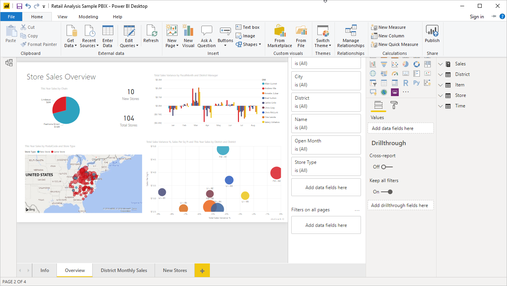
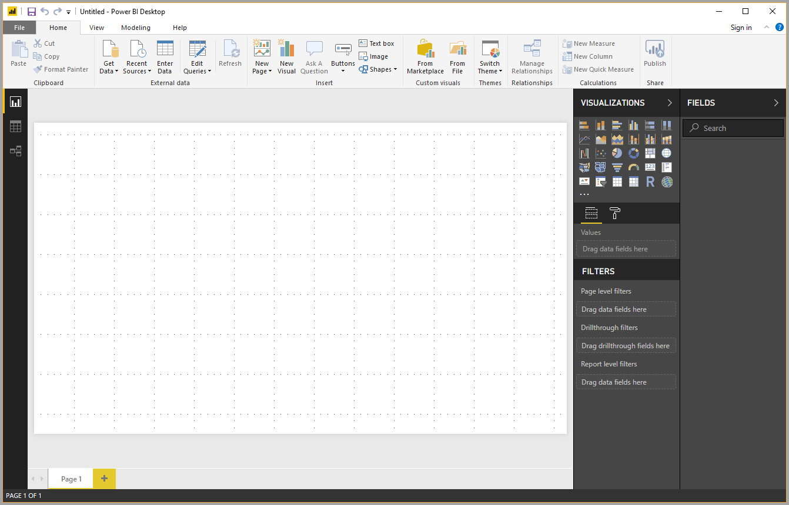
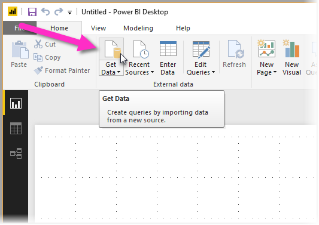
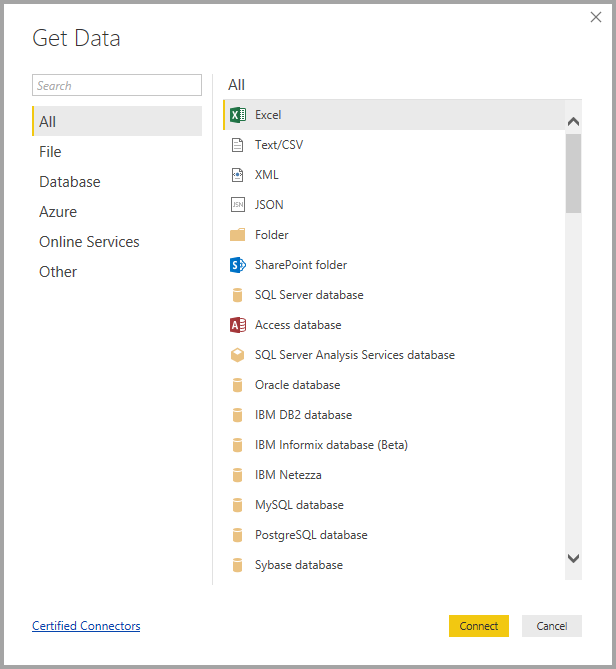
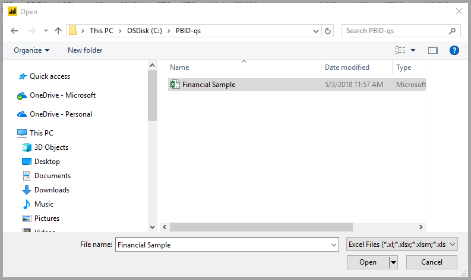
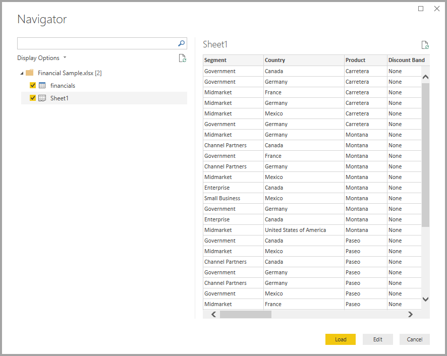
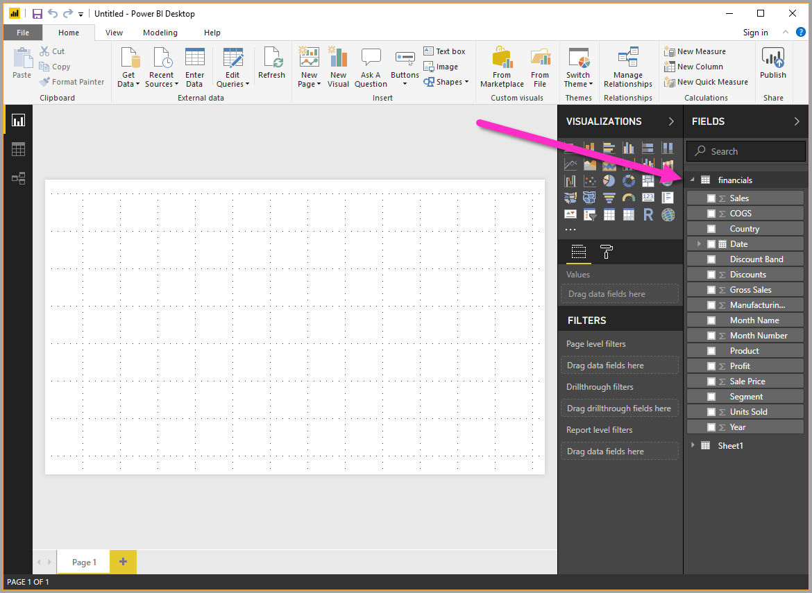

# Quickstart: Connect to data in Power BI Desktop

In this quickstart, you connect to data using **Power BI Desktop**, which is the first step in building data models and creating reports.

If you're not signed up for Power BI, [sign up for a free trial](https://app.powerbi.com/signupredirect?pbi_source=web) before you begin.

## Prerequisites

To complete the steps in this article, you need the following:
* Download and install **Power BI Desktop**, which is a free application that runs on your local computer. You can [download **Power BI Desktop**](https://powerbi.microsoft.com/desktop) direclty, or you can get it from [the **Microsoft Store**](http://aka.ms/pbidesktopstore).
* [Download this sample Excel workbook](http://go.microsoft.com/fwlink/?LinkID=521962), and create a folder called *C:\PBID-qs* where you can store the Excel file. Subsequent steps in this quickstart assume that is the file location for the downloaded Excel workbook.

## Launch Power BI Desktop

Once you install **Power BI Desktop**, launch the application so it's running on your local computer. You're presented with a blank canvas, which is where you create visuals and reports from data to which you connect. 

## Connect to data

With **Power BI Desktop** you can connect to many different types of data. You can connect to basic data sources such as a Microsoft Excel file, and you can connect to online services that contain all sorts of data such as Salesforce, Microsoft Dynamics, Azure Blob Storage, and many more. 

To connect to data, from the **Home** ribbon select **Get Data**.

The **Get Data** window appears, where you can choose from the many different data sources to which **Power BI Desktop** can connect. In this quickstart we use the Excel workbook that you downloaded, described in the *Prerequisites* section at the beginning of this article. 

Since this is an Excel file, we select **Excel** from the **Get Data** window, then select the **Connect** button.

We're prompted to provide the location of the Excel file to which we want to connect. The downloaded file is called *Financial Sample* so we select that file, and then select **Open**.

**Power BI Desktop** then loads the workbook and reads its contents, and shows you the available data in the file using the **Navigator** window, where you can choose which data you would like to load into Power BI Desktop. You select the tables by marking the checkboxes beside each table you want to import. In this case, we'll import both available tables.

Once you've made your selections, select **Load** to import the data into Power BI Desktop.

## View data in the Fields pane

Once you've loaded the tables, the **Fields** pane shows you the data. You can expand each table by selecting the triangle beside its name. In the following image, the *financials* table is expanded, showing each of its fields. 

And that's it! You've connected to data in **Power BI Desktop**, loaded that data, and now you can see all the available fields within those tables.

## Next steps
There are all sorts of things you can do with **Power BI Desktop** once you've connected to data, such as creating visuals and reports. Take a look at the following resource to get you going:

* [Getting Started Guide for Power BI Desktop](desktop-getting-started.md)

