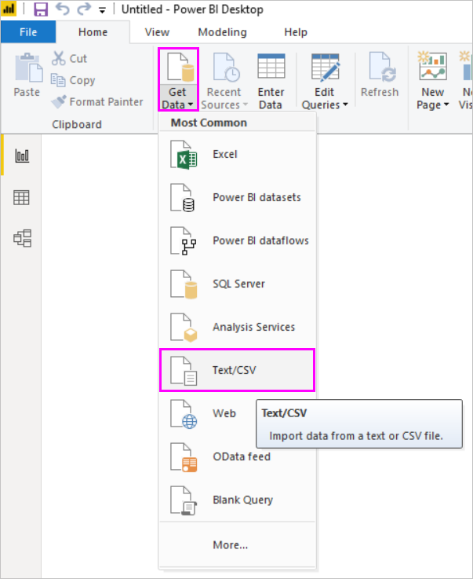
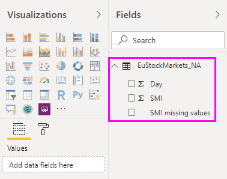
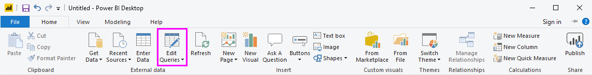
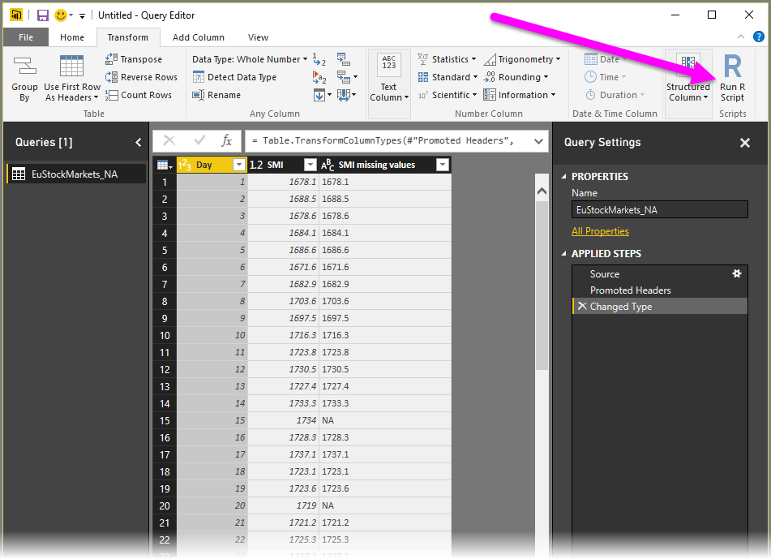
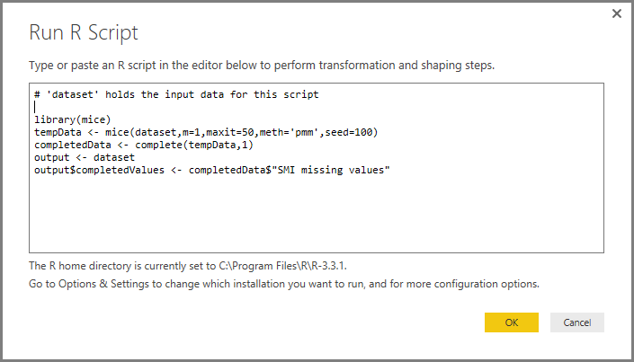
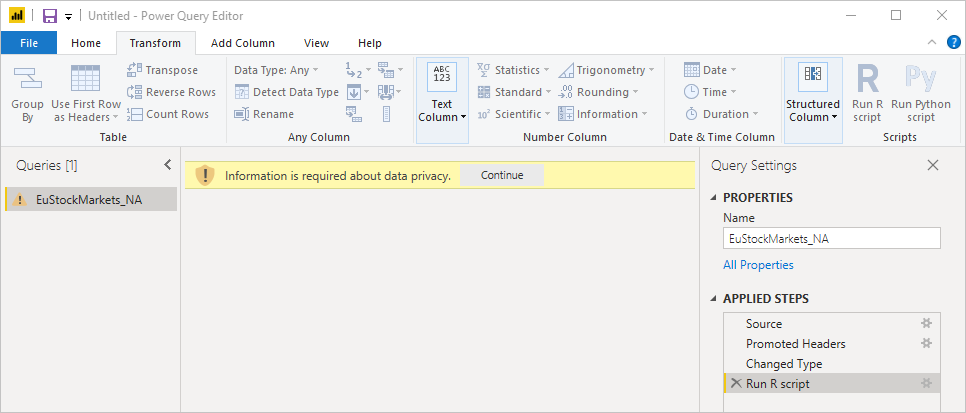
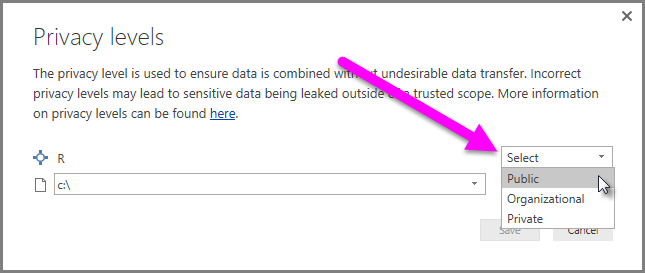

# Using R in Query Editor
You can use **R**, a programming language widely used by statisticians, data scientists, and data analysts, in the Power BI Desktop **Query Editor**. This integration of R into **Query Editor** lets you perform data cleansing using R, and perform advanced data shaping and analytics in datasets, including completion of missing data, predictions, and clustering, just to name a few. **R** is a powerful language, and can be used in **Query Editor** to prepare your data model and create reports.

## Installing R
To use **R** in Power BI Desktop's **Query Editor**, you need to install **R** on your local machine. You can download and install **R** for free from many locations, including the [Revolution Open download page](https://mran.revolutionanalytics.com/download/), and the [CRAN Repository](https://cran.r-project.org/bin/windows/base/).

## Using R in Query Editor
To show how to use **R** in **Query Editor**, take this example from a stock market dataset, based on a .CSV file that you can [download from here](http://download.microsoft.com/download/F/8/A/F8AA9DC9-8545-4AAE-9305-27AD1D01DC03/EuStockMarkets_NA.csv) and follow along. The steps for this example are the following:

1. First, load your data into **Power BI Desktop**. In this example, load the *EuStockMarkets_NA.csv* file and select **Get Data > CSV** from the **Home** ribbon in **Power BI Desktop**.

   
2. Select the file and select **Open**, and the CSV is displayed in the **CSV file** dialog.

   
3. Once the data is loaded, you'll see it in the **Fields** pane in Power BI Desktop.

   
4. Open **Query Editor** by selecting **Edit Queries** from the **Home** tab in **Power BI Desktop**.

   
5. In the **Transform** tab, select **Run R Script** and the **Run R Script** editor appears (shown in the next step). Notice that rows 15 and 20 suffer from missing data, as do other rows you can't see in the following image. The steps below show how R can (and will) complete those rows for you.

   
6. For this example, enter the following script code:

       library(mice)
       tempData <- mice(dataset,m=1,maxit=50,meth='pmm',seed=100)
       completedData <- complete(tempData,1)
       output <- dataset
       output$completedValues <- completedData$"SMI missing values"

   > [!NOTE]
   > You'll need to have the *mice* library installed in your R environment for the previous script code to work properly. To install mice, run the following command in your R installation:
   > |      > install.packages('mice')
   > 
   > 

   When put into the **Run R Script** dialog, the code looks like the following:

   
7. After selecting **OK**, **Query Editor** displays a warning about data privacy.

   
8. For the R scripts to work properly in the Power BI service, all data sources need to be set to *public*. For more information about privacy settings and their implications, see [Privacy Levels](desktop-privacy-levels.md).

   

   Notice a new column in the **Fields** pane called *completedValues*. Notice there are a few missing data elements, such as on row 15 and 18. Take a look at how R handles that in the next section.

With just five lines of R script, **Query Editor** filled in the missing values with a predictive model.

## Creating visuals from R script data
Now we can create a visual to see how the R script code using the *mice* library completed the missing values, as shown in the following image:

Once that visual is complete, and any other visuals you might want to create using **Power BI Desktop**, you can save the **Power BI Desktop** file (which saves as a .pbix file) and then use the data model, including the R scripts that are part of it, in the Power BI service.

> [!NOTE]
> Want to see a completed .pbix file with these steps completed? You're in luck - you can download the completed **Power BI Desktop** file used in these examples [right here](http://download.microsoft.com/download/F/8/A/F8AA9DC9-8545-4AAE-9305-27AD1D01DC03/Complete%20Values%20with%20R%20in%20PQ.pbix).

Once you've uploaded the .pbix file to the Power BI service, a couple more steps are necessary to enable data refresh (in the service) and to enable visuals to be updated in the service (the data needs access to R for visuals to be updated). The additional steps are the following:

* **Enable scheduled refresh for the dataset** - to enable scheduled refresh for the workbook that contains your dataset with R scripts, see [Configuring scheduled refresh](refresh-scheduled-refresh.md), which also includes information about **Personal Gateway**.
* **Install the Personal Gateway** - you need a **Personal Gateway** installed on the machine where the file is located, and where R is installed; the Power BI service must access that workbook and re-render any updated visuals. You can get more information on how to [install and configure Personal Gateway](service-gateway-personal-mode.md).

## Limitations
There are some limitations to queries that include R scripts created in **Query Editor**:

* All R data source settings must be set to *Public*, and all other steps in a query created in **Query Editor** must also be public. To get to data source settings, in **Power BI Desktop** select **File > Options and settings > Data source settings**.

  

  From the **Data Source Settings** dialog, select the data source(s) and then select **Edit Permissions...** and ensure that the **Privacy Level** is set to *Public*.

      
* To enable scheduled refresh of your R visuals or dataset, you need to enable **Scheduled refresh** and have a **Personal Gateway** installed on the computer that houses the workbook and the R installation. For more information on both, see the previous section in this article, which provides links to learn more about each.

There are all sorts of things you can do with R and custom queries, so explore and shape your data just the way you want it to appear.

