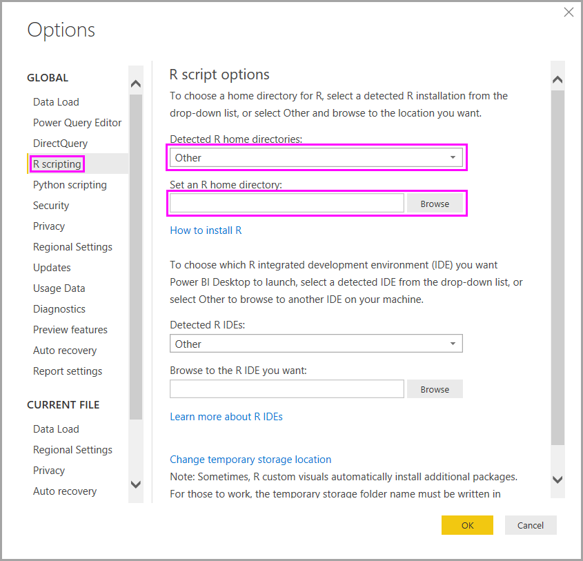

# Run R scripts in Power BI Desktop
You can run R scripts directly in **Power BI Desktop**, and import the resulting datasets into a Power BI Desktop data model.

## Install R
To run R scripts in Power BI Desktop, you need to install **R** on your local machine. You can download and install **R** for free from many locations, including the [Revolution Open download page](https://mran.revolutionanalytics.com/download/), and the [CRAN Repository](https://cran.r-project.org/bin/windows/base/). The current release of R scripting in Power BI Desktop supports Unicode characters as well as spaces (empty characters) in the installation path.

## Run R scripts
With just a few steps in Power BI Desktop, you can run R scripts and create a data model, from which you can create reports, and share them on the Power BI service. R scripting in Power BI Desktop now supports number formats that contain decimals (.) and commas (,).

### Prepare an R script
To run an R script in Power BI Desktop, create the script in your local R development environment, and make sure it runs successfully.

To run the script in Power BI Desktop, make sure the script runs successfully in a new and unmodified workspace. This means that all packages and dependencies must be explicitly loaded and run. You can use *source()* to run dependent scripts.

When preparing and running an R script in Power BI Desktop, there are a few limitations:

* Only data frames are imported, so make sure the data you want to import to Power BI is represented in a data frame
* Columns that are typed as Complex and Vector are not imported, and are replaced with error values in the created table
* Values that are N/A are translated to NULL values in Power BI Desktop
* Any R script that runs longer than 30 minutes times out
* Interactive calls in the R script, such as waiting for user input, halts the script’s execution
* When setting the working directory within the R script, you *must* define a full path to the working directory, rather than a relative path

### Run your R script and import data
1. In Power BI Desktop, the R Script data connector is found in **Get Data**. To run your R Script, select **Get Data > More...**, then select **Other > R script** as shown in the following image:
   
   
2. If R is installed on your local machine, the latest installed version is selected as your R engine. Simply copy your script into the script window and select **OK**.
   
   
3. If R is not installed, is not identified, or if there are multiple installations on your local machine, expand **R Installation Settings** to display installation options, or to select which installation you want to run the R script.
   
   
   
   If R is installed and is not identified, you can explicitly provide its location in the text box provided when you expand **R Installation Settings**. In the above image, the path *C:\Program Files\R\R-3.2.0* is explicitly provided in the text box.
   
   R installation settings are centrally located in the R Scripting section of the Options dialog. To specify your R installation settings, select **File > Options and settings** and then **Options > R scripting**. If multiple installations of R are available, a drop-down menu appears that allows you to  select which installation to use.
   
   
4. Select **OK** to run the R Script. When the script runs successfully, you can then choose the resulting data frames to add to the Power BI model.

### Refresh
You can refresh an R script in Power BI Desktop. When you refresh an R script, Power BI Desktop runs the R script again in the Power BI Desktop environment.

## Next steps
Take a look at the following additional information about R in Power BI.

* [Create R Visuals in Power BI Desktop](desktop-r-visuals.md)
* [Use an external R IDE with Power BI](desktop-r-ide.md)

