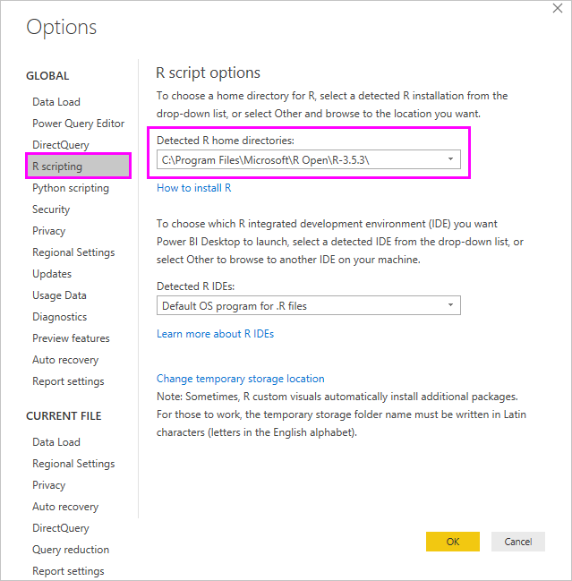

# Create Power BI visuals using R
With **Power BI Desktop**, you can use **R** to visualize your data.

## Install R
**Power BI Desktop** does not include, deploy, or install the **R** engine. To run R scripts in **Power BI Desktop**, you must separately install **R** on your local computer. You can download and install **R** for free from many locations, including the [Revolution Open download page](https://mran.revolutionanalytics.com/download/), and the [CRAN Repository](https://cran.r-project.org/bin/windows/base/). The current release of R scripting in **Power BI Desktop** supports Unicode characters as well as spaces (empty characters) in the installation path.

## Enable R visuals
To enable R visuals, select **File > Options and settings > Options** and in the **Options** page that appears, make sure your local R installation is specified in the **R Scripting** section of the **Options** window, as shown in the following image. In the following image, the path local installation of R is **C:\Program Files\R\R-3.2.0** and that path is explicitly provided in the text box. Make sure the path it displays properly reflects the local R installation you want **Power BI Desktop** to use.
   
   

Once you specify your R installation, you’re ready to begin creating R visuals.

## Create R visuals in Power BI Desktop
1. Select the **R Visual** icon in the **Visualization** pane, as shown in the following image, to add an R visual.
   
   

   When you add an R visual to a report, **Power BI Desktop** does the following:
   
   - A placeholder R visual image appears on the report canvas.
   
   - The **R script editor** appears along the bottom of the center pane.
   
   

2. Next, add fields you want to consume in your R script to the **Values** section in the **Fields** well, just as you would with any other **Power BI Desktop** visual. 
    
    Only fields that have been added to the **Fields** well are available to your R script. You can add new fields or remove unneeded fields from the **Fields** well while working on your R script in the **Power BI Desktop R script editor**. **Power BI Desktop** automatically detects which fields you have added or removed.
   
   > [!NOTE]
   > The default aggregation type for R visuals is *do not summarize*.
   > 
   > 
   
3. Now you can use the data you selected to create a plot. 

    As you select fields, the **R script editor** generates supporting R script binding code based on your selections in the gray section along the top of the editor pane. As you select or remove additional fields, supporting code in the R script editor is automatically generated or removed accordingly.
   
   In the example shown in the following image, three fields were selected: hp, gear, and drat. As a result of those selections, the R script editor generated the following binding code:
   
   * A dataframe called **dataset** was created
     * That dataframe is comprised of the different fields selected by the user
   * The default aggregation is *do not summarize*
   * Similar to table visuals, fields are grouped and duplicate rows only appear once
   
   
   
   > [!TIP]
   > In certain cases, you may not want automatic grouping to occur, or you may want all rows to appear, including duplicates. In that case, you can add an index field to your dataset that causes all rows to be considered unique and which prevents grouping.
   > 
   > 
   
   The generated dataframe is called a **dataset**, and you can access selected columns by their respective names. For example, access the gear field by writing *dataset$gear* in your R script. For fields with spaces or special characters, use single quotes.

4. With the dataframe automatically generated by the fields you selected, you’re ready to write a R script that results in plotting to the R default device. When the script is complete, select **Run** from the **R script editor** title bar (**Run** is on the right side of the title bar).
   
    When you select **Run**, **Power BI Desktop** identifies the plot and presents it on the canvas. Since the process is executed on your local R installation, make sure the required packages are installed.
   
   **Power BI Desktop** replots the visual when any of the following events occur:
   
   * When you select **Run** from the **R script editor** title bar
   * Whenever a data change occurs, due to data refresh, filtering, or highlighting

     The following image shows an example of the correlation plot code, and it plots the correlations between attributes of different types of cars.

     

5. To get a larger view of the visualizations, you can minimize the **R script editor**. And, of course, like other visuals in **Power BI Desktop**, you can cross filter the correlation plot by selecting only sport cars in the donut visual (the round visual on the right, in the above example image).

    

6. You can also modify the R script to customize the visual, and take advantage of the power of R by adding parameters to the plotting command.

    The original plotting command was the following:

    corrplot(M, method = "color",  tl.cex=0.6, tl.srt = 45, tl.col = "black")

    With a few changes in the R script, the command is now the following:

    corrplot(M, method = "circle", tl.cex=0.6, tl.srt = 45, tl.col = "black", type= "upper", order="hclust")

    As a result, the R visual now plots circles, only considers at the upper half, and reorders the matrix to cluster correlated attributes, as shown in the following image.

    

    When executing a R script that results in an error, the R visual is not plotted and an error message is displayed on the canvas. For details on the error, select **See details** from the R visual error on the canvas.

    

    > **R scripts security:** R visuals are created from R scripts, which could contain code with security or privacy risks. When attempting to view or interact with an R visual for the first time, a user is presented with a security warning message. Only enable R visuals if you trust the author and source, or after you review and understand the R script.
    > 
    > 

## Known limitations
R visuals in **Power BI Desktop** has a few limitations:

* Data size limitations – data used by the R visual for plotting is limited to 150,000 rows. If more than 150,000 rows are selected, only the top 150,000 rows are used and a message is displayed on the image.
* Calculation time limitation – if an R visual calculation exceeds five minutes the execution times out, resulting in an error.
* Relationships – as with other Power BI Desktop visuals, if data fields from different tables with no defined relationship between them are selected, an error occurs.
* R visuals are refreshed upon data updates, filtering, and highlighting. However, the image itself is not interactive and cannot be the source of cross-filtering.
* R visuals respond to highlighting other visuals, but you cannot click on elements in the R visual in order to cross filter other elements.
* Only plots that are plotted to the R default display device are displayed correctly on the canvas. Avoid explicitly using a different R display device.
* In this release, RRO installations are not automatically identified by the 32-bit version of Power BI Desktop, so you must manually provide the path to the R installation directory in **Options and settings > Options > R Scripting**.

## Next steps
Take a look at the following additional information about R in Power BI.

* [Running R Scripts in Power BI Desktop](desktop-r-scripts.md)
* [Use an external R IDE with Power BI](desktop-r-ide.md)

