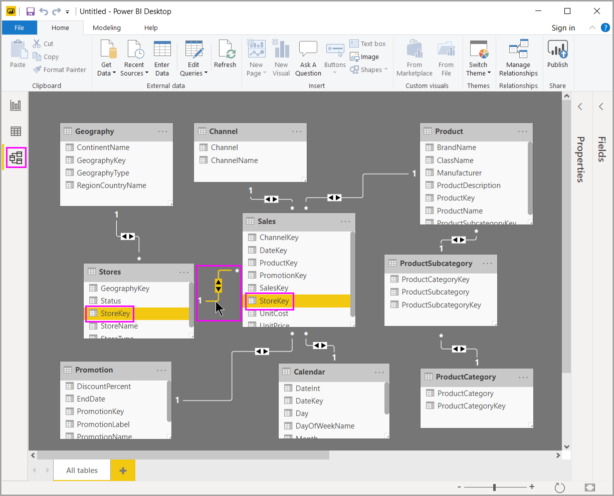

# Relationship View in Power BI Desktop
**Relationship View** shows all of the tables, columns, and relationships in your model. This can be especially helpful when your model has complex relationships between many tables.

Let’s take a look.

**A.**  Relationship View icon – Click to show your model in Relationship View

**B.** Relationship – You can hover your cursor over a relationship to show the columns used. Double-click on a relationship to open it in the **Edit Relationship** dialog box. 

In the figure above, you can see the *Stores* table has a *StoreKey* column that’s related to the *Sales* table, which also has a *StoreKey* column. We see it’s a *Many to One* (\*:1) relationship, and the icon in the middle of the line shows the Cross filter direction set to *Both*. The arrow on the icon shows the direction of the filter context flow.

To learn more about relationships, see [Create and manage relationships in Power BI Desktop](desktop-create-and-manage-relationships.md).

