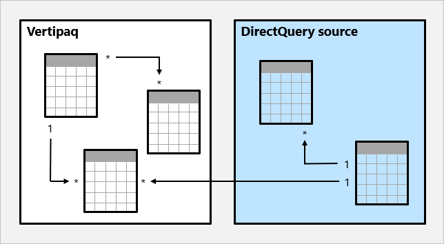
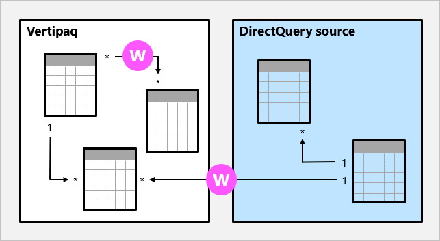

# Model relationships in Power BI Desktop

This article targets Import data modelers working with Power BI Desktop. It's an important model design topic that is essential to delivering intuitive, accurate, and optimal models.

For a deeper discussion on optimal model design, including table roles and relationships, see the [Understand star schema and the importance for Power BI](guidance/star-schema.md) article.

## Relationship purpose

Simply put, Power BI relationships propagate filters applied on the columns of model tables to other model tables. Filters will propagate so long as there's a relationship path to follow, which can involve propagation to multiple tables.

Relationship paths are deterministic, meaning that filters are always propagated in the same way and without random variation. Relationships can, however, be disabled, or have filter context modified by model calculations that use particular DAX functions. For further information, see the [Relevant DAX functions](#relevant-dax-functions) topic later in this article.

> [!IMPORTANT]
> It's important to understand that model relationships do not enforce data integrity. For further information, see the [Relationship evaluation](#relationship-evaluation) topic later in this article to learn how model relationships can respond to data integrity issues in your data.

Let's see how relationships can propagate filters with a simple example supported by an animated image.

In this example, the model consists of four tables: **Category**, **Product**, **Year**, and **Sales**. The **Category** table relates to the **Product** table, and the **Product** table relates to the **Sales** table. The **Year** table also relates to the **Sales** table. All relationships are one-to-many (the details of which are shared later in this article).

A query—for example, generated by a Power BI card visual—requests the total sales quantity for sales orders made for a single category, **Cat-A**, and for a single year, **CY2018**. This is why filters are applied on the **Category** and **Year** tables. The filter on the **Category** table propagates to the **Product** table to isolate two products that are assigned to the category **Cat-A**. Next, the **Product** table filters propagate to the **Sales** table to isolate just two sales rows for these products. These two sales rows represent the sales of products assigned to category **Cat-A**, and their combined quantity is 14 units. At the same time, the **Year** table filter propagates to further filter the **Sales** table, resulting in just the one sales row that is for products assigned to category **Cat-A** and that was ordered in year **CY2018**. The quantity value returned by the query is 11 units. Note that when multiple filters are applied to a table (like the **Sales** table), it's always an AND operation, requiring that all conditions must be true.

### Disconnected tables

It's unusual that a model table isn't related to another model table. Such a table in a valid model design can be described as a _disconnected table_. A disconnected table isn't intended to propagate filters to other model tables. Instead, it's used to accept "user input" (perhaps with a slicer visual), allowing model calculations to use the input value in a meaningful way. For example, consider a disconnected table that is loaded with a range of daily currency exchange rates. Providing a filter is applied to isolate a single exchange rate value, the value can be used by a measure expression to convert sales values.

The Power BI Desktop what-if parameter is feature that creates a disconnected table. For further information, see the [Create and use a What if parameter to visualize variables in Power BI Desktop](desktop-what-if.md) article.

## Relationship properties

A model relationship relates one column in a table to one column in a different table. (There's one specialized case where this requirement isn't true, and this applies only to multi-column relationships in DirectQuery models. For further information, see the [COMBINEVALUES](/dax/combinevalues-function-dax) DAX function article.)

> [!NOTE]
> It's not possible to relate a column to a different column in the same table. This is sometimes confused with the ability to define a relational database foreign key constraint that is table self-referencing. This relational database concept can be used to store a parent-child hierarchy (for example, an employee organization chart, relating each employee to a "reports to" employee). Generating a model hierarchy based on this type of relationship can't be solved by creating model relationships. To achieve this, see the [Parent and Child functions](/dax/parent-and-child-functions-dax) article.

### Cardinality

Each model relationship must be defined with a cardinality type. There are four cardinality type options, representing the data characteristics of the "from" and "to" related columns. The "one" side means the column contains unique values; the "two" side means the column can contain duplicate values.

> [!NOTE]
> If a data refresh operation attempts to load duplicate values into a "one" side column, the entire data refresh will fail.

The four options—together with their shorthand notations—are described in the following bulleted list:

- One-to-many (1:\*)
- Many-to-one (\*:1)
- One-to-one (1:1)
- Many-to-many (\*:\*)

In Power BI Desktop, when you create a relationship the designer will automatically detect and set the cardinality type. The designer can do this because it queries the model to know which columns contain unique values. For Import models it uses internal storage statistics; for DirectQuery models it sends profiling queries to the data source. Sometimes, however, it can get it wrong. It can get it wrong because tables are yet to be loaded with data, or because columns that you expect to contain duplicate values currently contain unique values. In this instance, you can update the cardinality type providing any "one" side columns contain unique values (or the table is yet to be loaded with rows of data).

The **One-to-many** and **Many-to-one** cardinality options are essentially the same, and they're also the most common cardinality types.

When configuring a One-to-many or Many-to-one relationship, you'll choose the one that matches the order in which you related the columns. Consider how you would configure the relationship from the **Product** table to the **Sales** table by using the **ProductID** column found in each table. The cardinality type would be _One-to-many_, as the **ProductID** column in the **Product** table contains unique values. If you related the tables in the reverse direction, **Sales** to **Product**, then the cardinality would be _Many-to-one_.

A **One-to-one** relationship means both columns contain unique values. This cardinality type isn't common, and it likely represents a suboptimal model design because of the storage of redundant data.<!-- For guidance on using this cardinality type, see the [One-to-one relationship guidance](guidance/relationships-one-to-one) article.-->

A **Many-to-many** relationship means both columns can contain duplicate values. This cardinality type is infrequently used. It's typically useful when designing complex model requirements.<!-- For guidance on using this cardinality type, see the [Many-to-many relationship guidance](guidance/relationships-many-to-many) article.-->

> [!NOTE]
> The Many-to-many cardinality type isn't currently supported for models developed for Power BI Report Server.

> [!TIP]
> In Power BI Desktop model view, you can interpret a relationship's cardinality type by noticing the indicators (1 or \*) on either side of the relationship line. To determine the related columns, you'll need to select, or hover the cursor over, the relationship line to have the columns highlighted.

### Cross filter direction

Each model relationship must be defined with a cross filter direction. Your selection determines the direction(s) that filters will propagate. The possible cross filter options are dependent on the cardinality type.

| Cardinality type | Cross filter options |
| --- | --- |
| One-to-many (or Many-to-one) | Single Both |
| One-to-one | Both |
| Many-to-many | Single (Table1 to Table2) Single (Table2 to Table1) Both |

_Single_ means "single direction", and _Both_ means "both directions" and is commonly described as _bi-directional_.

For One-to-many relationships, the cross filter direction is always from the "one" side, and optionally from the "many" side also (both). For One-to-one relationships, the cross filter direction is always from both tables. Lastly, for the Many-to-many relationships, cross filter direction can be from either one of the tables, or from both tables. Notice that when the cardinality type includes a "one" side, that filters will always propagate from that side.

When the cross filter direction is set to **Both**, an additional property is available to apply bi-directional filtering when row-level security (RLS) rules are enforced. For further information about RLS, see the [Row-level security (RLS) with Power BI Desktop](desktop-rls.md) article.

Modifying the relationship cross filter direction, including the disabling of filter propagation, can also be done by a model calculation. It is achieved by using the [CROSSFILTER](/dax/crossfilter-function) DAX function.

Bi-directional relationships can impact negatively on performance. Further, attempting to configure a bi-directional relationship could result in ambiguous filter propagation paths. In this case, Power BI Desktop may fail to commit the relationship change and will alert you with an error message. Sometimes, however, Power BI Desktop may allow you to define ambiguous relationship paths between tables. Precedence rules that affect ambiguity detection and path resolution are described later in this article in the [Precedence rules](#precedence-rules) topic.

We recommend using bi-directional filtering on needs-basis.<!-- For guidance on bi-directional filtering, see the [Cross filter relationship guidance](guidance/relationships-bidirectional-filtering) article.-->

> [!TIP]
> In Power BI Desktop model view, you can interpret a relationship's cross filter direction by noticing the arrowhead(s) along the relationship line. A single arrowhead represents a single-direction filter in the direction of the arrowhead; a double arrowhead represents a bi-directional relationship.

### Make this relationship active

There can only be one active filter propagation path between two model tables. However, it's possible to introduce additional relationship paths, though these relationships must all be configured as _inactive_. Inactive relationships can only be made active during the evaluation of a model calculation. It is achieved by using the [USERELATIONSHIP](/dax/userelationship-function-dax) DAX function.

<!--For guidance on defining inactive relationships, see the [Active vs inactive relationship guidance](guidance/relationships-active-inactive) article.-->

> [!TIP]
> In Power BI Desktop model view, you can interpret a relationship's active vs inactive status. An active relationship is represented by a solid line; an inactive relationship is represented as a dashed line.

### Assume referential integrity

This property is valid only for One-to-many and One-to-one relationships between two DirectQuery storage mode tables that are based on the same data source. When enabled, native queries sent to the data source will join the two tables together by using an INNER JOIN rather than an OUTER JOIN. Generally, enabling this property improves query performance, though it does depend on the specifics of the data source.

This property should always be enabled when a database foreign key constraint exists between the two tables. When a foreign key constraint doesn't exist, you can still enable the property providing that you are certain data integrity exists.

> [!IMPORTANT]
> If data integrity should become compromised, the inner join will eliminate unmatched rows between the tables. For example, if a model **Sales** table stored a **ProductID** column value that did not exist in the related **Product** table, any **Sales** table rows for that product would be eliminated from the query, resulting in an understatement of the sales results.
>
> For further information, see the [Assume referential integrity settings in Power BI Desktop](desktop-assume-referential-integrity.md) article.

## Relevant DAX functions

There are several DAX functions that are relevant to model relationships. Each function is described briefly in the following bulleted list:

- [RELATED](/dax/related-function-dax): Retrieves the value from "one" side.
- [RELATEDTABLE](/dax/relatedtable-function-dax): Retrieve a table of rows from "many" side.
- [USERELATIONSHIP](/dax/userelationship-function-dax): Forces the use of a specific inactive model relationship.
- [CROSSFILTER](/dax/crossfilter-function): Modifies the relationship cross filter direction (to one or both), or it disables filter propagation (none).
- [COMBINEVALUES](/dax/combinevalues-function-dax): Joins two or more text strings into one text string. The primary purpose of this function is to support multi-column relationships in DirectQuery models.
- [TREATAS](/dax/treatas-function): Applies the result of a table expression as filters to columns from an unrelated table.
- [Parent and Child functions](/dax/parent-and-child-functions-dax): A family of related functions that can be used to generate calculated columns that naturalize a parent-child hierarchy. These columns can then be used to create a fixed-level hierarchy.

## Relationship evaluation

Model relationships, from an evaluation perspective, are classified as either _strong_ or _weak_. It's not a configurable relationship property. It is in fact inferred from the cardinality type of the source of the two related model tables. It's important to understand the evaluation type because there may be performance implications or data integrity consequences. These implications and integrity consequences are described in this topic.

Some modeling theory is required to fully understand relationship evaluations.

An Import or DirectQuery model sources all of its data from either the Vertipaq cache or the source database. In both instances, Power BI is able to determine that a "one" side to a relationship exists.

A Composite model, however, can be comprised of tables using different storage modes (Import, DirectQuery or Dual), or multiple DirectQuery sources. Each source, including the Vertipaq cache of Import data, is considered a data island. Model relationships can then be classified as _intra-island_ or _cross-island_. An intra-island relationship is one that relates two tables within a data island, while a cross-island relationship relates tables from different data islands. Note that all relationships in Import or DirectQuery models are intra-island.

Let's see an example of a Composite model.

In this example, the Composite model consists of two islands: a Vertipaq data island and a DirectQuery source data island. The Vertipaq data island contains three tables, and a single DirectQuery source data island contains two tables. One cross-island relationship exists in the model that relates a table in the Vertipaq data island to a table in the DirectQuery source data island.

### Strong relationships

A model relationship is strong when the query engine can determine the "one" side of relationship. It understands that the "one" side column is guaranteed to contain unique values.

All One-to-many intra-island relationships are strong relationships.

In the following example, there are two strong relationships, both marked with the **S**. Relationships include the One-to-many relationship contained within the Vertipaq island, and the One-to-many relationship contained within the DirectQuery source.

For Import models, stored in the Vertipaq cache, a data structure is created for each strong relationship at data refresh time. These data structures consist of indexed mappings of the column-to-column values, and their purpose is to accelerate joining tables at query time.

At query time, strong relationships permit _table expansion_ to take place. Table expansion results in the creation of a virtual table by including the native columns of the base table and then expanding into related tables. This is done in the query engine for Import tables, and in the native query sent to the source database for DirectQuery tables, providing that the "assume referential integrity" property isn't enabled. The query engine then acts upon the expanded table, applying filters and grouping by the values in the expanded columns.

> [!NOTE]
> Inactive relationships are expanded also, even when the relationship isn't used by a calculation. Bi-directional relationships have no impact on table expansion.

For Many-to-many relationships, table expansion takes place from the "many" to the "one" sides by using LEFT OUTER JOIN semantics. When a matching value from the "many" to the "one" side doesn't exist, a blank virtual row is added to the "one" side table.

Table expansion also occurs for One-to-one intra-island relationships, but by using FULL OUTER JOIN semantics. It ensures that blank virtual rows are added on either side, when necessary.

The blank virtual rows are effectively _Unknown Members_. Unknown members represent referential integrity violations where the "many" side value has no corresponding "one" side value. Ideally these blanks do not exist, and this issue can be addressed by cleansing and repairing the source data.

Let's see how table expansion can works with a simple example supported by an animated image.

In this example, the model consists of three tables: **Category**, **Product**, and **Sales**. The **Category** table relates to the **Product** table with a One-to-many relationship, and the **Product** table relates to the **Sales** table with a One-to-many relationship. The **Category** table contains two rows, the **Product** table contains three rows, and the **Sales** tables contains five rows. There are matching values on both sides of all relationships meaning that there are no referential integrity violations. A query-time expanded table is revealed. The table consists of the columns from all three tables. It's effectively a denormalized perspective of the data contained in the three tables. Next, a new row is added to the **Sales** table, and it has a production identifier value (9) that has no matching value in the **Product** table. It's a referential integrity violation. In the expanded table, this row has (Blank) values for the **Category** and **Product** table columns.

### Weak relationships

A model relationship is weak when there's no guaranteed "one" side. It can be the case for two reasons:

- The relationship uses a Many-to-many cardinality type (even if one or both columns contain unique values)
- The relationship is cross-island (which is the case for Composite models only)

In the following example, there are two weak relationships, both marked with the **W**. Relationships include the Many-to-many relationship contained within the Vertipaq island, and the One-to-many cross-island relationship.

For Import models, data structures are never created for weak relationships. This means table joins must be resolved at query time.

Table expansion never occurs for weak relationships. Table joins are achieved by using INNER JOIN semantics, and for this reason blank virtual rows are not added to compensate for referential integrity violations.

There are additional restrictions related to weak relationships:

- The **RELATED** DAX function can't be used to retrieve the "one" side column values
- Enforcing RLS has topology restrictions

> [!NOTE]
> In Power BI Desktop model view, it's not always possible to determine whether a model relationship is strong or weak. A Many-to-many relationship will always be weak. However, a One-to-many relationship may be weak, providing it's a cross-island relationship. To determine whether it's a cross-island relationship, you'll need to inspect the table storage modes and data sources to arrive at a correct determination.

### Precedence rules

Bi-directional relationships can introduce multiple, and therefore ambiguous, filter propagation paths between model tables. The following list provides precedence rules that affect ambiguity detection and path resolution:

1. Many-to-one and One-to-one relationships, including weak relationships
2. Many-to-many relationships
3. Bi-directional relationships, in the reverse direction (i.e. from the "Many" side)

### Performance preference

The following list provides an order of preference for performance:

1. One-to-many intra-island relationships
2. Many-to-many cardinality relationships
3. Many-to-many model relationships achieved with an intermediary table, and that involve at least one bi-directional relationship.
4. Cross-island relationships

<!--For further information and guidance on many-to-many relationships, see the [Cross filter relationship guidance](guidance/relationships-bidirectional-filtering) article.-->

## Next steps

- [Understand star schema and the importance for Power BI](guidance/star-schema.md)
- Questions? [Try asking the Power BI Community](https://community.powerbi.com/)
