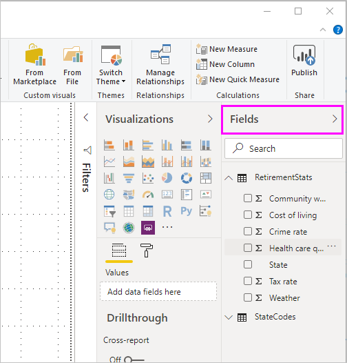

# Connect to datasets in the Power BI service from Power BI Desktop
You can establish a live connection to a shared dataset in the Power BI service, and create many different reports from the same dataset. This means you can create your perfect data model in Power BI Desktop, publish it to the Power BI service. Then you and others can create multiple different reports (in separate .pbix files) from that same, common data model, and save them to different workspaces. This feature is called **Power BI service Live connection**.

There are all sorts of benefits of this feature, including best practices, which we’ll discuss during this article. There are also a few considerations and limitations, so please make sure you read through those - they're found at the end of this article.

## Using a Power BI service live connection for report lifecycle management
One challenge with the popularity of Power BI is the proliferation of reports, dashboards, and their underlying data models. Here's why: it's easy to create compelling reports in **Power BI Desktop**, then share ([publish](desktop-upload-desktop-files.md)) those reports in the **Power BI service**, and to create great dashboards from those datasets. Since so many people were doing so, often using the same (or nearly the same) datasets, knowing which report was based on which dataset - and how fresh each dataset might be - became a challenge. The **Power BI service Live Connection** addresses that challenge, and makes creating, sharing, and expanding upon common-dataset reports and dashboards easier and consistent.

### Create a dataset everyone can use, then share it
Let's say Anna (a business analyst) is on your team, and they are great at creating good data models (often called datasets). With Anna's expertise, they can create a dataset and report, and then share that report in the **Power BI service**.

Everyone loves Anna's report, and their dataset, and that's where the trouble would begin - everyone on their team would attempt to create *their own version* of that dataset, then share their own reports with the team. All of the sudden there was a multitude of reports (from different datasets) in your team's workspace in the **Power BI service**. Which was the most recent? Were the datasets the same, or only almost? What were the differences? With the **Power BI service Live Connection** feature, all that can change for the better. In the next section, we see how others can use Anna's published dataset for their own reports, in their own workspaces, and enable everyone to use the same solid, vetted, published dataset to build their unique reports.

### Connect to a Power BI service dataset using a live connection
Once Anna creates their report (and creates the dataset it's based upon), she publishes it to the **Power BI service**, it shows up in her team's workspace in the Power BI service. If they save it to a *new experience workspace*, then they can set the Build permission to make it available to everyone in and out of their workspace to see and use.

To learn more about the new experience workspaces, see [app workspaces](service-new-workspaces.md).

Other members in and out of Anna's workspace can now establish a live connection to Anna's shared data model (using the **Power BI service live connection** feature), and create their own unique reports, from *their original dataset*, in *their own new experience workspaces*.

In the following image, you see how Anna creates one **Power BI Desktop** report, and publishes it (which includes its data model) to the **Power BI service**. Then others can connect to their data model using the **Power BI service live connection**, and create their own unique reports in their own workspaces, based on Anna's dataset.

> [!NOTE]
> If you save your dataset to a [classic shared workspace](service-create-workspaces.md), only members of that workspace build reports on your dataset. To establish a Power BI service live connection, the dataset to which you connect must be in a shared workspace of which you are a member.
> 
> 

## Step-by-step for using the Power BI service live connection
Now that we know how useful the **Power BI service live connection** is, and how you can use it as a best practice approach to report lifecycle management, let's walk through the steps that get us from Anna's great report (and dataset) to a shared dataset that her Power BI teammates can use.

### Publish a Power BI report and dataset
The first step in managing the report lifecycle using a **Power BI service live connection** is to have a report (and dataset) that teammates want to use. So Anna must first **publish** their report from **Power BI Desktop**. They do this by selecting **Publish** from the **Home** ribbon in Power BI Desktop.

If Anna isn't signed in to their Power BI service account, they're prompted to do so.

From there, they can choose the workspace destination to which the report and dataset will be published. Remember, if Anna saves it to a new experience workspace, then anyone with Build permission can have access to that dataset. Build permission is set in the Power BI service, after publishing. If they save it to a classic workspace only members who have access to the workspace where a report is published can access its dataset using a **Power BI service live connection**.

The publishing process begins, and **Power BI Desktop** shows the progress.

Once complete, **Power BI Desktop** shows you success, and provides a couple links to get you to the report itself in the **Power BI service**, and a link to get **Quick Insights** on the report.

Now that your report with its dataset is in the Power BI service, you can also *promote* it, to attest to its quality and reliability. You can even request that it be *certified* by a central authority in your Power BI tenant. With either of these endorsements, your dataset will always appear at the topic of the list when people are looking for datasets. If interested, you can read more about the process of [promoting your dataset](service-datasets-promote.md). 

The last step is to set *Build permission* for the dataset the report is based on. Build permission determines who can see and use your dataset. You can set it in the workspace itself, or when you share an app from the workspace. Learn more about setting the [Build permission](service-datasets-build-permissions.md#build-permissions-for-shared-datasets).

Next, let's see how other teammates who have access to the workspace where the report (and dataset) were published can connect to the dataset and build our own reports.

### Establish a Power BI service live connection to the published dataset
To establish a connection to the published report, and create your own report based on the published dataset, select **Get Data** from the **Home** ribbon in **Power BI Desktop**, select **Power BI** from the left pane, and then select **Power BI datasets**.

If you're not signed in to Power BI, you'll be prompted to do so. Once logged in, you're presented with a window that shows which workspaces you're a member of, and you can select which workspace contains the dataset to which you want to establish a **Power BI service live connection**.

The datasets in the list are all the shared datasets you have Build permission for, in any workspace. You can search for a specific dataset and see its name, owner, the workspace where it resides, and when it was last refreshed. You also see the *endorsed* datasets, either certified or promoted, at the top of the list. 

When you select **Load** from the window, you establish a live connection to the selected dataset, which means the data you see (the fields, and their values) are loaded into **Power BI Desktop** in real time.

Now you (and others) can create and share custom reports, all from the same dataset. This is a great way to have one knowledgeable person create a well-formed dataset (such as what Anna does), and allow many teammates use that shared dataset to create their own reports.

## Limitations and considerations
When using the **Power BI service live connection**, there are a few limitations and considerations to keep in mind.

* Only users with Build permission for a dataset can connect to a published dataset using the **Power BI service live connection**. 
* Free users only see datasets in their My Workspace and in Premium-based workspaces.
* Since this is a live connection, left-navigation and modeling are disabled, similar to the behavior when connected to **SQL Server Analysis Services**.
* Since this is a live connection, RLS (row- and role-level security), OneDrive for Business, and other such connection behaviors are enforced, just as they are when connected to **SQL Server Analysis Services**.
* If the owner modifies the original shared .pbix file, the dataset and report that is shared in the **Power BI service** is overwritten. Reports based on that dataset aren't overwritten, but any changes to the dataset are reflected in the report.
* Members of a workspace cannot replace the originally shared report. Attempts to do so result in a warning that prompts you to rename the file, and publish.
* If you delete the shared dataset in the **Power BI service**, then other reports based on that dataset will no longer work properly or display their visuals.
* For Content Packs, you must first create a copy of a content pack before using it as a basis for sharing a .pbix report and dataset to the **Power BI service**.
* For Content Packs from *My Organization*, once copied, you cannot replace the report created on the service and/or a report created as part of copying a Content Pack with a live connection. Attempts to do so result in a warning that prompts you to rename the file, and publish. In this situation, you can only replace published live connected reports.
* Deleting a shared dataset in the **Power BI service** means no one can access that dataset any longer from **Power BI Desktop**.

