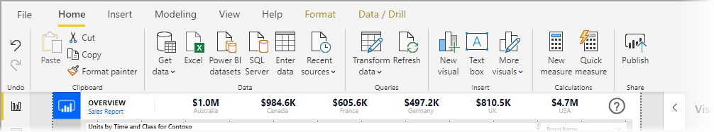

# Use the updated ribbon in Power BI Desktop (preview)

Beginning with the November 2019 update, Power BI Desktop is revising its ribbon to better align its appearance and experience with other Microsoft products, such as Microsoft Office.

The updated ribbon is in preview, so we can gather feedback from users and customers, and make sure the experience is exceptional. We anticipate a few months of preview, feedback, and improvement before the updated Power BI Desktop ribbon is released for general availability. 

## How to enable the updated ribbon

The updated ribbon in Power BI is a preview feature, and must be enabled. To enable it, select **File > Options and settings > Options**, then select **Preview features** from the left column. In the right pane you an **Updated ribbon** selection. Check the box beside **Updated ribbon** to enable the preview feature. You'll need to restart Power BI Desktop for the preview feature change to take effect.

## Features of the new ribbon

The benefits of updating our ribbon are intended to make the experience across Power BI Desktop, as well as other Microsoft products, easy and familiar. 

These benefits can be grouped into the following categories:

* **Improved look, feel, and organization** - icons and functionality in the updated Power BI Desktop ribbon are aligned to the look, feel, and organization of ribbon items found in Office applications.

    

* **An intuitive Themes gallery** - the Themes gallery, found in the **View** ribbon, has the familiar look and feel of the PowerPoint themes gallery. As such, the images in the ribbon show you what the theme changes will look like if applied to your report, such as the color combinations and fonts. 

    

* **Dynamic ribbon content based on your view** - in the existing ribbon for Power BI Desktop, icons or commands that weren't available were simply grayed out, creating a less-than-optimal experience. With the updated ribbon, icons are dynamically displayed and arranged, so that you always know which options are available to you, in context.

* **A single-line ribbon, when collapsed, saves you space** - another benefit of the updated ribbon is the ability to collapse the ribbon itself into a single line, dynamically displaying ribbon items based on your context. 

    

In addition to those visible changes, an updated ribbon also lets us make future updates to Power BI Desktop, and its ribbon, such as the following:

* Create more flexible and intuitive controls in the ribbon, such as the visuals gallery
* Add the *black* and *dark gray* Office themes to Power BI Desktop
* Improve accessiblitiy

## Next steps
There are all sorts of data you can connect to using Power BI Desktop. For more information on data sources, check out the following resources:

* [What is Power BI Desktop?](desktop-what-is-desktop.md)
* [Data Sources in Power BI Desktop](desktop-data-sources.md)
* [Shape and Combine Data with Power BI Desktop](desktop-shape-and-combine-data.md)
* [Connect to Excel workbooks in Power BI Desktop](desktop-connect-excel.md)   
* [Enter data directly into Power BI Desktop](desktop-enter-data-directly-into-desktop.md)   

