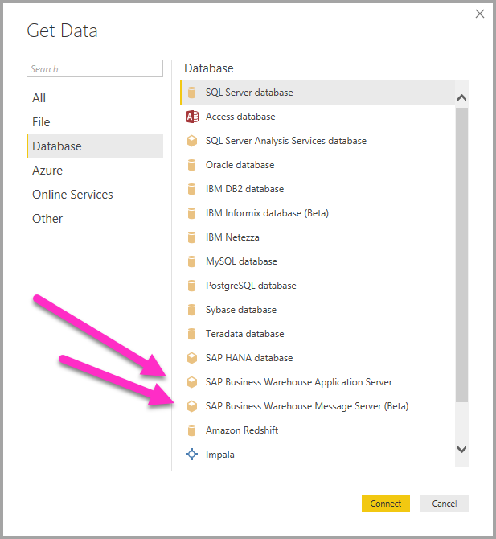
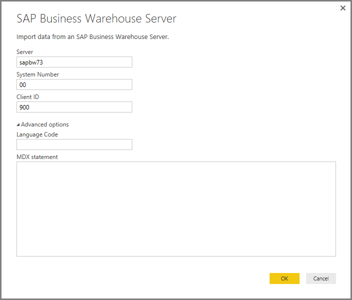
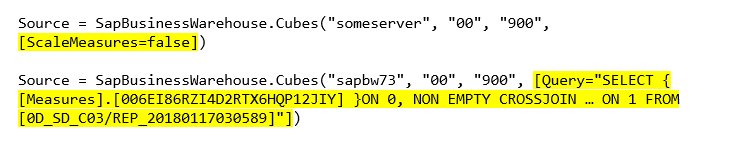
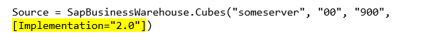
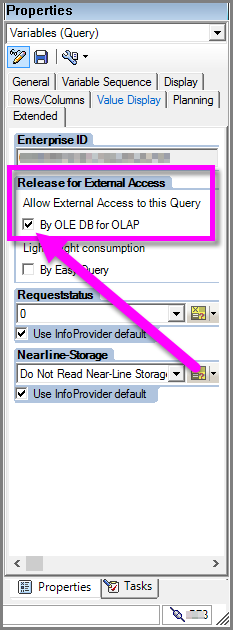

# Use the SAP BW Connector in Power BI Desktop
With Power BI Desktop, you can access **SAP Business Warehouse (BW)** data.

For information about how SAP customers can benefit from connecting Power BI to their existing SAP Business Warehouse (BW) systems, see the [Power BI and SAP BW whitepaper](https://aka.ms/powerbiandsapbw). For details about using DirectQuery with SAP BW, see the article [DirectQuery and SAP Business Warehouse (BW)](desktop-directquery-sap-bw.md).

Starting with the June 2018 release of **Power BI Desktop** (and generally available with the October 2018 release), you can use the SAP BW connector with an implementation that has significant improvements in performance and capabilities. This updated version of the SAP BW connector was developed by Microsoft and is called **Implementation 2.0**. You can select either  version 1 (v1) of the **SAP BW Connector**, or the **Implementation 2.0 SAP Connector**. The following sections describe the installation of each version, in turn. You can choose one or the other connector when connecting to SAP BW from Power BI Desktop.

We suggest you use the **Implementation 2.0 SAP Connector** whenever possible.

## Installation of version 1 of the SAP BW Connector
We recommend using the Implementation 2.0 SAP Connector whenever possible (see instructions in the following section). This section describes installation of version 1 of the **SAP BW Connector**, which you can install by taking the following installation steps:

1. Install the **SAP NetWeaver** library on your local machine. You can get the **SAP Netweaver** library from your SAP administrator, or directly from the [SAP Software Download Center](https://support.sap.com/swdc). Since the **SAP Software Download Center** changes its structure frequently, more specific guidance for navigating that site is not available. The **SAP NetWeaver** library is usually included also in the SAP Client Tools installation.
   
   You may be able to search for *SAP Note #1025361* to get the download location for the most recent version. Make sure the architecture for the **SAP NetWeaver** library (32-bit or 64-bit) matches your **Power BI Desktop** installation, then install all files included in the **SAP NetWeaver RFC SDK** according to the SAP Note.
2. The **Get Data** dialog includes an entry for **SAP Business Warehouse Application Server** and **SAP Business Warehouse Message Server** in the **Database** category.
   
   

## Installation of Implementation 2.0 SAP Connector

**Implementation 2.0** of the SAP Connector requires the SAP .NET Connector 3.0. You can [download the SAP .NET Connector 3.0](https://support.sap.com/en/product/connectors/msnet.html) from SAP’s website using the following link:

* [SAP .NET Connector 3.0](https://support.sap.com/en/product/connectors/msnet.html)

Access to the download requires a valid S-user. Customers are encouraged to contact their SAP Basis team to get the SAP .NET Connector 3.0. 

The connector comes in 32-bit and 64-bit versions, and users *must* choose the version that matches their Power BI Desktop installation. At the time of this writing, the website lists two versions (for .NET 4.0 framework):

* SAP Connector for Microsoft .NET 3.0.20.0 for Windows 32-bit (x86) as zip file (6.896 KB), January 16, 2018
* SAP Connector for Microsoft .NET 3.0.20.0 for Windows 64-bit (x64) as zip file (7.180 KB), January 16, 2018

When installing, in the **Optional setup steps** window, make sure you select the *Install assemblies to GAC* option as shown in the following image.

> [!NOTE]
> The first version of SAP BW implementation required Netweaver DLLs; if you're using Implementation 2.0 of the SAP Connector, and not using the first version, the Netweaver DLLs are not required.

## Version 1 SAP BW Connector features
The version 1 **SAP BW Connector** in Power BI Desktop let you import data from your **SAP Business Warehouse Server** cubes, or use DirectQuery. 

To learn more about the **SAP BW connector** and how to use it with DirectQuery, take a look at the [DirectQuery and SAP Business Warehouse (BW)](desktop-directquery-sap-bw.md) article.

When connecting, you must specify a *Server*, *System Number*, and *Client ID* to establish the connection.

You can also specify two additional **Advanced options**: Language code, and a custom MDX statement to run against the specified server.

If no MDX statement was specified you are presented with the **Navigator** window, which displays the list of cubes available in the server, with the option to drill down and select items from the available cubes, including dimensions and measures. Power BI exposes queries and cubes exposed by the [BW Open Analysis Interface OLAP BAPIs](https://help.sap.com/saphelp_nw70/helpdata/en/d9/ed8c3c59021315e10000000a114084/content.htm).

When you select one or more items from the server, a preview of the output table is created, based on their selection.

The **Navigator** window also provides a few **Display Options** that allow you to do the following:

* **Display *Only Selected Items* versus *All Items* (default view):** This option is useful for verifying the final set of items selected. An alternative approach to viewing this is to select the *Column Names* in the *Preview* area.
* **Enable Data Previews (default behavior):** You can also control whether data previews should be displayed in this dialog. Disabling data previews reduces the amount of server calls, since it no longer requests data for the previews.
* **Technical Names:** SAP BW supports the notion of *technical names* for objects within a cube. Technical names allow a cube owner to expose *user friendly* names for cube objects, as opposed to only exposing the *physical names* for those objects in the cube.

After selecting all necessary objects in the **Navigator**, you can decide what to do next, by selecting one of the following buttons on the bottom of the **Navigator** window:

* Selecting **Load** triggers loading the entire set of rows for the output table into the Power BI Desktop data model, then takes you to **Report** view where you can begin  visualizing the data or making further modifications using the **Data** or **Relationships** views.
* Selecting **Edit** brings up **Query Editor**, where you can perform additional data transformation and filtering steps before the entire set of rows is brought into the Power BI Desktop data model.

In addition to importing data from **SAP BW** cubes, remember that you can also import data from a wide range of other data sources in Power BI Desktop, and then you can combine them into a single report. This presents all sorts of interesting scenarios for reporting and analytics on top of **SAP BW** data.

## Using Implementation 2.0 SAP BW Connector

You must create a new connection to use Implementation 2.0 of the SAP BW Connector. To create a new connection, take the following steps.

1. From the **Get Data** window, select either **SAP Business Warehouse Application Server** or **SAP Business Warehouse Message Server**.

2. You're presented with the new connection dialog, which allows selection of the implementation. Selecting **Implementation 2.0**, as shown in the following image, enables the Execution mode, Batch size and Enable characteristic structures options.

    

3. Select **OK**, and subsequently, the **Navigator** experience is the same as described in the earlier section for the version 1 SAP BW Connector. 

### New options for Implementation 2.0 

Implementation 2.0 supports the following options:

1. **ExecutionMode** - Specifies the MDX interface used to execute queries on the server. Valid options are the following:

        a. SapBusinessWarehouseExecutionMode.BasXml
        b. SapBusinessWarehouseExecutionMode.BasXmlGzip
        c. SapBusinessWarehouseExecutionMode.DataStream

    The default value for this option is SapBusinessWarehouseExecutionMode.BasXmlGzip.

    Using *SapBusinessWarehouseExecutionMode.BasXmlGzip* may improve performance when experiencing high latency for large datasets.

2. **BatchSize** - Specifies the maximum number of rows that will be retrieved at a time when executing an MDX statement. A small number of rows will translate into more calls to the server while retrieving a large dataset. A large number of rows may improve performance, but could cause memory issues on the SAP BW server. The default value is 50000 rows.

3. **EnableStructures** - A logical value indicating whether characteristic structures are recognized. The default value for this option is false. Affects the list of objects available for selection. Not supported in Native query mode.

The **ScaleMeasures** option has been deprecated in this implementation. The behavior is now the same as setting *ScaleMeasures = false*, that is always showing unscaled values.

### Additional improvements for Implementation 2.0 

The following bulleted list describes some of the additional improvements that come with the new implementation:

* Improved performance
* Ability to retrieve several million rows of data, and fine tuning through the batch size parameter.
* Ability to switch execution modes.
* Support for compressed mode. Especially beneficial for high latency connections or large datasets.
* Improved detection of Date variables
* [Experimental] Expose Date (ABAP type DATS) and Time (ABAP type TIMS) dimensions as dates and times respectively, instead of text values.
* Better exception handling. Errors that occur in BAPI calls are now surfaced.
* Column folding in BasXml and BasXmlGzip modes. For example, if the generated MDX query retrieves 40 columns but the current selection only needs 10, this request will be passed onto the server to retrieve a smaller dataset.

### Changing existing reports to use Implementation 2.0 

Changing existing reports to use **Implementation 2.0** is only possible in Import mode, and requires the following manual steps.

1. Open an existing report, select **Edit Queries** in the ribbon, and then select the SAP Business Warehouse query you would like to update.

2. Right-click the query and select **Advanced Editor**.

3. In the **Advanced Editor** change the SapBusinessWarehouse.Cubes call as follows: 

    a. Determine whether the query already contains an option record, such as what's shown in the following example:

    

    b. If so, add the Implementation 2.0 option, and remove the ScaleMeasures option, if present, as shown:

    

    c. If the query does not already include an options record, just add it. For example, if it has the following:

    

    d. Just change it to:

    

4. Every effort has been made to make Implementation 2.0 of the SAP BW Connector compatible with version 1 of the SAP BW Connector. However, there may be some differences due to the different SAP BW MDX execution modes being used. To resolve any discrepancies, try switching between execution modes.

## Troubleshooting
This section provides troubleshooting situations (and solutions) for working with th **SAP BW** connector.

1. Numeric data from **SAP BW** returns decimal points instead of commas. For example, 1,000,000 is returned as 1.000.000.
   
   **SAP BW** returns decimal data with either a *,* (comma) or a *.* (dot) as the decimal separator. To specify which of those **SAP BW** should use for the decimal separator, the driver used by **Power BI Desktop** makes a call to *BAPI_USER_GET_DETAIL*. This call returns a structure called **DEFAULTS**, which has a field called *DCPFM* that stores *Decimal Format Notation*. It takes one of the following three values:
   
       ‘ ‘ (space) = Decimal point is comma: N.NNN,NN
       'X' = Decimal point is period: N,NNN.NN
       'Y' = Decimal point is N NNN NNN,NN
   
   Customers who have reported this issue found that the call to  *BAPI_USER_GET_DETAIL* is failing for a particular user (the user who is showing the incorrect data), with an error message similar to the following:
   
       You are not authorized to display users in group TI:
           <item>
               <TYPE>E</TYPE>
               <ID>01</ID>
               <NUMBER>512</NUMBER>
               <MESSAGE>You are not authorized to display users in group TI</MESSAGE>
               <LOG_NO/>
               <LOG_MSG_NO>000000</LOG_MSG_NO>
               <MESSAGE_V1>TI</MESSAGE_V1>
               <MESSAGE_V2/>
               <MESSAGE_V3/>
               <MESSAGE_V4/>
               <PARAMETER/>
               <ROW>0</ROW>
               <FIELD>BNAME</FIELD>
               <SYSTEM>CLNTPW1400</SYSTEM>
           </item>
   
   To solve this error, users must ask their SAP admin to grant the SAPBW user being used in Power BI the right to execute *BAPI_USER_GET_DETAIL*. It’s also worth verifying that the user has the required *DCPFM* value, as described earlier in this troubleshooting solution.
   
2. **Connectivity for SAP BEx queries**
   
   You can perform **BEx** queries in Power BI Desktop by enabling a specific property, as shown in the following image:
   
   
   
3. The **Navigator** window does not display a data preview and instead provides an *object reference not set to an instance of an object* error message.
   
   SAP users need access to specific BAPI function modules to get metadata and retrieve data from SAP BW's InfoProviders. These include:
   * BAPI_MDPROVIDER_GET_CATALOGS
   * BAPI_MDPROVIDER_GET_CUBES
   * BAPI_MDPROVIDER_GET_DIMENSIONS
   * BAPI_MDPROVIDER_GET_HIERARCHYS
   * BAPI_MDPROVIDER_GET_LEVELS
   * BAPI_MDPROVIDER_GET_MEASURES
   * BAPI_MDPROVIDER_GET_MEMBERS
   * BAPI_MDPROVIDER_GET_VARIABLES
   * BAPI_IOBJ_GETDETAIL

   To solve this issue, verify that the user has access to the various *MDPROVIDER* modules as well as *BAPI_IOBJ_GETDETAIL*. To further troubleshoot this or similar issues, select *Enable tracing* on the *Diagnostics* window within Power BI Desktop's *Options*. Attempt to retrieve data from SAP BW while tracing is active, and examine the trace file for more detail.

## Next steps
For more information about SAP and DirectQuery, check out the following resources:

* [DirectQuery and SAP HANA](desktop-directquery-sap-hana.md)
* [DirectQuery and SAP Business Warehouse (BW)](desktop-directquery-sap-bw.md)
* [DirectQuery in Power BI](desktop-directquery-about.md)
* [Data Sources supported by DirectQuery](desktop-directquery-data-sources.md)
* [Power BI and SAP BW whitepaper](https://aka.ms/powerbiandsapbw)
