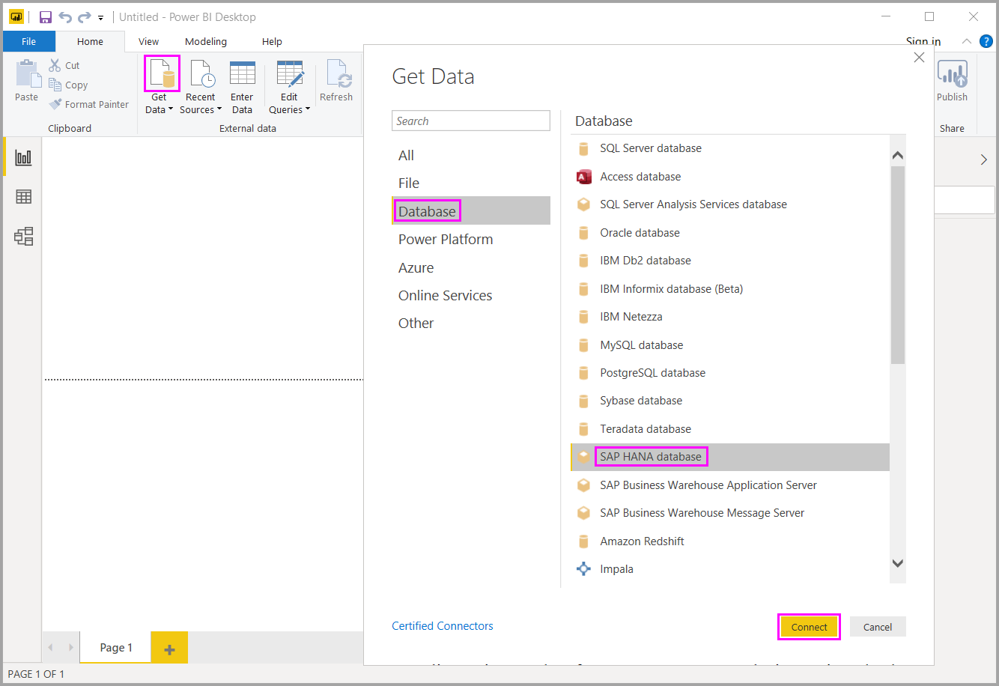

# Use SAP HANA in Power BI Desktop
With Power BI Desktop, you can now access **SAP HANA** databases. To use **SAP HANA**, the SAP HANA ODBC driver must be installed on the local client computer in order for the Power BI Desktop **SAP HANA** data connection to work properly. You can download the SAP HANA ODBC driver from the [SAP Software Download Center](https://support.sap.com/swdc). From there, search for the SAP HANA CLIENT for Windows computers. Since the **SAP Software Download Center** changes its structure frequently, more specific guidance for navigating that site is not available.

To connect to a **SAP HANA** database, select **Get Data > Database > SAP HANA Database** as shown in the following image:

When connecting to a SAP HANA database, specify the server name and the port in the format *server:port* - the following image shows an example with a server named *ServerXYZ* and port *30015*.

In this release **SAP HANA** in [DirectQuery](desktop-directquery-sap-hana.md) mode is supported in Power BI Desktop and the Power BI service, and you can publish and upload reports that use **SAP HANA** in DirectQuery mode to the Power BI service. You can also publish and upload reports to the Power BI Service when not using **SAP HANA** in DirectQuery mode.

### Supported features for SAP HANA
This release has many capabilities for **SAP HANA**, as shown in the following list:

* The Power BI connector for **SAP HANA** uses the SAP ODBC driver, to provide the best user experience
* **SAP HANA** supports both DirectQuery and Import options
* Power BI supports HANA information models (such as Analytic and Calc views) and has optimized navigation
* With **SAP HANA**, you can also use the direct SQL feature to connect to Row and Column Tables
* Includes Optimized Navigation for HANA Models
* Power BI supports **SAP HANA** Variables and Input parameters

### Installing the SAP HANA ODBC driver
### Limitations of SAP HANA
There are also a few limitations to using **SAP HANA**, shown below:

* NVARCHAR strings are truncated to maximum length of 4000 Unicode characters
* SMALLDECIMAL is not supported
* VARBINARY is not supported
* Valid Dates are between 1899/12/30 and 9999/12/31

## Next steps
For more information about DirectQuery, check out the following resources:

* [DirectQuery and SAP HANA](desktop-directquery-sap-hana.md)
* [DirectQuery in Power BI](desktop-directquery-about.md)
* [Data Sources supported by DirectQuery](desktop-directquery-data-sources.md)

