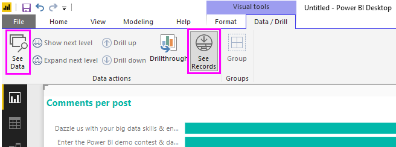
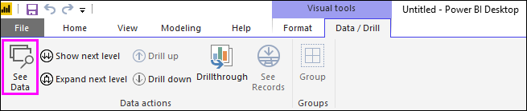
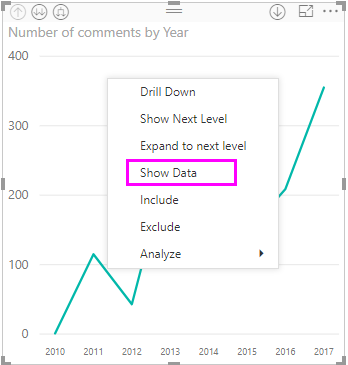
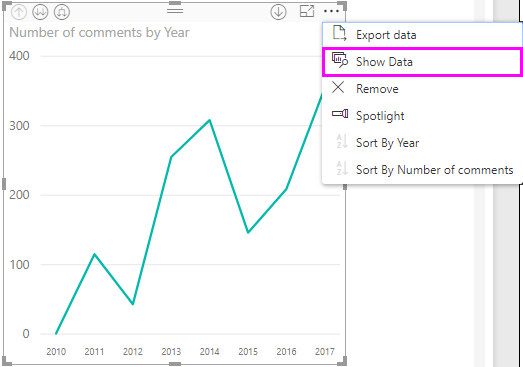
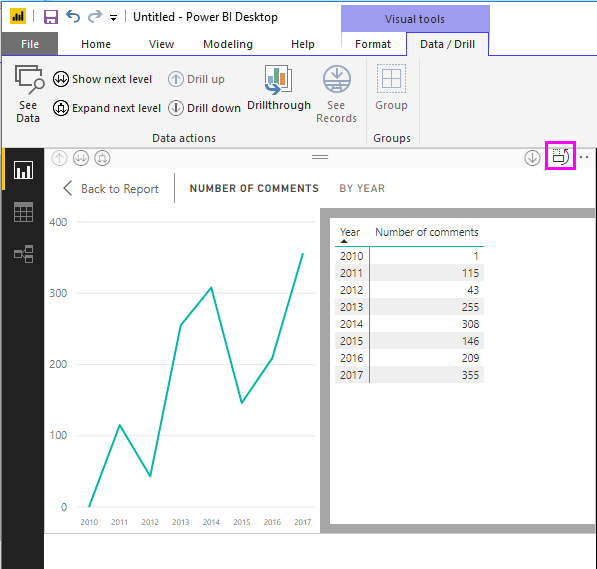
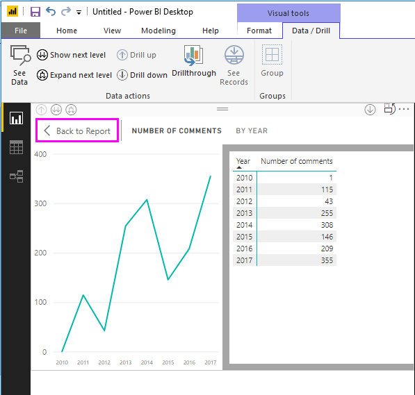
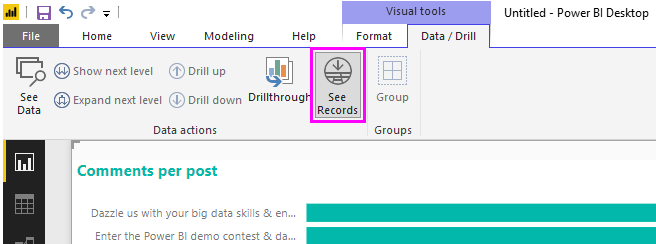
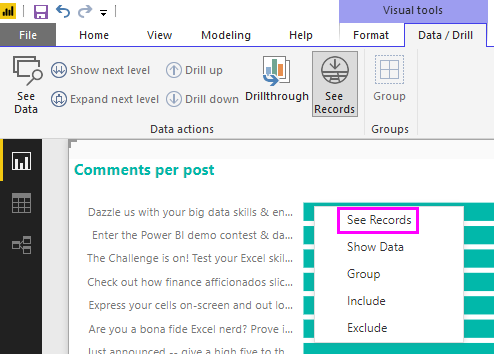
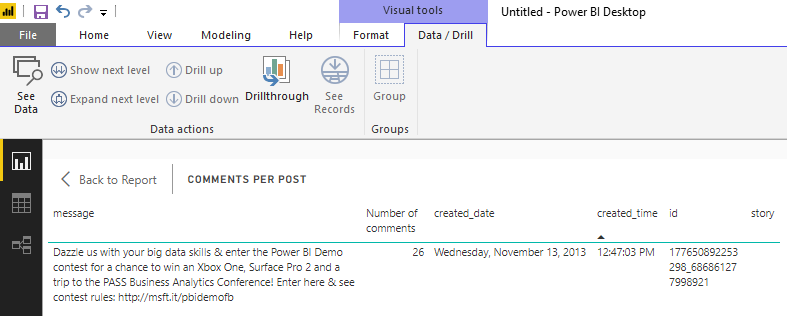
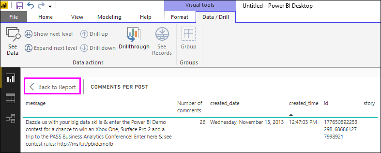

# Use See Data and See Records in Power BI Desktop
In **Power BI Desktop** you can drill into the details of a visualization, and see textual representations of the underlying data or the individual data records for the selected visual. These features are sometimes referred to as *click-through*, *drill-through*, or *drill-through to details*.

You can use **See Data** to view a textual version of the values used by the selected visualization, or use **See Records** to view all the data for one selected record or data point. 

>[!IMPORTANT]
>**See Data** and **See Records** support only the following visualization types:
>  - Bar chart
>  - Column chart
>  - Donut chart
>  - Filled map
>  - Funnel
>  - Map
>  - Pie chart
>  - Treemap

## Use See Data in Power BI Desktop

**See Data** shows you the data underlying a visualization. **See Data** appears in the **Data/Drill** tab in the **Visual Tools** section of the ribbon when a visualization is selected.

You can also see the data by right-clicking on a visualization, and then selecting **Show Data** from the menu that appears; or by selecting the **More options** ellipsis (...) in the upper-right corner of a visualization, and then selecting **Show Data**.

&nbsp;&nbsp;

> [!NOTE]
> You must be hovering over a data point in the visual for the right-click menu to be available.

When you select **See Data** or **Show Data**, the Power BI Desktop canvas displays both the visual and the textual representation of the data. In the *horizontal view*, the visual is displayed on the top half of the canvas, and the data is shown on the bottom half. 

You can toggle between the horizontal view and a *vertical view* by selecting the icon in the upper-right corner of the canvas.

To get back to the report, select **< Back to Report** in the upper-left corner of the canvas.

## Use See Records in Power BI Desktop

You can also focus on one data record in a visualization, and drill into the data behind it. To use **See Records**, select a visualization, then select **See Records** in the **Data/Drill** tab in the **Visual Tools** section of the ribbon, and then select a data point or row on the visualization. 

> [!NOTE]
> If the **See Records** button in the ribbon is disabled and grayed-out, it means the selected visualization does not support **See Records**.

You can also right-click a data element and select **See Records** from the menu that appears.

When you select **See Records** for a data element, the Power BI Desktop canvas displays all the data associated with the selected element. 

To get back to the report, select **< Back to Report** in the upper-left corner of the canvas.

> [!NOTE]
>**See Records** has the following limitations:
> - You can't change the data in the **See Records** view and save it back to the report.
> - You can't use **See Records** when your visual uses a calculated measure.
> - You can't use **See Records** when you are connected to a live multidimensional (MD) model.

## Next steps
There are all sorts of report formatting and data management features in **Power BI Desktop**. Check out the following resources for a few examples:

* [Use grouping and binning in Power BI Desktop](desktop-grouping-and-binning.md)
* [Use gridlines, snap-to-grid, z-order, alignment and distribution in Power BI Desktop reports](desktop-gridlines-snap-to-grid.md)

