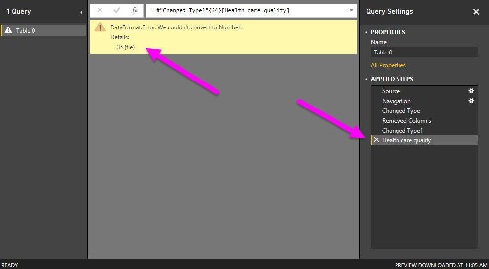
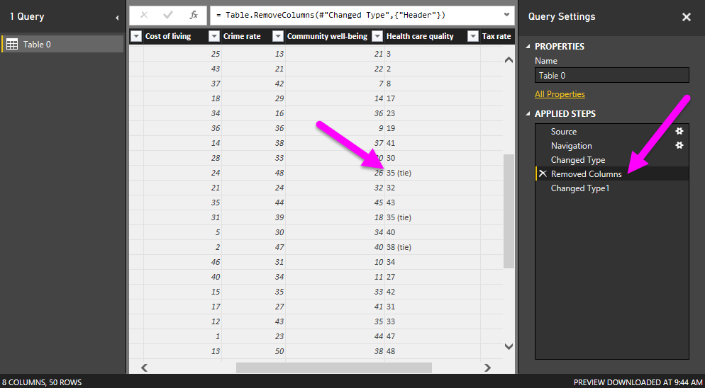
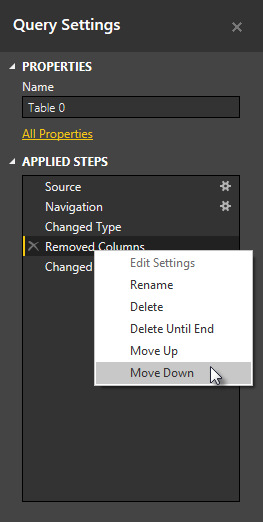
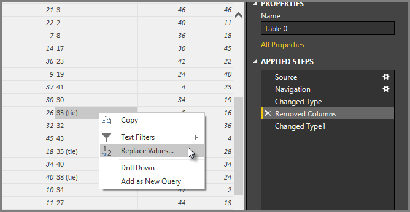
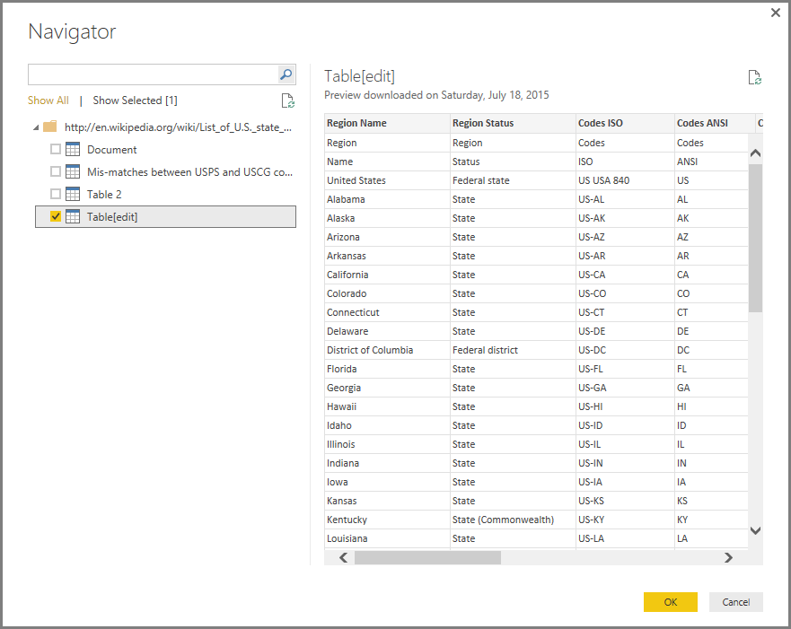

# Shape and combine data in Power BI Desktop
With **Power BI Desktop**, you can connect to many different types of data sources, then shape the data to meet your needs. *Shaping* data means transforming the data – such as renaming columns or tables, changing text to numbers, removing rows, setting the first row as headers, and so on. *Combining* data means connecting to two or more data sources, shaping them as needed, then consolidating them into one useful query.

This document demonstrates how to shape a query using Power BI Desktop, highlighting some of the most common tasks. The query used here is described in more detail, including how to create the query from scratch, in [Getting Started with Power BI Desktop](desktop-getting-started.md).

It’s useful to know that the **Query Editor** in Power BI Desktop makes ample use of right-click menus, as well as the ribbon. Most of what you can select in the **Transform** ribbon is also available by right-clicking an item (such as a column) and choosing from the menu that appears.

## Shape Data
When you shape data in the Query Editor, you’re providing step-by-step instructions (that Query Editor carries out for you) to adjust the data as Query Editor loads and presents it. The original data source is not affected; only this particular view of the data is adjusted, or *shaped*.

The steps you specify (such as rename a table, transform a data type, or delete columns) are recorded by Query Editor, and each time this query connects to the data source those steps are carried out so that the data is always shaped the way you specify. This process occurs whenever you use the Query Editor feature of Power BI Desktop, or for anyone who uses your shared query, such as on the **Power BI** service. Those steps are captured, sequentially, in the **Query Settings** pane under **Applied Steps**.

The following image shows the **Query Settings** pane for a query that has been shaped – we’ll go through each of those steps in the next few paragraphs.

Using the retirement data from [Getting Started with Power BI Desktop](https://powerbi.uservoice.com/knowledgebase/articles/471664), which we found by connecting to a Web data source, let’s shape that data to fit our needs.

For starters, one column's scores were not automatically transformed from text to numbers when Query Editor loaded the table, and we need them to be numbers. No problem – just right-click the column header, and select **Change Type \> Whole Number** to change them. To choose more than one column, first select a column then hold down **SHIFT**, select additional adjacent columns, and then right-click a column header to change all selected columns. You can also use the **CTRL** key to choose non-adjacent columns.

You can also *transform* those columns from text to header from the **Transform** ribbon. Here’s the **Transform** ribbon, with an arrow pointing toward the **Data Type** button, which lets you transform the current data type to another.

Note that in **Query Settings**, the **Applied Steps** reflect any shaping steps applied to the data. If I want to remove any step from the shaping process, I simply select the **X** to the left of the step. In the following image, **Applied Steps** reflects the steps so far: connecting to the website (**Source**); selecting the table (**Navigation**); and while loading the table, Query Editor automatically changed text-based number columns from *Text* to *Whole Number* (**Changed Type**). One column of rankings was not automatically changed to a number-based type, and we'll find out why in the next few paragraphs.

Before we can work with this query, we need to make a few changes to get its data where we want it:

* *Remove the first column* – we don’t need it, it just includes redundant rows that say “Check out how your state ranks for retirement” which is an artifact of this data source being a Web-based table
* *Fix a few Errors* – one of the columns, **Health care quality**, contains a few ties in states' rankings, which was noted on the website by having the text *(tie)* after their numbers. That works well on the website, but it requires that we transform the column from text to data manually. It's easy to fix this using Power BI Desktop, and doing so demonstrates a cool feature of **Applied Steps** in Query
* *Change the Table Name* – that **Table 0** is not a useful descriptor, but changing it simple

To remove the first column, simply select the column and choose the **Home** tab from the ribbon, then **Remove Columns** as shown in the following figure.

Next we need to address the text column, and transform it into numbers. At first it seems straightforward, that we can just change the type of the **Health care quality** column from text to number (such as *Whole Number*, or *Decimal Number*). But when we change the type from **Text** to **Whole Number**, then look through the values in that column, we find that Query Editor reports a few errors.

There are a few ways to get more information about each error. You can select the cell (without clicking on the word **Error**), or click the word **Error** directly. If you select the cell *without* clicking directly on the word **Error**, Query Editor displays the error information on the bottom of the window.

If you click the word *Error* directly, Query creates an **Applied Step** in the **Query Settings** pane and displays information about the error.

To get back to the Query Editor, you have to remove that step by selecting the **X** next to it.

When we select the most recent **Applied Step**, we see the error just described, as shown in the following image.

Since Query Editor records steps sequentially, we can select the step prior to changing the type, in **Applied Steps**, and see what the value of that cell is prior to the transformation, as shown in the following image.

Okay, now we can fix those values, and *then* change the type. Since Query Editor records the steps sequentially, yet independently of each other, you can move each **Applied Step** up or down in the sequence. Just right-click any step, and Query Editor provides a menu that lets you do the following: **Rename**, **Delete**, **Delete** **Until End** (remove the current step, and all subsequent steps too), **Move Up**, or **Move Down**.

In addition, you can select an **Applied Step** anywhere in the list, and continue shaping the data at that point in the sequence. Query Editor will automatically insert a new step directly after the currently selected **Applied Step**. Let's give that a try.

First, we select the **Applied Step** prior to changing the type of the **Health care quality** column. Then we replace the values that have the text "(tie)" in the cell so that only the number remains. Right-click the cell that contains "35 (tie)" and select *Replace Values...* from the menu that appears. Note which **Applied Step** is currently selected (the step prior to changing the type).

Since we're inserting a step, Query Editor warns us about the danger of doing so - subsequent steps could cause the query to break. We need to be careful, and thoughtful! Since this is a tutorial, and we're highlighting a really cool feature of Query Editor to demonstrate how you can create, delete, insert, and reorder steps, we'll push ahead and select **Insert**.

There are three ties, so we replace the values for each. When you create a new Applied Step, Query Editor names it based on the action - in this case, **Replaced Value**. When you have more than one step with the same name in your query, Query Editor adds a number (in sequence) to each subsequent **Applied Step** to differentiate between them.

The following screen shows the three **Replaced Value** steps in **Query Settings**, but it also shows something else that's even more interesting: since we removed each instance of the text "(tie)" from the **Health care quality** column, the **Changed Type** step now completes *with no errors*.

**Note:** You can also **Remove Errors** (using the ribbon or the right-click menu), which removes any rows that have errors. In this case it would’ve removed all the states that had "*(tie)*" from our data, and we didn’t want to do that – we like all the states, and want to keep them in the table.

Okay that was a little involved, but it was a good example of how powerful and versatile Query Editor can be.

Lastly, we want to change the name of that table to something descriptive. When we get to creating reports, it’s especially useful to have descriptive table names, especially when we connect to multiple data sources, and they’re all listed in the **Fields** pane of the **Report** view.

Changing the table name is easy: in the **Query Settings** pane, under **Properties**, simply type in the new name of the table, as shown in the following image, and hit **Enter**. Let’s call this table *RetirementStats*.

Okay, we’ve shaped that data to the extent we need to. Next let’s connect to another data source, and combine data.

## Combine Data
That data about various states is interesting, and will be useful for building additional analysis efforts and queries. But there’s one problem: most data out there uses a two-letter abbreviation for state codes, not the full name of the state. We need some way to associate state names with their abbreviations.

We’re in luck: there’s another public data source that does just that, but it needs a fair amount of shaping before we can connect it to our retirement table. Here’s the Web resource for state abbreviations:

<http://en.wikipedia.org/wiki/List_of_U.S._state_abbreviations>

From the **Home** ribbon in Query Editor, we select **New Source \> Web** and type the address, select OK, and the Navigator shows what it found on that Web page.

 

We select **Table[edit]** because that includes the data we want, but it’s going to take quite a bit of shaping to pare that table’s data down to what we want.

> [!TIP]
> Is there a faster or easier way to accomplish the steps below? Yes, we could create a *relationship* between the two tables, and shape the data based on that relationship. The following steps are still good to learn for working with tables, just know that relationships can help you quickly use data from multiple tables.
> 
> 

To get this data into shape, we take the following steps:

* Remove the top two rows – they’re a result of the way that Web page’s table was created, and we don’t need them. From the **Home** ribbon, select **Reduce Rows \> Remove Rows \> Remove Top Rows**.

The **Remove Top Rows** window appears, letting you specify how many rows you want to remove.

* Remove the bottom 26 rows – they’re all the territories, which we don’t need to include. From the **Home** ribbon, select **Reduce Rows \> Remove Rows \> Remove Bottom Rows**.

* Since the RetirementStats table doesn't have information for Washington DC, we need to filter it from our list. Select the drop-down arrow beside the Region Status column, then clear the checkbox beside **Federal district**.

* Remove a few unneeded columns – we only need the mapping of state to its official two-letter abbreviation, so we can remove the following columns: **Column2**, **Column3**, and then **Column5** through **Column10**. First select Column2, then hold down the **CTRL** key and select the other columns to be removed (this lets you select multiple, non-contiguous columns). From the Home tab on the ribbon, select **Remove Columns \> Remove Columns**.

* Use the first row as headers – since we removed the top three rows, the current top row is the header we want. You can select **Use First Row As Headers** from the **Home** tab, or from the **Transform** tab in the ribbon.

**Note:** This is a good time to point out that the *sequence* of applied steps in Query Editor is important, and can affect how the data is shaped. It’s also important to consider how one step may impact another subsequent step; if you remove a step from the Applied Steps, subsequent steps may not behave as originally intended, because of the impact of the query’s sequence of steps.

**Another Note:** When you resize the Query Editor window to make the width smaller, some ribbon items are condensed to make the best use of visible space. When you increase the width of the Query Editor window, the ribbon items expand to make the most use of the increased ribbon area.

* Rename the columns, and the table itself – as usual, there are a few ways to rename a column; first select the column, then either select **Rename** from the **Transform** tab on the ribbon, or right-click and select **Rename…** from the menu that appears. The following image has arrows pointing to both options; you only need to choose one.

Let’s rename them to *State Name* and *State Code*. To rename the table, just type the name into the **Name** box in the **Query Settings** pane. Let’s call this table *StateCodes*.

Now that we’ve shaped the StateCodes table the way we want, let’s combine these two tables, or queries, into one; since the tables we now have are a result of the queries we applied to the data, they’re often referred to as *queries*.

There are two primary ways of combining queries – *merging* and *appending*.

When you have one or more columns that you’d like to add to another query, you **merge** the queries. When you have additional rows of data that you’d like to add to an existing query, you **append** the query.

In this case we want to merge queries. To get started, from the left pane of Query Editor we select the query *into which* we want the other query to merge, which in this case is *RetirementStats*. Then select **Combine \> Merge Queries** from the **Home** tab on the ribbon.

You may be prompted to set the privacy levels, to ensure the data is combined without including or transferring data you didn't want transferred.

Next the **Merge** window appears, prompting us to select which table we’d like merged into the selected table, and then, the matching columns to use for the merge. Select State from the *RetirementStats* table (query), then select the *StateCodes* query (easy in this case, since there’s only one other query – when you connect to many data sources, there are many queries to choose from). When we select the correct matching columns – **State** from *RetirementStats*, and **State Name** from *StateCodes* – the **Merge** window looks like the following, and the **OK** button is enabled.

A **NewColumn** is created at the end of the query, which is the contents of the table (query) that was merged with the existing query. All columns from the merged query are condensed into the **NewColumn**, but you can select to **Expand** the table, and include whichever columns you want.

To Expand the merged table, and select which columns to include, select the expand icon (). The **Expand** window appears.

In this case, we only want the **State Code** column, so we select only that column and then select **OK**. We clear the checkbox from Use original column name as prefix because we don’t need or want that; if we leave that selected, the merged column would be named **NewColumn.State Code** (the original column name, or **NewColumn**, then a dot, then the name of the column being brought into the query).

**Note:** Want to play around with how to bring in that **NewColumn** table? You can experiment a bit, and if you don’t like the results, just delete that step from the **Applied Steps** list in the **Query Settings** pane; your query returns to the state prior to applying that **Expand** step. It’s like a free do-over, which you can do as many times as you like until the expand process looks the way you want it.

We now have a single query (table) that combined two data sources, each of which has been shaped to meet our needs. This query can serve as a basis for lots of additional, interesting data connections – such as housing cost statistics, demographics, or job opportunities in any state.

To apply changes and close Query Editor, select Close & Apply from the **Home** ribbon tab. The transformed dataset appears in Power BI Desktop, ready to be used for creating reports.

## More Information
There are all sorts of things you can do with Power BI Desktop. For more information on its capabilities, check out the following resources:

* [Getting Started with Power BI Desktop](desktop-getting-started.md)
* [Query Overview with Power BI Desktop](desktop-query-overview.md)
* [Data Sources in Power BI Desktop](desktop-data-sources.md)
* [Connect to Data in Power BI Desktop](desktop-connect-to-data.md)
* [Common Query Tasks in Power BI Desktop](desktop-common-query-tasks.md)   

