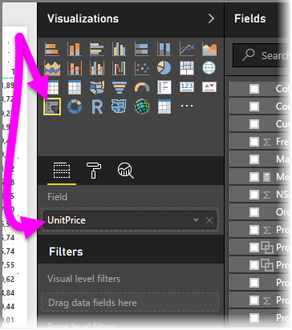
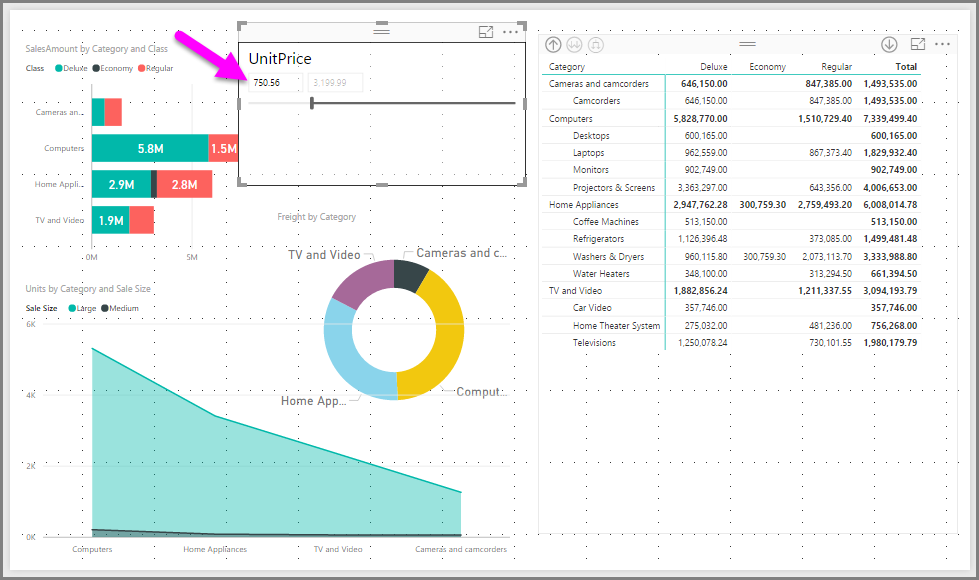

# Use the numeric range slicer in Power BI Desktop
With the **numeric range slicer**, you can apply all sorts of filters to any numeric column in your data model. You can choose to filter **between** numbers, **less than or equal** to a number, or **more than or equal** to a number. While this may sound straightforward, it's a very powerful way to filter your data.

## Using the numeric range slicer
You can use the numeric range slicer just like any other slicer. Simply create a **slicer** visual for your report, and then select a numeric value for the **Field** value. In the following image, the *UnitPrice* field is selected.

Select the carat in the upper-right corner of the **numeric range slicer** and a menu appears.

For the numeric range, you can select from the following three selections:

* Between
* Less than or equal to
* Greater than or equal to

When you select **Between** from the menu, a slider appears and you can filter for numeric values that fall between the numbers. In addition to using the slider bar itself, you can click in either box and type in the values. This is convenient when you want to slice on specific whole numbers, yet the granularity of moving the slicer bar makes it difficult to land exactly on that number.

In the following image, the report page is filtered for *UnitPrice* values that range between 500 and 1500.

When we select **Less than or equal to**, the left (lower value) handle of the slider bar disappears, and we can adjust only  the upper bound of the slider bar. In the following image, we set the slider bar to 497.17.

Lastly, if we select **Greater than or equal to**, then the right (highest value) slider bar handle disappears, and we can adjust the lower value, as seen in the following image. Now only items with a *UnitPrice* greater than or equal to 750.56 are displayed in the visuals on the report page.

## Limitations and considerations
The following limitations and considerations currently apply to the **numeric range slicer**

* The **numeric range slicer** currently filters every underlying row in the data, not any aggregated value. For example, if a *Sales Amount* field is used, each transaction based on *Sales Amount* would be filtered upon, not the sum of *Sales Amount* for each data point of a visual.
* It does not currently work with Measures
* Currently the **numeric range slicer** is only available in **Power BI Desktop**. If a report that uses the **numeric range slicer** is published to the **Power BI service**, the filter will still be applied but it will appear as a list slicer.

