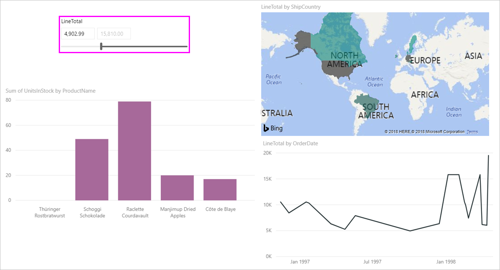

# Use the numeric range slicer in Power BI Desktop
With the **numeric range slicer**, you can apply all sorts of filters to any numeric column in your data model. You can choose to filter **between** numbers, **less than or equal** to a number, or **greater than or equal** to a number. While this may sound straightforward, it's a very powerful way to filter your data.

## Using the numeric range slicer
You can use the numeric range slicer just like any other slicer. Simply create a **slicer** visual for your report, and then select a numeric value for the **Field** value. In the following image, the *LineTotal* field is selected.

Select the down-arrow link in the upper-right corner of the **numeric range slicer** and a menu appears.

For the numeric range, you can select from the following three selections:

* Between
* Less than or equal to
* Greater than or equal to

When you select **Between** from the menu, a slider appears and you can filter for numeric values that fall between the numbers. In addition to using the slider bar itself, you can click in either box and type in the values. This is convenient when you want to slice on specific numbers, yet the granularity of moving the slicer bar makes it difficult to land exactly on that number.

In the following image, the report page is filtered for *LineTotal* values that range between 2500.00 and 6000.00.

When we select **Less than or equal to**, the left (lower value) handle of the slider bar disappears, and we can adjust only  the upper bound of the slider bar. In the following image, we set the slider bar maximum to 5928.19.

Lastly, if we select **Greater than or equal to**, then the right (highest value) slider bar handle disappears, and we can adjust the lower value, as seen in the following image. Now only items with a *LineTotal* greater than or equal to 4902.99 are displayed in the visuals on the report page.

## Snap to whole numbers with the numeric range slicer

A numeric range slicer will snap to whole numbers if the data type of the underlying field is **Whole Number**. This lets your slicer to cleanly align who whole numbers. **Decimal Number** type fields let you enter or select fractions of a number. The formatting applied in the textbox matches the formatting set on the field, even though you can type in or select more precise numbers.

## Display formatting with the date range slicer

When using a slicer to display or set a range of dates, the format of the date is always displayed using the **Short Date** format, based on the user's browser or operating system locale. This is the display format regardless of the data type settings for the underlying data or model. 

For example, you could have a long date format for the underlying data type (such as *dddd, MMMM d, yyyy* which would format a date in other visuals or circumstances as *Wednesday, March 14, 2001*), but in the date range slicer that date would be displayed in the slicer as *03/14/2001*.

Displaying the **Short Date** format in the slicer ensures the length of the string stays consistent and compact within the slicer. 

## Limitations and considerations
The following limitations and considerations currently apply to the **numeric range slicer**:

* The **numeric range slicer** currently filters every underlying row in the data, not any aggregated value. For example, if a *Sales Amount* field is used, each transaction based on *Sales Amount* would be filtered upon, not the sum of *Sales Amount* for each data point of a visual.
* It does not currently work with Measures.
* You can type any number into the textboxes on a numeric slicer, even if it is outside the range of values in the underlying column. This lets you set up filters if you know the data may change in future.
