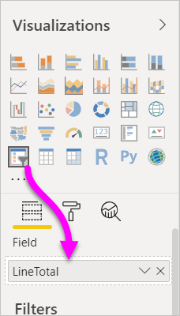

# Use the numeric range slicer in Power BI Desktop
With the numeric range slicer, you can apply all sorts of filters to any numeric column in your data model. There are three options for filtering your numeric data: between numbers, less than or equal to a number, or greater than or equal to a number. This may sound simple, but it's a powerful way to filter your data.

## Use the numeric range slicer
You can use the numeric range slicer like you would use any other slicer. Just create a **slicer** visual for your report, and then select a numeric value for the **Field** value. In the following image, we selected the **LineTotal** field.

Select the down-arrow link in the upper-right corner of the **numeric range slicer** and a menu appears.

For the numeric range, you can select from the following three options:

* **Between**
* **Less than or equal to**
* **Greater than or equal to**

When you select **Between** from the menu, a slider appears. You can use the slider to select numeric values that fall between the numbers. Sometimes the granularity of moving the slicer bar makes it difficult to land exactly on that number. You can also use the slider and select either box to type in the values we want. This option is convenient when you want to slice on specific numbers. 

In the following image, the report page filters for **LineTotal** values that range between 2500.00 and 6000.00.

When you select **Less than or equal to**, the left (lower value) handle of the slider bar disappears, and you can adjust only the upper-bound limit of the slider bar. In the following image, we set the slider bar maximum to 5928.19.

Lastly, if you select **Greater than or equal to**, then the right (higher value) slider bar handle disappears. You can then adjust the lower value, as seen in the following image. Now, only items with a **LineTotal** greater than or equal to 4902.99 display in the visuals on the report page.

## Snap to whole numbers with the numeric range slicer

A numeric range slicer snaps to whole numbers if the data type of the underlying field is **Whole Number**. This feature lets your slicer cleanly align to whole numbers. **Decimal Number** fields let you enter or select fractions of a number. The formatting set in the textbox matches the formatting set on the field, even though you can type in or select more precise numbers.

## Display formatting with the date range slicer

When you use a slicer to display or set a range of dates, the dates display in the **Short Date** format. The user's browser or operating system locale determine the date format. As such, it will be the display format no matter what the data type settings are for the underlying data or model. 

You could, for example, have a long date format for the underlying data type. In this case, a date format such as *dddd, MMMM d, yyyy* would format a date in other visuals or circumstances as *Wednesday, March 14, 2001*. But in the date range slicer, that date displays in the slicer as *03/14/2001*.

Displaying the **Short Date** format in the slicer ensures the length of the string stays consistent and compact within the slicer. 

## Limitations and considerations
The following limitations and considerations apply to the **numeric range slicer**:

* The **numeric range slicer** filters every underlying row in the data, not any aggregated value. For example, let's say that you use a *Sales Amount* field. The slicer then filters each transaction based on the sales amount, not the sum of the sales amount for each data point of a visual.
* It doesn't currently work with measures.
* You can type any number into the textboxes on a numeric slicer, even if it is outside the range of values in the underlying column. This option lets you set up filters if you know the data may change in future.
