# Sort by column in Power BI Desktop
In **Power BI Desktop** and the **Power BI service**, you can change how a visual looks by sorting it by different data fields. By changing how you sort a visual, you can highlight the information you want to convey, and ensure the visual reflects that trend (or emphasis).

Whether you're using numeric data (such as sales figures) or text data (such as state names), you can sort your visualizations as desired, and make them look like you want them to.  **Power BI** provides lots of flexibility for sorting, and quick menus for you to use. On any visual, select the ellipses menu (...) and then select the field by which you want to sort, as shown in the following image.

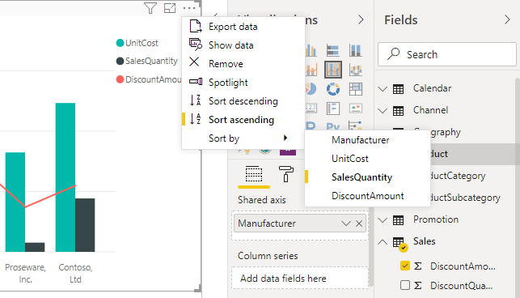

## More depth, and an example
Let's take an example that has more depth, and see how it works in **Power BI Desktop**.

The following visualization shows costs, quantities, and amounts by manufacturer name. Here's the visualization as it looks before we do any further sorting.

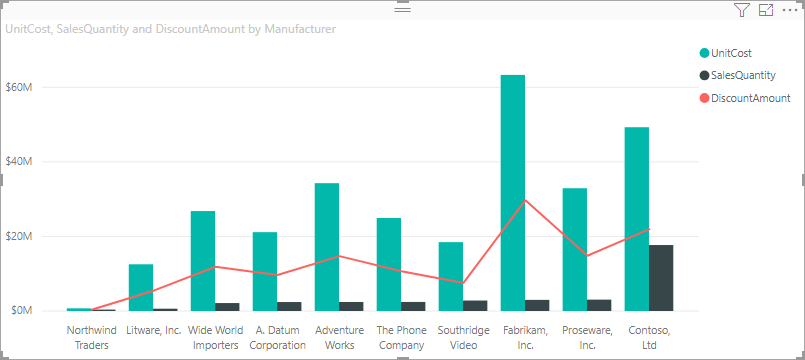

The visual is currently sorted by **SalesQuantity** - we can tell that by matching the color of the ascending bars to the legend, but there's a better way to determine the current sort column: the ellipses menu (...) in the upper right corner of the visual. When we select the ellipses, we see the following:

* The current sorting field is **SalesQuantity**, indicated by the facts that **Sort By SalesQuantity** is in bold and has a yellow bar. 

* The current sorting direction is smallest to largest, as shown by the little icon **A/Z** (A above Z) and a down arrow.

We'll look at the sorting field and direction independently in the next two sections.

## Selecting which column to use for sorting
You noticed the yellow bar beside **Sort By SalesQuantity** in the **More Options** menu, which indicates that the visual is sorted by the **SalesQuantity** column. Sorting by another column is easy - just select the ellipses to show the ellipsis menu, then select another column.

In the following image, we selected *DiscountAmount* as the column by which we want to sort. That column happens to be one of the lines on the visual, rather than one of the bars. Here's what it looks like after we select **Sort By DiscountAmount**.

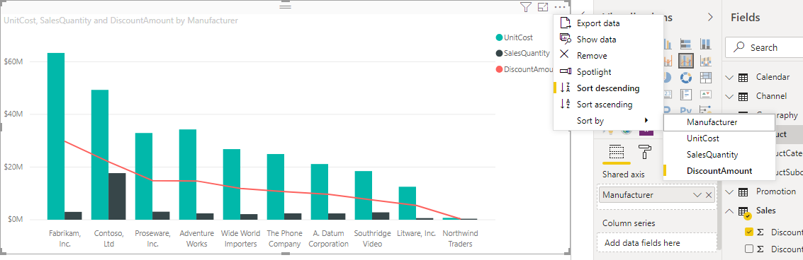

Notice how the visual has changed. The values now are ordered from highest DiscountAmount value, in this visual Fabrikam Inc., down to Northwind Traders which has the lowest value. 

But what if we want to sort ascending, instead of descending? The next section shows just how easy that is.

## Selecting the sort order - smallest to largest, largest to smallest
When we take a closer look at the **Options** menu from the previous image, we see that the icon next to **Sort By DiscountAmount** shows **Z/A** (Z above A). Take a look:

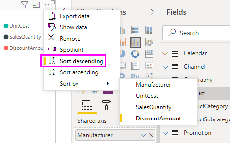

When **Z/A** is displayed, it means the visual is being sorted by the selected column in order of greatest value to smallest value. Want to change that? No problem - just tap or click that **Z/A** icon, and it changes the sort order to **A/Z** and sorts the visual (based on the selected column) from smallest to greatest value.

Here's our same visual, this time after tapping the **Z/A** icon on the **Sort By DiscountAmount** menu item to change its ordering. Notice that Northwind Traders is now the first manufacturer listed, and Fabrikam Inc. is the last - the opposite sorting from before.

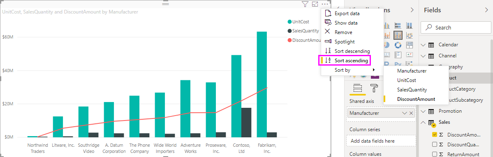

You can sort by any column included in the visual - we could easily select SalesQuantity as the column by which we want to sort, with **Sort By SalesQuantity**, to show the manufacturers with the most sales first, and still retain the other columns in the visual however they happen to apply to that manufacturer. Here's a look at the visual with those settings.

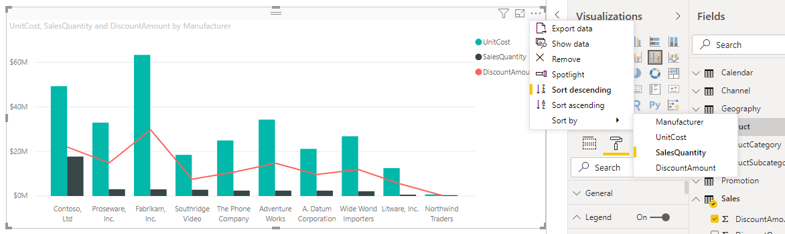

## Sort using the Sort by Column button
There's another way to sort your data, and that's by using the **Sort by Column** button in the **Modeling** ribbon.

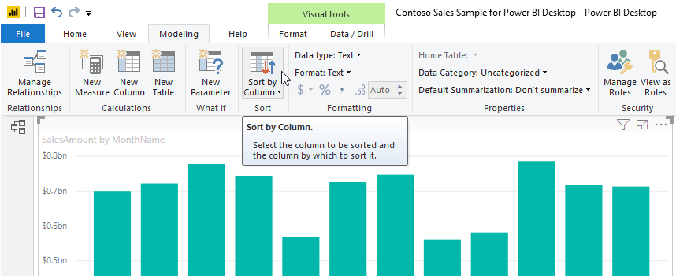

This approach to sorting requires that you select a column from the **Fields** pane, and then select the **Sort by Column** button to choose how (by which column) you want to sort your visual. You have to select the column (field) you want to sort from the **Fields** pane in order to enable the **Sort by Column** button - otherwise the button is inactive.

Let's look at a common example: you have data from each month of the year, and you want to sort it based on chronological order. The following steps show you how.

1. First, notice that when the visual is selected but no column is selected in the **Fields** pane, the **Sort by Column** button is inactive (grayed out).
   
   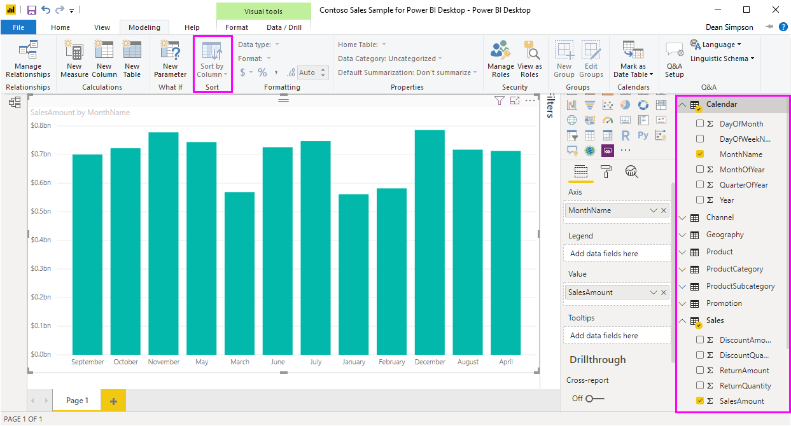

2. When we select the column by which we want to sort, in the **Fields** pane, the **Sort by Column** button becomes active.
   
   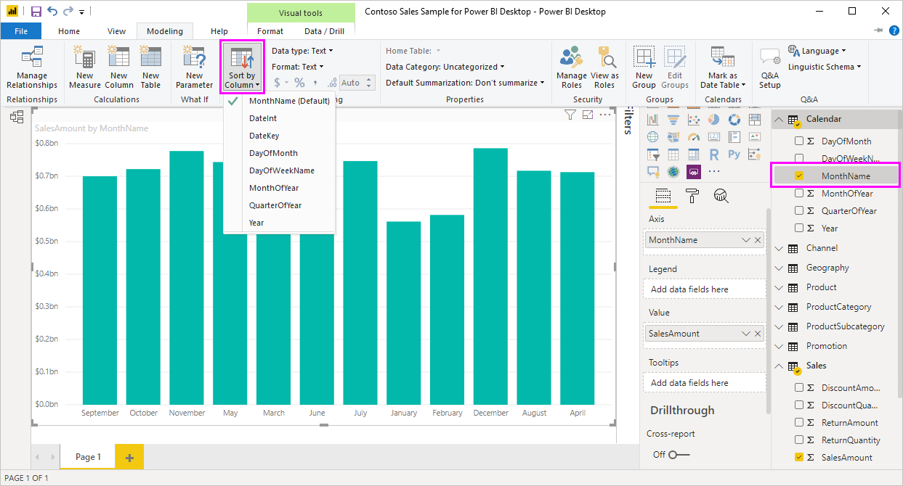
3. Now, with the visual selected, we can select *MonthOfYear*, instead of the default (*MonthName*), and the visual now sorts in the order we want: by the month of the year.
   
   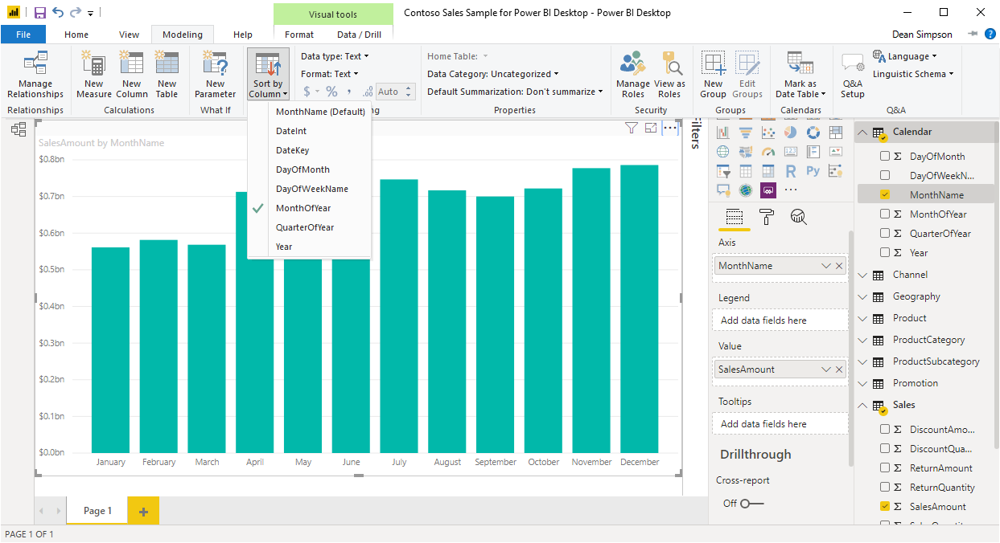

And that's it. Remember that you must select a column in the **Fields** pane for the **Sort by Column** button to become active.

## Getting back to default column for sorting
You can sort by any column you'd like, but there may be times when you want the visual to return to its default sorting column. No problem. For a visual that has a sort column selected (a selected sort column has a yellow bar beside it in the ellipsis menu, as we learned), simply open the **More Options** menu and select that column again, and the visualization returns to its default sort column.

For example, here's our previous chart:

When we go back to the menu and select **SalesQuantity** again, the visual defaults to being ordered alphabetically by **Manufacturer**, as shown in the following image.

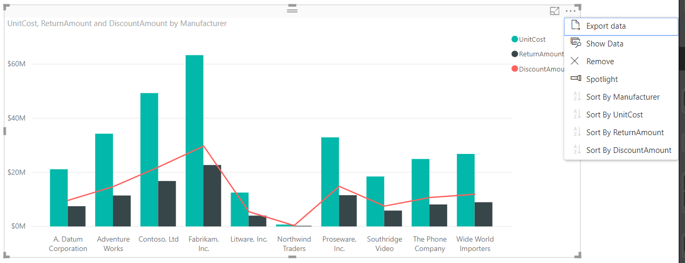

With so many options for sorting your visuals, creating just the chart or image you want is easy.

