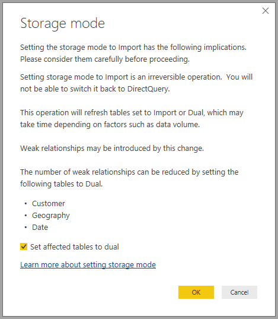

# Storage mode in Power BI Desktop (Preview)

In **Power BI Desktop** you can specify the **storage mode** of tables, providing you with control over whether table data is cached in-memory for reports. 

Setting the **storage mode** provides many advantages. You can set **storage mode** for each table individually in your model, thereby enabling a single dataset to take advantage of one or many of the following advantages:

* **Query performance** - as users interact with visuals in Power BI reports, DAX queries are submitted to the dataset. Caching data into memory by properly setting **storage mode** can boost query performance and interactivity of your reports.
* **Large datasets** - tables that are not cached do not consume memory for caching purposes. You can enable interactive analysis over large datasets that are too big or expensive to completely cache into memory. You can choose which tables are worth caching, and which are not.
* **Data refresh optimization** - tables that are not cached don't need to be refreshed. You can reduce refresh times by caching only the necessary data to meet your service level agreements and your business requirements.
* **Near-real time requirements** - tables with near-real time requirements may benefit from not being cached, to reduce data latency.
* **Writeback** - Writeback enables business users to explore what-if scenarios by changing cell values. Custom applications can apply changes to the data source. Tables that aren't cached can reflect changes immediately, allowing instant analysis of the effects.

The **storage mode** setting in **Power BI Desktop** is one of three related features:

* **Composite models** - allows a report to have multiple data connections, including DirectQuery connections or import, in any combination thereof.
* **Many-to-many relationships** - with **composite models** you can establish **many-to-many relationships** between tables, removing requirements for unique values in tables, and revoving prior work-arounds such as introducing new tables just to establish relationships. 
* **Storage mode** - you can now specify which visuals require a query to back-end data sources, and those that do no require it are imported even if based on DirectQuery, improving performance and reducing back-end load. Previously, even simple visuals like slicers initiated queries being sent to back-end sources. 

This collection of three related features for **composite models** are each described in separate articles:

* **Composite models** are described in detail in their own article, [Composite models in Power BI Desktop (Preview)](desktop-composite-models.md).
* **Many-to-many relationships** are described in their own article, [many-to-many relationships in Power BI Desktop (Preview)](desktop-many-to-many-relationships.md).
* **Storage mode** is desribed in detail in this article.

## Enabling the storage mode preview feature

The **storage mode** feature is in Preview, and must be enabled in **Power BI Desktop**. To enable **storage mode**, select **File > Options and Settings > Options > Preview Features**, then select the **composite models** checkbox. 

You'll need to restart **Power BI Desktop** for the feature to be enabled.

## Using the storage mode property

**Storage mode** is a property that you can set on each table in your model. To set the **storage mode**, select the table from the **Fields** pane and then right-click to bring up the context menu. From the context menu, select **Properties**.

The **storage mode** selection is shown in the **Field properties** pane for the table. From there you can view the current **storage mode** or modify it.

There are three values for **storage mode**:

* **Import** - When set to **Import**, imported tables are cached. Queries submitted to the Power BI dataset that return data from Import tables can only be fulfilled from cached data.
* **DirectQuery** - With this setting, DirectQuery tables are not cached. Queries submitted to the Power BI dataset (for example, DAX queries) that return data from DirectQuery tables can only be fulfilled by executing on-demand queries to the data source. Queries submitted to the data source use the query language for that data source (for example, SQL).
* **Dual** - Dual tables can act as either cached or not cached, depending on the context of the query submitted to the Power BI dataset. In some cases, queries are fulfilled from cached data; in other cases, queries are fulfilled by executing an on-demand query to the data source.

Changing a table to Import is an *irreversible* operation; it cannot be changed back to DirectQuery, or back to Dual.

## Constraints on DirectQuery and Dual tables

Dual tables are subject to the same constraints as DirectQuery tables. These include limited M transformations, and restricted DAX functions in calculated columns. See [Implications of using DirectQuery](desktop-directquery-about.md#implications-of-using-directquery) for more information.

## Relationship rules on tables with different storage modes

Relationships must comply with rules based on the **storage mode** of the related tables. This section provides examples of valid combinations. See [many-to-many relationships in Power BI Desktop (Preview)](desktop-many-to-many-relationships.md) for complete information.

On a dataset with a single data source, the following **1-to-many** relationship combinations are valid:

| Table on **many** side | Table on **1** side |
| ------------- |----------------------| 
| Dual          | Dual                 | 
| Import        | Import or Dual       | 
| DirectQuery   | DirectQuery or Dual  | 

## Propagation of Dual
Let's look at an example. Consider the following simple model, where all the tables are from a single source that supports Import and DirectQuery.

Let’s say all tables in this model are DirectQuery to begin with. If we then change the **storage mode** of the *SurveyResponse* table to Import, the following prompt is displayed:

The dimension tables (*Customer*, *Date* and *Geography*) must be set to **Dual** to comply with the previously described relationship rules. Instead of requiring that these tables be set to **Dual** ahead of time, they can be set in a single operation.

The propagation logic is designed to help with models that contain many tables. Let’s say you have a model with 50 tables and only certain fact (transactional) tables need to be cached. The logic in **Power BI Desktop** figures out the minimum set of dimension tables that need to be set to **Dual**, so you don’t have to do so.

The propagation logic traverses only to the one side of **1-to-many** relationships.

* Changing the *Customer* table to **Import** (instead of changing *SurveyResponse*) is not allowed because of its relationships to the DirectQuery tables *Sales* and *SurveyResponse*.
* Changing the *Customer* table to **Dual** (instead of changing *SurveyResponse*) is allowed. The propagation logic sets the *Geography* table to also be **Dual**.

## Storage mode usage example
Let's continue with the example from the previous section, and imagine we apply the following **storage mode** property settings:

| Table                   | Storage mode         |
| ----------------------- |----------------------| 
| *Sales*                 | DirectQuery          | 
| *SurveyResponse*        | Import               | 
| *Date*                  | Dual                 | 
| *Customer*              | Dual                 | 
| *Geography*             | Dual                 | 

Making those storage mode property setttings results in the following behaviors, assuming the *Sales* table has significant data volume.
* Dimension tables (*Date*, *Customer* and *Geography*) are cached, so initial report load times should be fast when retrieving slicer values to display.
* By not caching the *Sales* table, the following results occur:
    * Data-refresh times are improved, and memory consumption is reduced
    * Report queries based on the *Sales* table run in DirectQuery mode, which may take longer but are closer to real-time because no caching latency is introduced

* Report queries based on the *SurveyResponse* table are returned from the in-memory cache, and thus they should be relatively fast.

## Queries that hit or miss the cache

By connecting **SQL Profiler** to the diagnostics port for **Power BI Desktop**, you can see which queries hit or miss the in-memory cache by performing a trace based on the following events:

* Queries Events\Query Begin
* Query Processing\Vertipaq SE Query Begin
* Query Processing\DirectQuery Begin

For each *Query Begin* event, check other events with the same *ActivityID*. For example, if there is no *DirectQuery Begin* event, but there is a *Vertipaq SE Query Begin* event, then the query was answered from the cache.

Queries that refer to **Dual** mode tables return data from the cache if possible, otherwise they revert to DirectQuery.

Continuing the prior example, the following query refers only to a column from the *Date* table, which is in **Dual** mode. Therefore, it should hit the cache.

The following query refers only to a column from the *Sales* table, which is in **DirectQuery** mode. Therefore, it should *not* hit the cache.

The following query is interesting because it combines both columns. This query will not hit the cache. You may initially expect it to retrieve *CalendarYear* values from the cache and *SalesAmount* values from the source and then combine the results, but this would be less efficient than submitting the SUM/GROUP BY operation to the source system. If the operation is pushed down to the source, the number of rows returned will likely be far less. 

> [!NOTE]
> This behavior is different from [many-to-many relationships in Power BI Desktop (Preview)](desktop-many-to-many-relationships.md) when combining cached and non-cached tables.

## Caches should be kept in sync

The queries displayed in the previous section show that **Dual** tables sometimes hit the cache and sometimes do not hit the cache. Because of this, if the cache is out of date different values can be returned. Query execution will not attempt to mask data issues by, for example, filtering DirectQuery results to match cached values. It is your responsibility to know your data flows, and you should design accordingly. There are established techniques to handle such cases at the source, if necessary.

The **Dual** storage mode is a performance optimization. It should only be usedin ways that do not compromise the ability to meet business requirements. For alternative behavior, please consider using the techniques described in the [Many-to-many relationships in Power BI Desktop (Preview)](desktop-many-to-many-relationships.md) article.

## Data view
If at least one table in the dataset has its **storage mode** set to either Import or Dual, the **Data view** tab is displayed.

When selected in *Data view**, **Dual** and **Import** tables show cached data. DirectQuery tables do not show data, and a message is displayed that states DirectQuery tables cannot be shown.

## Limitations and considerations

There are a few limitations for this release of **storage mode**, and its correlation with **composite models**.

The following multidimensional sources cannot be used with **composite models**:

* SAP HANA
* SAP Business Warehouse
* SQL Server Analysis Services
* Power BI datasets

When connecting to those multidimensional sources using DirectQuery, you cannot also connect to another DirectQuery source, nor combine with imported data.

The existing limitations of using DirectQuery still apply when using **composite models**. Many of those limitations are now per table, depending upon the **storage mode** of the table. For example, a calculated column on an imported table can refer to other tables, but a calculated column on a DirectQuery table is still restricted to refer only to columns on the same table. Other limitations apply to the model as a whole, if any of the tables within the model are DirectQuery. For example, the **QuickInsights** and **Q&A** features are not available on a model if any of the tables within it has a **storage mode** of DirectQuery. 

## Next steps

The following articles describe more about composite models, and also describe DirectQuery in detail.

* [Composite models in Power BI Desktop (Preview)](desktop-composite-models.md)
* [Many-to-many relationships in Power BI Desktop (Preview)](desktop-many-to-many-relationships.md)

DirectQuery articles:

* [Using DirectQuery in Power BI](desktop-directquery-about.md)
* [Data sources supported by DirectQuery in Power BI](desktop-directquery-data-sources.md)

