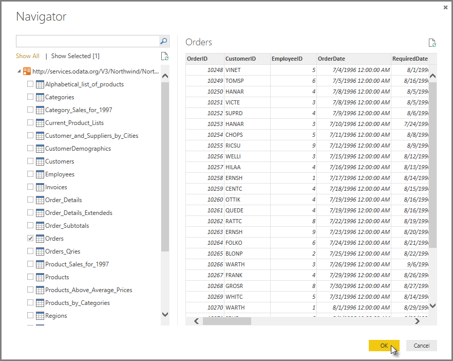
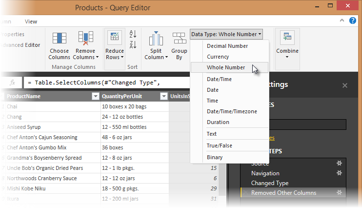

# Tutorial: Combine sales data from Excel and an OData feed

It's common to have data spread across multiple data sources, such as product information in one database and sales information in another. With **Power BI Desktop**, you can combine data from different sources to create interesting, compelling data analyses and visualizations. 
In this tutorial, you learn how to combine data from two data sources, an Excel workbook that includes product information and an OData feed that contains orders data. After you import each dataset and perform transformation and aggregation steps, you combine the data from both sources to produce a **Total Sales per Product and Year** report with interactive visualizations. These techniques can also be applied to SQL Server queries, CSV files, and any other data sources in Power BI Desktop.

>[!NOTE]
>In Power BI Desktop, there are often a few ways to accomplish a task. For example, many ribbon selections are also available by using a right-click or **More options** menu on a column or cell. Several alternate methods are described in the steps below. 

## Import the product data from Excel

First, import the product data from the Excel Products.xlsx workbook into Power BI Desktop.

1. [Download the Products.xlsx Excel workbook Products.xlsx](http://download.microsoft.com/download/1/4/E/14EDED28-6C58-4055-A65C-23B4DA81C4DE/Products.xlsx), and save it as **Products.xlsx**.
   
2. Select the dropdown arrow next to **Get Data** in the **Home** tab of the Power BI Desktop ribbon, and then select **Excel** from the **Most Common** dropdown. 
   
   
   
   >[!NOTE]
   >You can also select the **Get Data** item itself, or select **Get Data** from the Power BI **Get started** dialog, then select **Excel** or **File** > **Excel** in the **Get Data** dialog box, and then select **Connect**.
   
3. In the **Open** dialog box, navigate to and select the **Products.xlsx** file, and then select **Open**.
   
4. In the **Navigator** pane, select the **Products** table and then select **Edit**.
   
   
   
A preview of the table opens in the **Power Query Editor**, where you can apply transformations to clean up the data. 
   

   
>[!NOTE]
>You can also open the **Power Query Editor** by selecting **Edit Queries** > **Edit Queries** from the **Home** ribbon in Power BI Desktop, or by right-clicking or choosing **More options** next to any query in **Report View**, and selecting **Edit Query**.

## Clean up the product columns

Your combined report will only use the **ProductID**, **ProductName**, **QuantityPerUnit**, and **UnitsInStock** columns from the Excel workbook, so you can remove the other columns. 

1. In **Power Query Editor**, select the **ProductID**, **ProductName**, **QuantityPerUnit**, and **UnitsInStock** columns (use **Ctrl**+**Click** to select more than one column, or **Shift**+**Click** to select columns that are next to other).
   
2. Right-click and select **Remove Other Columns** from the dropdown, or select **Remove Columns** > **Remove Other Columns** from the **Manage Columns** group in the **Home** ribbon tab, to remove all other columns from the table. 
   
    or 

## Import the order data from an OData feed

Next, import the order data from the sample Northwind sales system OData feed. 

1. In **Power Query Editor**, select **New Source** and then select **OData feed**. 
   
2. In the **OData Feed** dialog box, paste the URL for the Northwind OData feed, `http://services.odata.org/V3/Northwind/Northwind.svc/`, and select **OK**.
   
3. In the **Navigator** pane, select the **Orders** table, and then select **Edit**.
   
   
   
   >[!NOTE]
   >In **Navigator**, you can select a table name, without selecting the checkbox, to see a preview.

## Expand the order data

When you connect to data sources with multiple tables, such as relational databases, you can use the references between tables to build up your query. The **Orders** table contains a reference to a nested **Order_Details** table, which has data about the individual products in each order. You can use the **Expand** operation to add the **ProductID**, **UnitPrice**, and **Quantity** columns from the related (**Order_Details**) table into the subject (**Orders**) table. 

1. In **Power Query Editor**, scroll to the **Order_Details** column.
   
2. In the **Order_Details** column header, select the **Expand** icon ().
   
3. In the **Expand** drop-down:
   
   1. Select **(Select All Columns)** to clear all columns.
      
   2. Select **ProductID**, **UnitPrice**, and **Quantity**, and then select **OK**.
      
      

After you expand the **Order_Details** table, three new columns and additional rows are added to the **Orders** table, one for each row in the nested related table.

## Create a custom calculated column

Power Query Editor lets you create calculations and custom fields to enrich your data. You can create a custom column that multiplies item quantity times item price, to calculate the total price for each line item in the order.

1. In the **Add Column** ribbon tab, click **Add** > **Custom Column**.
   
   
   
2. In the **Add Custom Column** dialog box, in the **Custom Column Formula** textbox, enter **[Order_Details.UnitPrice]** * **[Order_Details.Quantity]**.
3. In the **New column name** textbox, enter **LineTotal**, and select **OK**.
   
   

## Set the data type for the new field

When Power Query Editor connects to data, it determines the best data type for each field and displays the data accordingly. You can see the data types assigned to fields by the icons at the left of the headers, or under **Data Type:** in the **Transform** group of the **Home** ribbon tab. 

The new **LineTotal** column has a data type of **Any**. The calculated values will be currency, so to change the data type, either:

- Select the new **LineTotal** column, then select the dropdown arrow next to **Data Type** in the **Transform** area of the **Home** ribbon tab, and then select **Fixed decimal number**, or
   
- Right-click the **LineTotal** column header, choose **Change Data Type** from the dropdown, and then select **Fixed decimal number**. 
   
         

## Clean up the orders columns

You can make the model easier to work with in reports by deleting, renaming, and reordering some of the columns.

Your report only uses the **OrderDate**, **ShipCity**, **ShipCountry**, **Order_Details.ProductID**, **Order_Details.UnitPrice**, and **Order_Details.Quantity** columns. With the Excel data, you used **Remove Other Columns**. Here, you remove selected columns.

1. Select the **Order ID** and **Shipper** columns (use **Ctrl**+**Click** to select multiple columns). 
   
2. Right-click on either selected column header and click **Remove Columns**.

You can make the **Order_Details.ProductID**, **Order_Details.UnitPrice** and **Order_Details.Quantity** columns easier to use by removing the *Order_Details.* prefixes from the column names. To rename the columns to **ProductID**, **UnitPrice** and **Quantity**, respectively:

1. Double-click or tap and hold each column header, or right-click the column header, and select **Rename** from the dropdown. 
   
2. Delete the *Order_Details.* prefix, and then press **Enter**.

Finally, to make the **LineTotal** column easier to access, drag and drop it to the left, just to the right of the **ShipCountry** column.

## Review query steps

As you shaped and transformed data in the Power Query Editor, each step was recorded in the **Applied Steps** area of the **Query Settings** pane at the right side of the Power Query Editor window. You can step back through the Applied Steps to see exactly what changes you made, and edit, delete, or rearrange them if necessary (although this can be risky, because changing preceding steps can break later steps). 

Navigate between your queries in the Power Query Editor by selecting each query in the **Queries** pane on the left. After applying the data transformations so far, the Applied Steps for your two queries should look like the following:

>[!TIP]
>Underlying the Applied Steps are formulas written in the **Power Query Language**, also known as the **M** language. To see and edit the formulas, select **Advanced Editor** in the **Query** group of the Home tab of the ribbon. 

## Import the transformed data

When you are satisfied with your transformed data, select each query in the **Queries** pane of Power Query Editor, and then select **Close & Apply** > **Close & Apply** in the Home tab of the ribbon to import it into Power BI Desktop. 

Once the data is loaded, each query appears in the Power BI Desktop Report view as a new query in the **Fields** list.

## Combine the two queries

Power BI Desktop does not require you to combine queries to report on them. Instead, you can create relationships between datasets, based on fields they have in common. For more information about relationships, see [Create and manage relationships](desktop-create-and-manage-relationships.md).

The Orders and Products datasets in this tutorial share a common *ProductID* field, so there can be a relationship between them based on that column. Power BI Desktop may detect the relationship automatically, or you can specify it in the Power BI Desktop **Manage Relationships** dialog. 

1. In Power BI Desktop Report view, select **Manage Relationships** in the **Relationships** area of the **Home** ribbon tab.
   
   
   
2. See if Power BI Desktop automatically detects the relationship between the Products and Orders tables by selecting **Autodetect**. 
   
   >[!NOTE]
   >- To change anything about the relationship, select it in the **Manage Relationships** dialog and select **Edit**. 
   >- To create a new relationship, select **New** in the **Manage Relationships** dialog.
   
3. Power BI Desktop has autodetected the relationship correctly, so select **Cancel** to close the **Manage Relationships** dialog.

You can also visualize and manage the relationship between your tables by selecting **Relationship** view at the left side of the Power BI Desktop window.
   
   
7. We see the following, which visualizes the relationship between the queries.
   
   
8. When you double-click the arrow on the line that connects the to queries, an **Edit Relationship** dialog appears.
   
   
9. No need to make any changes, so we'll just select **Cancel** to close the **Edit Relationship** dialog.

## Create visualizations using your data

Power BI Desktop lets you create a variety of visualizations to gain insights from your data. You can build reports with multiple pages, and each page can have multiple visuals. You and others can interact with your visualizations to help analyze and understand your data. For more information about viewing and editing reports in Power BI Service (your site), see [Edit a Report](service-interact-with-a-report-in-editing-view.md).

Because there is a relationship between your datasets based on the **ProductID** field, you can mix fields from both of your queries in your visualizations. 

Your first visualization is a bar chart showing units in stock for each product, which uses fields from the **Products** query. 

1. Select **UnitsInStock** from **Products** in the **Fields** pane at the right, or drag it onto a blank space on the canvas. This creates a bar chart visualization showing the total number of all products in stock. 
   
2. To show the number of each product in stock, with the bar chart selected, select **ProductName** from **Products** in the **Fields** pane. Or, you can drag the **ProductName** field to **Drag data fields here** under **Axis**, in the bottom half of the **Visualizations** pane next to the **Fields** pane. 
   
3. To sort the chart by most to least units in stock, select the **More options** ellipsis (**...**) at the upper right of the visualization, and then select **Sort By UnitsInStock**.

Your second visualization is a line chart showing **LineTotal** by **OrderDate**, from the **Orders** query. 

1. With nothing selected on the canvas, select **OrderDate** from **Orders** in the **Fields** pane, or drag it to a blank space on the canvas. 
   
2. With the new visualization selected, select **LineTotal** from **Orders**, or drag it on to the visualization. 
   
3. Change the new visualization to a line chart by selecting it, and then selecting the **Line chart** icon in the **Visualizations** pane.

   

The third visualization is a map showing **LineTotals** by **ShipCountry**. 

1. With nothing selected on the canvas, select **ShipCountry** from **Orders** in the **Fields** pane, or drag it to a blank space on the canvas. Power BI Desktop detects that the data is country names, and automatically creates a map visualization with a data point for each country that had orders. 
   
2. To make the size of the data points reflect the amount of sales for each country, with the new visualization selected, drag the **LineTotal** field to **Drag data fields here** under **Values**, in the bottom half of the **Visualizations** pane. The size of the circles on the map now reflects the dollar amount of the orders from each country. 
   
   

## Interact with your report visuals to analyze further

Power BI Desktop lets you interact with visuals that cross-highlight and filter each other to uncover further trends. For more information, see [Filtering and Highlighting in Reports](power-bi-reports-filters-and-highlighting.md). 

Because of the relationship between your queries, interactions with one visualization will affect the visualizations from both queries. 

On the map visualization, select the circle centered in **Canada**. Note that the other two visuals are filtered to show Units in Stock and Line Totals just for Canada.

## Complete Sales Analysis report

You now have a Sales Report that combines data from the Products.xlsx Excel file and the Northwind OData feed, with report visuals that help analyze sales information from different countries. When your report is ready, you can [upload it to Power BI service](desktop-upload-desktop-files.md) to share it with other Power BI users.

## Next steps
* [Read other Power BI Desktop tutorials](http://go.microsoft.com/fwlink/?LinkID=521937)
* [Watch Power BI Desktop videos](http://go.microsoft.com/fwlink/?LinkID=519322)
* [Visit the Power BI Forum](http://go.microsoft.com/fwlink/?LinkID=519326)
* [Read the Power BI Blog](http://go.microsoft.com/fwlink/?LinkID=519327)