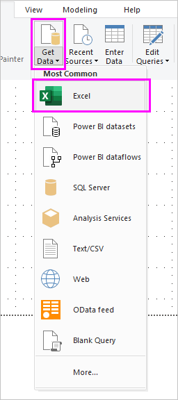
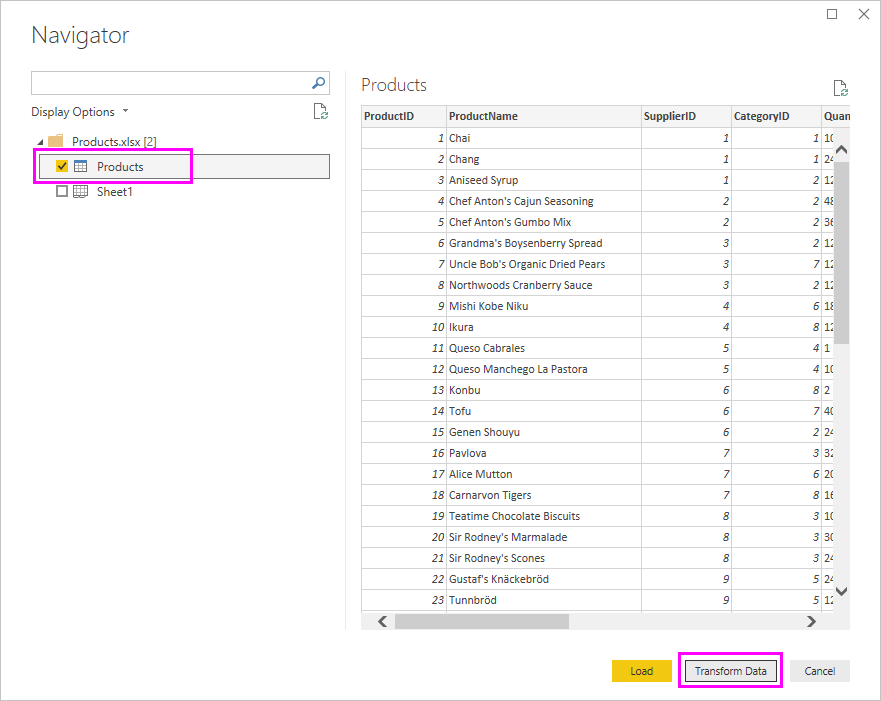
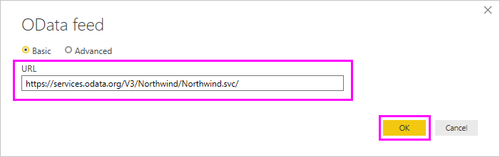
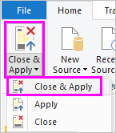
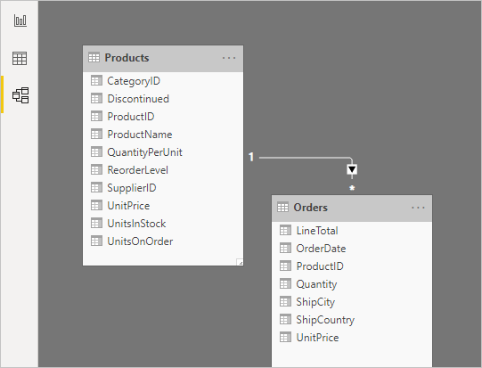
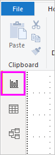

# Tutorial: Combine sales data from Excel and an OData feed

It's common to have data spread across multiple data sources, such as product information in one database and sales information in another. With **Power BI Desktop**, you can combine data from different sources to create interesting, compelling data analyses and visualizations. 

In this tutorial, you learn how to combine data from two data sources: an Excel workbook that includes product information, and an OData feed that contains orders data. After you import each dataset and perform transformation and aggregation steps, you use data from both sources to produce a sales analysis report with interactive visualizations. These techniques can also be applied to SQL Server queries, CSV files, and any other data sources in Power BI Desktop.

>[!NOTE]
>In Power BI Desktop, there are often a few ways to accomplish a task. For example, many ribbon selections are also available by using a right-click or **More options** menu on a column or cell. Several alternate methods are described in the steps below. 

## Import the product data from Excel

First, import the product data from the Excel Products.xlsx workbook into Power BI Desktop.

1. [Download the Products.xlsx Excel workbook](http://download.microsoft.com/download/1/4/E/14EDED28-6C58-4055-A65C-23B4DA81C4DE/Products.xlsx), and save it as **Products.xlsx**.
   
2. Select the dropdown arrow next to **Get Data** in the **Home** tab of the Power BI Desktop ribbon, and then select **Excel** from the **Most Common** dropdown. 
   
   
   
   >[!NOTE]
   >You can also select the **Get Data** item itself, or select **Get Data** from the Power BI **Get started** dialog, then select **Excel** or **File** > **Excel** in the **Get Data** dialog box, and then select **Connect**.
   
3. In the **Open** dialog box, navigate to and select the **Products.xlsx** file, and then select **Open**.
   
4. In the **Navigator** pane, select the **Products** table and then select **Edit**.
   
   
   
A preview of the table opens in the **Power Query Editor**, where you can apply transformations to clean up the data. 
   

   
>[!NOTE]
>You can also open the **Power Query Editor** by selecting **Edit Queries** > **Edit Queries** from the **Home** ribbon in Power BI Desktop, or by right-clicking or choosing **More options** next to any query in **Report View**, and selecting **Edit Query**.

## Clean up the products columns

Your combined report will only use the **ProductID**, **ProductName**, **QuantityPerUnit**, and **UnitsInStock** columns from the Excel workbook, so you can remove the other columns. 

1. In **Power Query Editor**, select the **ProductID**, **ProductName**, **QuantityPerUnit**, and **UnitsInStock** columns (use **Ctrl**+**Click** to select more than one column, or **Shift**+**Click** to select columns that are next to each other).
   
2. Right-click any of the selected headers and select **Remove Other Columns** from the dropdown, to remove all except the selected columns from the table. 
   You can also select **Remove Columns** > **Remove Other Columns** from the **Manage Columns** group in the **Home** ribbon tab. 
   
   

## Import the order data from an OData feed

Next, import the order data from the sample Northwind sales system OData feed. 

1. In **Power Query Editor**, select **New Source** and then select **OData feed** from the **Most Common** dropdown. 
   
   
   
2. In the **OData Feed** dialog box, paste the URL for the Northwind OData feed, `http://services.odata.org/V3/Northwind/Northwind.svc/`, and select **OK**.
   
   
   
3. In the **Navigator** pane, select the **Orders** table, and then select **OK** to load the data into **Power Query Editor**.
   
   
   
   >[!NOTE]
   >In **Navigator**, you can select any table name, without selecting the checkbox, to see a preview.

## Expand the order data

When you connect to data sources that have multiple tables, such as relational databases or the Northwind OData feed, you can use references between tables to build up your queries. The **Orders** table contains references to several related tables. You can add the **ProductID**, **UnitPrice**, and **Quantity** columns from the related **Order_Details** table into the subject (**Orders**) table by using the **Expand** operation. 

1. Scroll to the right in the **Orders** table until you can see the **Order_Details** column. Note that instead of data, it contains references to another table.
   
   
   
2. Select the **Expand** icon () in the **Order_Details** column header. 
   
3. In the **Expand** drop-down:
   
   1. Select **(Select All Columns)** to clear all columns.
      
   2. Select **ProductID**, **UnitPrice**, and **Quantity**, and then select **OK**.
      
      

After you expand the **Order_Details** table, the **Order_Details** column is replaced by the three new columns from the nested table, and there are new rows in the table for the added data from each order. 

## Create a custom calculated column

Power Query Editor lets you create calculations and custom fields to enrich your data. You will create a custom column that calculates the total price for each line item in an order by multiplying the unit price by item quantity.

1. In the **Add Column** ribbon tab of Power Query Editor, select **Custom Column**.
   
   
   
2. In the **Custom Column** dialog box, type **LineTotal** in the **New column name** field.

3. In the **Custom column formula** field after the **=** , enter **[Order_Details.UnitPrice]** \* **[Order_Details.Quantity]**. (You can also select the field names from the **Available columns** scroll box and select **<< Insert**, instead of typing them.) 
3. Select **OK**.
   
   

The new **LineTotal** field appears as the last column in the **Orders** table.

## Set the data type for the new field

When Power Query Editor connects to data, it determines the best data type for each field and displays the data accordingly. You can see the data types assigned to fields by the icons in the headers, or under **Data Type** in the **Transform** group of the **Home** ribbon tab. 

Your new **LineTotal** column has a data type of **Any**, but its values are currency. To assign a data type, right-click the **LineTotal** column header, select **Change Data Type** from the dropdown, and then select **Fixed decimal number**. 

>[!NOTE]
>You can also select the **LineTotal** column, then select the dropdown arrow next to **Data Type** in the **Transform** area of the **Home** ribbon tab, and then select **Fixed decimal number**.

## Clean up the orders columns

To make your model easier to work with in reports, you can delete, rename, and reorder some of the columns.

Your report will only use the **OrderDate**, **ShipCity**, **ShipCountry**, **Order_Details.ProductID**, **Order_Details.UnitPrice**, and **Order_Details.Quantity** columns. You can select these columns and use **Remove Other Columns** as you did with the Excel data, or you can select all the columns except those listed, right-click on one of the selected columns, and select **Remove Columns** to remove them all. 

You can make the **Order_Details.ProductID**, **Order_Details.UnitPrice** and **Order_Details.Quantity** columns easier to identify by removing the *Order_Details.* prefixes from the column names. To rename the columns to **ProductID**, **UnitPrice** and **Quantity**, respectively:

1. Double-click or tap and hold each column header, or right-click the column header and select **Rename** from the dropdown. 
2. Delete the *Order_Details.* prefix from each name, and then press **Enter**.

Finally, to make the **LineTotal** column easier to access, drag and drop it to the left, just to the right of the **ShipCountry** column.

## Review the query steps

As you shaped and transformed data in the Power Query Editor, each step was recorded in the **Applied Steps** area of the **Query Settings** pane on the right side of Power Query Editor. You can step back through the Applied Steps to review the changes you made, and edit, delete, or rearrange them if necessary (although this can be risky, because changing preceding steps can break later steps). 

Select each of your queries in the **Queries** list on the left side of Power Query Editor, and review the **Applied Steps** in **Query Settings**. After applying the previous data transformations, the Applied Steps for your two queries should look like the following:

 &nbsp;&nbsp; 

>[!TIP]
>Underlying the Applied Steps are formulas written in the **Power Query Language**, also known as the **M** language. To see and edit the formulas, select **Advanced Editor** in the **Query** group of the Home tab of the ribbon. 

## Import the transformed queries

When you are satisfied with your transformed data, select **Close & Apply** > **Close & Apply** in the **Close** group of the **Home** ribbon tab, to import the data into Power BI Desktop Report View. 

Once the data is loaded, the queries appear in the **Fields** list in the Power BI Desktop Report View .

## Manage the relationship between the datasets

Power BI Desktop does not require you to combine queries to report on them. However, you can use the relationships between datasets, based on fields they have in common, to extend and enrich your reports. Power BI Desktop may detect relationships automatically, or you can create them in the Power BI Desktop **Manage Relationships** dialog. For more details about relationships in Power BI Desktop, see [Create and manage relationships](desktop-create-and-manage-relationships.md).

The Orders and Products datasets in this tutorial share a common *ProductID* field, so there is a relationship between them based on that column. 

1. In Power BI Desktop Report View, select **Manage Relationships** in the **Relationships** area of the **Home** ribbon tab.
   
   
   
2. In the **Manage Relationships** dialog, note that Power BI Desktop has already detected and listed an active relationship between the Products and Orders tables. To view the relationship, select **Edit**. 
   
   
   
   The **Edit Relationship** dialog opens, showing details about the relationship.  
   
   
   
3. Power BI Desktop has autodetected the relationship correctly, so you can select **Cancel** and then **Close** to exit the relationship dialogs.

You can also view and manage the relationships between your queries by selecting the **Relationship** view at the left side of the Power BI Desktop window. Double-click the arrow on the line connecting the two queries to open the **Edit Relationship** dialog and view or change the relationship. 

To get back to Report View from Relationships View, select the **Report View** icon. 

## Create visualizations using your data

In Power BI Desktop Report View, you can create a variety of visualizations to gain insights from your data. You can build reports with multiple pages, and each page can have multiple visuals. You and others can interact with your visualizations to help analyze and understand your data. For more information about viewing and editing reports in Power BI Service (your site), see [Edit a Report](service-interact-with-a-report-in-editing-view.md).

You can use both of your data sets, and the relationship between them, to help visualize and analyze your sales data. 

First, create a stacked column chart that uses fields from both queries to show the quantity of each product ordered. 

1. Select the **Quantity** field from **Orders** in the **Fields** pane at the right, or drag it onto a blank space on the canvas. This creates a stacked column chart showing the total quantity of all products ordered. 
   
2. Select **ProductName** from **Products** in the **Fields** pane, or drag it onto the chart, to show the quantity of each product ordered. 
   
3. To sort the products by most to least ordered, select the **More options** ellipsis (**...**) at the upper right of the visualization, and then select **Sort By Quantity**.
   
4. Use the handles at the corners of the chart to enlarge it so more product names are visible. 
   
   

Next, create a chart showing order dollar amounts (**LineTotal**) over time (**OrderDate**). 

1. With nothing selected on the canvas, select **LineTotal** from **Orders** in the **Fields** pane, or drag it to a blank space on the canvas. The stacked column chart shows the total dollar amount of all orders. 
   
2. With the chart selected, select **OrderDate** from **Orders**, or drag it onto the chart. The chart now shows line totals for each order date. 
   
3. Resize the visualization by dragging the corners to be able to see more data. 
   
   
   
   >[!TIP]
   >If you only see Years on the chart (only three data points), drop down the arrow next to **OrderDate** in the **Axis** field of the **Visualizations** pane, and select **OrderDate** instead of **Date Hierarchy**. 

Finally, create a map visualization showing order amounts from each country. 

1. With nothing selected on the canvas, select **ShipCountry** from **Orders** in the **Fields** pane, or drag it to a blank space on the canvas. Power BI Desktop detects that the data is country names, and automatically creates a map visualization, with a data point for each country that had orders. 
   
2. To make the sizes of the data points reflect the order amounts for each country, drag the **LineTotal** field onto the map (or drag it to **Drag data fields here** under **Size**, in the bottom half of the **Visualizations** pane). The sizes of the circles on the map now reflect the dollar amounts of the orders from each country. 
   
   

## Interact with your report visuals to analyze further

Power BI Desktop lets you uncover further trends by interacting with visuals that cross-highlight and filter each other. For more information, see [Filtering and Highlighting in Reports](power-bi-reports-filters-and-highlighting.md). 

Because of the relationship between your queries, interactions with one visualization will affect all the other visualizations on the page. 

On the map visualization, select the circle centered in **Canada**. Note that the other two visualizations filter to highlight the line totals and order quantities just for Canada.

If you select one of the products in the **Quantity by ProductName** chart, the map and the date chart filter to reflect the data for that product, and if you select one of the dates in the **LineTotal by OrderDate** chart, the map and the product chart filter to show the data for that date. 
>[!TIP]
>To deselect a selection, select it again, or select one of the other visualizations. 

## Complete the sales analysis report

Your completed report combines data from the Products.xlsx Excel file and the Northwind OData feed in visuals that help analyze order information for different countries, timeframes, and products. When your report is ready, you can [upload it to Power BI service](desktop-upload-desktop-files.md) to share it with other Power BI users.

## Next steps
* [Read other Power BI Desktop tutorials](http://go.microsoft.com/fwlink/?LinkID=521937)
* [Watch Power BI Desktop videos](http://go.microsoft.com/fwlink/?LinkID=519322)
* [Visit the Power BI Forum](http://go.microsoft.com/fwlink/?LinkID=519326)
* [Read the Power BI Blog](http://go.microsoft.com/fwlink/?LinkID=519327)