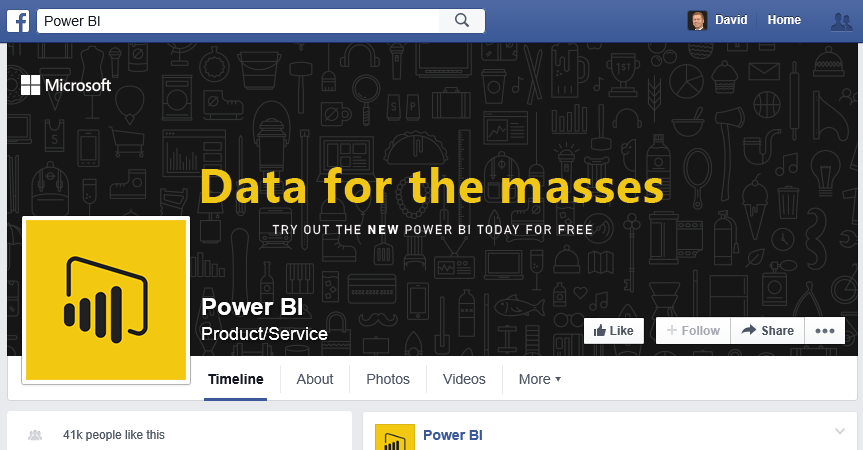
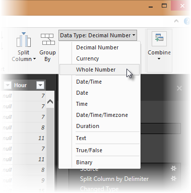
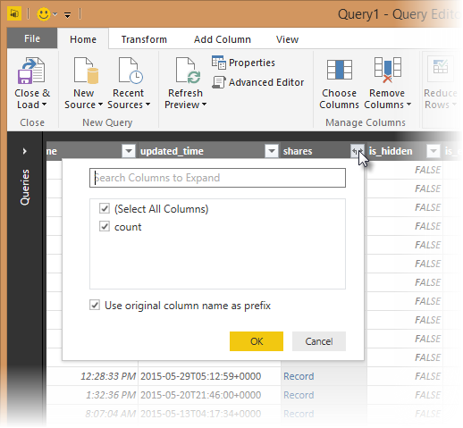
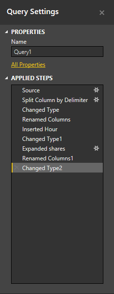
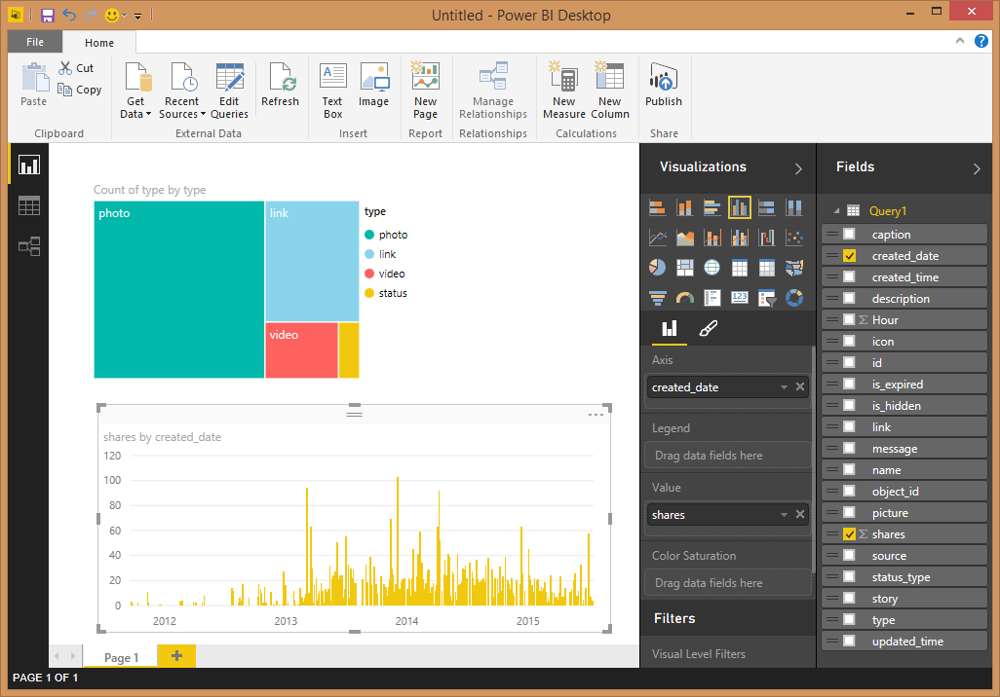
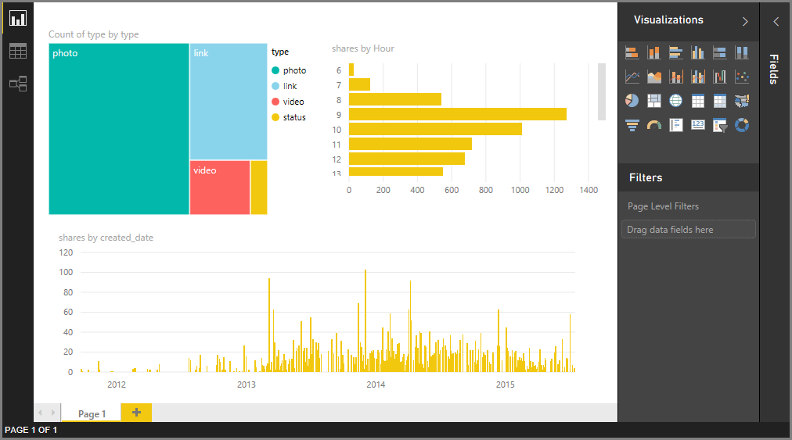

# Tutorial: Facebook analytics using Power BI Desktop
In this tutorial you learn how to import and visualize data from **Facebook**. During the tutorial you'll learn how to connect to a specific Facebook page (the Power BI page), apply data transformation steps, and create some visualizations.

Here are the steps you'll take:

* **Task 1:** Connect to a Facebook Page
* **Task 2**: Create visualizations using the Report view
  
  * **Step 1**: Create a Treemap visualization
* **Task 3**: Shape data in the Query view
  
  * **Step 1**: Split the date-time column into two
  * **Step 2**: Add an aggregate value from a related table
* **Task 4**: Create additional visualizations using the Report view
  
  * **Step 1**: Load the query to your report
  * **Step 2**: Create a Line chart and a Bar chart

## **Task 1: Connect to a Facebook page**
In this task you import data from the [Microsoft Power BI Facebook](https://www.facebook.com/microsoftbi)site (here's the URL: *https://www.facebook.com/microsoftbi )*.

Anyone can connect to that page, and follow these steps - no special credentials (other than your own Facebook account, which you use in this step) are required.

1. In the **Getting Started** dialog or in the **Home ribbon tab**, select **Get Data.**
2. The **Get Data** dialog appears, letting you select from all sorts of data sources. Select **Facebook** from the **Other** group.
   
   
   
   When you select **Connect**, a dialog appears to alert you to the risks of using a third-party service.
   
   
3. When you select Continue, the **Facebook** dialog box appears where you can paste the page name (**microsoftbi**) into the **Username** text box. Select **Posts** from the **Connection** drop down.
   
   
4. Click **OK**.
5. When prompted for credentials, sign in using your Facebook account and allow Power BI access through your account.
   
   

After establishing a connection to the page, you will see the data being loaded in the model. 

From there, **Query Editor** displays the data. **Query Editor** is part of Power BI Desktop, but loads in a separate window, and is where you perform all your transformations on your data connections.

When your data is how you want it, you can load it into Power BI Desktop. Select **Load & Close** from the **Home** ribbon.

You'll see a dialog that displays the progress of loading the data into the Power BI Desktop data model.

Once loaded, you’ll be taken to the **Report** view where the columns from the table are listed in the **Field** list on the right.

## **Task 2: Create visualizations using the Report view**
Now that you have landed the data from the page, you can quickly and easily gain insights about your data, using visualizations.

**Step 1:** Create a Treemap visualization

Creating a visualization is easy, we just drag a field from the **Field list** and drop it on the **Report canvas.**

Drag the **type** field onto the **Report** canvas. Power BI Desktop creates a new visualization in the **Report canvas**. Next, drag **type** from **Fields** (the same field you just dragged onto the **Report** canvas) onto the **Value** area to create a **Bar** visualization.

We can easily change the type of visualization by selecting a different icon from the **Visualization** pane. Let's change the type to a **Treemap** by selecting its icon from **Visualizations**, as shown in the following image.

Next, let's add a legend, then change the color of a data point. Select the **Format** icon in the **Visualizations** pane; the **Format** icon looks like a paintbrush.

When you select the down arrow next to **Legend**, the section expands to show how to customize the legend for the selected visualization. In this case, we made the following selections:

* moved the **Legend** slider to **On** so a legend would appear
* selected **Right** from the **Legend Position** drop-down
* moved the **Title** slider to **On** as well, so a title for the legend will appear
* typed in **type** for the title of the legend

In the following image, those settings are already made and reflected in the visualization.

Next, let's change the color of one of the data points. The link data point should be blue, so it's closer to the common color for hyperlinks.

Select the arrow next to **Data Colors** to expand that section. The data points are shown, with selection arrows beside each color that allows us to select a different color for each data point.

When you click on the color box down arrow beside any data point, a color selection dialog appears, letting you choose your color. In this case, we'll choose light blue.

That's better. In the following image, you can see how the color is applied to the data point in the visualization, and that the legend is also automatically updated, as is its color in the **Data Colors** section.

## **Task 3: Shape data in the table**
Now that you have imported the table selected and you start to visualize it, you may notice you need to perform various data shaping and cleansing steps in order to get the most out of your data.

**Step 1:** Split the date-time column into two

In this step, you will split the **created\_time** column to get both the date and time values. Whenever you're in Power BI Desktop and you want to modify an existing query, you need to launch **Query Editor**. To do that, select **Edit Queries** from the **Home** tab.

1. In the **Query Editor** grid, scroll to the right until you find the **created\_time** column
2. Right-click a column header in the **Query Preview** grid, and click **Split Column \> By Delimiter** to split the columns. Chose **Custom** in the delimiter drop down and enter **“T”** Note that this operation is also available in the **Home** ribbon tab, in the **Manage Columns** group.
   
   
   
   
3. Rename the created columns to **created\_date** and **created\_time** respectively.
4. Select the new column, **created\_time**, **** and in the **Query view** ribbon, navigate to the **Add Column** tab and select **Time\>Hour** under the **From Date & Time** group. This will add a new column that is only the hour component of the time.
   
   
5. Change the type of the new **Hour** column to **Whole Number**, by navigating to the **Home** tab and selecting the **Data Type** drop down or by right-clicking the column and selecting **Transform\>Whole Number**.
   
   

**Step 2:** Add an aggregate value from a related table

In this step, you add the count of shares from the nested value so that you can use it in the visualizations.

1. Continue scrolling to the right until you see the **shares** column. The nested value indicates that we need to do another transform in order to get the actual values.
2. In the top right of the column header, select the  icon to open the **Expand/Aggregate** builder. Select **count** and hit **OK**. This will add the count of the shares for each row in our table.
   
   
   
   After the data loads, rename the column to **shares** by double clicking on the column name, right clicking the column or in the **Query view** ribbon, select **Rename** under the **Transform** tab and **Any Column** group.
3. Finally, change the type of the new **shares** column to **Whole Number**. With the column selected, the type can be changed by right-clicking the column and selecting **Transform\>Whole Number** or **** by navigating to the **Home** tab and selecting the **Data Type** drop down or.

### Query steps created
As you perform transformations in the Query view, query steps are created and listed in the **Query Settings** pane, in the **APPLIED STEPS** list. Each query step has a corresponding Query formula, also known as the "M" language.

| Task | Query step | Formula |
| --- | --- | --- |
| Connect to a Facebook source |Source |Facebook.Graph  (&quot;https://graph.facebook.com/microsoftbi/posts&quot;) |
| **Split Columns** to get the values you need |Split Column by Delimiter |Table.SplitColumn  (Source,&quot;created_time&quot;,Splitter.SplitTextByDelimiter(&quot;T&quot;),{&quot;created_time.1&quot;, &quot;created_time.2&quot;}) |
| **Change Type** of the new columns (automatic step) |Changed Type |Table.TransformColumnTypes  (#&quot;Split Column by Delimiter&quot;,{{&quot;created_time.1&quot;, type date}, {&quot;created_time.2&quot;, type time}}) |
| **Rename **a column**** |Renamed Columns |Table.RenameColumns  (#&quot;Changed Type&quot;,{{&quot;created_time.1&quot;, &quot;created_date&quot;}, {&quot;created_time.2&quot;, &quot;created_time&quot;}}) |
| **Insert **a column**** |Inserted Hour |Table.AddColumn  (#&quot;Renamed Columns&quot;, &quot;Hour&quot;, each Time.Hour([created_time]), type number) |
| **Change Type ** |Changed Type1 |Table.TransformColumnTypes  (#&quot;Inserted Hour&quot;,{{&quot;Hour&quot;, type text}}) |
| **Expand **values in a nested table**** |Expand shares |Table.ExpandRecordColumn  (#&quot;Changed Type1&quot;, &quot;shares&quot;, {&quot;count&quot;}, {&quot;shares.count&quot;}) |
| **Rename **the column**** |Renamed Columns1 |Table.RenameColumns  (#&quot; Expand shares&quot;,{{&quot;shares.count&quot;, &quot;shares&quot;}}) |
| **Change Type** |Changed Type2 |Table.TransformColumnTypes  (#&quot;Renamed Columns1&quot;,{{&quot;shares&quot;, Int64.Type}}) |

## **Task 4: Create additional visualizations using the Report view**
Now that we have converted the data into the shape that we need for the rest of our analysis, we can load the resulting table into our Report and create additional visualizations.

**Step 1:** Load the query to your report

In order to load the query results to the report, we need to select **Load & Close** from **Query Editor**. This will load our changes into Power BI Desktop, and close **Query Editor**.

In Power BI Desktop, we need to make sure we're in **Report** view. Select the top icon from the left bar in Power BI Desktop.

**Step 2:** Create a Line chart and a Bar chart

In order to create a visualization, we can drag fields from the **Field list** and drop them in the **Report canvas**.

1. Drag the **shares** field onto the **Report** canvas, which creates a bar chart. Then drag created\_date onto the chart, and Power BI Desktop changes the visualization to a **Line Chart**.
   
   
2. Next, drag the **shares** field and drop it in the **Report canvas**. Now drag the **Hour** field into the **Axis** section under the **Field List**.
   
   
3. We can easily change the type of visualization by clicking on a different icon in the **Visualization** pane. The arrow in the image below points to the **Bar Chart** icon.
   
   
4. Change the visualization type to **Bar Chart**.
5. The **Bar Chart** is created, but the axis isn't what we want - we want it sorted in the other direction (from high to low). Select the down arrow next to **Y-Axis** to expand that section. We need to change the type of axis from **Continuous** to **Categorical**, so it'll sort how we want it (the image below shows the axis before we make the selection - check out the subsequent image for how we want it to look).

That's better. And now we have three visualizations on this page, which we can size as we want to fill up the report page.

As you can see, it's easy to customize visualizations in your report, so you can present the data in the way that you want. Power BI Desktop provides a seamless end-to-end experience from getting data from a wide range of data sources and shaping it to meet your analysis needs to visualizing this data in rich and interactive ways. Once your report is ready, you can [upload it to Power BI](powerbi-desktop-upload-desktop-files.md) and create dashboards based on it, which you can share with other Power BI users.

You can download the end result of this tutorial [here](http://download.microsoft.com/download/1/4/E/14EDED28-6C58-4055-A65C-23B4DA81C4DE/FacebookAnalytics.pbix)

### Where else can I get more information?
* [Read other Power BI Desktop tutorials](http://go.microsoft.com/fwlink/?LinkID=521937)
* [Watch Power BI Desktop videos](http://go.microsoft.com/fwlink/?LinkID=519322)
* [Visit the Power BI Forum](http://go.microsoft.com/fwlink/?LinkID=519326)
* [Read the Power BI Blog](http://go.microsoft.com/fwlink/?LinkID=519327)



