# Tutorial: Analyze Facebook data by using Power BI Desktop

In this tutorial, you learn how to import data from Facebook and use it in Power BI Desktop. You'll connect and import data from the Power BI Facebook page, apply transformations to the imported data, and use the data in report visualizations.

> [!WARNING]
> Due to Facebook App permission restrictions, the connector capabilities described in this article are not currently working properly. We’re working with Facebook to return this functionality as soon as possible.

## Connect to a Facebook page

This tutorial uses data from the [Microsoft Power BI Facebook page](https://www.facebook.com/microsoftbi). You don't need any special credentials to connect and import data from this page except for a personal Facebook account.

1. Open Power BI Desktop and select **Get data** in the **Getting Started** dialog, or in the **Home** ribbon tab, select **Get Data** and then select **More**.
   
2. In the **Get Data** dialog, select **Facebook** from the **Online Services** group, and then select **Connect**.
   
   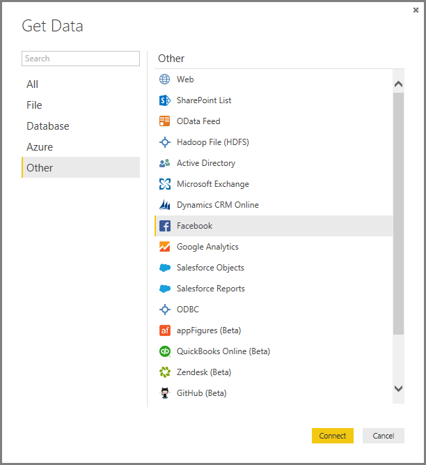
   
   A dialog appears to alert you to the risks of using a third-party service.
   
   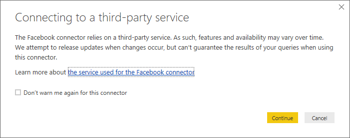
   
3. Select **Continue**. 

   The **Facebook** dialog box appears.
   
4. Enter the page name **microsoftbi** into the **Username** text box, select **Posts** from the **Connection** dropdown, and then select **OK**.
   
   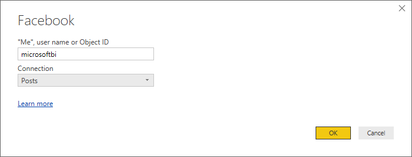
   
5. When prompted for credentials, sign in to your Facebook account, and allow Power BI access through your account.
   
   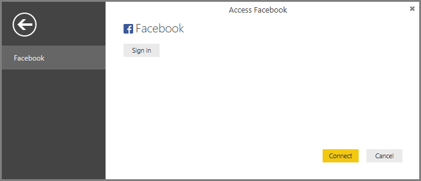

   After connecting to the Power BI Facebook page, you see a preview of the page's **Posts** data. 
   
   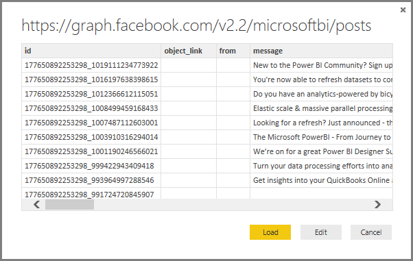
   
## Shape and transform the imported data

You want to see and show which posts have the most comments over time, but you notice in the **Posts** data preview that the **created_time** data is hard to read and understand, and there's a lack of comments data. You need to perform some shaping and cleansing of the data to pull the most out of it. Use the Power BI Desktop Power Query Editor to edit the data, before or after importing it into Power BI Desktop. 

### Split the date/time column

First, separate the date and time values in the **created_time** column to be more readable. 

1. In the Facebook data preview, select **Edit**. 
   
   
   
   The Power BI Desktop **Power Query Editor** opens in a new window and displays the data preview from the Power BI Facebook page. 
   
   
   
2. Select the **created_time** column. Note that it's currently a Text data type, denoted by an **ABC** icon in the column header. Right-click the header and select **Split Column** > By **Delimiter** in the drop-down list. Or, select **Split Column** > **By Delimiter** under the **Transform** group in the **Home** tab of the ribbon.  
   
   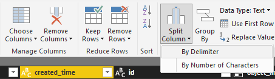
   
3. In the **Split Column by Delimiter** dialog box, select **Custom** from the dropdown, enter **T** (the character that starts the time part of the **created_time** values) in the input field, and then select **OK**. 
   
   
   
   The column splits into two columns that contain the strings before and after the *T* delimiter and are named **created_time.1** and **created_time.2**, respectively. Power BI has automatically detected and changed the data types to **Date** for the first column and **Time** for the second column, and formatted the date and time values to be more readable.
   
4. Rename the two columns. Select the first column, **created_time.1**, and then select **Rename** in the **Any Column** group of the **Transform** tab in the ribbon. Alternatively, double-click the column header. Enter the new column header, **created_date**. Repeat for the second column, **created_time.2**, and rename it **created_time**.
   
   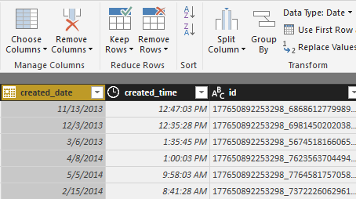
   
### Expand the nested column

Now that the date and time data are the way you want them, you can expose comments data by expanding a nested column. 

1. Select the  icon at the top of the **object_link** column to open the **Expand/Aggregate** dialog. Select **connections**, and then select **OK**. 
   
   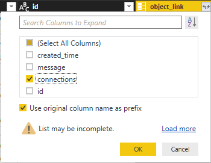
   
   The column heading changes to **object_link.connections**.
2. Select the  icon at the top of the **object_link.connections** column, select **comments**, and then select **OK**. The column heading changes to **object_link.connections.comments**.
   
3. Select the  icon at the top of the **object_link.connections.comments** column, and this time select **Aggregate** instead of **Expand** in the dialog box. Select **# Count of id**, and then select **OK**. 
   
   
   
   The column now displays the number of comments for each message. 
   
4. Rename the **Count of object_link.connections.comments.id** column to **Number of comments**.
   
5. Select the down arrow next to the **Number of comments** header and select **Sort Descending** to see the posts sorted from most to fewest comments. 
   
   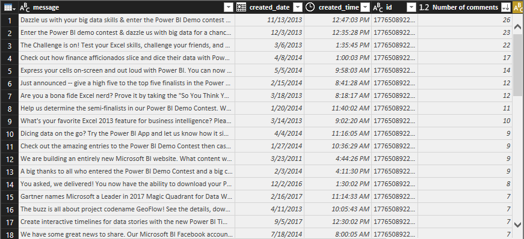
   
### Review query steps

As you shape and transform data in the Power Query Editor, each step is recorded in the **Applied Steps** area of the **Query Settings** pane at the right side of the **Power Query Editor** window. You can step back through the **Applied Steps** to see exactly what changes you made, and edit, delete, or rearrange them if necessary. Use caution when modifying these steps, because changing preceding steps can break later steps. 

After applying the data transformations so far, your **Applied Steps** should appear as follows:
   
   
   
   >[!TIP]
   >Underlying the **Applied Steps** are formulas written in the Power Query Language, also known as the M language. To see and edit the formulas, select **Advanced Editor** in the **Query** group of the **Home** tab of the ribbon. 

### Import the transformed data

When you're satisfied with the data, select **Close & Apply** > **Close & Apply** in the **Home** tab of the ribbon to import it into Power BI Desktop. 
   
   
   
   A dialog displays the progress of loading the data into the Power BI Desktop data model. 
   
   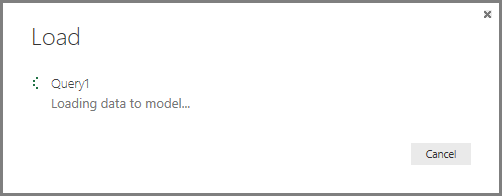
   
   Once the data is loaded, it appears in the **Report** view as a new query in the **Fields** pane.
   
   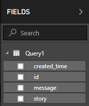
   
## Use the data in report visualizations 

Now that you have imported data from the Facebook page, you can quickly and easily gain insights about your data by using visualizations. Creating a visualization is easy; just select a field or drag it from the **Fields** pane onto the report canvas.

### Create a bar chart

1. In Power BI Desktop **Report** view, select **message** from the **Fields** pane, or drag it onto the canvas. A table showing all post messages appears on the canvas. 
   
   
   
2. With that table selected, also select **Number of comments** from the **Fields** pane, or drag it into the table. 
   
3. Select the **Stacked bar chart** icon in the **Visualizations** pane. The table changes to a bar chart showing the number of comments per post. 
   
   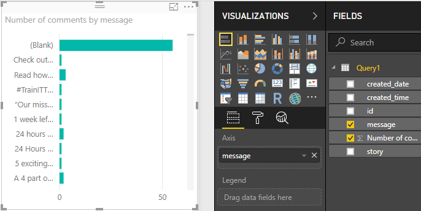
   
4. Select **More options** (...) next to the visualization, and then select **Sort by Number of comments** to sort the table by descending number of comments. 
   
   
   
5. Note that the most comments were associated with **Blank** messages (these posts may have been stories, links, videos, or other non-text content). To filter out the **Blank** row, select **message (all)** from the **Filters** pane, select **Select All**, and then select **Blank** to deselect it. 

   The **Filters** entry changes to **message is not (Blank)**, and the **Blank** row disappears from the chart visualization.
   
   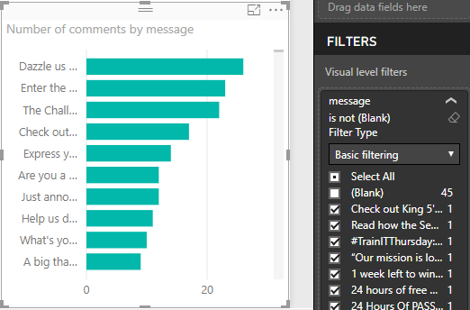
   
### Format the chart

The visualization is getting more interesting, but you can't see much of the post text in the chart. To show more of the post text:

1. Using the handles on the chart visualization, resize the chart to be as large as possible. 
   
2. With the chart selected, select the **Format** icon (paint roller) in the **Visualizations** pane.
   
3. Select the down arrow next to **Y axis**, and drag the slider next to **Maximum size** all the way to the right (**50%**). 
4. Reduce the **Text size** to **10** to fit more text.
   
   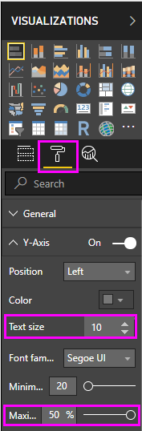
   
   The chart now shows more of the post content. 
   
   
   
The X axis (number of comments) of the chart does not show exact values, and looks lost at the bottom of the chart. You decide to use data labels instead. 

1. Select the Format icon, and then select the slider next to **X axis** to turn it **Off**. 
   
2. Select the slider next to **Data labels** to turn them **On**. 

   Now the chart shows the exact number of comments for each post.
   
   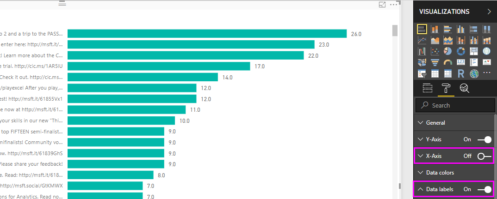
   
### Edit the data type

That's better, but the data labels all have a **.0** decimal place, which is distracting and misleading, because **Number of posts** must be a whole number. You need to change the data type of the **Number of posts** column to **Whole Number**.

To edit the data type:
1. Right-click **Query1** in the **Fields** pane, or hover over it and select **More options** (...), and then select **Edit Query**. You can also select **Edit Queries** > **Edit Queries** from the **External data** group of the **Home** tab in the ribbon. 
   
        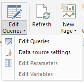

   The Power BI Desktop Power Query Editor opens in a separate window.
   
2. In the Power Query Editor, select the **Number of comments** column, and change the data type by following one of these steps: 
   - Select the **1.2** icon next to the **Number of comments** column header, and select **Whole number** from the drop-down list
   - Right-click the column header and select **Change type** > **Whole Number**.
   - Select **Data type: Decimal Number** in the **Transform** group of the **Home** tab, or the **Any Column** group of the **Transform** tab, and select **Whole Number** from the drop-down list.
   
   The icon in the column header changes to **123**, denoting a **Whole Number** data type.
   
   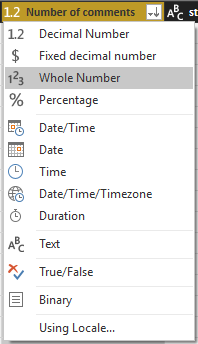
   
3. To apply the changes, select **File** > **Close & Apply**, or **File** > **Apply** to keep the **Power Query Editor** window open. After the changes load, the data labels on the chart become whole numbers. 
   
   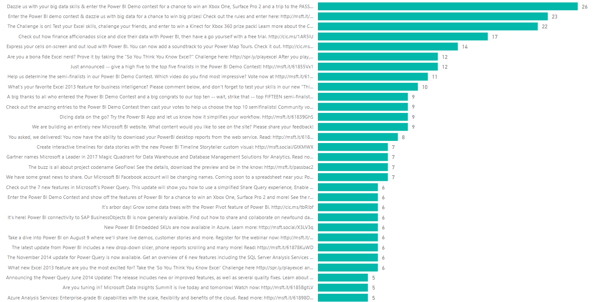
   
### Create a date slicer

Suppose you want to visualize the number of comments on posts over time. You can create a slicer visualization to filter the chart data to different time frames. 

1. Select a blank area of the canvas, and then select the **Slicer** icon in the **Visualizations** pane. 

   A blank slicer visualization appears.
   
   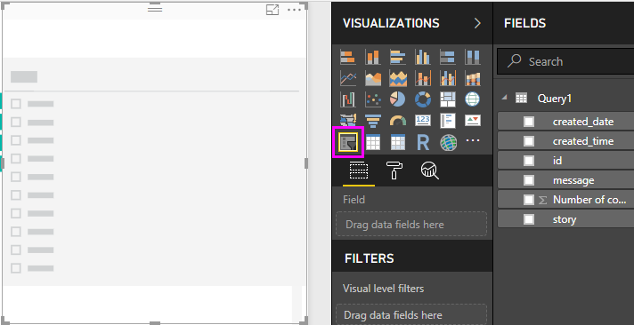
   
2. Select the **created_date** field from the **Fields** pane, or drag it into the new slicer. 

   The slicer changes to a date range slider, based on the field's Date data type.
   
   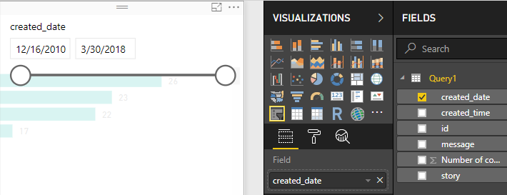
   
3. Move the slider handles to select different date ranges, and note how the chart data filters accordingly. You can also select the date fields in the slicer and type in specific dates, or choose them from a calendar popup.
    
   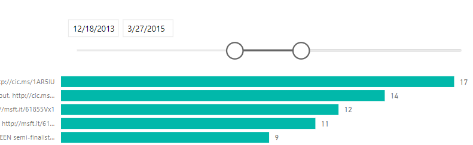
   
### Format the visualizations

You can give the chart a more descriptive and attractive title. 

1. With the chart selected, select the **Format** icon in the **Visualizations** pane, and then select the drop-down arrow next to **Title** to expand it.
2. Change the **Title text** to **Comments per post**. 
3. Select the drop-down arrow next to **Font color**, and select a green color to match the green bars of the visualization.
4. Increase the **Text size** to **10**, and change the **Font family** to **Segoe (Bold)**.

   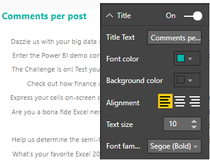

5. Experiment with other formatting options and settings to change the appearance of your visualizations. 

   

## Create more visualizations

As you can see, it's easy to customize visualizations in your report to present the data in ways that you want. For example, try using the imported Facebook data to create this line chart showing number of comments over time.

Power BI Desktop provides a seamless end-to-end experience, from getting data from a wide range of data sources and shaping it to meet your analysis needs, to visualizing this data in rich and interactive ways. When your report is ready, you can [upload it to the Power BI service](desktop-upload-desktop-files.md) and create dashboards based on it, which you can share with other Power BI users.

## Next steps
* [Read other Power BI Desktop tutorials](https://go.microsoft.com/fwlink/?LinkID=521937)
* [Watch Power BI Desktop videos](https://go.microsoft.com/fwlink/?LinkID=519322)
* [Visit the Power BI Forum](https://go.microsoft.com/fwlink/?LinkID=519326)
* [Read the Power BI Blog](https://go.microsoft.com/fwlink/?LinkID=519327)

