# Tutorial: Analyze web page data using Power BI Desktop

As a long-time soccer fan, you want to report on the UEFA European Championship (Euro Cup) winners over the years. With Power BI Desktop, you can import this data from a web page into a report and create visualizations that show the data. In this tutorial, you learn how to use Power BI Desktop to:

- Connect to a web data source and navigate across its available tables,
- Shape and transform data in the **Power Query Editor**,
- Name a query and import it into a Power BI Desktop report, and 
- Create and customize a map and a pie chart visualization.

## Connect to a web data source

You can get the UEFA winners data from the Results table on the UEFA European Football Championship Wikipedia page at http://en.wikipedia.org/wiki/UEFA_European_Football_Championship. 

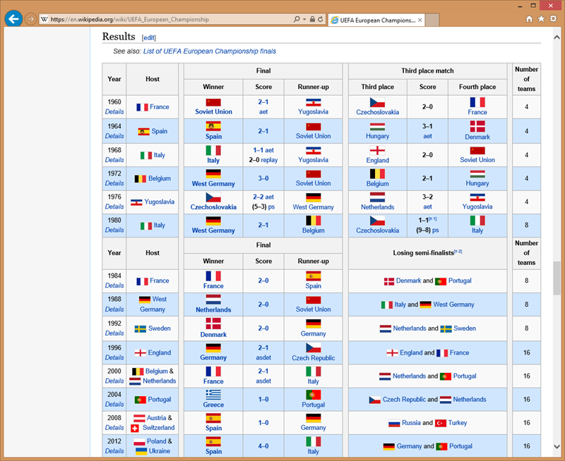

Note that Web connections are only established using basic authentication. Web sites requiring authentication may not work properly with the Web connector.

To import the data:

1. In the Power BI Desktop **Home** ribbon tab, drop down the arrow next to **Get Data**, and then select **Web**.
   
    
   
   >[!NOTE]
   >You can also select the **Get Data** item itself, or select **Get Data** from the Power BI **Get started** dialog, then select **Web** from the **All** or **Other** section of the **Get Data** dialog box, and then select **Connect**.
   
2. In the **From Web** dialog box, paste the URL `http://en.wikipedia.org/wiki/UEFA_European_Football_Championship` into the **URL** text box, and then select **OK**.
   
    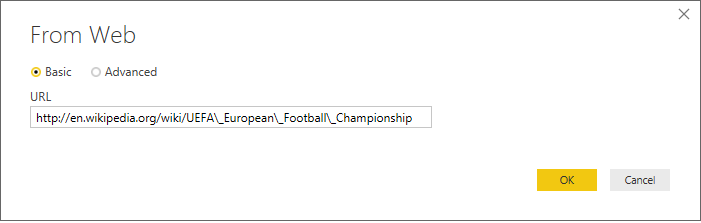
   
   After connecting to the Wikipedia web page, the Power BI **Navigator** dialog box shows a list of available tables on the page. You can select any of the table names to preview its data. The **Results[edit]** table has the data you want, although it is not exactly in the shape you want. You will reshape and clean up the data before loading it into your report. 
   
   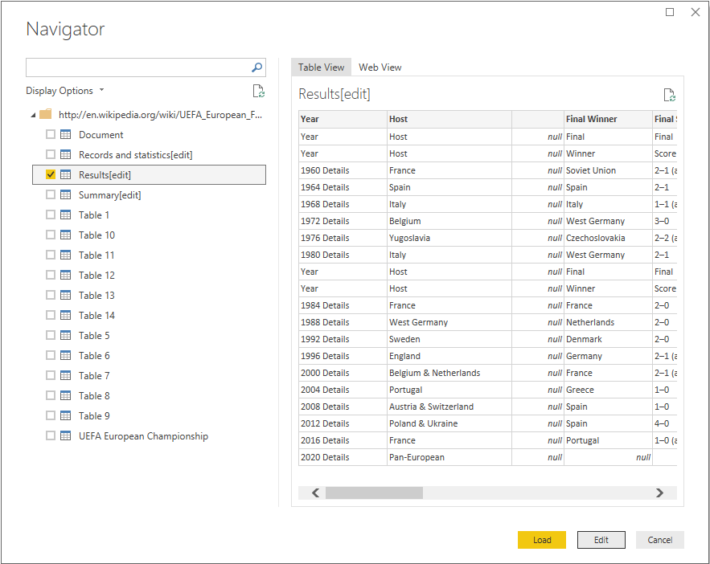
   
   >[!NOTE]
   >The **Preview** pane shows the most recent table selected, but all selected tables will load into the **Power Query Editor** when you select **Edit** or **Load**. 
   
3. Select the **Results[edit]** table in the **Navigator** list, and then select **Edit**. 
   
   A preview of the table opens in the **Power Query Editor**, where you can apply transformations to clean up the data. 
   
   
   
## Shape data in Power Query Editor

You want to make the data easier to scan by displaying only the years and the countries that won. You can use the **Power Query Editor** to perform these data shaping and cleansing steps.

First, remove all the columns except **Year** and **Final Winners** from the table.

1. In the **Power Query Editor** grid, select the **Year** and **Final Winners** columns (hold down the **Ctrl** key to select multiple items).
   
2. Right-click and select **Remove Other Columns** from the dropdown, or select **Remove Columns** > **Remove Other Columns** from the **Manage Columns** group in the **Home** ribbon tab, to remove all other columns from the table. 
   
   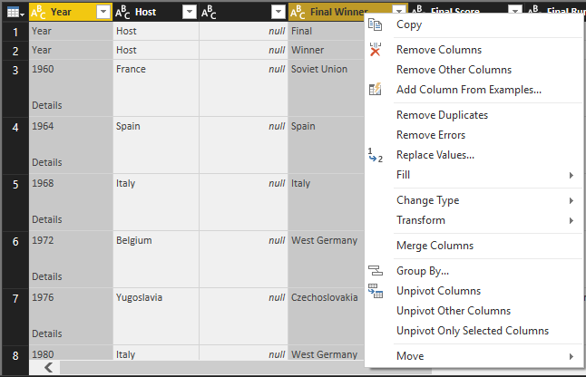 or 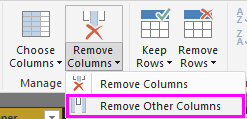

Next, remove the extra word **Details** from the **Year** column cells.

1. Select the **Year** column.
   
2. Right-click, and select **Replace Values** from the dropdown, or select **Replace Values** from the **Transform** group in the **Home** tab of the ribbon (also found in the **Any Column** group in the **Transform** tab). 
   
   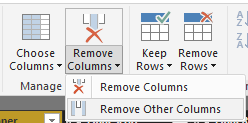 or 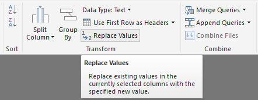
   
3. In the **Replace Values** dialog box, type **Details** in the **Value To Find** text box, leave the **Replace With** text box empty, and then select **OK** to delete the word "Details" from the **Year** entries.
   
   

Some **Year** cells only contain the word "Year" rather than year values. You can filter the **Year** column to only display rows that do not contain the word "Year". 

1. Select the filter drop-down arrow on the **Year** column.
   
2. In the drop-down, scroll down and clear the checkbox next to the **Year** option, and then select **OK**, to remove the rows that only have the word "Year" in the **Year** column. 

   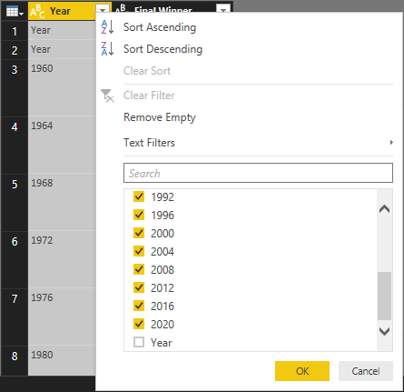

Now that you have cleaned up the data in the **Year** column, you can work on the **Final Winner** column. Since you are only looking at the final winners data now, you can rename this column to **Country**. To rename the column:

1. Double-click or tap and hold in the **Final Winner** column header, or 
   - Right-click the **Final Winners** column header, and select **Rename** from the dropdown, or 
   - Select the **Final Winners** column and select **Rename** from the **Any Column** group in the **Transform** tab of the ribbon. 
   
   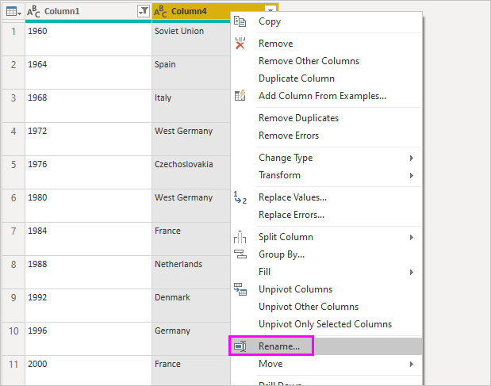 or 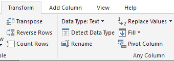
   
2. Type **Country** in the header and press **Enter** to rename the column.

You also want to filter out rows like "2020" that have null values in the **Country** column. You could use the filter menu as you did with the **Year** values, or you can:

1. Right-click on the **Country** cell in the **2020** row, which has the value *null*. 
2. Select **Text Filters** > **Does not Equal** in the context menu to remove any rows that contain that cell's value.
   
   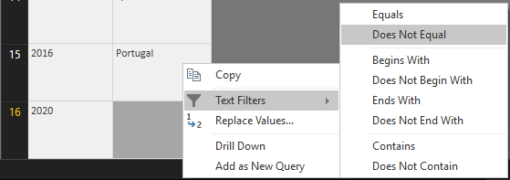
   
## Import the query into Report View

Now that you've shaped the data the way you want, you're ready to name your query "Euro Cup Winners" and import it into your report.

1. In the **Query Settings** pane, in the **Name** text box, type **Euro Cup Winners**, and then press **Enter**.
   
   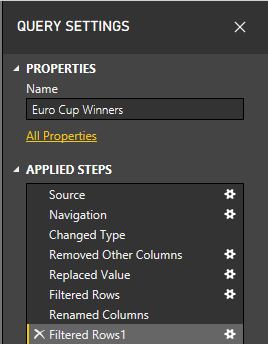

2. Select **Close & Apply** > **Close & Apply** from the **Home** tab of the ribbon.
   
   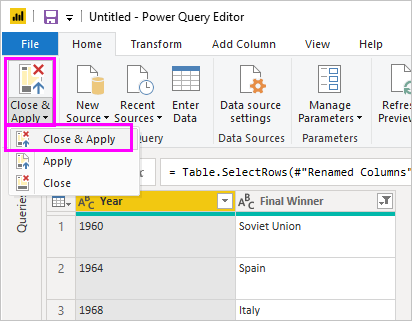
   
The query loads into the Power BI Desktop **Report View**, where you can see it in the **Fields** pane. 
   
   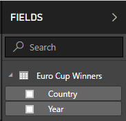
>[!TIP]
>You can always get back to the **Power Query Editor** to edit and refine your query by:
>- Selecting the **More options** ellipsis (**...**) next to **Euro Cup Winners** in the **Fields** pane, and selecting **Edit Query** from the dropdown, or
>- Selecting **Edit Queries** > **Edit Queries** in the **External data** group of the **Home** ribbon tab in Report view. 

## Create a visualization

To create a visualization based on your data: 

1. Select the **Country** field in the **Fields** pane, or drag it to the report canvas. Power BI Desktop recognizes the data as country names, and automatically creates a **Map** visualization. 
   
   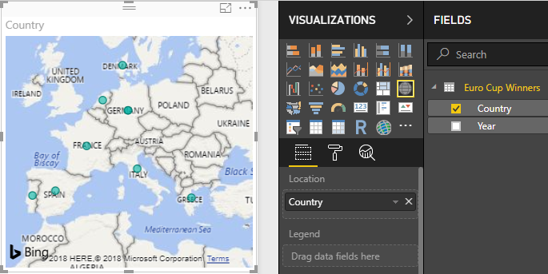
   
2. Enlarge the map by dragging the handles in the corners so all the winning country names are visible.  

   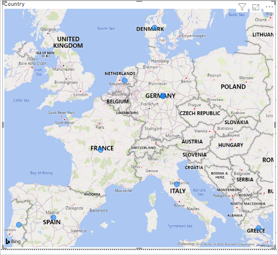
   
3. The map shows identical data points for every country that won a Euro Cup tournament. To make the size of each data point reflect how often the country has won, drag the **Year** field to **Drag data fields here** under **Size** in the lower part of the **Visualizations** pane. The field automatically changes to a **Count of Year** measure, and the map visualization now shows larger data points for countries that have won more tournaments. 
   
   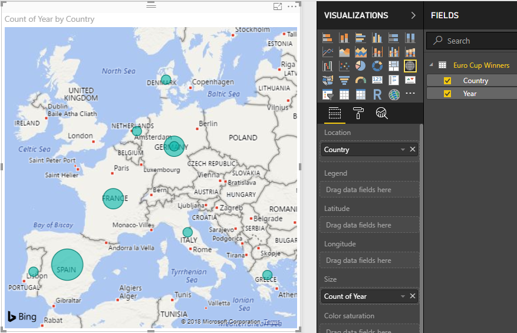
   

## Customize the visualization

As you can see, it is very easy to create visualizations based on your data. It's also easy to customize your visualizations to better present the data in ways that you want. 

### Format the map
You can change the appearance of a visualization by selecting it and then selecting the **Format** (paint roller) icon in the **Visualizations** pane. For example, the "Germany" data point(s) in your visualization could be misleading, because West Germany won two tournaments and Germany won one, and the map superimposes the two points rather than separating or adding them together. You can color these two points differently to highlight this. You can also give the map a more descriptive and attractive title. 

1. With the visualization selected, select the **Format** icon, and then select **Data colors** to expand the data color options. 
   
   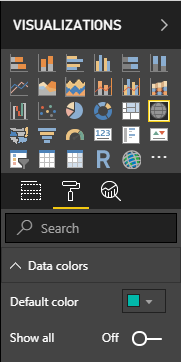
   
2. Turn **Show All** to **On**, and then select the dropdown next to **West Germany** and choose a yellow color. 
   
   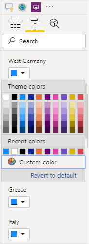
   
3. Select **Title** to expand the title options, and in the **Title text** field, type **Euro Cup Winners** in place of the current title. 
4. Change **Font color** to red, **Text size** to **12**, and **Font family** to **Segoe (Bold)**. 
   
   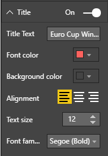
   

Your map visualization now looks like this:

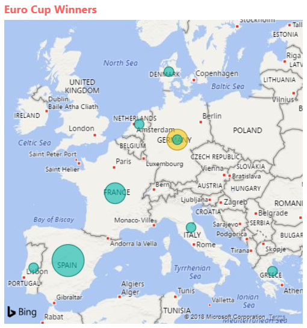
   
### Change the visualization type
You can change the type of a visualization by selecting it and then selecting a different icon at the top of the **Visualization** pane. For example, your map visualization is missing the data for the Soviet Union and Czechoslovakia, because those countries no longer exist on the world map. Another type of visualization like a treemap or pie chart may be more accurate, because it shows all the values. 

To change the map to a pie chart, select the map and then select the **Pie chart** icon in the **Visualization** pane. 
   
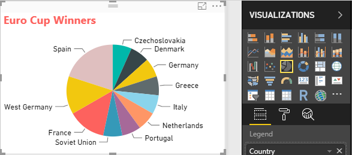

>[!TIP]
>- You can use the **Data colors** formatting options to make "Germany" and "West Germany" the same color. 
>- To group the countries with the most wins together on the pie chart, select the ellipsis (**...**) at the upper right of the visualization, and then select **Sort by Count of Year** from the dropdown. 

Power BI Desktop provides a seamless end-to-end experience, from getting data from a wide range of data sources and shaping it to meet your analysis needs, to visualizing this data in rich and interactive ways. Once your report is ready, you can [upload it to Power BI](desktop-upload-desktop-files.md) and create dashboards based on it, which you can share with other Power BI users.

## See also
* [Read other Power BI Desktop tutorials](http://go.microsoft.com/fwlink/?LinkID=521937)
* [Watch Power BI Desktop videos](http://go.microsoft.com/fwlink/?LinkID=519322)
* [Visit the Power BI Forum](http://go.microsoft.com/fwlink/?LinkID=519326)
* [Read the Power BI Blog](http://go.microsoft.com/fwlink/?LinkID=519327)

