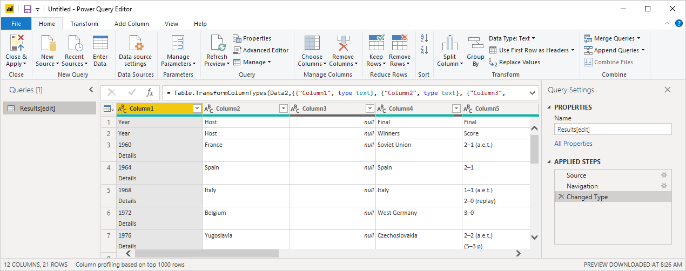

# Analyzing web page data using Power BI Desktop (tutorial)

As a long-time soccer fan, you want to report on the UEFA European Championship (Euro Cup) winners over the years. With Power BI Desktop, you can import a table from a web page into a report and create a visualization showing this data. This tutorial teaches you how to connect to a web data source and navigate across its available tables, shape and transform data in the **Power Query Editor**, import the data into your report, and create and edit a Map visualization in Power BI Desktop.

## Connect to a web data source

You can import the UEFA winners data from the Results table on the UEFA European Football Championship Wikipedia page at http://en.wikipedia.org/wiki/UEFA_European_Football_Championship. 



1. In the Power BI Desktop **Getting Started** dialog, or in the **Home** ribbon tab, select **Get Data**.
2. In the **Get Data** **All** (or **Other**) dialog box, select **Web** and then select **Connect**, or in the dropdown from the **Get Data** ribbon item, select **Web**. 
3. In the **From Web** dialog box, paste the URL **http://en.wikipedia.org/wiki/UEFA_European_Football_Championship** into the **URL** text box, and then select **OK**.
   
   After connecting to the Wikipedia web page, the Power BI **Navigator** dialog box shows a list of available tables on the page. You can select any of these tables to preview its data. The **Preview** pane shows the most recent table selected, but every table selected will load into the **Power Query Editor** when you select **Edit** or **Load**. 
   
   
   
4. The **Results[edit]** table has the data you want, but it is not exactly in the shape you want. You want to reshape and clean up the data before loading it into your report. Select the **Results[edit]** table in the **Navigator** list, and then select **Edit**. 
   
A preview of the table opens in the **Power Query Editor**, where you can apply transformations to clean up the data. 
   

   
## Shape data in the table

You want to make the data easier to scan by displaying only the years and winners, and renaming the columns. You can use the **Power Query Editor** to perform these data shaping and cleansing steps.

First, remove all the columns except **Year** and **Final Winners** from the table.

1. In the **Power Query Editor** grid, select the **Year** and **Final Winners** columns (use **Ctrl** + **Click**).
2. Right-click, and select **Remove Other Columns** from the dropdown, or select **Remove Columns** > **Remove Columns** from the **Manage Columns** group in the **Home** ribbon tab. 

   

   All the columns except **Year** and **Final Winner** are removed.

Next, remove the extra word **Details** from the **Year** column cells.

1. Select the **Year** column.
2. Right-click, and select **Replace Values** from the dropdown, or select **Replace Values** from the **Any Column** group in the **Transform** tab of the ribbon. 
3. In the **Replace Values** dialog box, type **Details** in the **Value To Find** text box, leave the **Replace With** text box empty, and then select **OK**. The word "Details" is deleted from the **Year** entries.

   

Some **Year** cells only contain the word "Year" rather than year values. You can filter the **Year** column to only display rows that do not contain the word "Year". 

1. Select the filter drop-down arrow on the **Year** column.
2. In the drop-down, scroll down and clear the checkbox next to the **Year** option, and then select *OK**. Rows that only had "Year" in the Year column are removed. 

   

Now that you have cleaned up the data in the **Year** column, you can work on the **Final Winner** column.

Since we are only looking at the final winners, we can rename this column to **Country**.

1. Select the **Final Winner** column in the Query preview.
2. Right-click, and select **Rename** from the dropdown, or select **Rename** from the **Any Column** group in the **Transform** tab of the ribbon. 

You also want to filter out null values (like 2020) in the **Country** column. You could use the filter menu as you did with the **Year** values, or you can:

1. Right-click on the **Country** cell in the **2020** row, which contains a null value.
2. Select **Text Filters** > **Does not Equal** in the context menu.
3. This creates a new filter that removes rows like *2020* that have *null* in the **Country** column.

Now you are ready to name your final query **Euro Cup Winners** and import the data into your report.

1. In the **Query Settings** pane, in the **Name** text box, replace the current value with **Euro Cup Winners**, and press **Enter**.
   
   

2. Select **Close & Apply** > *Close & Apply** from the **Home** tab of the ribbon.

The query data loads into the Power BI Desktop **Report View**, where you can see it in the **Fields** pane. 

will trigger evaluation of the query and load of the table output to the Report. In Power BI Desktop, select the **Report** icon to see Power BI Desktop in Report view.

You can see the resulting table fields in the **Fields pane** at the right of the **Report view**.

## Create a visualization

To create a visual based on your data, select the **Country** field in the **Fields** pane, or drag it to the report canvas. Power BI recognizes that the data is country names, and automatically creates a **Map** visualization. 
   
   

You can experiment with different types of visualizations by selecting them in the **Visualizations** pane, but most of them aren't relevant for the table , 
2. We can easily change the type of visualization by clicking on a different icon in the **Visualization** pane.
   
   
3. We are going to stay with the **Map** visualization type to Map, We can also resize the visualization by dragging from one of the corners of the visualization up to the desired size.
   
   
4. Note that currently all the points in the map have the same size. We want to change this so that countries with more Euro Cup tournaments won are represented with a larger point in the map. In order to do this, we can drag the **Year** field in the **Fields list** to the **Values** box in the lower half of the **Fields pane**.
   
   

As you can see, it is very easy to customize visualizations in your report, in order to present the data in the way that you want. Power BI Desktop provides a seamless end-to-end experience from getting data from a wide range of data sources and shaping it to meet your analysis needs to visualizing this data in rich and interactive ways. Once your report is ready, you can [upload it to Power BI](desktop-upload-desktop-files.md) and create dashboards based on it, which you can share with other Power BI users.

This concludes the **Importing Data from the Web** tutorial. You can download the completed Power BI Desktop file [here](http://download.microsoft.com/download/1/4/E/14EDED28-6C58-4055-A65C-23B4DA81C4DE/Analyzing_Data_From_The_Web.pbix).

## Where else can I get more information?
* [Read other Power BI Desktop tutorials](http://go.microsoft.com/fwlink/?LinkID=521937)
* [Watch Power BI Desktop videos](http://go.microsoft.com/fwlink/?LinkID=519322)
* [Visit the Power BI Forum](http://go.microsoft.com/fwlink/?LinkID=519326)
* [Read the Power BI Blog](http://go.microsoft.com/fwlink/?LinkID=519327)

