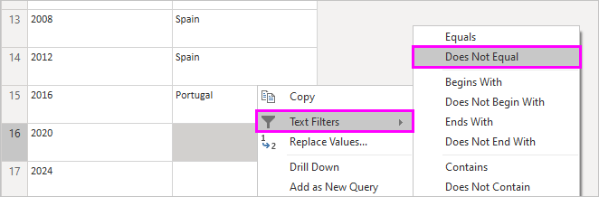
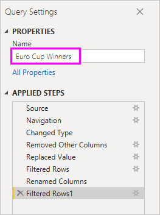

# Analyzing web page data using Power BI Desktop (tutorial)

As a long-time soccer fan, you want to know about UEFA European Championship (Euro Cup) winners over the years. You can use Power BI Desktop to import a table from a web page into a report and create a map visualization showing this data. In this tutorial, you learn how to use Power BI Desktop to:
- Connect to a web data source and navigate across its available tables
- Shape and transform the data in the **Power Query Editor** and import it into a report, and 
- Create and edit a Map visualization in Power BI Desktop.

## Connect to a web data source

You can import the UEFA winners data from the Results table on the UEFA European Football Championship Wikipedia page at http://en.wikipedia.org/wiki/UEFA_European_Football_Championship. 



1. In the Power BI Desktop **Getting Started** dialog, or in the **Home** ribbon tab, select **Get Data**.
   
2. In the dropdown from the **Get Data** ribbon item, select **Web**, or in the **Get Data** **All** (or **Other**) dialog box, select **Web** and then select **Connect**. 
   
    &nbsp; 
   
3. In the **From Web** dialog box, paste the URL **http://en.wikipedia.org/wiki/UEFA_European_Football_Championship** into the **URL** text box, and then select **OK**.
   
    
   
  After connecting to the Wikipedia web page, the Power BI **Navigator** dialog box shows a list of available tables on the page. You can select any of these tables to preview its data. The **Preview** pane shows the most recent table selected, but every table selected will load into the **Power Query Editor** when you select **Edit** or **Load**. 
   
   
   
4. The **Results[edit]** table has the data you want, but it is not exactly in the shape you want. You can reshape and clean up the data before loading it into your report. Select the **Results[edit]** table in the **Navigator** list, and then select **Edit**. 
   
   A preview of the table opens in the **Power Query Editor**, where you can apply transformations to clean up the data. 
   
   
   
## Shape data in the table

You want to make the data easier to scan by displaying only the years and winners, and renaming the columns. You can use the **Power Query Editor** to perform these data shaping and cleansing steps.

First, remove all the columns except **Year** and **Final Winners** from the table.

1. In the **Power Query Editor** grid, select the **Year** and **Final Winners** columns (use **Ctrl** + **Click**).
   
2. Right-click, and select **Remove Other Columns** from the dropdown, or select **Remove Columns** > **Remove Columns** from the **Manage Columns** group in the **Home** ribbon tab, to remove all the columns except **Year** and **Final Winner** from the table. 
   
    &nbsp; 

Next, remove the extra word **Details** from the **Year** column cells.

1. Select the **Year** column.
   
2. Right-click, and select **Replace Values** from the dropdown, or select **Replace Values** from the **Any Column** group in the **Transform** tab of the ribbon. 
   
    &nbsp; 
   
3. In the **Replace Values** dialog box, type **Details** in the **Value To Find** text box, leave the **Replace With** text box empty, and then select **OK** to delete the word "Details" from the **Year** entries.
   
   

Some **Year** cells only contain the word "Year" rather than year values. You can filter the **Year** column to only display rows that do not contain the word "Year". 

1. Select the filter drop-down arrow on the **Year** column.
   
2. In the drop-down, scroll down and clear the checkbox next to the **Year** option, and then select *OK** to remove the rows that only had "Year" in the **Year** column. 

   

Now that you have cleaned up the data in the **Year** column, you can work on the **Final Winner** column.

Since you are only looking at final winners, you can rename this column to **Country**.

1. Select the **Final Winner** column in the Query preview.
   
2. Right-click, and select **Rename** from the dropdown, or select **Rename** from the **Any Column** group in the **Transform** tab of the ribbon. 
   
    &nbsp; 
   
3. Type **Country** in the header and press **Enter** to rename the column.

You also want to filter out null values (like 2020) in the **Country** column. You could use the filter menu as you did with the **Year** values, or you can:

1. Right-click on the **Country** cell in the **2020** row, which contains a null value.
2. Select **Text Filters** > **Does not Equal** in the context menu to remove rows like "2020" that had *null* in the **Country** column.
   
   
   
Now you're ready to name your query **Euro Cup Winners** and import the data into your report.

1. In the **Query Settings** pane, in the **Name** text box, type **Euro Cup Winners**, and press **Enter**.
   
   

2. Select **Close & Apply** > *Close & Apply** from the **Home** tab of the ribbon.
   
   
   
The query data loads into the Power BI Desktop **Report View**, where you can see it in the **Fields** pane. 
   
   

## Create a visualization

To create a visual based on your data, select the **Country** field in the **Fields** pane, or drag it to the report canvas. Power BI recognizes that the data is country names, and automatically creates a **Map** visualization. 

   
The map now shows equal-sized data points for all countries that won a Euro Cup tournament. You want the size of the data points to reflect how often the countries have won. 

1. Drag the **Year** field in the **Fields** list to the **Size** field in the lower part of the **Visualizations** pane, where it automatically changes to a **Count of Year** measure. Your map visualization now shows larger data points for countries that won more tournaments. 
   
2. Drag the corners of the visualization to enlarge it so all the country names are visible. 
   
   

As you can see, it is very easy to create and customize visualizations in your reports to present data in ways that you want. 

- You can change the appearance of your map visualization by selecting it and then selecting the **Format** icon in the **Visualizations** pane. For example, the size of the "Germany" data point is misleading because West Germany won two tournaments and unified Germany has won one, and the two data points are superimposed. Coloring the two data points differently could help point this out. You can also use the **Title** field to give the visualization a better title than "Count of Year by Country". 

- You can change the type of visualization by selecting it and then selecting one of the other icons at the top of the **Visualization** pane. Your map visualization is missing the data for the Soviet Union and Czechoslovakia, because those countries no longer exist. Another type of visualization like a pie chart or treemap might give a more accurate rendering of the data because it lists all values.  
   
   

Power BI Desktop provides a seamless end-to-end experience, from getting data from a wide range of data sources and shaping it to meet your analysis needs, to visualizing this data in rich and interactive ways. Once your report is ready, you can [upload it to Power BI](desktop-upload-desktop-files.md) and create dashboards based on it, which you can share with other Power BI users.

## See also
* [Read other Power BI Desktop tutorials](http://go.microsoft.com/fwlink/?LinkID=521937)
* [Watch Power BI Desktop videos](http://go.microsoft.com/fwlink/?LinkID=519322)
* [Visit the Power BI Forum](http://go.microsoft.com/fwlink/?LinkID=519326)
* [Read the Power BI Blog](http://go.microsoft.com/fwlink/?LinkID=519327)

