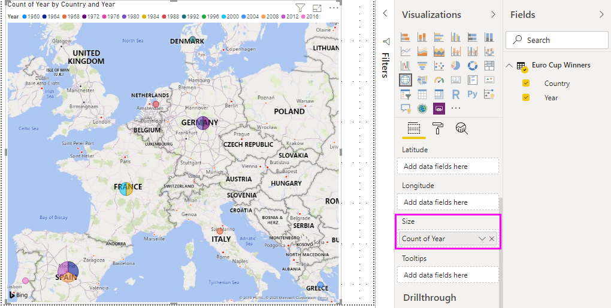

# Analyzing Web page data using Power BI Desktop (tutorial)
In this tutorial, you learn how to import a table of data from a Web page and create a report to visualize this data. As part of this process, you navigate across tables available on a web page, and apply data transformation steps to bring the table into a new shape.

 In this article:

* **Task 1:** Connect to a web data source
* **Task 2:** Shape data in the Query view
  * Step 1: Remove Other Columns to only display columns of interest
  * Step 2: Replace Values to clean up values in a selected column
  * Step 3: Filter values in a column
  * Step 4: Rename a column
  * Step 5: Filter null values in a column
  * Step 6: Rename a query
  * Query Steps created
* **Task 3:** Create visualizations using the Report view
  * Step 1: Load the query to your report
  * Step 2: Create a Map visualization

## Task 1: Connect to a web data source
 In task 1, you import a Tournament Summary table from the UEFA European Football Championship Wikipedia page at the following location: http://en.wikipedia.org/wiki/UEFA\_European\_Football\_Championship



### Add a Wikipedia page data source
1. In the **Getting Started dialog** or in the **Home** ribbon tab, select **Get Data**.
2. This brings up the **Get Data** dialog, where you can pick from a wide range of data sources to import data into Power BI Desktop. We will select **Web** which is available under the **All** or **Other** group.
3. In the **Web Content** dialog box, in the **URL** text box, paste the Wikipedia URL (http://en.wikipedia.org/wiki/UEFA\_European\_Football\_Championship).
4. Click **OK**.

After establishing a connection to the web page, you see a list of tables available on this Wikipedia page in the **Navigator** dialog. You can single-click on each of these tables to preview the data.

In the **Navigator** left-pane, select the **Results[edit]** table for the Tournament Summary results, or select the **Results[edit]** table and select **Edit**. This will allow us to reshape this table before loading it to the Report, since the data is not in the shape that we need for our analysis.

This will land a preview of the table in the Query view, where we can apply a set of transformation steps to clean up the data.

## Task 2: Shape data in the subject table
Now that you have the subject table selected for your data query, you learn how to perform various data shaping and cleansing steps.

**Step 1:** Remove Other Columns to only display columns of interest

In this step, you remove all columns except **Year** and **Final Winners**.

1. In the **Query Preview** grid, select the **Year** and **Final Winners** columns (use **CTRL** + **Click**).
2. Right-click a column header in the **Query Preview** grid, and click **Remove Other Columns** to remove the unselected columns. Note that this operation is also available in the **Home** ribbon tab, in the **Manage Columns** group.

**Step 2:** Replace Values to clean up values in a selected column

In this step, you replace the Details suffix in the **Year** column. Note that this suffix is on a new line so it is not visible in the table preview. However, if you click in one of the cells with a numeric value in the Year column, you will see the full value in the detailed view.

1. Select the **Year** column.
2. In the **Query view** ribbon, click **Replace Values** under the **Home** tab or right-click the **Year** column, and click **Replace Values** to replace Details with empty text.
3. In the **Replace Values** dialog box, type Details in the **Value to Find** text box and leave the **Replace With** text box empty.
4. Click **OK**.

 **Step 3:** Filter values in a column

In this step, you filter the **Year** column to display rows that do not contain “Year”.

1. Click the filter drop down arrow on the **Year** column.
2. In the **Filter** drop-down, clear the **Year** option.
3. Click **OK**.

**Step 4:** Rename a column

Now that we have cleaned up the data in the **Year** column, we are going to work on the **Final Winner** column.

Since we are only looking at the list of winners, we can rename this column to **Country**.

1. Select the **Final Winner** column in the Query preview.
2. In the **Query view** ribbon, under the **Transform** tab and **Any Column** group, you will find **Rename**.
3. This will make the column name editable. We will rename this column to **Country**.

**Step 5:** Filter out null values in a column

We also need to filter out null values in the **Country** column. In order to do this, we could use the filter menu as we saw in Step 3, or alternatively we can:

1. Right-click on one of the cells in the **Country** column that contain a null value.
2. Select **Text Filters -\> Does not Equal** in the context menu.
3. This creates a new filter step to remove rows with null values in the **Country** column.

**Step 6:** Name a query

In this step, you name your final query **Euro Cup Winners**.

1. In the **Query Settings** pane, in the **Name** text box, enter **Euro Cup Winners**.
   
   

## Task 3: Create visualizations using the Report view
Now that we have converted the data into the shape that we need for our analysis, we can load the resulting table into our Report and create a few visualizations.

**Step 1:** Load the query to your report

In order to load the query results to Power BI Desktop and create a report, we select **Close & Load** from the **Home** ribbon.

This will trigger evaluation of the query and load of the table output to the Report. In Power BI Desktop, select the **Report** icon to see Power BI Desktop in Report view.

You can see the resulting table fields in the **Fields pane** at the right of the **Report view**.

**Step 2:** Create a Map visualization

In order to create a visualization, we can drag fields from the **Field list** and drop them in the **Report canvas**.

1. Drag the **Country** field and drop it in the **Report canvas**. This will create a new visualization in the **Report canvas**. In this case, since we have a list of countries, it will create a **Map visualization**.
   
   
2. We can easily change the type of visualization by clicking on a different icon in the **Visualization** pane.
   
   
3. We are going to stay with the **Map** visualization type to Map, We can also resize the visualization by dragging from one of the corners of the visualization up to the desired size.
   
   
4. Note that currently all the points in the map have the same size. We want to change this so that countries with more Euro Cup tournaments won are represented with a larger point in the map. In order to do thiso, we can drag the **Year** field in the **Fields list** to the **Values** box in the lower half of the **Fields pane**.
   
   

As you can see, it is very easy to customize visualizations in your report, in order to present the data in the way that you want. Power BI Desktop provides a seamless end-to-end experience from getting data from a wide range of data sources and shaping it to meet your analysis needs to visualizing this data in rich and interactive ways. Once your report is ready, you can [upload it to Power BI](desktop-upload-desktop-files.md) and create dashboards based on it, which you can share with other Power BI users.

This concludes the **Importing Data from the Web** tutorial. You can download the completed Power BI Desktop file [here](http://download.microsoft.com/download/1/4/E/14EDED28-6C58-4055-A65C-23B4DA81C4DE/Analyzing_Data_From_The_Web.pbix).

## Where else can I get more information?
* [Read other Power BI Desktop tutorials](http://go.microsoft.com/fwlink/?LinkID=521937)
* [Watch Power BI Desktop videos](http://go.microsoft.com/fwlink/?LinkID=519322)
* [Visit the Power BI Forum](http://go.microsoft.com/fwlink/?LinkID=519326)
* [Read the Power BI Blog](http://go.microsoft.com/fwlink/?LinkID=519327)

