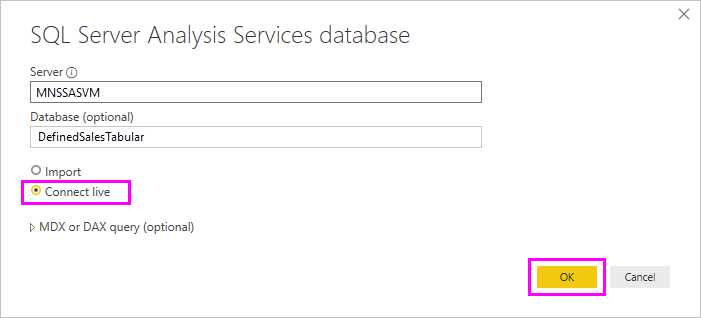

# Dynamic row level security with Analysis services tabular model
This tutorial demonstrates the steps necessary to implement **row level security** within your **Analysis Services Tabular Model**, and shows how to use it in a Power BI report. The steps in this tutorial are designed to let you follow along and learn the steps necessary by completing on a sample dataset.

During this tutorial, the following steps are described in detail, helping you understand what you need to do to implement dynamic row level security with Analysis Services tabular model:

* Create a new security table in the **AdventureworksDW2012** database
* Build the tabular model with necessary fact and dimension tables
* Define the roles and permissions for the users
* Deploy the model to an **Analysis Services tabular** instance
* Use Power BI Desktop to build a report that displays the data corresponding to the user accessing the report
* Deploy the report to **Power BI service**
* Create a new dashboard based on the report, and finally,
* Share the dashboard with your coworkers

To follow the steps in this tutorial you need the **AdventureworksDW2012** database, which you can download from the **[repository](https://github.com/Microsoft/sql-server-samples/releases/tag/adventureworks)**.

## Task 1: Create the user security table and define data relationship
There are many published articles describing how to define row level dynamic security with **SQL Server Analysis Services (SSAS) tabular** model. For our sample, we follow the article [Implement Dynamic Security by Using Row Filters](https://msdn.microsoft.com/library/hh479759.aspx). The following steps walk you through the first task in this tutorial:

1. For our sample, we're using **AdventureworksDW2012** relational database. In that database, create the **DimUserSecurity** table, as shown in the following image. For this sample, we're using SQL Server Management Studio (SSMS) to create the table.
   
   
2. Once the table is created and saved, we need to create the relationship between the **DimUserSecurity** table's **SalesTerritoryID** column and **DimSalesTerritory** table's **SalesTerritoryKey** column, as shown in the following image. This can be done from **SSMS** by right-clicking on the **DimUserSecurity** table, and selecting **Design**. Then select **Table Designer -> Relationships...** from the menu.
   
   
3. Save the table, then add few rows of user information in to the table by again right clicking on the **DimUserSecurity** table and then selecting **Edit Top 200 Rows**. Once you’ve added those users, the rows of the **DimUserSecurity** table look like they do in the following image:
   
   
   
   We’ll come back to these users in upcoming tasks.
4. Next we do an *inner join* with the **DimSalesTerritory** table, which shows the region details associated with the user. The following code performs the *inner join*, and the image that follows shows how the table appears once the *inner join* is successful.
   
       select b.SalesTerritoryCountry, b.SalesTerritoryRegion, a.EmployeeID, a.FirstName, a.LastName, a.UserName from [dbo].[DimUserSecurity] as a join  [dbo].[DimSalesTerritory] as b on a.[SalesTerritoryID] = b.[SalesTerritoryKey]
   
   
5. Notice that the above image shows information such as which user is responsible for which sales region. That data is displayed because of the relationship that we created in **Step 2**. Also, note that the user **Jon Doe is part of the Australia sales region**. We’ll revisit John Doe in upcoming steps and tasks.

## Task 2: Create the tabular model with facts and dimension tables
1. Once your relational data warehouse is in place, it’s time to define your tabular model. The model can be created using **SQL Server Data Tools (SSDT)**. To get more information about how to define a tabular model, please refer to [Create a New Tabular Model Project](https://msdn.microsoft.com/library/hh231689.aspx).
2. Import all the necessary tables into the model as shown below.
   
    
3. Once you’ve imported the necessary tables, you need to define a role called **SalesTerritoryUsers** with **Read** permission. This can be achieved by clicking on the **Model** menu in SQL Server Data Tools, and then clicking **Roles**. In the **Role Manager** dialog box, click **New**.
4. Under **Members** tab in the **Role Manager**, add the users that we defined in the **DimUserSecurity** table in **Task 1 - step 3**.
   
    
5. Next, add the proper functions for both **DimSalesTerritory** and **DimUserSecurity** tables, as shown below under **Row Filters** tab.
   
    
6. In this step, we use the **LOOKUPVALUE** function to return values for a column in which the Windows user name is the same as the user name returned by the **USERNAME** function. Queries can then be restricted where the values returned by **LOOKUPVALUE** match values in the same or related table. In the **DAX Filter** column, type the following formula:
   
       =DimSalesTerritory[SalesTerritoryKey]=LOOKUPVALUE(DimUserSecurity[SalesTerritoryID], DimUserSecurity[UserName], USERNAME(), DimUserSecurity[SalesTerritoryID], DimSalesTerritory[SalesTerritoryKey])
    In this formula, the **LOOKUPVALUE** function returns all values for the **DimUserSecurity[SalesTerritoryID]** column, where the **DimUserSecurity[UserName]** is the same as the current logged on Windows user name, and **DimUserSecurity[SalesTerritoryID]** is the same as the **DimSalesTerritory[SalesTerritoryKey]**.
   
    > [!IMPORTANT]
    > Be aware that the DAX function [USERELATIONSHIP](https://msdn.microsoft.com/query-bi/dax/userelationship-function-dax) is not supported when using row level security.

   The set of Sales SalesTerritoryKey's returned by **LOOKUPVALUE** is then used to restrict the rows shown in the **DimSalesTerritory**. Only rows where the **SalesTerritoryKey** for the row is in the set of IDs returned by the **LOOKUPVALUE** function are displayed.
8. For the **DimUserSecurity** table, in the **DAX Filter** column, type the following formula:
   
       =FALSE()

    This formula specifies that all columns resolve to the false Boolean condition; therefore, no columns for the **DimUserSecurity** table can be queried.
1. Now we need to process and deploy the model. You can refer to the [Deploy article](https://msdn.microsoft.com/library/hh231693.aspx) for assistance in deploying the model.

## Task 3: Adding Data Sources within your On-premises data gateway
1. Once your tabular model is deployed and ready for consumption, you need to add a data source connection to your on-premises Analysis Services tabular server within your Power BI portal.
2. To allow the **Power BI service** access to your on-premises analysis service, you need to have an **[On-premises data gateway](service-gateway-onprem.md)** installed and configured in your environment.
3. Once the gateway is correctly configured, you need to create a data source connection for your **Analysis Services** tabular instance. This article will help you with [adding a data source within the Power BI portal](service-gateway-enterprise-manage-ssas.md).
   
   
4. With the previous step complete, the gateway is configured and ready to interact with your on-premises **Analysis Services** data source.

## Task 4: Creating report based on analysis services tabular model using Power BI desktop
1. Launch **Power BI Desktop** and select **Get Data > Database**.
2. From the list of data sources, select the **SQL Server Analysis Services Database** and select **Connect**.
   
   
3. Fill in your **Analysis Services** tabular instance details and select **Connect Live**. Select **OK**. With **Power BI**, dynamic security works only with **Live connection**.
   
   
4. You'll see that the model that was deployed is in the **Analysis Services** instance. Select the respective model and select **OK**.
   
   
5. **Power BI Desktop** now displays all the available fields, to the right of the canvas in the **Fields** pane.
6. In the **Fields** pane on the right, select the **SalesAmount** measure from the **FactInternetSales** table and the **SalesTerritoryRegion** dimension from the **SalesTerritory** table.
7. We’ll keep this report simple, so right now we won’t add any more columns. To have a more meaningful representation of the data, we'll change the visualization to **Donut chart**.
   
   
8. Once your report is ready, you can directly publish it to the Power BI portal. From the **Home** ribbon in **Power BI Desktop**, select **Publish**.

## Task 5: Creating and sharing a dashboard
1. You’ve created the report and clicked **Publish** in **Power BI Desktop**, so the report is published to the **Power BI** service. Now that it’s in the service, our model security scenario can be demonstrated by using the example we created in the previous steps.
   
   In his role, **Sales Manager - Sumit** can see data from all the different sales regions. So he creates this report (the report created in the previous task steps) and publishes it to the Power BI service.
   
   Once he publishes the report, he creates a dashboard in the Power BI service called **TabularDynamicSec** based on that report. In the following image, notice that the Sales Manager (Sumit) is able to see the data corresponding to all the sales region.
   
   
2. Now Sumit shares the dashboard with his colleague, Jon Doe, who is responsible for sales in the Australia region.
   
   
   
   
3. When Jon Doe logs in to the **Power BI** service and views the shared dashboard that Sumit created, Jon Doe should see **only** the sales from his region for which he is responsible. So Jon Doe logs in, accesses the dashboard that Sumit shared with him, and Jon Doe sees **only** the sales from the Australia region.
   
   
4. Congratulations! The dynamic row level security that was defined in the on-premises **Analysis Services** tabular model has been successfully reflected and observed in the **Power BI** service. Power BI uses the **effectiveusername** property to send the current Power BI user credential to the on-premises data source to run the queries.

## Task 6: Understanding what happens behind the scenes
1. This task assumes you're familiar with SQL Profiler, since you need to capture a SQL Server profiler trace on your on-premises SSAS tabular instance.
2. The session gets initialized as soon as the user (Jon Doe, in this case) accesses the dashboard in the Power BI service. You can see that the **salesterritoryusers** role takes an immediate effect with the effective user name as **<EffectiveUserName>jondoe@moonneo.com</EffectiveUserName>**
   
       <PropertyList><Catalog>DefinedSalesTabular</Catalog><Timeout>600</Timeout><Content>SchemaData</Content><Format>Tabular</Format><AxisFormat>TupleFormat</AxisFormat><BeginRange>-1</BeginRange><EndRange>-1</EndRange><ShowHiddenCubes>false</ShowHiddenCubes><VisualMode>0</VisualMode><DbpropMsmdFlattened2>true</DbpropMsmdFlattened2><SspropInitAppName>PowerBI</SspropInitAppName><SecuredCellValue>0</SecuredCellValue><ImpactAnalysis>false</ImpactAnalysis><SQLQueryMode>Calculated</SQLQueryMode><ClientProcessID>6408</ClientProcessID><Cube>Model</Cube><ReturnCellProperties>true</ReturnCellProperties><CommitTimeout>0</CommitTimeout><ForceCommitTimeout>0</ForceCommitTimeout><ExecutionMode>Execute</ExecutionMode><RealTimeOlap>false</RealTimeOlap><MdxMissingMemberMode>Default</MdxMissingMemberMode><DisablePrefetchFacts>false</DisablePrefetchFacts><UpdateIsolationLevel>2</UpdateIsolationLevel><DbpropMsmdOptimizeResponse>0</DbpropMsmdOptimizeResponse><ResponseEncoding>Default</ResponseEncoding><DirectQueryMode>Default</DirectQueryMode><DbpropMsmdActivityID>4ea2a372-dd2f-4edd-a8ca-1b909b4165b5</DbpropMsmdActivityID><DbpropMsmdRequestID>2313cf77-b881-015d-e6da-eda9846d42db</DbpropMsmdRequestID><LocaleIdentifier>1033</LocaleIdentifier><EffectiveUserName>jondoe@moonneo.com</EffectiveUserName></PropertyList>
3. Based on the effective user name request, Analysis Services converts the request to the actual moonneo\jondoe credential after querying the local Active Directory. Once **Analysis Services** gets the actual credential from Active Directory, then based on the access and permissions the user has for the data, **Analysis Services** returns only the data for which he or she has permission.
4. If more activity occurs with the dashboard, for example, if Jon Doe goes from the dashboard to the underlying report, with SQL Profiler you would see a specific query coming back to the Analysis Services tabular model as a DAX query.
   
   
5. You can also see below the DAX query that is getting executed to populate the data for the report.
   
   ```
   EVALUATE
     ROW(
       "SumEmployeeKey", CALCULATE(SUM(Employee[EmployeeKey]))
     )
   
   <PropertyList xmlns="urn:schemas-microsoft-com:xml-analysis">``
             <Catalog>DefinedSalesTabular</Catalog>
             <Cube>Model</Cube>
             <SspropInitAppName>PowerBI</SspropInitAppName>
             <EffectiveUserName>jondoe@moonneo.com</EffectiveUserName>
             <LocaleIdentifier>1033</LocaleIdentifier>
             <ClientProcessID>6408</ClientProcessID>
             <Format>Tabular</Format>
             <Content>SchemaData</Content>
             <Timeout>600</Timeout>
             <DbpropMsmdRequestID>8510d758-f07b-a025-8fb3-a0540189ff79</DbpropMsmdRequestID>
             <DbPropMsmdActivityID>f2dbe8a3-ef51-4d70-a879-5f02a502b2c3</DbPropMsmdActivityID>
             <ReturnCellProperties>true</ReturnCellProperties>
             <DbpropMsmdFlattened2>true</DbpropMsmdFlattened2>
             <DbpropMsmdActivityID>f2dbe8a3-ef51-4d70-a879-5f02a502b2c3</DbpropMsmdActivityID>
           </PropertyList>
   ```

## Considerations
There are a few considerations to keep in mind when working with row level security, SSAS, and Power BI:

1. On-premises row level security with Power BI is only available with Live Connection.
2. Any changes in the data after processing the model would be immediately available for the users (who are accessing the report with **Live Connection**) from the Power BI service.

