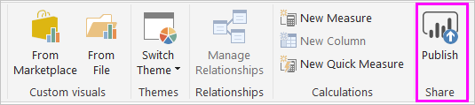

# Publish datasets and reports from Power BI Desktop
When you publish a Power BI Desktop file to the Power BI service, you publish the data in the model to your Power BI workspace. The same is true for any reports you created in **Report** view. You’ll see a new dataset with the same name, and any reports in your Workspace navigator.

Publishing from Power BI Desktop has the same effect as using **Get Data** in Power BI to connect to and upload a Power BI Desktop file.

> [!NOTE]
> Any changes you make to the report in Power BI won't be saved back to the original Power BI Desktop file. This includes when you add, delete, or change visualizations in reports.
> 
> 

## To publish a Power BI Desktop dataset and reports
1. In Power BI Desktop, choose **File** \> **Publish** \> **Publish to Power BI** or select **Publish** on the ribbon.  

   

2. Sign in to Power BI.
3. Select the destination.

   

When complete, you receive a link to your report. Select the link to open the report in your Power BI site.

## Republish or replace a dataset published from Power BI Desktop
The dataset, and any reports you created in Power BI Desktop, upload to your Power BI site when you publish a Power BI Desktop file. When you republish your Power BI Desktop file, the dataset in your Power BI site is replaced with the updated dataset from the Power BI Desktop file.

This process is straightforward, but there are a few things you should know:

* Two or more datasets in Power BI with the same name as the Power BI Desktop file could cause publishing to fail. Make sure you have only one dataset in Power BI with the same name. You can also rename the file and publish, creating a new dataset with same name as the file.
* If you rename or delete a column or measure, any visualizations you already have in Power BI with that field could be broken. 
* Power BI ignores some format changes of existing columns. For example, if you change a column’s format  from 0.25% to 25%.
* If you have a refresh schedule that is configured for your existing dataset in Power BI and you add new data sources to your file and then republish, you’ll have to sign into them in *Manage Data Sources* before the next scheduled refresh.
* When you republish a dataset published from Power BI Desktop and have a refresh schedule defined, a dataset refresh is started as soon as you republish. 

