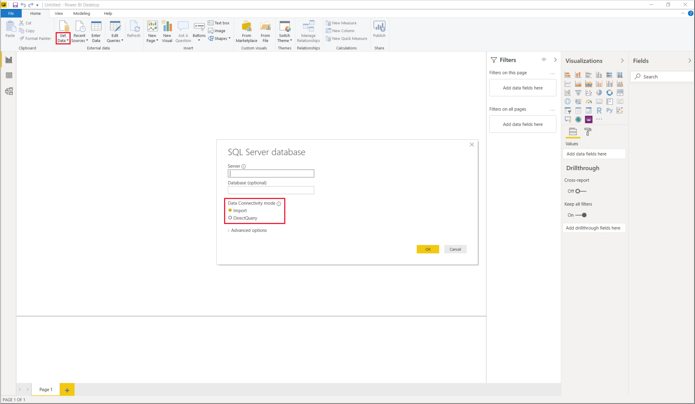
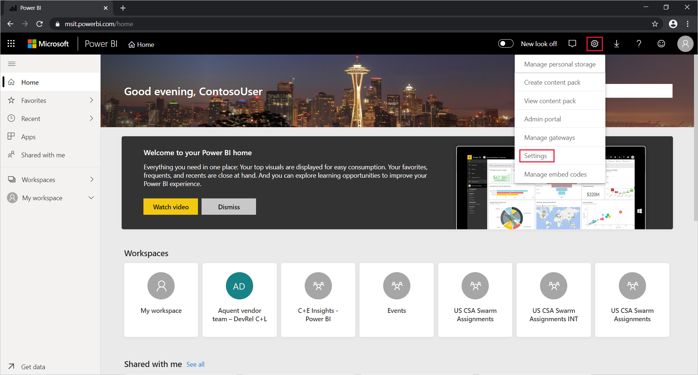

# Use DirectQuery in Power BI Desktop
With **Power BI Desktop**, when you connect to your data source, it's always possible to import a copy of the data into the **Power BI Desktop**. For some data sources, an alternative approach is available: connect directly to the data source using **DirectQuery**.

## Supported data sources
For a full listing of data sources that support **DirectQuery**, see [Data sources supported by DirectQuery](power-bi-data-sources.md).

## How to connect using DirectQuery
When you use **Get Data** to connect to a data source supported by **DirectQuery**, the connection window lets you select how you want to connect. For example, in **Power BI Desktop**, under the **Home** ribbon, select **Get Data** > **SQL Server**. In the **SQL Server Database** dialog box, the **Data Connectivity mode** shows options of **Import** and **DirectQuery**:



Here are the differences between selecting **Import** and **DirectQuery**:

- **Import**: The selected tables and columns are imported into **Power BI Desktop**. As you create or interact with a visualization, **Power BI Desktop** uses the imported data. To see underlying data changes since the initial import or the most recent refresh, you must refresh the data, which imports the full dataset again.

- **DirectQuery**: No data is imported or copied into **Power BI Desktop**. For relational sources, the selected tables and columns appear in the **Fields** list. For multi-dimensional sources like SAP Business Warehouse, the dimensions and measures of the selected cube appear in the **Fields** list. As you create or interact with a visualization, **Power BI Desktop** queries the underlying data source, so you’re always viewing current data.

Many data modeling and data transformations are available when using **DirectQuery**, though with some limitations. When you create or interact with a visualization, you must query the underlying source. The time that's needed to refresh the visualization depends on the performance of the underlying data source. When the data needed to service the request has recently been requested, **Power BI Desktop** uses recent data to reduce the required time to show the visualization. If you select **Refresh** from the **Home** ribbon, all visualizations are refreshed with current data.

The [Power BI and DirectQuery](desktop-directquery-about.md) article describes **DirectQuery** in detail. For more information about benefits, limitations, and important considerations when using **DirectQuery**, see the following sections.

## Benefits of using DirectQuery
There are a few benefits to using **DirectQuery**:

- **DirectQuery** lets you build visualizations over very large datasets, where it would otherwise be unfeasible to first import all the data with pre-aggregation.
- Underlying data changes can require a refresh of data. For some reports, the need to display current data can require large data transfers, making reimporting data unfeasible. By contrast, **DirectQuery** reports always use current data.
- The 1-GB dataset limitation *doesn't* apply to **DirectQuery**.

## Limitations of DirectQuery
There are currently a few limitations to using **DirectQuery**:

- All tables must come from a single database, unless you use [composite models](desktop-composite-models.md).

- If the **Query Editor** query is overly complex, an error occurs. To remedy the error, either delete the problematic step in **Query Editor**, or *import* the data instead of using **DirectQuery**. For multi-dimensional sources like SAP Business Warehouse, there's no **Query Editor**.

- Time intelligence capabilities are unavailable in **DirectQuery**. For example, special treatment of date columns (such as year, quarter, month, or day) isn't supported in **DirectQuery** mode.

- Limitations are placed on DAX expressions allowed in measures to ensure that queries sent to the underlying data source have acceptable performance.

- There's a one-million-row limit for returning data when using **DirectQuery**. The limit doesn't affect aggregations or calculations used to create the dataset returned using **DirectQuery**. It only affects the rows returned.

    For example, you can aggregate 10 million rows with your query that runs on the data source. The query accurately returns the results of that aggregation to Power BI using **DirectQuery** if the returned Power BI data is less than 1 million rows. If over 1 million rows are returned from **DirectQuery**, Power BI returns an error.

## Important considerations when using DirectQuery
The following three points should be taken into consideration when using **DirectQuery**:

- **Performance and load**: All **DirectQuery** requests are sent to the source database, so the required visual refresh time depends on how long that back-end source takes to respond with the results from the query (or queries). Five seconds or less is the recommended response time (with requested data being returned) for using **DirectQuery** for visuals; the maximum is 30 seconds. Any longer, and the experience of a user consuming the report becomes unacceptably poor. After a report is published to the Power BI service, any query that takes longer than a few minutes will time out, and the user will receive an error.
  
    Load on the source database should also be considered, based on the number of Power BI users who will consume the published report. Using **Row Level Security** (RLS) can have a significant impact as well. A non-RLS dashboard tile shared by multiple users results in a single query to the database. Using RLS on a dashboard tile, however, usually means the refresh of a tile requires one query *per user*, significantly increasing load on the source database and potentially impacting performance.
  
    Power BI creates queries that are as efficient as possible. Under certain situations, however, the generated query may not be efficient enough to avoid refresh that would fail. One example of this situation is when a generated query retrieves an excessively large number of rows from the back-end data source. In this case, the following error occurs:

    ```output
    The resultset of a query to external data source has exceeded
    ```
  
    This situation can occur with a simple chart that includes a very high cardinality column, with the aggregation option set to **Don’t Summarize**. The visual needs to only have columns with a cardinality below 1 million, or it must apply the appropriate filters.

- **Security**: By default, all users who consume a published report connect to the back-end data source using the credentials entered after publication to the Power BI service. This process is the same for data that's imported: all users see the same data, regardless of any security rules defined in the backend source.

    Customers who want per-user security implemented with DirectQuery sources should either use RLS or configure Kerberos-constrained authentication against the source. Kerberos isn't available for all sources. [Learn more about RLS](service-admin-rls.md). [Learn more about Kerberos in DirectQuery](service-gateway-sso-kerberos.md).

- **Supported features**: Some features in **Power BI Desktop** are unsupported in **DirectQuery** mode, or they have limitations. Also, some capabilities in the Power BI service (such as *Quick Insights*) aren't available for datasets using **DirectQuery**. When determining whether to use **DirectQuery**, you should consider these feature limitations.

## Publish to the Power BI service
Reports created using **DirectQuery** can be published to the Power BI service.

If the used data source doesn't need the **On-premises data gateway** (**Azure SQL Database**, **Azure SQL Data Warehouse**, or **Redshift**), you must provide credentials before the Power BI service shows the published report. Follow these instructions to provide the credentials:

1. Sign in to [Power BI](https://www.powerbi.com/).
2. In the Power BI service, select the **Settings** gear icon and choose the **Settings** menu item.

    

3. In the Power BI service's **Settings** page, select the **Datasets** tab, choose the dataset that uses **DirectQuery**, and select **Edit credentials**.

4. Add the credentials. Otherwise, an error occurs when you open a published report or explore a dataset that's created with a **DirectQuery** connection.

To make a data connection for data sources other than **Azure SQL Database**, **Azure SQL Data Warehouse** and **Redshift** that use DirectQuery, install an **On-premises data gateway** and register the data source. For more information, see [What is an on-premises data gateway?](service-gateway-onprem.md)

## Next steps
For more information about **DirectQuery**, check out the following resources:

- [Using DirectQuery in Power BI](desktop-directquery-about.md)
- [Data sources supported by DirectQuery](power-bi-data-sources.md)
- [DirectQuery and SAP Business Warehouse (BW)](desktop-directquery-sap-bw.md)
- [DirectQuery and SAP HANA](desktop-directquery-sap-hana.md)
- [What is an on-premises data gateway?](service-gateway-onprem.md)
