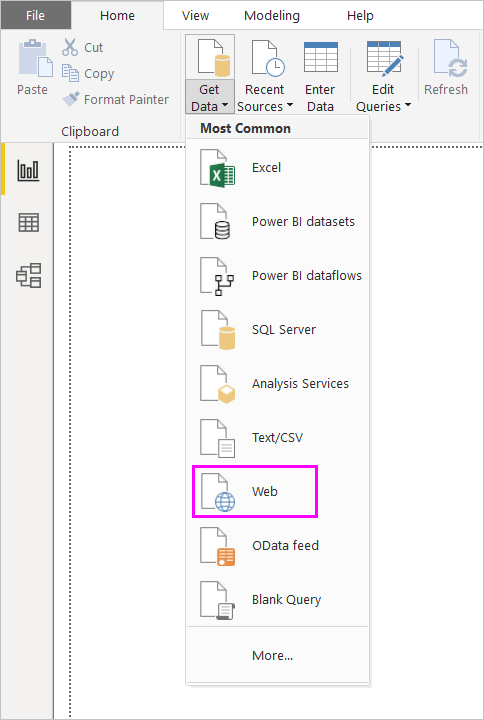

# Use OneDrive for Business links in Power BI Desktop
Many people have Excel workbooks stored in OneDrive for Business that would be great for use with Power BI Desktop. With Power BI Desktop, you can use online links for Excel files stored in OneDrive for Business to create reports and visuals. You can use a OneDrive for Business group account or your individual OneDrive for Business account.

Getting an online link from OneDrive for Business requires a few specific steps. The following sections explain those steps, which let you share the file link among groups, across different machines, and with your coworkers.

## Get a link from Excel
1. Navigate to your OneDrive for Business location using a browser. Right-click the file you want to use, and select **Open in Excel**.
   
   > [!NOTE]
   > Your browser interface might not look exactly like the following image. There are many ways to select **Open in Excel** for files in your OneDrive for Business browser interface. You can use any option that allows you to open the file in Excel.
   > 
   > 
   
   
2. In Excel, select **File** > **Info**, and then select **Copy path** above **Protect Workbook**.
   
   

## Use the link in Power BI Desktop
In Power BI Desktop, you can use the link you just copied to the clipboard. Take the following steps:

1. In Power BI Desktop, select **Get Data** > **Web**.
   
   
2. With the **Basic** option selected, paste the link into the **From Web** dialog box.
3. Remove the *?web=1* string at the end of the link so that Power BI Desktop can properly navigate to your file, and then select **OK**.
   
     
4. If Power BI Desktop prompts you for credentials, choose either **Windows** (for on-premises SharePoint sites) or **Organizational Account** (for Office 365 or OneDrive for Business sites).
   
   

A **Navigator** dialog box appears, allowing you to select from the list of tables, sheets, and ranges found in the Excel workbook. From there, you can use the OneDrive for Business file just like any other Excel file. You can create reports and use it in datasets like you would with any other data source.

> [!NOTE]
> To use a OneDrive for Business file as a data source in the Power BI service, with **Service Refresh** enabled for that file, make sure you select **OAuth2** as the **Authentication method** when configuring your refresh settings. Otherwise, you may encounter an error (such as, *Failed to update data source credentials*) when you attempt to connect or to refresh. Selecting **OAuth2** as the authentication method remedies that credentials error.
> 
> 

