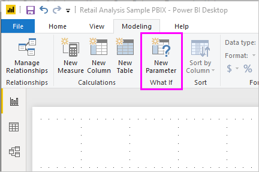
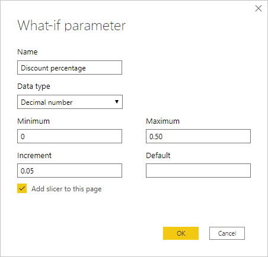
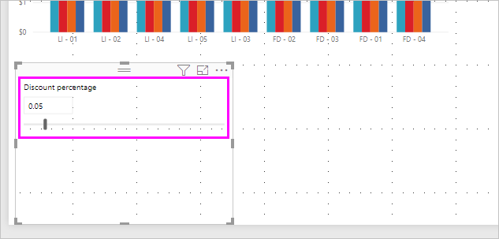
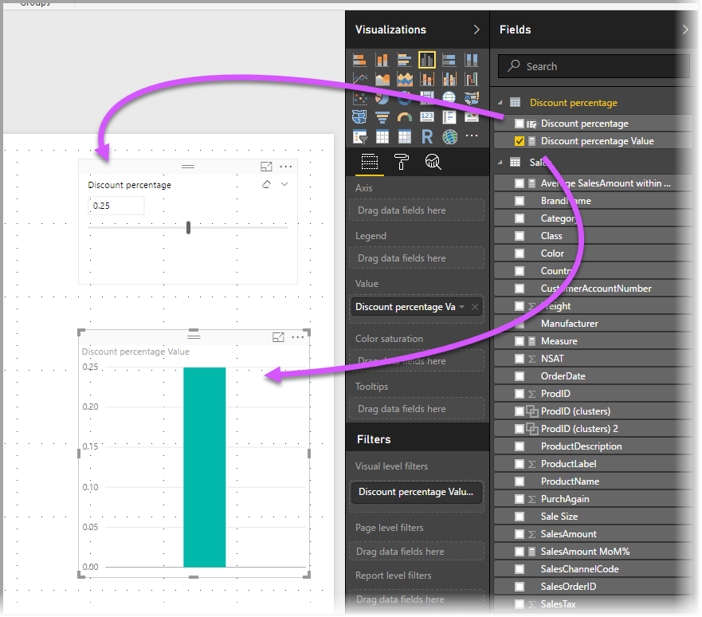
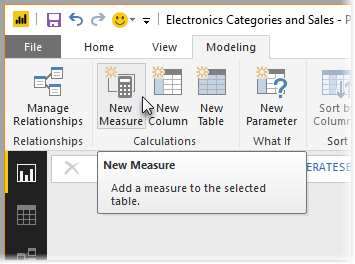
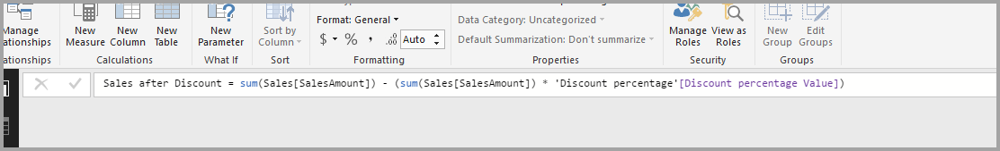
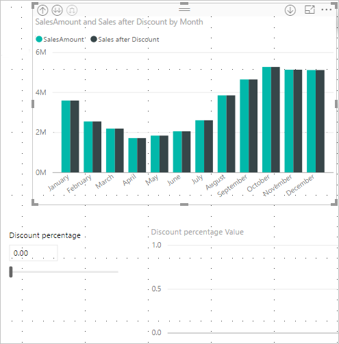
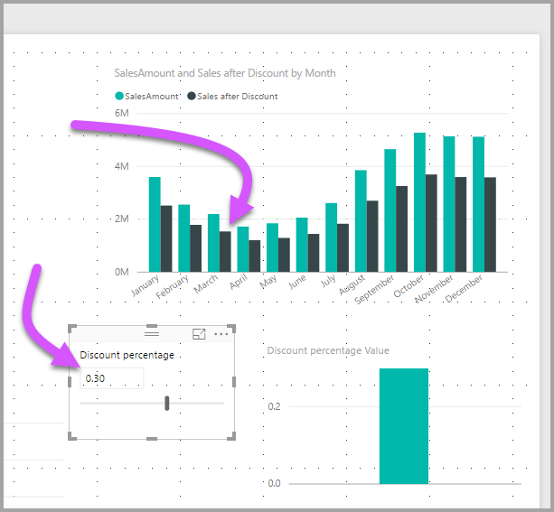

# Create and use a What if parameter to visualize variables in Power BI Desktop
Starting with the August 2018 release of **Power BI Desktop**, you can create **What if** variables for your reports, interact with the variable as a slicer, and visualize and quantify different key values in your reports.

The **What if** parameter is on the **Modeling** tab in **Power BI Desktop**. When you select it, a dialog appears where you can configure the parameter.

## Creating a What if parameter
To create a **What if** parameter, select the **What if** button from the **Modeling** tab in **Power BI Desktop**. In the following image, we've created a parameter called *Discount percentage* and set its data type to *Decimal number.* The *Minimum* value is zero, the *Maximum* is 0.50 (fifty percent). We've also set the *Increment* to 0.05, or five percent. That's how much the parameter will adjust when interacted with in a report.

> [!NOTE]
> For decimal numbers, make sure you precede it with a zero, as in 0.50 versus just .50. Otherwise, the number won't validate and the **OK** button will not be selectable.
> 
> 

For your convenience, the **Add slicer to this page** checkbox automatically puts a slicer with your **What if** parameter onto the current report page.

In addition to creating the parameter, creating a **What if** parameter also creates a measure, which you can use to visualize the current value of the **What if** parameter.

It's important and useful to note that once you create a **What if** parameter, both the parameter and the measure become part of your model. So, they're available throughout the report and can be used on other report pages. And, since they're part of the model, you can delete the slicer from the report page, or if you want it back, just grab the **What if** parameter from the **Fields** list and drag it onto the canvas (then change the visual to a slicer) to easily get the parameter back into your report.

## Using a What if parameter
Let's create a simple example of using a **What if** parameter. We created the **What if** parameter in the previous section, now we'll put it to use by creating a new measure whose value adjusts with the slider. To accomplish this, we create a new measure.

The new measure is simply going to be the total sales amount, with the discount rate applied. You can create complex and interesting measures, of course, that let the consumers of your reports visualize the variable of your **What if** parameter. For example, you could create a report that lets sales people see their compensation if they meet certain sales goals or percentages, or see the effect of increased sales to deeper discounts.

Once we type the measure formula into the formula bar, and name it **Sales after Discount**, we see its result:

Then, we create a column visual with *OrderDate* on the axis, and both *SalesAmount* and the just-created measure, *Sales after Discount* as the values.

Then, as we move the slider, we see that the *Sales after Discount* column reflects the discounted sales amount.

And, that's all there is to it. You can use **What if** parameters in all sorts of situations, to enable the consumers of reports to interact with different scenarios that you create in your reports.

