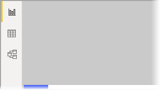

# What is Power BI Desktop?

*Power BI Desktop* is a free application you install on your local computer that lets you connect to, transform, and visualize your data. With Power BI Desktop, you can connect to multiple different sources of data, and combine them (often called modeling) into a data model. This data model lets you build visuals, and collections of visuals you can share as reports, with other people inside your organization. Most users who work on business intelligence projects use *Power BI Desktop* to create reports, and then use the *Power BI service* to share their reports with others.

The most common uses for Power BI Desktop are as follows:

* Connect to data
* Transform and clean that data, to create a data model
* Create visuals, such as charts or graphs, that provide visual representations of the data
* Create reports that are collections of visuals, on one or more report pages
* Share reports with others using the Power BI service

People most often responsible for such tasks are often considered *data analysts* (sometimes referred to as *analysts*) or business intelligence professionals (often referred to as *report creators*). However, many people who don't consider themselves an analyst or a report creator use Power BI Desktop to create compelling reports, or to pull data from various sources and build data models, which they can share with their coworkers and organizations.

There are three views available in Power BI Desktop, which you select on the left side of the canvas. The views, shown in the order they appear, are as follows:
* **Report**: In this view, you create reports and visuals, where most of your creation time is spent.
* **Data**: In this view, you see the tables, measures, and other data used in the data model associated with your report, and transform the data for best use in the report's model.
* **Model**: In this view, you see and manage the relationships among tables in your data model.

The following image shows the three views, as displayed along the left side of the canvas:

 

## Connect to data
To get started with Power BI Desktop, the first step is to connect to data. There are many different data sources you can connect to from Power BI Desktop. 

To connect to data:

1. From the **Home** ribbon, select **Get Data** > **More**. 

   The **Get Data** window appears, showing the many categories to which Power BI Desktop can connect.

   

2. When you select a data type, you're prompted for information, such as the URL and credentials, necessary for Power BI Desktop to connect to the data source on your behalf.

   

3. After you connect to one or more data sources, you may want to transform the data so it's useful for you.

## Transform and clean data, create a model

In Power BI Desktop, you can clean and transform data using the built-in Power Query Editor. With Power Query Editor, you make changes to your data, such as changing a data type, removing columns, or combining data from multiple sources. It's like sculpting: you start with a large block of clay (or data), then shave off pieces or add others as needed, until the shape of the data is how you want it. 

Each step you take in transforming data (such as rename a table, transform a data type, or delete columns) is recorded by Power Query Editor, and each time this query connects to the data source those steps are carried out so that the data is always shaped the way you specified.

The following image shows the **Power Query Editor** window for a query that has been shaped, and turned into a model.

 

Once your data is how you want it, you can create visuals. 

## Create visuals 

After you have a data model, you can drag *fields* onto the report canvas to create *visuals*. A visual is a graphic representation of the data in your model. The following visual shows a simple column chart. 

There are many different types of visuals to choose from in Power BI Desktop. 

To create or change a visual: 

- From the **Visualizations** pane, select the visual icon. 

   

   If you have a visual selected on the report canvas, the selected visual changes to the type you selected. 

   If no visual is selected, a new visual is created based on your selection.

## Create reports

More often, you'll want to create a collection of visuals that show various aspects of the data you've used to create your model in Power BI Desktop. A collection of visuals, in one Power BI Desktop file, is called a *report*. A report can have one or more pages, just like an Excel file can have one or more worksheets. 

With Power BI Desktop you can create complex and visually rich reports, using data from multiple sources, all in one report that you can share with others in your organization.

In the following image, you see the first page of a Power BI Desktop report, named **Overview**, as seen on the tab near the bottom of the image. 

## Share reports

Once a report is ready to share with others, you can *publish* the report to the Power BI service, and make it available to anyone in your organization who has a Power BI license. 

To publish a Power BI Desktop report: 

1. Select **Publish** from the **Home** ribbon in Power BI Desktop.

   

   Power BI Desktop connects you to the Power BI service with your Power BI account. 

2. Power BI prompts you to select where in the Power BI service you'd like to share the report, such as your workspace, a team workspace, or some other location in the Power BI service. 

   You must have a Power BI license to share reports to the Power BI service.

## Next steps

To get started with Power BI Desktop, the first thing you need is to download and install the application. There are two ways to get Power BI Desktop:

* [Get Power BI Desktop from the Windows Store](https://aka.ms/pbidesktopstore)
* [Download Power BI Desktop from the web](https://docs.microsoft.com/en-us/power-bi/desktop-get-the-desktop#download-power-bi-desktop-directly)

