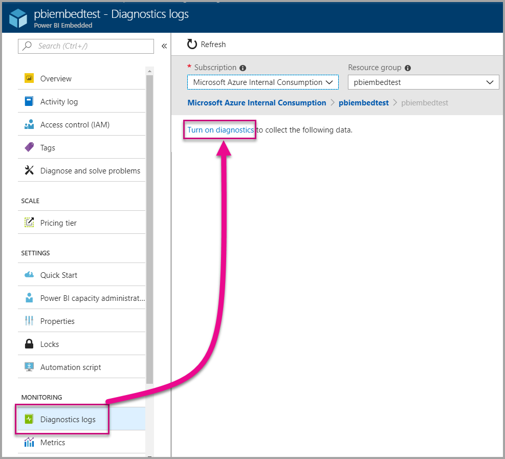
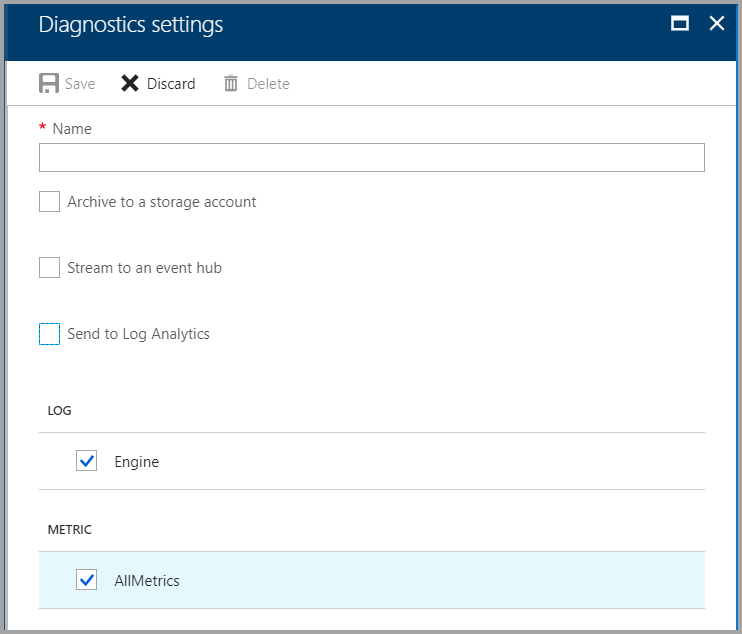
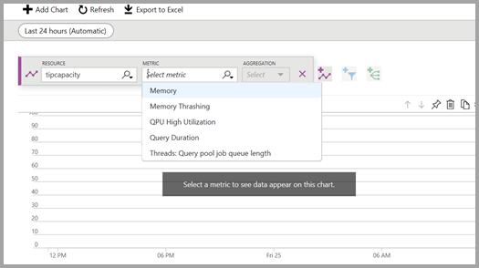
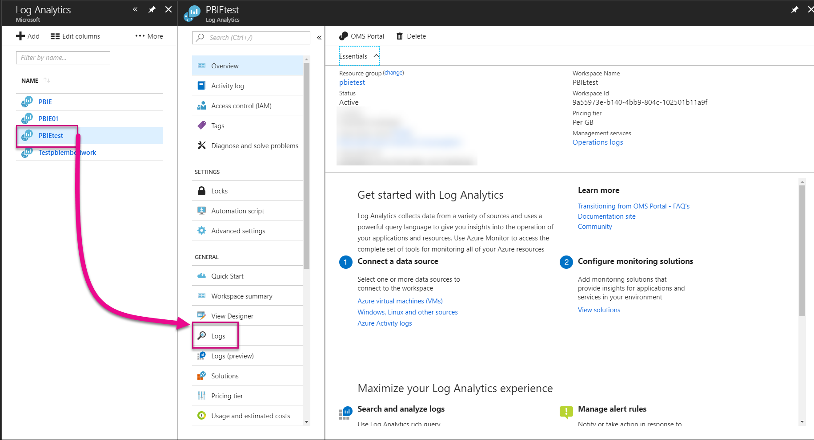
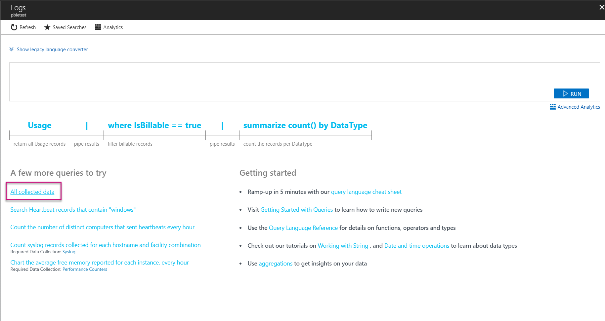
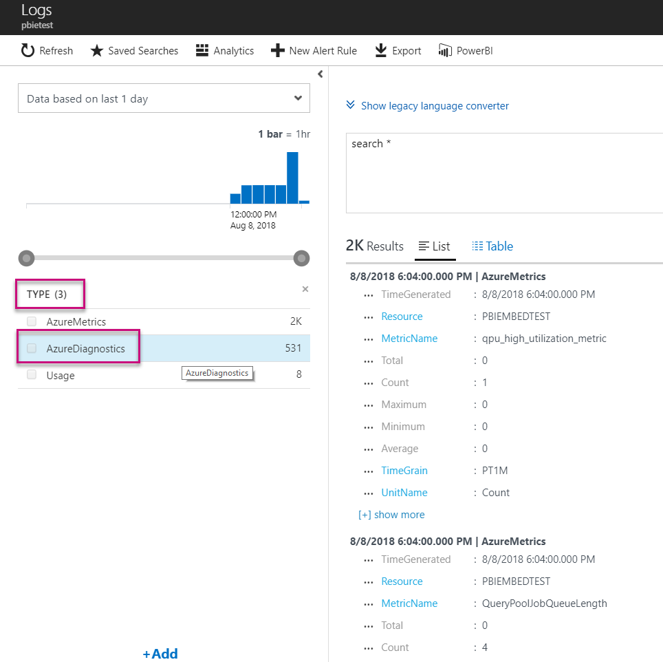
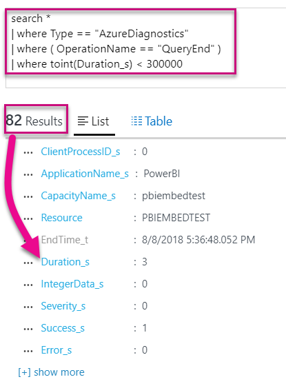
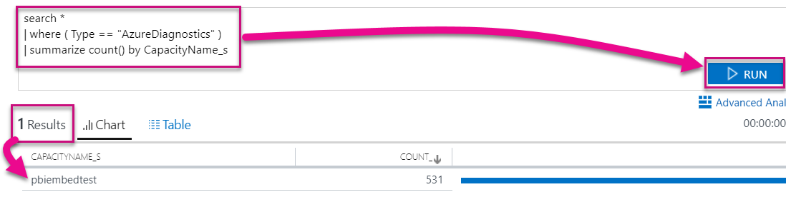

# Diagnostic logging for Power BI Embedded in Azure

With [Azure resource diagnostic logs](https://docs.microsoft.com/azure/monitoring-and-diagnostics/monitoring-overview-of-diagnostic-logs), you can log many events from your capacity, pour them into an analytics tool and get insights into the behavior of your resource.

Using Diagnostics can answer a few scenarios, such as:

* Detection of long-running or problematic queries.
* Detecting errors when reaching the limit of your capacity.
* Derivation of [capacity metrics](https://powerbi.microsoft.com/blog/power-bi-developer-community-april-update/).
* Tracking usage of specific datasets.

## Set up diagnostics logging

### Azure portal

1. In [Azure portal](https://portal.azure.com) > Power BI Embedded resource, select **Diagnostic logs** in the left navigation, and then select **Turn on diagnostics**.

    

2. In **Diagnostic settings**, specify the following options:

    * **Name** - Enter a name for the diagnostics setting to create.

    * **Archive to a storage account** - To use this option, you need to connect to an existing storage account. See [Create a storage account](https://docs.microsoft.com/azure/storage/common/storage-create-storage-account), and follow the instructions to create a storage account. Then select your storage account by returning to this page in the portal. It may take a few minutes for newly created storage accounts to appear in the drop-down menu. Log file storage is in JSON format.
    * **Stream to an event hub** - To use this option, you need to connect to an existing Event Hub namespace and event hub. To learn more, see [Create an Event Hubs namespace and an event hub using the Azure portal](https://docs.microsoft.com/azure/event-hubs/event-hubs-create).
    * **Send to Log Analytics** - To use this option, either use an existing workspace or create a new Log Analytics workspace by following the steps to [create a new workspace](https://docs.microsoft.com/azure/log-analytics/log-analytics-quick-collect-azurevm#create-a-workspace) in the portal. This leverages [Azure Log Analytics](https://docs.microsoft.com/azure/log-analytics/log-analytics-overview), which provides built-in analysis, dashboarding and notification capabilities. You can use Log Analytics to connect more data from other resources and get a single and complete view of data across all your application’s resources. It can also be connected to [Power BI with a single click](https://docs.microsoft.com/azure/log-analytics/log-analytics-powerbi).
    For more information on viewing your logs in Log Analytics, see [View logs in Log Analytics](https://docs.microsoft.com/azure/log-analytics/log-analytics-activity).
    * **Engine** - Select this option to log the set of engine [events listed](#whats-logged) below.
    * **AllMetrics** - Select this option to store verbose data in [Metrics](https://docs.microsoft.com/azure/analysis-services/analysis-services-monitor#server-metrics). If you are archiving to a storage account, you can select the retention period for the diagnostic logs. Logs are auto-deleted after the retention period expires.

3. Select **Save**.

    To change how your diagnostic logs are saved, you can return to this page to modify settings.

    

### Using PowerShell to enable diagnostics

To enable metrics and diagnostics logging by using PowerShell, use the following commands:

* To enable storage of diagnostics logs in a storage account, use this command:

    ```powershell
    Set-AzureRmDiagnosticSetting -ResourceId [your resource id] -StorageAccountId [your storage account id] -Enabled $true
    ```
    The storage account ID is the resource ID for the storage account where you want to send the logs.

* To enable streaming of diagnostics logs to an event hub, use this command:

    ```powershell
    Set-AzureRmDiagnosticSetting -ResourceId [your resource id] -ServiceBusRuleId [your service bus rule id] -Enabled $true
    ```
* The Azure Service Bus rule ID is a string with this format:

    ```powershell
    {service bus resource ID}/authorizationrules/{key name}
    ```

* To enable sending diagnostics logs to a Log Analytics workspace, use this command:

    ```powershell
        Set-AzureRmDiagnosticSetting -ResourceId [your resource id] -WorkspaceId [resource id of the log analytics workspace] -Enabled $true
    ```

* You can obtain the resource ID of your Log Analytics workspace by using the following command:

    ```powershell
    (Get-AzureRmOperationalInsightsWorkspace).ResourceId
    ```

You can combine these parameters to enable multiple output options.

### REST API

Learn how to [change diagnostics settings by using the Azure Monitor REST API](https://docs.microsoft.com/rest/api/monitor/). 

### Resource Manager template

Learn how to [enable diagnostics settings at resource creation by using a Resource Manager template](https://docs.microsoft.com/azure/monitoring-and-diagnostics/monitoring-enable-diagnostic-logs-using-template).

## What's logged?

You can select **Engine** and/or the **AllMetrics** categories.

### Engine

The engine category instructs the resource to log the following events, and on each of the events there are properties:

|     Event Name     |     Event Description     |
|----------------------------|----------------------------------------------------------------------------------|
|    Audit Login    |    Records all new connection to   the engine events since the trace started.    |
|    Session Initialize    |    Records all session   initialization events since the trace started.    |
|    Vertipaq Query Begin    |    Records all VertiPaq SE query   begin events since the trace started.    |
|    Query Begin    |    Records all query begin events   since the trace started.    |
|    Query End    |    Records all query end events   since the trace started.    |
|    Vertipaq Query End    |    Records all VertiPaq SE query   end events since the trace started.    |
|    Audit Logout    |    Records all disconnect from   engine events since the trace started.    |
|    Error    |    Records all engine error   events since the trace started.    |

<br>
<br>

| Property Name | Vertipaq Query End Example | Property Description |
|-------------------|---------------------------------------------------------------------------------------------------------------------------------------------------------------------------------------------------------|--------------------------------------------------------------------------------------------------------------------------|
| EventClass | XM_SEQUERY_END | Event Class is used to categorize events. |
| EventSubclass | 0 | Event Subclass provides additional information about each event class. (for example, 0: VertiPaq Scan) |
| RootActivityId | ff217fd2-611d-43c0-9c12-19e202a94f70 | Root activity ID. |
| CurrentTime | 2018-04-06T18:30:11.9137358Z | Time at which the event started when available. |
| StartTime | 2018-04-06T18:30:11.9137358Z | Time at which the event started when available. |
| JobID | 0 | Job ID for progress. |
| ObjectID | 464 | Object ID |
| ObjectType | 802012 | ObjectType |
| ObjectName | SalesLT Customer | ObjectName |
| ObjectPath | 5eaa550e-06ac-4adf-aba9-dbf0e8fd1527.Model.SalesLT Customer | Object path. A comma-separated list of parents, starting with the object's parent. |
| ObjectReference | <Object><Table>SalesLT Customer</Table><Model>Model</Model><Database>5eaa550e-06ac-4adf-aba9-dbf0e8fd1527</Database></Object> | Object reference. Encoded as XML for all parents, using tags to describe the object. |
| EndTime | 2018-04-06T18:30:11.9137358Z | Time at which the event ended. |
| Duration | 0 | Amount of time (in milliseconds) taken by the event. |
| SessionType | User | Session type (what entity caused the operation). |
| ProgressTotal | 0 | Progress total. |
| IntegerData | 0 | Integer data. |
| Severity | 0 | Severity level of an exception. |
| Success | 1 | 1 = success. 0 = failure (for example, a 1 means success of a permissions check and a 0 means a failure of that check). |
| Error | 0 | Error number of a given event. |
| TextData | SET DC_KIND=\"AUTO\";  SELECT  [SalesLT Customer (464)].[rowguid (606)] AS [SalesLT Customer (464)$rowguid (606)]  FROM [SalesLT Customer (464)]; [Estimated size (volume marshalling bytes): 850 6800] | Text data associated with the event. |
| ConnectionID | 3 | Unique connection ID. |
| DatasetID | 5eaa550e-06ac-4adf-aba9-dbf0e8fd1527 | Id of the dataset in which the statement of the user is running. |
| SessionID | 3D063F66-A111-48EE-B960-141DEBDA8951 | Session GUID. |
| SPID | 180 | Server process ID. This uniquely identifies a user session. This directly corresponds to the session GUID used by XML/A. |
| ClientProcessID | null | The process ID of the client application. |
| ApplicationName | null | Name of the client application that created the connection to the server. |
| CapacityName | pbi641fb41260f84aa2b778a85891ae2d97 | The name of the Power BI Embedded capacity resource. |
| RequestParameters |  |  |
| RequestProperties |  |  |

### AllMetrics

Checking the **AllMetrics** option logs the data of all the metrics that you can use with a Power BI Embedded resource.

   

## Manage your logs

Logs are typically available within a couple of hours after setting up logging. It's up to you to manage your logs in your storage account:

* Use standard Azure access control methods to secure your logs by restricting who can access them.
* Delete logs that you no longer want to keep in your storage account.
* Be sure to set a retention period, so old logs are deleted from your storage account.

## View logs in Log Analytics

Metrics and server events are integrated with xEvents in Log Analytics for side-by-side analysis. Log Analytics can also be configured to receive events from other Azure services that provide a holistic view of diagnostic logging data across your architecture.

To view your diagnostic data in Log Analytics, open the **Logs** page from the left menu or the Management area, as shown below.



Now that you've enabled data collection, in **Logs**, select **All collected data**.



In **Type**, select **AzureDiagnostics**, and then select **Apply**. AzureDiagnostics includes Engine events. Notice a Log Analytics query is created on-the-fly.



Select **EventClass\_s** or one of the event names and Log Analytics continues constructing a query. Be sure to save your queries to reuse later.

Be sure to see [Log Analytics](https://docs.microsoft.com/azure/log-analytics/), which provides a website with an enhanced query, dashboarding, and alerting capabilities on collected data.

### Queries

There are hundreds of queries you can use. Here are a few to get you started. To learn more about using the new Log Search query language, see [Understanding log searches in Log Analytics](https://docs.microsoft.com/azure/log-analytics/log-analytics-log-search).

* Query return that took less than five minutes (300,000 milliseconds) to complete.

    ```
    search *
    | where Type == "AzureDiagnostics"
    | where ( OperationName == "QueryEnd" )
    | where toint(Duration_s) < 300000
    ```

    

* Identify capacity names.

    ```
    search *
    | where ( Type == "AzureDiagnostics" )
    | summarize count() by CapacityName_s 
    ```

    

## Next steps

You can learn more about Azure resource diagnostic logging.

> [!div class="nextstepaction"]
> [Azure resource diagnostic logging](https://docs.microsoft.com/azure/monitoring-and-diagnostics/monitoring-overview-of-diagnostic-logs)

> [!div class="nextstepaction"]
> [Set-AzureRmDiagnosticSetting](https://docs.microsoft.com/powershell/module/azurerm.insights/Set-AzureRmDiagnosticSetting)