# Tutorial: Developing a Power BI Custom Visual

We’re enabling developers to easily add custom visuals into Power BI for use in dashboard and reports. To help you get started, we’ve published the code for all of our visualizations to GitHub.

Along with the visualization framework, we’ve provided our test suite and tools to help the community build high-quality custom visuals for Power BI.

This tutorial shows you how to develop a Power BI custom visual named Circle Card to display a formatted measure value inside a circle. The Circle Card visual supports customization of fill color and thickness of its outline.

In the Power BI Desktop report, the cards are modified to become Circle Cards.

  

In this tutorial, you learn how to:
>[!div class="checklist"]
>* Create a Power BI custom visual.
>* Develop the custom visual with D3 visual elements.
>* Configure data binding with the visual elements.
>* Format data values.
>* Add visual properties.
>* Package the visual.
>* Import the custom visual into a Power BI Desktop report.

## Prerequisites

* If you're not signed up for **Power BI Pro**, [sign up for a free trial](https://powerbi.microsoft.com/en-us/pricing/) before you begin.
* You need [Visual Studio Code](https://www.visualstudio.com/) installed.

## Setting Up the Developer Environment

In addition to the prerequisites, there are a few more tools you need to install.

### Installing Node.js

1. To install Node.js, in a web browser, navigate to [Node.js](https://nodejs.org).

2. Download the latest feature MSI installer.

3. Run the installer, and then follow the installation steps. Accept the terms of the license agreement and all defaults.

   

4. Restart the computer.

### Installing Packages

Now you need to install the **pbiviz** package.

1. Open Windows PowerShell after the computer has been restarted.

2. To install pbiviz, enter the following command.

   ```powershell
   npm i -g powerbi-visuals-tools
   ```

### Creating and Installing a Certificate

1. To create a certificate, enter the following command.

  ```powershell
  pbiviz --create-cert
  ```

  It returns a result that produces a *passphrase*. In this case, the *passphrase* is **_15105661266553327_**.

  

2. Now we need to install the certificate. to install the certificate, enter the following command.

  ```powershell
  pbiviz --install-cert
  ```

3. In the Certificate Import Wizard, verify that the store location is set to Current User. Then select *Next*.

      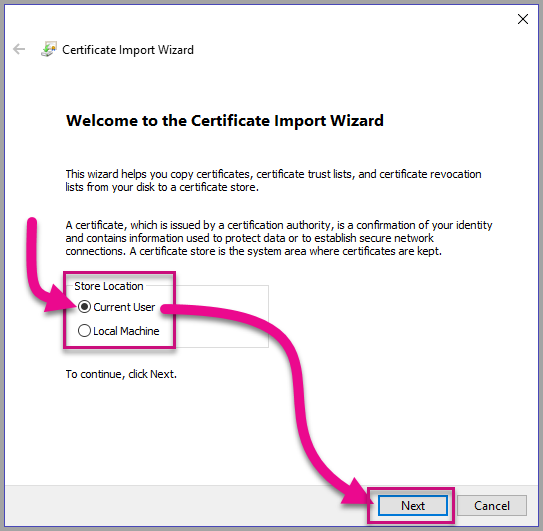

4. At the **File to Import** step, select *Next*.

5. At the **Private Key Protection** step, in the Password box, paste the passphrase you received from creating the cert.  Again, in this case it is **_15105661266553327_**.

      

6. At the **Certificate Store** step, select the **Place all certificates in the Following store** option. Then select *Browse*.

      

7. In the **Select Certificate Store** window, select **Trusted Root Certification Authorities** and then select *OK*. Then select *Next* on the **Certificate Store** screen.

      

8. To complete the import, click Finish.

9. If you receive a security warning, click Yes.

    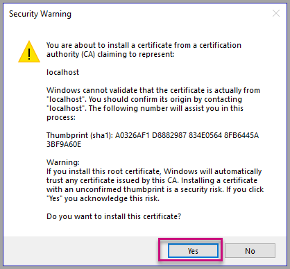

10. When notified that the import was successful, click OK.

    

> ![Important]
> Do not close the Windows PowerShell session.

## Creating a Custom Visual

Now that you have set up your environment, it is time to create your custom visual.

The full source code for this tutorial is available [here](https://github.com/uve/circlecard).

1. In Windows PowerShell, verify that the Power BI Visual Tools package has been installed.

    ```powershell
    pbiviz
    ```
  You should see the help output.

   <pre><code>
         +syyso+/
    oms/+osyhdhyso/
    ym/       /+oshddhys+/
    ym/              /+oyhddhyo+/
    ym/                     /osyhdho
    ym/                           sm+
    ym/               yddy        om+
    ym/         shho /mmmm/       om+
     /    oys/ +mmmm /mmmm/       om+
    oso  ommmh +mmmm /mmmm/       om+
   ymmmy smmmh +mmmm /mmmm/       om+
   ymmmy smmmh +mmmm /mmmm/       om+
   ymmmy smmmh +mmmm /mmmm/       om+
   +dmd+ smmmh +mmmm /mmmm/       om+
         /hmdo +mmmm /mmmm/ /so+//ym/
               /dmmh /mmmm/ /osyhhy/
                 //   dmmd
                       ++

       PowerBI Custom Visual Tool

    Usage: pbiviz [options] [command]

    Commands:

    new [name]        Create a new visual
    info              Display info about the current visual
    start             Start the current visual
    package           Package the current visual into a pbiviz file
    update [version]  Updates the api definitions and schemas in the current visual. Changes the version if specified
    help [cmd]        display help for [cmd]

    Options:

    -h, --help      output usage information
    -V, --version   output the version number
    --install-cert  Install localhost certificate
    </code></pre>

<a name="ssl-setup"></a>

2. Review the output, including the list of supported commands.

    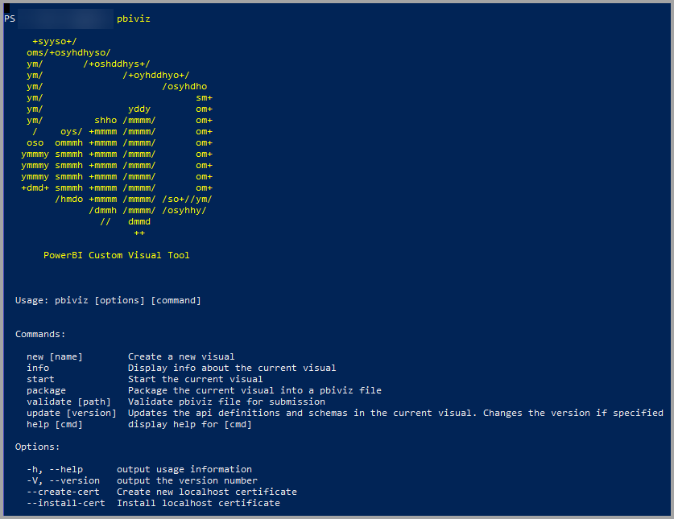 

3. To create a custom visual project, enter the following command. CircleCard is the name of the project.

    ```powershell
    pbiviz new CircleCard
    ```
    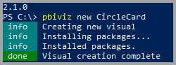

4. Navigate to the project folder.

    ```powershell
    cd CircleCard
    ```
5. Start the custom visual. Your CircleCard visual is now running while being hosted on your computer.

    ```powershell
    pbiviz start
    ```

    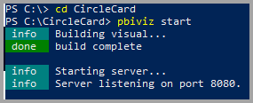

> ![Important]
> Do not close the Windows PowerShell session.

### Testing the Custom Visual

Now we are going to test the CircleCard custom visual by uploading a Power BI Desktop report and then editing the report to display the custom visual.

1. Sign in to [PowerBI.com](www.powerbi.com) > go to the **Gear icon** > then select **Settings**.

      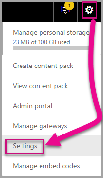

2. Select **Developer** then check the **Enable Developer Visual for testing** checkbox.

    

3. Upload a Power BI Desktop report.  

    Get Data > Files > Local File.

    You can download a sample Power BI Desktop report [here](https://microsoft.github.io/PowerBI-visuals/docs/step-by-step-lab/images/US_Sales_Analysis.pbix).

    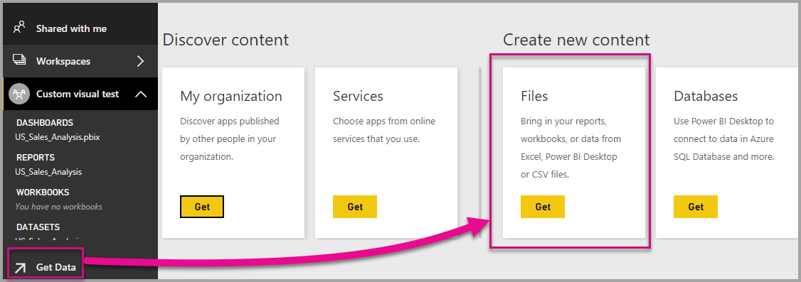
    

    Now to view the report, select **US_Sales_Analysis** from the **Report** section in the navigation pane on the left.

    

4. Now you need to edit the report while in the Power BI service.

    Go to **Edit report**.

    

5. Select the **Developer Visual** from the **Visualizations** pane.

    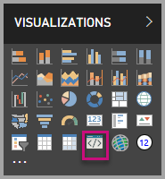

    > ![Note]
    > This visualization represents the custom visual that you started on your computer. It is only available when the developer settings have been enabled.

6. Notice that a visualization was added to the report canvas.

    

    > ![Note]
    > This is a very simple visual that displays the number of times its Update method has been called. At this stage, the visual does not yet retrieve any data.

7. While selecting the new visual in the report, Go to the Fields Pane > expand Sales > select Quantity.

    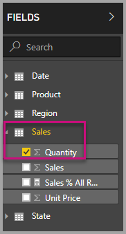

8. Then to test the new visual, resize the visual and notice the update value increments.

    

To stop the custom visual running in PowerShell, enter Ctrl+C. When prompted to terminate the batch job, enter Y, then press Enter.

## Adding Visual Elements

Now you need to install the **D3 JavaScript library**. D3 is a JavaScript library for producing dynamic, interactive data
visualizations in web browsers. It makes use of widely implemented SVG
HTML5, and CSS standards.

Now you can develop the custom visual to display a circle with text.

> ![Note]
> Many text entries in this tutorial can be copied from [here](https://github.com/uve/circlecard).

1. To install the **D3 library** in PowerShell, enter the command below.

    ```powershell
    npm i d3@3.5.5 --save
    ```

    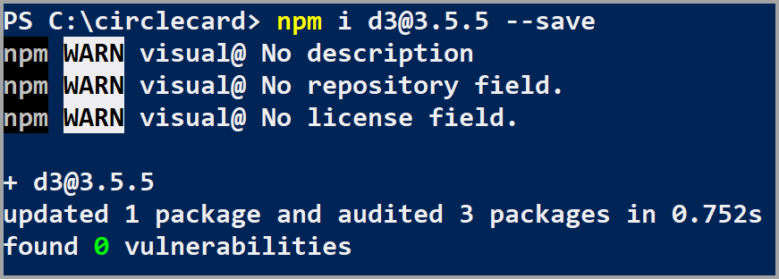

2. To install type definitions for the **D3 library**, enter the command below.

    ```powershell
    npm i @types/d3@3.5
    ```

    

    This command installs TypeScript definitions based on JavaScript files, enabling you to develop the custom visual in TypeScript (which is a superset of JavaScript). Visual Studio Code is an ideal IDE for developing TypeScript applications.

3. Launch [Visual Studio Code](https://code.visualstudio.com/).

    You can launch **Visual Studio Code** from powershell by using the following command.

    ```powershell
    code .
    ```

4. In the **Explorer pane**, expand the **node_modules** folder to verify that the **d3 library** was installed.

    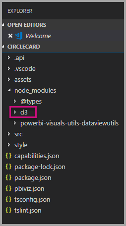

5. Notice the TypeScript file, **index.d.ts**, by expanding node_modules > @types > d3 in the **Explorer pane**.

    

6. Select the **pbiviz.json** file.

7. To register the **d3 library**, enter the following file reference into the externalJS array. Be sure to add a *comma* between the existing file reference and the new file reference.

    ```javascript
    "node_modules/d3/d3.min.js"
    ```
    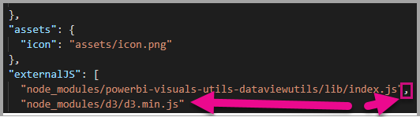

8. Save the **pbiviz.json** file changes.

### Developing the Visual Elements

Now we can explore how to develop the custom visual to show a circle and sample text.

1. In the **Explorer pane**, expand the **src** folder and then select **visual.ts**.

> ![Note]
> Notice the comments at the top of the **visual.ts** file. Permission to use the Power BI custom visual packages is granted free of charge under the terms of the MIT License. As part of the agreement, you must leave the comments at the top of the file.

2. Remove the following default custom visual logic from the Visual class.
    * The four class-level private variable declarations.
    * All lines of code from the constructor.
    * All lines of code from the update method.
    * All remaining lines within the module, including the parseSettings and enumerateObjectInstances methods.

    Verify that the module code looks like the following.

    ```typescript
    module powerbi.extensibility.visual {
    "use strict";
    export class Visual implements IVisual {

        constructor(options: VisualConstructorOptions) {

        }

        public update(options: VisualUpdateOptions) {

            }
        }
    }
    ```

3. Beneath the *Visual* class declaration, insert the following class-level properties.

    ```typescript
     private host: IVisualHost;
     private svg: d3.Selection<SVGElement>;
     private container: d3.Selection<SVGElement>;
     private circle: d3.Selection<SVGElement>;
     private textValue: d3.Selection<SVGElement>;
     private textLabel: d3.Selection<SVGElement>; 
    ```

    

4. Add the following code to the *constructor*.

    ```typescript
    this.svg = d3.select(options.element)
                 .append('svg')
                 .classed('circleCard', true);
    this.container = this.svg.append("g")
                         .classed('container', true);
    this.circle = this.container.append("circle")
                             .classed('circle', true);
    this.textValue = this.container.append("text")
                                 .classed("textValue", true);
    this.textLabel = this.container.append("text")
                                 .classed("textLabel", true);
    ```

    This code adds an SVG group inside the visual and then adds three shapes: a circle and two text elements.

    To format the code in the document, right-click anywhere in the **Visual Studio Code document**, and then select **Format Document**.

      

    To improve readability, it is recommended that you format the document every time that paste in code snippets.

5. Add the following code to the *update* method.

    ```typescript
    let width: number = options.viewport.width;
    let height: number = options.viewport.height;
    this.svg.attr({
     width: width,
     height: height
    });
    let radius: number = Math.min(width, height) / 2.2;
    this.circle
     .style("fill", "white")
     .style("fill-opacity", 0.5)
     .style("stroke", "black")
     .style("stroke-width", 2)
    .attr({
     r: radius,
     cx: width / 2,
     cy: height / 2
    });
    let fontSizeValue: number = Math.min(width, height) / 5;
    this.textValue
     .text("Value")
     .attr({
         x: "50%",
         y: "50%",
         dy: "0.35em",
         "text-anchor": "middle"
     }).style("font-size", fontSizeValue + "px");
    let fontSizeLabel: number = fontSizeValue / 4;
    this.textLabel
     .text("Label")
     .attr({
         x: "50%",
         y: height / 2,
         dy: fontSizeValue / 1.2,
         "text-anchor": "middle"
     })
     .style("font-size", fontSizeLabel + "px");
    ```

*This code sets the width and height of the visual, and then initializes the attributes and styles of the visual elements.*

6. Save the **visual.ts** file.

7. Select the **capabilities.json** file.

    At line 14, remove the entire objects element (lines 14-60).

8. Save the **capabilities.json** file.

9. In PowerShell, start the custom visual.

    ```powershell
    pbiviz
    ```

### Toggle Auto Reload

1. Navigate back to the Power BI report.
2. In the toolbar floating above the developer visual, select the **Toggle Auto Reload**.

    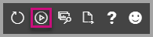

    This option ensures that the visual is automatically reloaded each time you save project changes.

3. From the **Fields pane**, drag the **Quantity** field into the developer visual.

4. Verify that the visual looks like the following.

    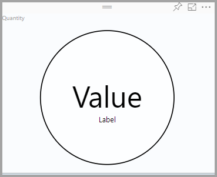

5. Resize the visual.

    Notice that the circle and text value scales to fit the available dimension of the visual.

    The update method is called continuously with resizing the visual, and it results in the fluid rescaling of the visual elements.

    You have now developed the visual elements.

6. Continue running the visual.

## Configuring data binding

Define the data roles and data view mappings, and then modify the custom visual logic to display the value and display name of a measure.

### Configuring the Capabilities

Modify the **capabilities.json** file to define the data role and data view mappings.

1. In Visual Studio code, in the **capabilities.json** file, from inside the **dataRoles** array, remove all content (lines 3-12).

2. Inside the **dataRoles** array, insert the following code.

    ```json
    {
     "displayName": "Measure",
     "name": "measure",
     "kind": "Measure"
    }
    ```
    The **dataRoles** array now defines a single data role of type **measure**, that is named **measure**, and displays as **Measure**. This data role allows passing either a measure field, or a field that is summarized.

3. From inside the **dataViewMappings** array, remove all content (lines 10-31).

4. Inside the **dataViewMappings** array, insert the following content.

    ```json
            {
            "conditions": [
                { "measure": { "max": 1 } }
            ],
            "single": {
                "role": "measure"
            }
           }
    ```
    The **dataViewMappings** array now defines one field can be passed to the data role named **measure**.

5. Save the **capabilities.json** file.

6. In Power BI, notice that the visual now can be configured with **Measure**.

    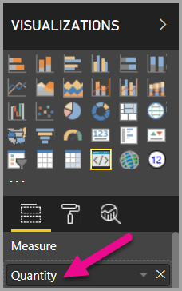

    > ![Note]
    > The visual project does not yet include data binding logic.

### Exploring the dataview

1. In the toolbar floating above the visual, click **Show Dataview**.

    

2. Expand down into **single**, and then notice the value.

    

3. Expand down into **metadata**, and then into the **columns** array, and in particular notice the **format** and **displayName** values.

    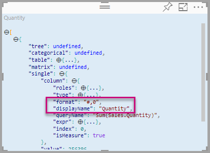

4. To toggle back to the visual, in the toolbar floating above the visual, click **Show Dataview**.

    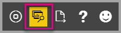

### Configuring Data Binding

1. In **Visual Studio Code**, in the **visual.ts** file, add the following statement as the first statement of the update method.

    ```typescript
    let dataView: DataView = options.dataViews[0];
    ```
    

    This statement assigns the *dataView* to a variable for easy access, and declares the variable to reference the *dataView* object.

2. In the **update** method, replace.text(“Value”)** with the following.

    ```typescript
    .text(dataView.single.value as string)
    ```
    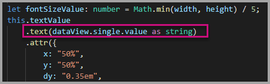

3. In the **update** method, replace **.text(“Label”)** with the following.

    ```typescript
    .text(dataView.metadata.columns[0].displayName)
    ```
    

4. Save the **visual.ts** file.

5. In **Power BI**, review the visual, which now displays the value and the display name.

You have now configured the data roles and bound the visual to the dataview.

## Adding formatting options

You are now going to add common properties to the visual.

1. In **Power BI**, select the **Format page**. you should see a message that reads - *Formatting options are unavailable for this visual.*

    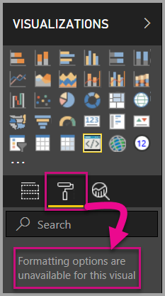

2. In **Visual Studio Code**, open the *capabilities.json* file.

3. Before the **dataViewMappings** array, add **objects** (after line 8).

    ```json
    "objects": {},
    ```
    

4. Save the **capabilities.json** file.

5. In **Power BI**, review the formatting options again.

    > ![Note]
    > If you do not see the formatting options change then select **Reload Custom Visual**.

    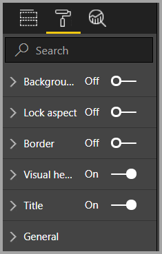

6. Set the **Title** option to *Off*. Notice that the visual no longer displays the measure name at the top-left corner.

    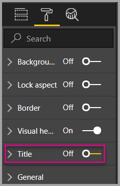

    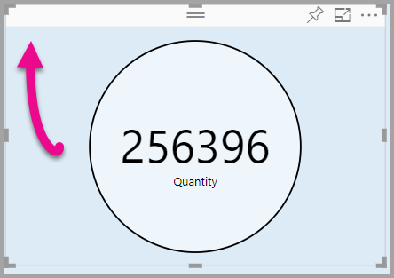

### Adding Custom Formatting Options

 You can add custom properties to enable configuring the color of the circle, and also the border width.

1. In PowerShell, stop the custom visual.

2. In Visual Studio Code, in the **capabilities.json** file, insert the following JSON fragment into the **objects** object.

    ```json
    "circle": {
     "displayName": "Circle",
     "properties": {
         "circleColor": {
             "displayName": "Color",
             "description": "The fill color of the circle.",
             "type": {
                 "fill": {
                     "solid": {
                         "color": true
                     }
                 }
             }
         },
         "circleThickness": {
             "displayName": "Thickness",
             "description": "The circle thickness.",
             "type": {
                 "numeric": true
                 }
             }
         }
     }
    ```

    The JSON fragment describes a group named circle, which consists of two options named circleColor and circleThickness.

   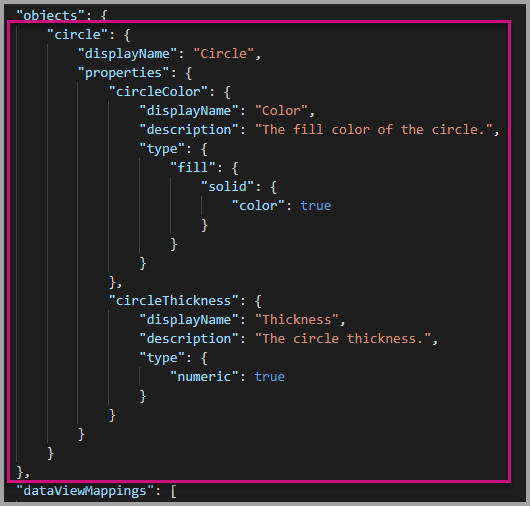

3. Save the **capabilities.json** file.

4. In the **Explorer pane**, from inside the **src** folder, and then select **settings.ts**. *This file represents the settings for the starter visual*.

5. In the **settings.ts** file, replace the two classes with the following code.

    ```typescript
    export class CircleSettings {
     public circleColor: string = "white";
     public circleThickness: number = 2;
    }
    export class VisualSettings extends DataViewObjectsParser {
     public circle: CircleSettings = new CircleSettings();
    }
    ```

    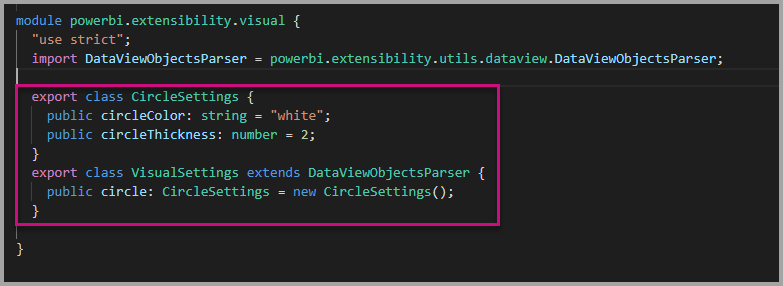

    This module defines the two classes. The **CircleSettings** class defines two properties with names that match the objects defined in the **capabilities.json** file (**circleColor** and **circleThickness**) and also sets default values. The **VisualSettings** class inherits the **DataViewObjectParser** class and adds a property named **circle**, which matches the object defined in the *capabilities.json* file, and returns an instance of **CircleSettings**.

6. Save the **settings.ts** file.

7. Open the **visual.ts** file.

8. In the **Visual** class, add the following property.

    ```typescript
    private visualSettings: VisualSettings;
    ```
    This property stores a reference to the **VisualSettings** object, describing the visual settings.

    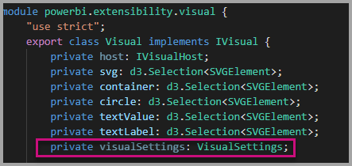

9. In the **Visual** class, add the following method before the **update** method. This method is used to populate the formatting options.

    ```typescript
    public enumerateObjectInstances(options: EnumerateVisualObjectInstancesOptions): VisualObjectInstanceEnumeration {
     const settings: VisualSettings = this.visualSettings ||
    VisualSettings.getDefault() as VisualSettings;
     return VisualSettings.enumerateObjectInstances(settings, options);
    }
    ```
    This method is used to populate the formatting options.

    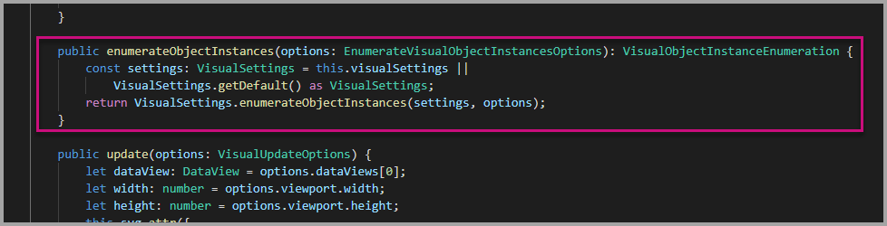

10. In the **update** method, after the declaration of the **radius** variable, add the following code.

    ```typescript
    this.visualSettings = VisualSettings.parse<VisualSettings>(dataView);
    this.visualSettings.circle.circleThickness = Math.max(0, this.visualSettings.circle.circleThickness)this.visualSettings.circle.circleThickness = Math.min(10, this.visualSettings.circle.circleThickness);
    ```
    This code retrieves the format options. It adjusts any value passed into the **circleThickness** property, converting it to 0 if negative, or 10 if it's a value greater than 10.

    

11. For the **circle element**, modify the value passed to the **fill style** to the following expression.

    ```typescript
    this.visualSettings.circle.circleColor
    ```

    

12. For the **circle element**, modify the value passed to the **stroke-width style** to the following expression.

    ```typescript
    this.visualSettings.circle.circleThickness
    ```

    

13. Save the visual.ts file.

14. In PowerShell, start the visual.

    ```powershell
    pbiviz start
    ```

15. In **Power BI**, in the toolbar floating above the visual, click **Toggle Auto Reload**.

16. In the **visual format** options, expand **Circle**.

    

    Modify the **color** and **thickness** option.

    Modify the **thickness** option to a value less than zero, and a value higher than 10. Then notice the visual updates the value to a tolerable minimum or maximum.

## Packaging the Custom Visual

Enter property values for the custom visual project, update the icon file, and then package the custom visual.

1. In **PowerShell**, stop the custom visual.

2. Open the **pbiviz.json** file in **Visual Studio Code**.

3. In the **visual** object, modify the **displayName** property to *Circle Card*.

    In the **Visualizations** pane, hovering over the icon reveals the display name.

    

4. For the **description** property, enter the following text.

    *Displays a formatted measure value inside a circle*

5. Optionally, in the **author** object, enter your details.

6. Save the **pbiviz.json** file.

7. In the **assets** object, notice that the document defines a path to an icon. The icon is the image that appears in the **_Visualizations_** pane. It must be a **PNG** file, *20 pixels by 20 pixels*.

8. In Windows Explorer, copy the icon.png file, and then paste it to replace the default file located at assets folder.

9. In Visual Studio Code, in the Explorer pane, expand the assets folder, and then select the icon.png file.

10. Review the icon.

    

11. In Visual Studio Code, ensure that all files are saved.

12. To package the custom visual, in PowerShell, enter the following command.

    ```powershell
    pbiviz package
    ```

    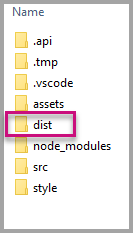

Now the package is output to the **dist** folder of the project. The package contains everything required to import the custom visual into either the Power BI service or a Power BI Desktop report. You have now packaged the custom visual, and it is now ready for use.

## Importing the Custom Visual to Power BI Desktop

Now you can open the Power BI Desktop report, and import the Circle Card custom visual.

1. Open **Power BI Desktop**, create a new report with any *sample dataset*

2. In the **_Visualizations_** pane, select the **ellipsis**, and then select **Import** from File.

    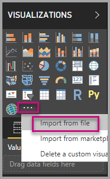

3. In the **import window**, click **Import**.

4. In the Open window, navigate to the **dist** folder in your project directory.

5. Select the **circleCard.pbiviz** file, and then select **Open**.

6. When the visual has successfully imported, select **OK**.

7. Verify that the visual has been added to the **_Visualizations_** pane.

    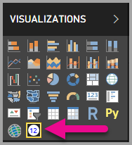

8. Hover over the **Circle Card** icon, and notice the tooltip that appears.

## Next Steps

[Publish custom visuals to AppSource](office-store.md)