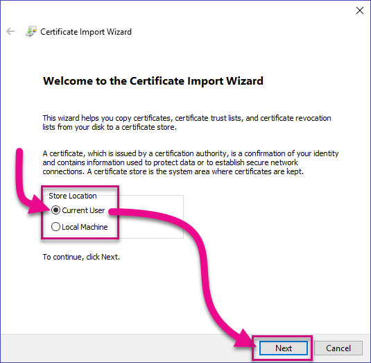

# Tutorial: Developing a Power BI Custom Visual

We’re enabling developers to easily add custom visuals into Power BI for use in dashboard and reports. To help you get started, we’ve published the code for all of our visualizations to GitHub. Along with the visualization framework, we’ve provided our test suite and tools to help the community build high-quality custom visuals for Power BI.

This tutorial show you how to develop a Power BI custom visual named Circle Card to display a formatted measure value inside a circle. The Circle Card visual supports customization of fill color and thickness of its outline.

When imported into your Power BI Desktop report, the cards will be modified to become Circle Cards.


In this tutorial, you learn how to:
>[!div class="checklist"]
>* Create a Power BI custom visual.
>* Develop the custom visual with D3 visual elements.
>* Configure data binding with the visual elements.
>* Format data values.
>* Add visual properties.
>* Package the visual.
>* Import the custom visual into a Power BI Desktop report.

## Prerequisites

* If you're not signed up for **Power BI Pro**, [sign up for a free trial](https://powerbi.microsoft.com/en-us/pricing/) before you begin.
* You need [Visual Studio](https://www.visualstudio.com/) installed (version 2013 or later).

## Sign in to Power BI

1. Navigate to [Power BI](https://powerbi.microsoft.com) and select **Sign In** (located at the top-right corner).

2. When prompted to update the password, reenter the provided password, and then enter and confirm a new password.

3. Complete the sign in process.

4. If prompted to stay signed in, click Yes.

5. Leave the Internet Explorer window open.

## Setting Up the Developer Environment

In addition to the prerequisites, there are a few more tools you need to install.

### Installing Node.js

1. To install Node.js, in a web browser, navigate to [Node.js](https://nodejs.org).

2. Download the latest feature MSI installer.

3. Run the installer, and then follow the installation steps. Accept the terms of the license agreement and all defaults.

   

4. Restart the computer.

### Installing Packages

1. You need to install the pbiviz package next.

2. Once the computer has been restarted, login in, and then open Windows PowerShell (do not open an *ISE* window).

3. To install pbiviz, enter the following command.

   ```powershell
   npm i -g powerbi-visuals-tools
   ```

### Creating and Installing a Certificate

1. To create a certificate, enter the following command.

  ```powershell
  pbiviz --create-cert
  ```

2. Copy the passphrase (do not select the quotes).

3. To install the certificate, enter the following command.

  ```powershell
  pbiviz --install-cert
  ```

4. In the Certificate Import Wizard, ensure that the store location is set to Current User. Then select *Next*.



At the **File to Import** step, select *Next*.

At the **Private Key Protection** step, in the Password box, paste the passphrase copied to the clipboard.

Click Next.

At the Certificate Store step, select the Place All Certificates in the Following Store option.


Click Browse.

In the Select Certificate Store window, select Trusted Root Certification Authorities.


Click OK.

In the Certificate Import Wizard, click Next.

To complete the import, click Finish.

If you receive a security warning, click Yes.

When notified that the import was successful, click OK.

In the Certificate window, click OK.

Leave Windows PowerShell open.
