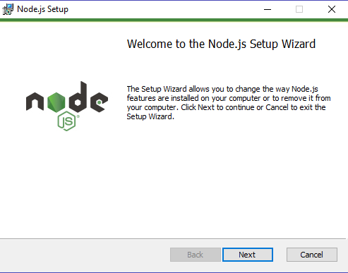
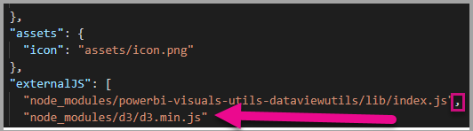
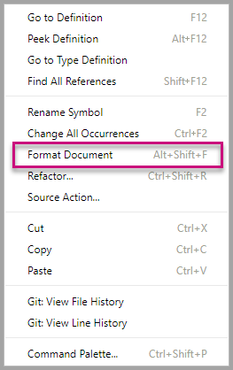

# Tutorial: Developing a Power BI Custom Visual

We’re enabling developers to easily add custom visuals into Power BI for use in dashboard and reports. To help you get started, we’ve published the code for all of our visualizations to GitHub.

Along with the visualization framework, we’ve provided our test suite and tools to help the community build high-quality custom visuals for Power BI.

This tutorial shows you how to develop a Power BI custom visual named Circle Card to display a formatted measure value inside a circle. The Circle Card visual supports customization of fill color and thickness of its outline.

In the Power BI Desktop report, the cards will be modified to become Circle Cards.

  

In this tutorial, you learn how to:
>[!div class="checklist"]
>* Create a Power BI custom visual.
>* Develop the custom visual with D3 visual elements.
>* Configure data binding with the visual elements.
>* Format data values.
>* Add visual properties.
>* Package the visual.
>* Import the custom visual into a Power BI Desktop report.

## Prerequisites

* If you're not signed up for **Power BI Pro**, [sign up for a free trial](https://powerbi.microsoft.com/en-us/pricing/) before you begin.
* You need [Visual Studio](https://www.visualstudio.com/) installed (version 2013 or later).

## Sign in to Power BI

1. Navigate to [Power BI](https://powerbi.microsoft.com) and select **Sign In** (located at the top-right corner) of the page.

2. When prompted to update the password, reenter the provided password, and then enter and confirm a new password.

3. Complete the sign-in process.

4. If prompted to stay signed in, click Yes.

5. Leave the Internet Explorer window open.

## Setting Up the Developer Environment

In addition to the prerequisites, there are a few more tools you need to install.

### Installing Node.js

1. To install Node.js, in a web browser, navigate to [Node.js](https://nodejs.org).

2. Download the latest feature MSI installer.

3. Run the installer, and then follow the installation steps. Accept the terms of the license agreement and all defaults.

   

4. Restart the computer.

### Installing Packages

Now you need to install the pbiviz package.

1. Open Windows PowerShell after the computer has been restarted.

2. To install pbiviz, enter the following command.

   ```powershell
   npm i -g powerbi-visuals-tools
   ```

### Creating and Installing a Certificate

1. To create a certificate, enter the following command.

  ```powershell
  pbiviz --create-cert
  ```

You should return a result that produces a *passphrase*. In this case, the *passphrase* is **_15105661266553327_**.

  

2. Now we need to install the certificate. to install the certificate, enter the following command.

  ```powershell
  pbiviz --install-cert
  ```

4. In the Certificate Import Wizard, ensure that the store location is set to Current User. Then select *Next*.

      

5. At the **File to Import** step, select *Next*.

6. At the **Private Key Protection** step, in the Password box, paste the passphrase you received from creating the cert.  Again, in this case it is **_15105661266553327_**.
   
      

7. At the **Certificate Store** step, select the **Place all certificates in the Following store** option. Then select *Browse*.

      

8. In the **Select Certificate Store** window, select **Trusted Root Certification Authorities** and then select *OK*. Then select *Next* on the **Certificate Store** screen.

      

9. To complete the import, click Finish.

10. If you receive a security warning, click Yes.

    

11. When notified that the import was successful, click OK.

    

> .

1. In Windows PowerShell, verify that the Power BI Visual Tools package has been installed.

    ```powershell
    pbiviz
    ```
  You should see the help output.

    <pre><code>
         +syyso+/
    oms/+osyhdhyso/
    ym/       /+oshddhys+/
    ym/              /+oyhddhyo+/
    ym/                     /osyhdho
    ym/                           sm+
    ym/               yddy        om+
    ym/         shho /mmmm/       om+
     /    oys/ +mmmm /mmmm/       om+
    oso  ommmh +mmmm /mmmm/       om+
   ymmmy smmmh +mmmm /mmmm/       om+
   ymmmy smmmh +mmmm /mmmm/       om+
   ymmmy smmmh +mmmm /mmmm/       om+
   +dmd+ smmmh +mmmm /mmmm/       om+
         /hmdo +mmmm /mmmm/ /so+//ym/
               /dmmh /mmmm/ /osyhhy/
                 //   dmmd
                       ++

       PowerBI Custom Visual Tool

    Usage: pbiviz [options] [command]

    Commands:

    new [name]        Create a new visual
    info              Display info about the current visual
    start             Start the current visual
    package           Package the current visual into a pbiviz file
    update [version]  Updates the api definitions and schemas in the current visual. Changes the version if specified
    help [cmd]        display help for [cmd]

    Options:

    -h, --help      output usage information
    -V, --version   output the version number
    --install-cert  Install localhost certificate
    </code></pre>

<a name="ssl-setup"></a>

2. Review the output, including the list of supported commands.

     

3. Navigate to your Workspace folder, using the folder path you used to install the course files.  In this case, we saved our files to the workspace folder in the c drive.

    ```
    cd C:\Workspace
    ```
4. To create a custom visual project, enter the following command. CircleCard is the name of the project.

    ```powershell
    pbiviz new CircleCard
    ```
5. Navigate to the project folder.

    ```powershell
    cd CircleCard
    ```
    

6. Start the custom visual. YoUr CircleCard visual is now running while being hosted on your computer.

    ```powershell
    pbiviz start
    ```

    

> 

2. Select **Developer** then check the **Enable Developer Visual for testing** checkbox.

    

3. Upload a Power BI Desktop report.  

    Get Data > Files > Local File.

    You can download a sample Power BI Desktop report [here](https://microsoft.github.io/PowerBI-visuals/docs/step-by-step-lab/images/US_Sales_Analysis.pbix).

    
    

    Now to view the report, select **US_Sales_Analysis** from the **Report** section in the navigation pane on the left.

    

4. Now you need to edit the report while in te Power BI service.

    Go to **Edit report**.

    

5. Select the **Developer Visual** from the **Visualizations** pane.

    

    > ![Note]
    > This visualization represents the custom visual that you started on your computer. It is only available when the developer settings have been enabled.

6. Notice that a visualization was added to the report canvas.

    

    > !{Note}
    > This is a very simple visual that displays the number of times its Update method has been called. At this stage the visual does not yet retrieve any data.

7. While selecting the new visual in the report, Go to the Fields Pane > expand Sales > select Quantity.

    

8. Then to test the new visual, resize the visual and notice the update value increments.

    

To stop the custom visual running in PowerShell, enter Ctrl+C. When prompted to terminate the batch job, enter Y, then press Enter.

## Adding Visual Elements

Now you need to install the **D3 JavaScript library**. This includes the typings and the configure file dependencies.

Then you can develop the custom visual to display a circle with text.

> ![Note]
> D3 is a JavaScript library for producing dynamic, interactive data visualizations in web browsers. It makes use of widely implemented SVG, HTML5, and CSS standards.

1. To install the **D3 library** in PowerShell, enter the command below.

    ```powershell
    npm i d3@3.5.5 --save
    ```
Many text entries in this tutorial can be copied from [here](https://github.com/uve/circlecard).

2. To install type definitions for the **D3 library**, enter the command below.

    ```powershell
    npm i @types/d3@3.5
    ```

This command installs TypeScript definitions based on JavaScript files, enabling you to develop the custom visual in TypeScript (which is a superset of JavaScript). Visual Studio Code is an ideal IDE for developing TypeScript applications.

3. Launch [Visual Studio Code](https://code.visualstudio.com/).

    You can launch **Visual Studio Code** from powershell by using the command *code .*.

4. In the **Explorer pane**, expand the **node_modules** folder to verify that the **d3 library** was installed.

    

5. Notice the TypeScript file, **index.d.ts**, by expanding node_modules > @types > d3 in the **Explorer pane**.

    

6. Open the **tsconfig.json** file if you need to make some changes.

    
    

7. Save the **tsconfig.json** file.

8. Select the **pbiviz.json** file.

9. To register the **d3 library**, enter the following file reference into the externalJS array. Be sure to add a *comma* after the existing file reference.

    ```javascript
    "node_modules/d3/d3.min.js"
    ```
    

10. Save the **pbiviz.json** file changes.

### Developing the Visual Elements

Now we can explore how to develop the custom visual to show a circle and sample text.

1. In the **Explorer pane**, expand the **src** folder, and then select **visual.ts**.

> ![Note]
> Notice the comments at the top of the **visual.ts** file. Permission to use the Power BI custom visual packages is granted free of charge under the terms of the MIT License. As part of the agreement, you must leave the comments at the top of the file.

2. Remove the following default custom visual logic from the Visual class.
    * The four class-level private variable declarations.
    * All lines of code from the constructor.
    * All lines of code from the update method.
    * All remaining lines within the module, including the parseSettings and enumerateObjectInstances methods.
    * You will add these methods back later in the tutorial.

    Verify that the module code looks like the following.

    ```typescript
    module powerbi.extensibility.visual {
    "use strict";
    export class Visual implements IVisual {

        constructor(options: VisualConstructorOptions) {

        }

        public update(options: VisualUpdateOptions) {

            }
        }
    }
    ```

3. Beneath the *Visual* class declaration, insert the following class-level properties.

    ```typescript
     private host: IVisualHost;
     private svg: d3.Selection<SVGElement>;
     private container: d3.Selection<SVGElement>;
     private circle: d3.Selection<SVGElement>;
     private textValue: d3.Selection<SVGElement>;
     private textLabel: d3.Selection<SVGElement>; 
    ```

    

4. Add the following code to the *constructor*.

    ```typescript
    this.svg = d3.select(options.element)
                 .append('svg')
                 .classed('circleCard', true);
    this.container = this.svg.append("g")
                         .classed('container', true);
    this.circle = this.container.append("circle")
                             .classed('circle', true);
    this.textValue = this.container.append("text")
                                 .classed("textValue", true);
    this.textLabel = this.container.append("text")
                                 .classed("textLabel", true);
    ```

    This code adds an SVG group inside the visual, and then adds three shapes: a circle and two text elements.

    To format the code in document, right-click anywhere in the visual Studio Code document, and then select **Format Document**.

      

    To improve readability, it is recommended that you format the document every time that paste in code snippets.

5. Add the following code to the *update* method.

    ```typescript
    let width: number = options.viewport.width;
    let height: number = options.viewport.height;
    this.svg.attr({
     width: width,
     height: height
    });
    let radius: number = Math.min(width, height) / 2.2;
    this.circle
     .style("fill", "white")
     .style("fill-opacity", 0.5)
     .style("stroke", "black")
     .style("stroke-width", 2)
    .attr({
     r: radius,
     cx: width / 2,
     cy: height / 2
    });
    let fontSizeValue: number = Math.min(width, height) / 5;
    this.textValue
     .text("Value")
     .attr({
         x: "50%",
         y: "50%",
         dy: "0.35em",
         "text-anchor": "middle"
     }).style("font-size", fontSizeValue + "px");
    let fontSizeLabel: number = fontSizeValue / 4;
    this.textLabel
     .text("Label")
     .attr({
         x: "50%",
         y: height / 2,
         dy: fontSizeValue / 1.2,
         "text-anchor": "middle"
     })
     .style("font-size", fontSizeLabel + "px");
        ```

    This code sets the width and height of the visual, and then initializes the attributes and styles of the visual lelements.

6. Save the **visual.ts** file.

7. Select the **capabilities.json** file.

    At line 14, remove the entire objects element (lines 14-60).

    You will develop the visual formatting options later in this lab.

8. Save the **capabilities.json** file.

9. In PowerShell, start the custom visual.

    ```powershell
    pbiviz
    ```

### Toggle Auto Reload

1. Navigate back to the Power BI report.
2. In the toolbar floating above the developer visual, select the **Toggle Auto Reload**.

    

    This option ensures that the visual is automatically reloaded each time you save project changes.

3. From the **Fields pane**, drag the **Quantity** field into the developer visual.

4. Verify that the visual looks like the following.

    

5. Resize the visual.

    Notice that the circle and text value scales to fit the available dimension of the visual.

    The update method is called continuously with each resize, and this results in the fluid rescaling of the visual elements.*

    You have now developed the visual elements.

6. Continue running the visual.

## Configuring data binding

Define the data roles and data view mappings, and then modify the custom visual logic to display the value and display name of a measure.

### Configuring the Capabilities

Modify the **capabilities.json** file to define the data role and data view mappings.

1. In Visual Studio code, in the **capabilities.json** file, from inside the **dataRoles** array, remove all content (lines 3-12).

2. Inside the **dataRoles** array, insert the following code.

    ```json
    {
     "displayName": "Measure",
     "name": "measure",
     "kind": "Measure"
    }
    ```
    The **dataRoles** array now defines a single data role of type **measure**, that is named measure, and will be displayed as **Measure** This data role will allow passing in either a measure field, or a field that is summarized.


