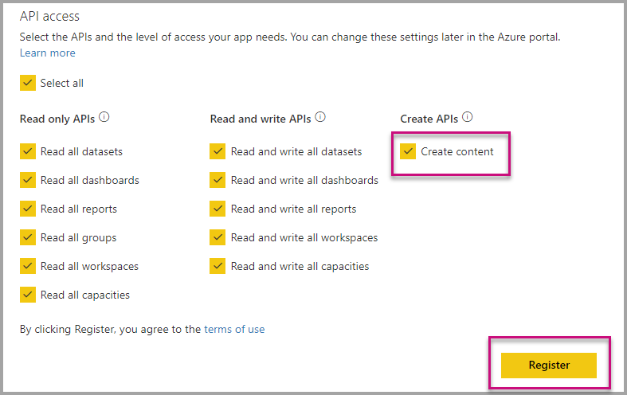

# Auto install Power BI apps when embedding for your organization

To embed content from an app, the user that is embedding must have [access to the app](../service-create-distribute-apps.md). If the app is installed for the user, then embedding works smoothly. For more information, see [Embed reports or dashboards from app](embed-from-apps.md). It's possible to define on PowerBI.com that all apps can be [installed automatically](https://powerbi.microsoft.com/blog/automatically-install-apps/), but this action is done at the tenant level and applies to all apps.

## Auto-install App on embedding

Currently, if a user has access to an app, but the app isn't installed, then the embedding fails. So you can avoid these failures when embedding from an app, it's possible to allow auto installation of the app upon embedding, meaning, the user tries to embed if the app isn't installed it's automatically installed for you and the content you want gets embedded immediately, resulting in a smooth experience for the user.

## Embed for Power BI users (User owns data)

To allow auto install of apps for your users, you need to give your application 'Content Create' permission when [registering your application](register-app.md#register-with-the-power-bi-application-registration-tool) or add it if you already registered your app.

Second, you need to provide the app ID in the embed URL. To do provide the app ID, you (the app creator) should first install the app then, just use one of our Rest API calls, [Get Reports, or [Get Dashboards](https://docs.microsoft.com/en-us/rest/api/power-bi/dashboards/getdashboards) and take the embed Url from the response, the app ID appears in the URL if the content is from an app.  After you have the embed URL, you can use it to embed regularly.

## Secure Embed

To use auto install of Apps, you (the app creator) should first install the app, then, go to the App on PowerBI.com, navigate to the report, and get the link in a usual fashion. All other users with access to the app that uses the link can embed the report, and the app is automatically installed for them if needed.

## Considerations and limitations

* Only report and Dashboard embed are supported for this scenario.

* This feature is currently not supported on App owns data and SharePoint Embed scenarios.