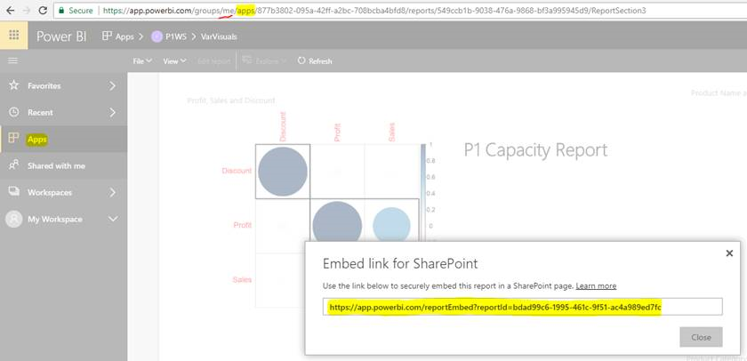

# Embed reports or dashboards from apps

In Power BI, you can create apps to bring related dashboards and reports together, all in one place. Then you publish them to large groups of people in your organization. The usage of those apps is relevant when all your users are Power BI users. So you can share content with them by using Power BI apps. This article gives you a few quick steps to embed content out of a published Power BI app and into a third-party application.

## Grab a report embedURL for embedding

1. Instantiate the application in a user workspace, **My Workspace**. Either share with yourself or guide another user to go through this flow.

2. Open the report you want in the Power BI service.

3. Go to **File** > **Embed In SharePoint Online** and grab the report embedURL. An embedURL sample is shown in the below snapshot. Alternatively, you can call the GetReports/GetReport REST API and extract the corresponding report embedURL field out of the response. The REST call shouldn’t have a workspace identifier as part of the URL as the app got instantiated in the user’s workspace.

    

4. Use the embedURL retrieved in step 3 with the JavaScript SDK.

## Grab a dashboard embedURL for embedding

1. Instantiate the application in a user workspace, **My Workspace**. Either share with yourself or guide another user to go through this flow.

2. Call the GetDashboards REST API and extract the corresponding dashboard embedURL field out of the response. The REST call shouldn’t have a workspace identifier as part of the URL as the app got instantiated in the user’s workspace.

3. Use the embedURL retrieved in step 2 with the JavaScript SDK.

## Next steps

Review how to embed from app workspaces for your third-party customers and your organization:

> [!div class="nextstepaction"]
>[Embed for third-party customers](embed-sample-for-customers.md)

> [!div class="nextstepaction"]
>[Embed for your organization](embed-sample-for-your-organization.md)
