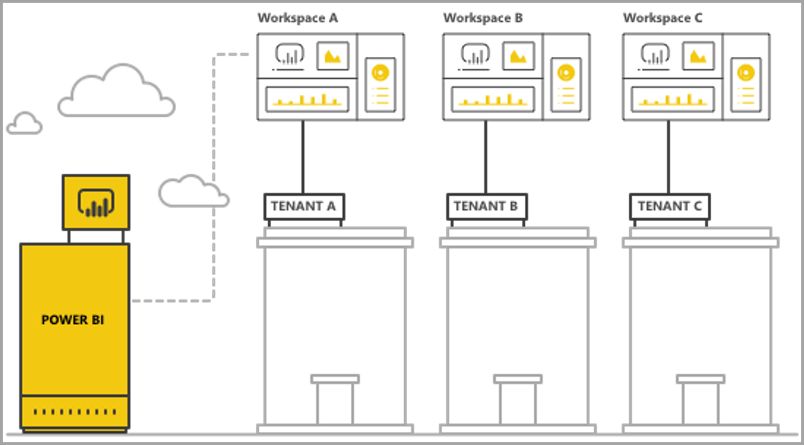
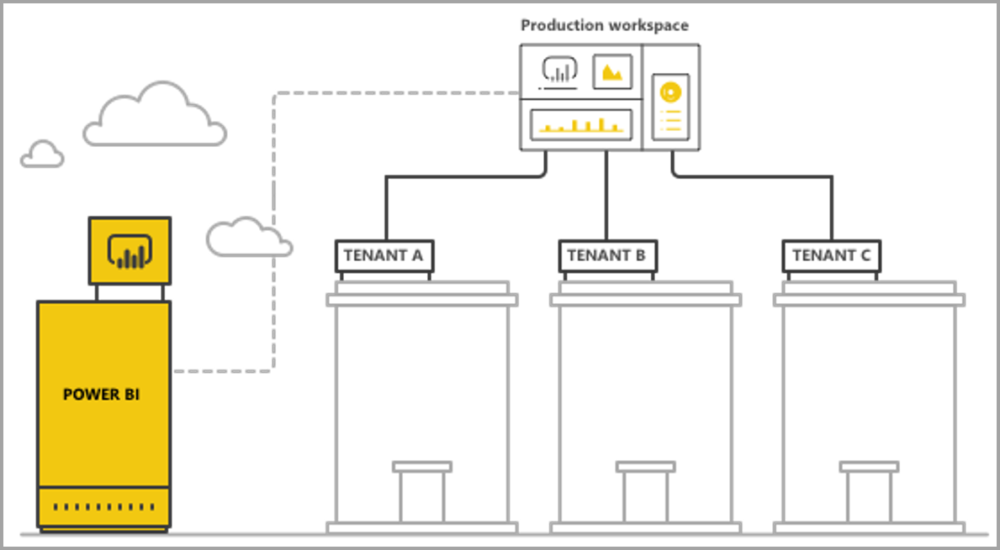

# Managing multi-tenancy with Power BI embedded analytics

When designing a multi-tenant SaaS application, you must carefully choose the tenancy model that best fits the needs of your SaaS application. This process is also true for Power BI as an embedded analytics part of your SaaS application. A tenancy model determines how each tenant’s data is mapped and managed within Power BI and the storage account. Your tenancy model impacts application design and management. Switching to a different model later might turn costly and disruptive.

With Power BI Embedded there are 2 main fundamental approaches to maintaining separation between tenants.

   1. Workspace based isolation with a separate Power BI Workspace per tenant
   2. Row-level security (RLS) based isolation where row-level security (RLS) on the underlying data is used to control and manage access to data

This article describes the different approaches and analyzes them according to several evaluation criteria.

## Concepts and terminology

**[AAD](https://docs.microsoft.com/en-us/azure/active-directory/fundamentals/active-directory-whatis)** - Azure Active Directory.

**AAD application** - an application identity in AAD. Required for authentication.

**SaaS application** - a **software-as-a-service** system implemented by an enterprise or ISV, usually an online service and related software systems for serving multiple customer tenants (organizations). For this article, **the SaaS application uses Power BI Embedded to serve analytics to its different tenants**. Power BI Embedded can also work for all types of applications if they have an online connection.

**Tenant** – A single customer (organization) that uses the SaaS application and any resources or data that the customer brings to the SaaS application or the SaaS application allocates for serving that customer.

**[Power BI](../power-bi-overview.md)** - The Power BI cloud service that serves as a platform for Power BI Embedded.

**Power BI tenant** - Is a set of Power BI resources associated with a single AAD tenant.

**[Power BI workspace](../service-create-workspaces.md)** - A container for content in Power BI.

**Power BI artifacts** – there are several Power BI artifacts in Power BI workspaces such as dashboards, reports, datasets and dataflows.

**[Power BI Embedded](azure-pbie-what-is-power-bi-embedded.md)** - A set of public APIs built on top of the Power BI Service that allows developers to build applications that manage Power BI content and embed Power BI elements.

**[Row-level security (RLS)](embedded-row-level-security.md)** - The ability to control user access to data for individual rows in a table which can be implemented in the data source or in the Power BI semantic model.

**Master user** - The identity that represents the SaaS application in Power BI and that the SaaS application uses when calling Power BI APIs. Needs to be an AAD user with a Power BI Pro license.

**AAD Application user (service principal)** - The identity that represents the SaaS application in Power BI and that the SaaS application uses when calling Power BI APIs. Needs to be an AAD web application. Can replace the use of a ‘Master user’ to authenticate with Power BI.

**Capacity** - a set of resources dedicated to running the Power BI service. [Power BI Premium capacities](../service-premium.md) are intended for Enterprises using Power BI internally, while [Power BI Embedded capacities](azure-pbie-create-capacity.md) are intended for application developers developing SaaS applications for third parties.

**[Power BI Pro license](../service-admin-purchasing-power-bi-pro.md)** - is a user-based Power BI license which grants rights to publish content to app workspaces, consume apps without Premium capacity, share dashboards and subscribe to dashboards and reports.

**[Data connectivity modes](../desktop-directquery-about.md)** - Connecting data sources to Power BI can be done in different modes - Import data to Power BI, which is the most common way to get data, or connect directly to the data in its original source repository, known as DirectQuery.Another mode connects directly to Analysis Services data and called Live connection. Learn more on data connectivity modes.

## Evaluation criteria

The optimal choice for the right tenancy model for your SaaS application varies according to specific business and technical requirements, data architecture and more. Deep understanding of these requirements along with available tenancy model options and trade-offs can help define robust, performant, cost-effective and scalable architecture for your SaaS application.

The following are a set of topic areas one should consider when choosing between the different tenancy models.

### Data architecture

Usually developers building applications with Power BI Embedded already have a single or multi-tenant database. It is easier to use a tenancy model for Power BI Embedded which is similar to the tenancy model of the database. If the database tenancy model hasn’t been defined yet, you may want to consider other aspects before deciding on your data architecture.

### Data Isolation

How sensitive is the data being stored? What level of isolation do you need separating different customer tenants? The answer might vary across different industries, or specific customers that has certain requirements.

### Scalability

To find the best solution, you should define the scale you reach in the foreseeable future. Remember that a solution that might be suitable now might not suffice when usage and data scale up. When analyzing scalability, you should consider the following list:

   * Number of tenants (customers).
   * Number of reports, dashboards and datasets for each tenant.
   * Size of data on each dataset and frequency of refreshes.
   * Number of users.
   * Number of concurrent users in peak times.

Some SaaS applications might have low number of customers and low usage, but large amounts of data. Others might have a lot of customers and high usage, but small amount of data and reports for each customer. High numbers in any of the above can impact future costs and operational complexity.

### Automation & operational complexity

You should identify frequently occurring processes that need automation.

   * What is the frequency of onboarding new tenants? What actions are needed to fully onboard each one?
   * What is the release cadence for new or updated Power BI content, that needs to be deployed?
   * How many row-level security roles are defined for each tenant?  

Identifying these processes and how you address them can help you understand the operational complexity involved in maintaining each model.

### Data Residency Requirements and the need to support multiple geographies

Power BI Embedded supports multi-geo deployment (preview feature). [Multi-Geo](embedded-multi-geo.md) enables Power BI Embedded resources to be deployed in different regions with specific content assigned to reside in specific regions. This feature can be used across all models but can have an impact on the amount of content to manage as well as costs. Currently multi-geo is designed for meeting data residency requirements and does not improve performance by moving data closer to consumers.

### Cost

[Power BI Embedded](https://azure.microsoft.com/en-us/services/power-bi-embedded/) has a resource-based purchase model, like Power BI Premium. You purchase one or more capacities with fixed computing power and memory. This capacity is the main cost item when working with Power BI Embedded. There is no limit on the number of users using the capacity. The only limit is the performance of the capacity. You need to purchase a [Power BI Pro license](../service-admin-licensing-organization.md) for each master user, or specific users that can take action in the Power BI portal.

We recommend testing and measuring the expected load on your capacity by simulating live environment and usage and run load testing on the capacity. You can measure the load and performance with the various Metrics available in the Azure capacity or [Premium capacity metrics app](../service-admin-premium-monitor-capacity.md).

### Content customization and authoring

There are two approaches for SaaS applications that want to give users the ability to edit and/or create new reports or upload data into the service as part of the flow:

   * [‘Edit’/ ‘Create’ mode in an embedded iFrame](https://github.com/Microsoft/PowerBI-JavaScript/wiki/Create-Report-in-Embed-View) - this option the user gets a view of the report or a new blank canvas inside the SaaS application, where they can use the Power BI toolbar to create content based on a dataset in the workspace. We recommend this option since it’s in the user’s context in a familiar environment, it’s easier to get started working and editing, and the user creates a report attached to an existing dataset.

   * Use Power BI Desktop to create new content and upload it through the SaaS application UI to the workspace. In this approach, users have more tools to work with using the Power BI Desktop. However, this approach is less recommended since users need to be familiar with an additional tool outside of the SaaS application context, and uploading a PBIX file means the user is adding an additional dataset, that might be duplicative of datasets already in the workspace.

## Power BI workspace-based isolation

With Power BI workspace-based isolation, the SaaS application supports multiple tenants from a single Power BI tenant, which contains all the Power BI content that different tenants use. The separation of tenants is done at the Power BI workspace level, by creating multiple workspaces, each with the relevant datasets, reports and dashboards for that tenant, connected only to that tenant’s data. If the you need additional isolation, you can create a ‘Master user’ or a Service Principal (Future release) for each workspace and its content.

### Data architecture

There are two main approaches to manage tenant’s data.

* A separate database per tenant
* A single multi-tenant database

If the SaaS application storage is keeping a separate database per tenant, then the natural choice is to use single-tenant datasets in Power BI with the connection string for each dataset pointing to the matching database.

If the SaaS application storage is using a multi-tenant database for all tenants, it’s easy to separate tenants by workspace, by configuring the database connection for the Power BI dataset with a parameterized database query that only retrieves the relevant tenant’s data. You can update the connection using the [Power BI Desktop](../desktop-query-overview.md) or using the [API](https://docs.microsoft.com/rest/api/power-bi/datasets/updatedatasourcesingroup) with [parameters](https://docs.microsoft.com/en-us/rest/api/power-bi/datasets/updateparametersingroup) on the query.

### Data isolation

Data in this tenancy model is separated at the workspace level. A simple mapping between a workspace and a tenant prevents users from one tenant seeing content from another tenant. Using a single *master* user demands you to have access to all the different workspaces. The configuration of which data to show an end user is defined during the [generation of the embed token](https://docs.microsoft.com/en-us/rest/api/power-bi/embedtoken), a backend-only process which end users can’t see or change.

To add additional isolation, an application developer can define a *master*/ application (future release) user per workspace rather than a single *master*/ application (future release) user with access to multiple workspaces. This way, you can ensure that any human error or credential leak does not cause multiple customer’s data being exposed.

### Scalability

One advantage of this model is that separating the data into multiple datasets for each tenant overcomes the [size limits of a single dataset](https://docs.microsoft.com/en-us/power-bi/service-premium-large-datasets) (currently 10 GB in a capacity). When the capacity is overloaded, [it can evict unused datasets](../service-premium-understand-how-it-works.md) to free memory for active datasets. This is not possible with a single large dataset. Using multiple datasets, it is also possible to separate tenants into multiple Power BI capacities if needed. [Learn more about how capacity operates](../service-admin-premium-manage.md).

Despite these advantages, one must consider the scale that the SaaS application can reach in the future. For example, one might reach limitations around the number of artifacts one can manage. See deployment [limitations](#summary-comparison-of-the-different-approaches) later in this article for more details. The capacity SKU used introduces a limit on the size of memory that datasets need to fit in, [how many refreshes can run at the same time](../service-premium-understand-how-it-works.md) and the maximum frequency of data refreshes. When managing hundreds or thousands of datasets, this should be considered and tested. It is also recommended to consider the average and peak volume of usage, as well as any specific tenants with extremely large datasets, or different usage patterns, that should be managed differently than other tenants.

### Automation & operational complexity

With a workspace-based isolation, an application developer might need to manage hundreds or thousands of artifacts. It’s important to define the processes that happen frequently in your Application Lifecycle Management, and ensure you have the right set of tools to perform these operations at scale in this tenancy model. Some example operations include:

   * Adding a new tenant (customer)
   * Updating a report or dashboard for some or all the tenants
   * Updating the dataset schema for some or all the tenants
   * Ad-hoc customizations for specific tenants
   * Frequency of dataset refreshes

For example, creating a new workspace for a new tenant is likely a frequent action which needs automation. With the [Power BI REST API](https://docs.microsoft.com/rest/api/power-bi/), you can achieve [full automation when creating new workspaces](https://powerbi.microsoft.com/blog/duplicate-workspaces-using-the-power-bi-rest-apis-a-step-by-step-tutorial/).

### Multi-Geo needs

Multi-geo involves purchasing capacity in the desired regions and assigning a workspace to that capacity. If you need to support different tenants in different regions, you just need to assign the tenant’s workspace to a capacity in the desired region. This is a simple operation and one that shouldn’t cost a lot more than having all workspaces in the same capacity. However, if you have tenants that need data resident in multiple regions, all artifacts in the workspace need to be duplicated in each regional capacity, increasing both cost and management complexity.

### Cost

Application developers using Power BI Embedded need to [purchase Power BI Embedded capacity to go to production](embed-sample-for-customers.md#move-to-production).  It’s important to understand the impact of workspace-based isolation model and their effect on capacities.

The workspace-based isolation model sits well with capacities for the following reasons:

   * The smallest object you can independently assign to a capacity is a workspace (i.e. you can’t assign a report, for example), so by separating tenants by workspaces, you get full flexibility in managing each tenant and its performance needs, as well as optimizing capacity utilization by scaling up/down. For example, large and important tenants with high volume and volatility can be managed in a separate capacity to ensure a consistent service level, while grouping smaller tenants in another capacity to optimize costs.

   * Separating workspaces also means separating datasets between tenants, so data models can be in smaller chunks, rather than in a single large dataset. This allows the capacity to better manage memory usage, evicting small and unused datasets when not needed, while keeping users satisfied with performance.

On the other hand, application developers should consider the limit on the number of parallel refreshes, as refresh processes might need extra capacity when you have multiple datasets.

### Content customization and authoring

For the main use cases of content creation, the application developer needs to carefully consider which tenants can have editing capabilities, and how many users in each tenant can edit. Permitting multiple users in each tenant to edit can result in a lot of content being generated, that can reach a dataset limitation such as number of reports per dataset, or the number of datasets in a workspace. If you give users this capability, we recommend to monitor their content generation closely and scale up as needed. For the same reasons, we don’t recommend using this capability for content personalization, where each user can make small changes to a report and save it for themselves. If the SaaS application allows content personalization, consider introducing and communicating workspace retention policies for user-specific content to facilitate the flow of content deletion when an end-user moves to a new position, leaving his company or simply not using the platform anymore.

## Row-level security-based isolation

With row-level security-based isolation, the SaaS application uses a single workspace to host multiple tenants. It means that each Power BI artifact report, dashboard, & dataset, is created once all tenants use it. Data separation between tenants is accomplished using [row-level security](embedded-row-level-security.md) on the multi-tenant dataset. When an end-user logs into the SaaS application and opens content, an Embed token is generated for that user’s session, with the roles and filters that ensure the user only sees the data they are permitted to see. If users from the same tenant are not permitted to view the same data, the application developer needs to implement hierarchical roles both between tenants as well as within the same tenant.

### Data architecture

Implementing row-level security-based isolation is easiest when all tenants’ data is stored in a single data warehouse. In this case, the application developer can pass only the relevant data from the data warehouse into the Power BI dataset, either via Direct Query or data import. If data in the database is separated per tenant, it needs to be combined into a single dataset which results in a lower degree of separation between tenants that existed in the database.

### Data isolation

With row-level security-based isolation, data separation is accomplished using [row-level security (RLS) definitions](embedded-row-level-security.md) on the dataset, which means all the data is co-resident. This reduces data separation is more susceptible to data leakage through developer error. Though RLS is done on the backend and totally secured from end-user manipulation, if the data is highly sensitive or customers are asking for data separation, it might be better to use workspace-based isolation.

### Scalability

With row-level security-based isolation, the data needs to fit within the dataset size limit, which is currently 10GB. With the introduction of [incremental refresh](../service-premium-incremental-refresh.md) and the upcoming release of an XMLA end-point for Power BI datasets, the dataset size limit is expected to increase significantly. However, the data still needs to fit into the capacity’s memory, with enough remaining memory for data refreshes to run. Large-scale deployments need large capacity to avoid users experiencing issues due to memory exceeding the limits of the current capacity. Alternative ways to handle scale include using **[aggregations](../desktop-aggregations.md)** or connecting to the data source directly using DirectQuery or Live connection, rather than caching all the data in the Power BI capacity.

### Automation & operational complexity

Managing artifacts is far easier with row-level security-based isolation than with workspace-based isolation as there is only one version of an artifact for each environment (dev/test/ production), instead of a version per tenant. At large scale, this means managing and updating 10s of artifacts, rather than 1,000s-10,000s.

On the other hand, Power BI doesn’t yet have an API to modify or create new RLS roles and rules. Adding or changing roles can only be done manually in the Power BI Desktop. If an RLS hierarchy needs to be applied, it can be complicated and error-prone to manage if you don't plan it carefully.

If the application developer needs to manage many roles and/or role definitions that need to be created or updated frequently, row-level security-based isolation isn't scalable, from a manageability perspective.

Another operational complexity is the need to closely monitor memory utilization and build a robust mechanism of alerts and scaling to ensure users get a smooth experience.  

### Multi-Geo needs

Since all the data is stored in a single dataset, it makes it difficult to meet data residency requirements that require certain data to be bound to specific locations. It can also significantly increase the cost of using multiple regions as all the data is replicated and stored in each regions. If only a limited number of tenants need different geographies, you can keep only those tenants’ data in a different region, using the workspace-based isolation model described above.

### Cost

The main cost driver with row-level security-based isolation is the memory footprint of the dataset. You need enough capacity to store the dataset and keep some additional memory buffer for any peaks in memory demand. One way to mitigate this is by storing the data in a SQL Server database or SQL Server Analysis Services cube, and using Direct Query or a Live connection to retrieve the data from the data source in real-time, rather than caching it in Power BI. This approach increases the cost of the data sources, but reduces the need for large capacity because of memory needs, hence reducing the cost of Power BI capacity.

### Content customization and authoring

When end-users edit or create new reports, they use the production multi-tenant dataset. For that reason, we advise only using the embedded iFrame option to edit or [create reports](https://github.com/Microsoft/PowerBI-JavaScript/wiki/Create-Report-in-Embed-View), as it relies on the same dataset, with row-level security applied. Having users uploading PBIX files with additional datasets can be very costly and difficult to manage with row-level security-based isolation. Also, when users generate new content that are in the same workspace, you need to make sure the production workspace does not hit its limits, and build a robust mechanism to distinguish which content is connected to which tenant.

## Summary comparison of the different approaches

Important note- The following analysis is based on the current state of the product. As we are releasing new features on a monthly cadence, we continue to provide new capabilities and features that answer existing limitations and weak spots. Make sure to check our monthly blog posts to see what’s new and come back to this article to see how new features affect tenancy model recommendation.

| Property  | Description  |  |  |  |
|--------------|-----------------------------------------------------------------------------------------------------------------------------------------------------------------------------------------------------------------------|---|---|---|
| pageName  | You can use the pageName query string parameter to set which page of the report to open. The pageName value corresponds to the end of the report URL when viewing a report in the Power BI Service, as shown below.   |  |  |  |
| ctid  | Enables external Guest users to view the content when logging in through Azure B2B.   |  |  |  |
| URL Filters  | You can use URL Filters in the embed URL you received from the Power BI UI to filter the content of the embed. This can be used to build low-code integrations with only basic HTML and JavaScript experience.  |  |  |  |

## Deployment considerations and limiatations

**Power BI Artifact limits:**

* Number of workspace V1 (groups) a single user/ application can be a member/admin of - 250.
* Number of workspace V2 (folders) a single user/ application can be a member/ admin of - 1000.
* Number of datasets in a single Workspace - 1000.
* Number of reports/dashboards connected to a single dataset - 1000.
* Dataset memory size limit to upload a PBIX - 10GB.

**Power BI Capacity considerations and limitations**

* Each capacity can only use its allocated memory and V-cores, according to the [SKU purchased](../service-premium.md). Learn more.
* Recommended [dataset size](../service-premium-large-datasets.md) for each SKU.
* Maximal dataset size in a dedicated capacity - 10 GB.
* Number of scheduled refreshes for an ‘import mode’ dataset in a day - 48.
* Time between scheduled refreshes for an ‘import mode’ dataset - 30 minutes.
* Number of refreshes that can run concurrently on a [capacity](../service-premium-understand-how-it-works.md#refresh-parallelization-policy).
* Average time of scaling a capacity is between 1-2 minutes. During that time the capacity is not available. We recommend using a scale-out approach to [avoid downtime](https://powerbi.microsoft.com/blog/power-bi-developer-community-november-update-2018/#scale-script).

## Next steps

* [Embedded analytics with Power BI](embedding.md)
* [Power BI Embedded](azure-pbie-what-is-power-bi-embedded.md)
* [Power BI Premium ](../service-premium.md)
* [Row-level security](embedded-row-level-security.md)