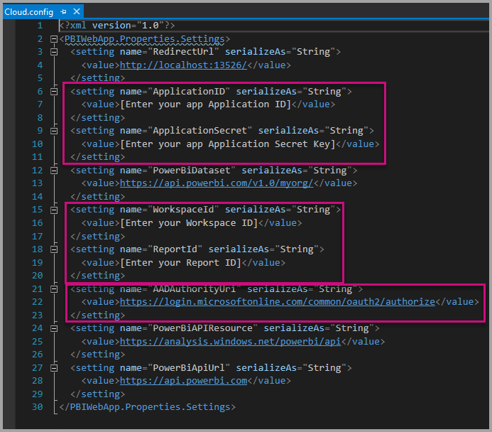

# Tutorial: Embed Power BI paginated reports into an application for your organization

In **Power BI**, you can embed paginated reports into an application by using user owns data. 

Paginated reports are reports designed for high quality printing. Usually these reports contain a lot of data, rendered in a way that makes it fit printed pages.
To understand how Power BI supports paginated reports, see [What are paginated reports in Power BI Premium?](https://docs.microsoft.com/power-bi/paginated-reports-report-builder-power-bi)

**User owns data** lets your application extend the Power BI service so it can use embedded analytics. This tutorial demonstrates how to integrate a paginated report into an application.

You use the Power BI .NET SDK with the Power BI JavaScript API to embed Power BI into an application for your organization.


In this tutorial, you learn the following tasks:
> [!div class="checklist"]
> * Register an application in Azure.
> * Embed a Power BI paginated report into an application using your Power BI tenant.

## Prerequisites
To get started, you're required to have:
* A [Power BI Pro account](../service-self-service-signup-for-power-bi.md).
* A [Microsoft Azure](https://azure.microsoft.com/) subscription.
* You need to have your own [Azure Active Directory tenant](create-an-azure-active-directory-tenant.md) setup.
* At least a P1 capacity [See What size Premium capacity do I need for paginated reports?](../paginated-reports-faq.md#what-size-premium-capacity-do-i-need-for-paginated-reports)

If you're not signed up for **Power BI Pro**, [sign up for a free trial](https://powerbi.microsoft.com/pricing/) before you begin.

If you don’t have an Azure subscription, create a [free account](https://azure.microsoft.com/free/?WT.mc_id=A261C142F) before you begin.

## Set up your embedded analytics development environment

Embedding a paginated report requires assigning a workspace to a dedicated capacity, and uploading the report to the workspace.

### Register an application in Azure Active Directory

[Register your application](register-app.md) with Azure Active Directory to allow your application access to the [Power BI REST APIs](https://docs.microsoft.com/rest/api/power-bi/). Registering your application allows you to establish an identity for your application and specify permissions to Power BI REST resources.

You need to proceed with registering a **server-side web application** app. You register a server-side web application to create an application secret.

## Set up your Power BI environment

Embedding a paginated report requires assigning a workspace to a dedicated capacity, and uploading the report to the workspace.

### Create a dedicated capacity

By creating a dedicated capacity, you can take advantage of having a dedicated resource for the content in your app workspace. For paginated reports, you must back your app workspace with at least a P1 capacity. You can create a dedicated capacity by using [Power BI Premium](../service-premium-what-is.md).

The following table lists the Power BI Premium SKUs that can be used to create a dedicated capacity for paginated reports in [Microsoft Office 365](../service-admin-premium-purchase.md):

| Capacity node | Total vCores<br/>(back end + front end) | Back-end vCores | Front-end vCores | DirectQuery/live connection limits |
| --- | --- | --- | --- | --- | --- |
| P1 |8 vCores |4 vCores, 25 GB of RAM |4 vCores |30 per second |
| P2 |16 vCores |8 vCores, 50 GB of RAM |8 vCores |60 per second |
| P3 |32 vCores |16 vCores, 100 GB of RAM |16 vCores |120 per second |
| P4 |64 vCores |32 vCores, 200 GB of RAM |32 vCores |240 per second |
| P5 |128 vCores |64 vCores, 400 GB of RAM |64 vCores |480 per second |

### Assign an app workspace to a dedicated capacity

After you create a dedicated capacity, you can assign your app workspace to that dedicated capacity. To complete this process, follow these steps:

1. Within the Power BI service, expand workspaces and select **More** for the workspace you're using for embedding your content. Then select **Workspace settings**.

    

2. Select **Premium** and enable **Dedicated capacity**. Select the dedicated capacity you created. Then select **Save**.

    

3. After you select **Save**, you should see a diamond next to the app workspace name.

    

### Create an app workspace

If you're embedding paginated reports for your customers, you have to place your content within an app workspace. There are different types of workspaces that you can set up: the [traditional workspaces](../service-create-workspaces.md) or the [new workspaces](../service-create-the-new-workspaces.md).

### Create and publish your Power BI paginated reports

You can create your paginated reports by using the [Power BI Report Builder](../paginated-reports-report-builder-power-bi.md#create-reports-in-power-bi-report-builder). Then you can [upload the report](../paginated-reports-quickstart-aw.md#upload-the-report-to-the-service) to an app workspace assigned to at least a P1 capacity. The end-user uploading the report must have a Power BI Pro license to publish to an app workspace.
   
## Embed your content by using the sample application

This sample is deliberately kept simple for demonstration purposes.

Follow the steps below to start embedding your content using the sample application.

1. Download [Visual Studio](https://www.visualstudio.com/) (version 2013 or later). Make sure to download the latest [NuGet package](https://www.nuget.org/profiles/powerbi).

2. Download the [User Owns Data sample](https://github.com/Microsoft/PowerBI-Developer-Samples) from GitHub to get started.

    

3. Open the **Cloud.config** file in the sample application, and fill in the following fields to run your application:
    * [Application ID](#application-id)
    * [Workspace ID](#workspace-id)
    * [Report ID](#report-id)
    * [AADAuthorityUrl](#aadauthorityurl)

    

### Application ID

Fill in the **applicationId** information with the **Application ID** from **Azure**. The **applicationId** is used by the application to identify itself to the users from which you're requesting permissions.

To get the **applicationId**, follow these steps:

1. Sign into the [Azure portal](https://portal.azure.com).

2. In the left-hand navigation pane, select **All Services**, and select **App Registrations**.

3. Select the application that needs the **applicationId**.

    

4. There's an **Application ID** that is listed as a GUID. Use this **Application ID** as the **applicationId** for the application.

    

### Workspace ID

Fill in the **workspaceId** information with the app workspace (group) GUID from Power BI. You can get this information either from the URL when signed into the Power BI service or using Powershell.

URL <br>


Powershell <br>

```powershell
Get-PowerBIworkspace -name "User Owns Embed Test"
```

   

### Report ID

Fill in the **reportId** information with the report GUID from Power BI. You can get this information either from the URL when signed into the Power BI service or using Powershell.


Powershell <br>

```powershell
Get-PowerBIworkspace -name "Paginated Report Embed" | Get-PowerBIReport
```


### AADAuthorityUrl

Fill in the **AADAuthorityUrl** information with the URL that either allows you to embed within your organizational tenant or embed with a guest user.

For embedding with your organizational tenant, use the URL - *https://login.microsoftonline.com/common/oauth2/authorize*.

For embedding with a guest, use the URL - *https://login.microsoftonline.com/report-owner-tenant-id* - where you add the tenant ID of the report owner in replacement of *report-owner-tenant-id*.

### Run the application

1. Select **Run** in **Visual Studio**.

    

2. Then select **Embed Report**. Depending on which content you choose to test with - reports, dashboards or tiles - then select that option in the application.

    

3. Now you can view the report in the sample application.

    

## Embed your content within your application

Even though the steps to embed your content can be done with the [Power BI REST APIs](https://docs.microsoft.com/rest/api/power-bi/), the example codes described in this article are made with the .NET SDK.

To integrate a paginated report into a web app, you use the Power BI REST API or the Power BI C# SDK. You also use an Azure AD authorization access token to get a report. Then you load the report by using the same access token. The Power BI Rest API provides programmatic access to specific Power BI resources. For more information, see [Power BI REST APIs](https://docs.microsoft.com/rest/api/power-bi/) and the [Power BI JavaScript API](https://github.com/Microsoft/PowerBI-JavaScript).

### Get an access token from Azure AD

Within your application, you must get an access token from Azure AD before you can make calls to the Power BI REST API. For more information, see [Authenticate users and get an Azure AD access token for your Power BI app](get-azuread-access-token.md).

### Get a report

To get a Power BI or paginated report, you use the [Get Reports](https://docs.microsoft.com/rest/api/power-bi/reports/getreports) operation, which gets a list of Power BI and paginated reports. From the list of reports, you can get a report ID.

### Get reports by using an access token

The [Get Reports](https://docs.microsoft.com/rest/api/power-bi/reports/getreports) operation returns a list of reports. You can get a single report from the list of reports.

To make the REST API call, you must include an *Authorization* header in the format of *Bearer {access token}*.

#### Get reports with the REST API

You can retrieve reports with the REST API. For a code example, see [Get reports with the REST API](embed-sample-for-your-organization.md#get-reports-with-the-rest-api).

#### Get reports by using the .NET SDK

You can use the .NET SDK to retrieve a list of reports instead of calling the REST API directly. For a code example sowing how to list reports, see [Get reports by using the .NET SDK](embed-sample-for-your-organization.md#get-reports-by-using-the-net-sdk).

### Load a report by using JavaScript

You can use JavaScript to load a report into a div element on your web page.

For a full sample of using the JavaScript API, you can use the [Playground tool](https://microsoft.github.io/PowerBI-JavaScript/demo). The Playground tool is a quick way to play with different types of Power BI Embedded samples. You can also get more Information about the JavaScript API by visiting the [PowerBI-JavaScript wiki](https://github.com/Microsoft/powerbi-javascript/wiki) page.

## Admin settings

Global admins or Power BI service administrators can turn the ability to use the REST APIs on or off for a tenant. Power BI admins can set this setting for the entire organization or for individual security groups. It's enabled for the entire organization by default. You can make these changes in the [Power BI admin portal](../service-admin-portal.md).

## Next steps

In this tutorial, you learned how to embed Power BI paginated reports into an application by using your Power BI organization account. 

> [!div class="nextstepaction"]
> [Embed from apps](embed-from-apps.md)

> [!div class="nextstepaction"]
>[Embed Power BI content for your customers](embed-sample-for-customers.md)

> [!div class="nextstepaction"]
>[Embed Power BI paginated reports for your customers](embed-paginated-reports-customers.md)

If you have more questions, [try asking the Power BI Community](http://community.powerbi.com/).